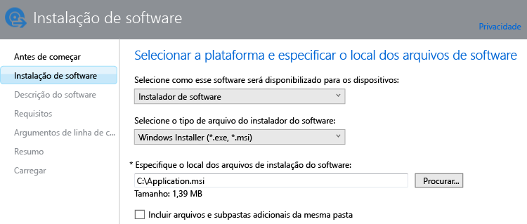

---
# required metadata

title: Adicionar aplicativos para computadores Windows | Microsoft Intune
description:
keywords:
author: robstackmsft
manager: jeffgilb
ms.date: 04/28/2016
ms.topic: article
ms.prod:
ms.service: microsoft-intune
ms.technology:
ms.assetid: bc8c8be9-7f4f-4891-9224-55fc40703f0b

# optional metadata

#ROBOTS:
#audience:
#ms.devlang:
ms.reviewer: owenyen
ms.suite: ems
#ms.tgt_pltfrm:
#ms.custom:

---

# Adicionar aplicativos para computadores Windows no Microsoft Intune

Use as informações neste tópico para aprender a adicionar aplicativos ao Intune antes de implantá-los.

> [!IMPORTANT]
> As informações neste tópico lhe ajudam a adicionar aplicativos em para computadores Windows que você gerencia usando o software cliente de computador do Intune. Se você quiser adicionar aplicativos para computadores Windows registrados e outros dispositivos móveis, consulte [Add apps for mobile devices in Microsoft Intune](add-apps-for-mobile-devices-in-microsoft-intune.md) (Adicionar aplicativos para dispositivos móveis no Microsoft Intune).

## Adicionar o aplicativo
Você usa o Intune Software Publisher para configurar as propriedades do aplicativo e carregá-lo no seu espaço de armazenamento em nuvem usando o seguinte procedimento:

1.  No [Console do administrador do Microsoft Intune](https://manage.microsoft.com), selecione **Aplicativos** &gt; **Adicionar Aplicativos** para iniciar o editor de software do Intune.

    > [!TIP] Talvez seja necessário inserir seu nome de usuário e senha do Intune antes de iniciar o editor.

2.  Na página **Instalação de Software** do editor do software, configure o seguinte:

    **Selecione como este software é disponibilizado para dispositivos**: escolha **Instalador do software** e especifique:

    - **Selecione o tipo de arquivo do instalador de software**: isso indica o tipo de software que você deseja implantar. Para um computador Windows, escolha **Windows Installer**.
    - **Especifique o local dos arquivos de configuração do software**: insira o local dos arquivos de instalação ou escolha **Procurar** para selecionar o local em uma lista.
    - **Incluir arquivos e subpastas adicionais da mesma pasta** - Alguns softwares que usam o Windows Installer requerem arquivos de suporte, que geralmente se encontram na mesma pasta que os arquivos de instalação. Selecione esta opção se você também deseja implantar esses arquivos de suporte.

    Por exemplo, se você quiser publicar um aplicativo chamado Application.msi no Intune, a página terá esta aparência:  (Fornecedor de Software do Computador)

   Esse tipo de instalação usa uma parte do seu espaço de armazenamento em nuvem.

3.  Na página **Descrição do Software**, defina as seguintes configurações:

    Dependendo do arquivo instalador que você está usando, talvez alguns desses valores tenham sido inseridos automaticamente ou não apareçam.

    - **Editor**: insira o nome do editor do aplicativo.
    - **Nome**: insira o nome do aplicativo como ele será exibido no portal da empresa.  Certifique-se de que todos os nomes de aplicativo usados são exclusivos. Se o mesmo nome de aplicativo for usado duas vezes, apenas um dos aplicativos será exibido para usuários no portal da empresa.
    - **Descrição**: insira uma descrição para o aplicativo. Isso será exibido para os usuários no portal da empresa.
    - **URL para informações do software** - (opcional) insira a URL de um site que contém informações sobre este aplicativo. A URL será exibida para os usuários no portal da empresa.
    - **URL privada**: (opcional) insira a URL para um site que contém informações de privacidade desse aplicativo. A URL será exibida para os usuários no portal da empresa.
    - **Categoria**: (opcional) selecione uma das categorias de aplicativo interno. Isso facilitará a localização do aplicativo quando os usuários navegarem pelo portal da empresa.

    - **Ícone**: (opcional) carregue um ícone que será associado ao aplicativo. Esse é o ícone que será exibido com o aplicativo quando os usuários navegarem pelo portal da empresa.

4.  Na página **Requisitos**, selecione os requisitos que devem ser atendidos antes que o aplicativo possa começar a ser instalado em um dispositivo. Escolha **Arquitetura**: selecione se esse aplicativo pode ser instalado em sistemas operacionais de 32 bits, 64 bits ou ambos, **Sistema Operacional**: selecione o sistema operacional mínimo no qual esse aplicativo pode ser instalado.

5.  Na página **Regras de detecção**, você pode configurar regras para detectar se o aplicativo que você está configurando já está instalado em um computador ou você pode usar as regras de detecção padrão para substituir automaticamente as versões previamente instaladas do aplicativo. Essa opção é para o Windows Installer (somente arquivos .exe).
6.  
    As regras que você pode configurar são:
    - **Há um arquivo**: especifique o caminho para o arquivo que deseja detectar. Você pode pesquisar em **%ProgramFiles%** (que procura em **Arquivos de Programas**\*&lt;caminho&gt;* e **Arquivos de Programas (x86)**\*&lt;caminho&gt;*) no computador ou **%SystemDrive%** (que pesquisa da unidade raiz do computador, geralmente C:)
    - **O código do produto MSI existe**: selecione **Procurar** para escolher o arquivo do Windows Installer (msi) que você deseja detectar. 
    - **Chave do Registro existente** - especifique uma chave do Registro que comece com **HKEY_LOCAL_MACHINE\**. Os caminhos do Registro de 32 e 64 bits são pesquisados. Se a chave especificada existe em um dos locais, a regra de detecção é satisfeita.

    Se o aplicativo satisfazer alguma das regras que você configurou, ele não será instalado.

7.  Somente para o tipo de arquivo do **Windows Installer** (msi e exe): na página **Argumentos de linha de comando**, escolha se deseja fornecer argumentos de linha de comando opcionais para o instalador. Por exemplo, alguns instaladores podem dar suporte ao argumento **/q** para instalar silenciosamente, sem intervenção do usuário.

8.  Somente para o tipo de arquivo do **Windows Installer** (exe apenas): na página **Códigos de retorno**, você pode adicionar novos códigos de erro que são interpretados pelo Intune quando o aplicativo é instalado em um computador Windows gerenciado.
    Por padrão, o Intune usa códigos de retorno padrão do setor para reportar a falha ou o êxito da instalação de um pacote do aplicativo: **0**: êxito ou **3010**: êxito com reinicialização. Você também pode adicionar seus próprios códigos de retorno a essa lista. Se você especificar uma lista de códigos de retorno e a instalação do aplicativo retornar um código não contido na lista, ele será interpretado como uma falha.

9.  Na página **Resumo**, examine as informações especificadas por você. Quando estiver pronto, selecione **Carregar**.

10. Selecione **Fechar** para concluir.

O aplicativo é exibido no nó **Aplicativos** do espaço de trabalho **Aplicativos**.

## Próximas etapas

Depois de criar um aplicativo, a próxima etapa é implantá-lo. Para saber mais, consulte [Deploy apps in Microsoft Intune](deploy-apps.md) (Implantar aplicativos no Microsoft Intune)

<!--HONumber=Jun16_HO2-->

