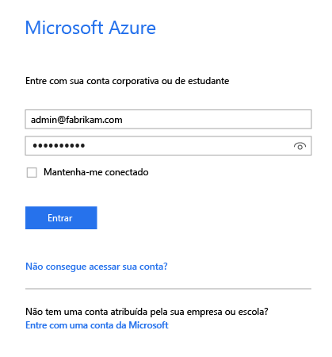
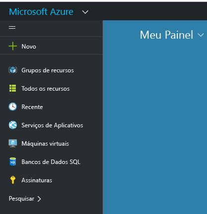
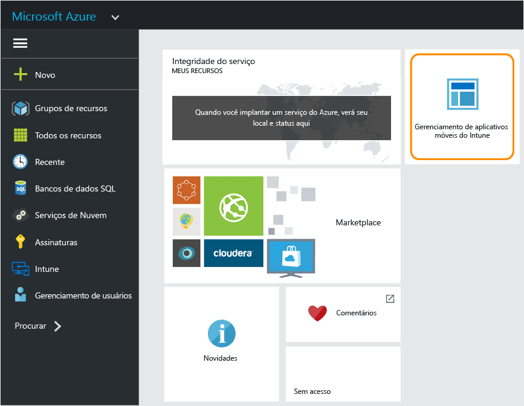

# Portal do Azure para políticas de MAM do Microsoft Intune
## Acessando o portal do Azure
O **portal do Azure** permite criar e gerenciar políticas de gerenciamento de aplicativos móveis.

O portal do Azure dá suporte à criação de políticas de MAM para:
- Aplicativos que são executados em dispositivos **registrados e gerenciados pelo Intune**.
- Aplicativos que são executados em dispositivos que **não são registrados** em nenhuma solução de MDM.
- Aplicativos que são executados em dispositivos que são **registrados em uma solução MDM de terceiros**.

>[!IMPORTANT]

> Se no momento você estiver usando o console de administração do Intune para gerenciar seus dispositivos, poderá criar uma política de MAM que dê suporte a aplicativos para dispositivos registrados no Intune usando o [Console de administração do Intune](configure-and-deploy-mobile-application-management-policies-in-the-microsoft-intune-console.md).

> Você não poderá ver todas as configurações de política de MAM no console de administração do Intune. O portal do Azure é o novo console de administração para criar políticas MAM. Se você criar políticas MAM no console de administração do Intune e no portal do Azure, a política no portal do Azure será aplicada aos aplicativos e implantada para usuários.

## Faça logon no portal do Azure e personalize sua página inicial

1.  Acesse o [portal do Azure](https://portal.azure.com) e entre com suas credenciais do [!INCLUDE[wit_nextref](../includes/wit_nextref_md.md)].

    

2.  Quando você estiver entrado com êxito, verá o **Painel**. A página **Painel** pode ser personalizada.

    

3.  No menu **Procurar**, localize **Intune**.

4.  Escolha **Intune > Gerenciamento de aplicativos móveis do Intune > Configurações**.

    

    > [!TIP]
    > Para fixar uma folha na **Tela inicial** , você pode usar a opção **Fixar** na folha.  Clique no ícone de pino na **folha de gerenciamento de aplicativos móveis do Intune**, para fixá-la na **Tela inicial** .

    

    
## Próximas etapas
[Preparar-se para configurar políticas de gerenciamento de aplicativos móveis](get-ready-to-configure-mobile-app-management-policies-with-microsoft-intune.md)

<!--HONumber=Jul16_HO4-->

