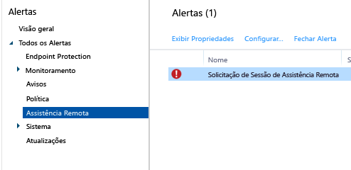

---
# required metadata

title: Tarefas comuns de gerenciamento de computadores Windows | Microsoft Intune
description:
keywords:
author: robstackmsft
manager: jeffgilb
ms.date: 04/28/2016
ms.topic: article
ms.prod:
ms.service: microsoft-intune
ms.technology:
ms.assetid: eb912c73-54d2-4d78-ac34-3cbe825804c7

# optional metadata

#ROBOTS:
#audience:
#ms.devlang:
ms.reviewer: owenyen
ms.suite: ems
#ms.tgt_pltfrm:
#ms.custom:

---

# Tarefas comuns de gerenciamento de computadores Windows com o cliente de computador do Microsoft Intune
Examine as tarefas deste tópico para aprender como gerenciar seus computadores que executam o cliente do Intune. Se você ainda não tiver instalado o cliente em seus computadores, consulte [Install the Windows PC client with Microsoft Intune](install-the-windows-pc-client-with-microsoft-intune.md) (Instalar o cliente do computador Windows com o Microsoft Intune).

## Usar políticas para simplificar o gerenciamento de computador
### Gerenciar o Firewall do Windows
As políticas simplificam a administração de configurações do Firewall do Windows em computadores gerenciados. Para obter detalhes, consulte [Help protect Windows PCs using Windows Firewall policies in Microsoft Intune](help-protect-windows-pcs-using-windows-firewall-policies-in-microsoft-intune.md) (Ajude a proteger computadores Windows usando políticas de Firewall do Windows no Microsoft Intune).

### Gerenciar o Microsoft Intune Center
O Microsoft Intune Center permite que os usuários:

-   Obtenham aplicativos a partir do portal da empresa.

-   Procurem atualizações.

-   Gerencie o Endpoint Protection do Microsoft Intune.

<!--- -   Request remote assistance.--->

O Microsoft Intune Center é instalado em todos os computadores gerenciados. Você pode definir as seguintes configurações em uma política do Intune e elas são exibidas para os usuários no Microsoft Intune Center:

|Configuração de política|Detalhes|
|------------------|--------------------|
|**Nome**|O nome do administrador que gerencia o computador.  Comprimento máximo: 40 caracteres|
|**Número do telefone**|O número do telefone do administrador que gerencia o computador.  Comprimento máximo: 20 caracteres|
|**Endereço de email**|O endereço de email do administrador que gerencia o computador.  Comprimento máximo: 40 caracteres|
|**Nome do site**|O nome do site de suporte para os usuários.  Comprimento máximo: 40 caracteres|
|**URL do site**|A URL do site de suporte.  Comprimento máximo: 150 caracteres|
|**Anotações**|Uma observação que é exibida para os usuários.  Comprimento máximo: 120 caracteres|

### Gerenciar configurações de atualização de software
Use as políticas para definir as configurações que os computadores gerenciados usam para procurar e baixar atualizações de software da Microsoft e de terceiros. Para mais informações, consulte [Keep Windows PCs up to date with software updates in Microsoft Intune](keep-windows-pcs-up-to-date-with-software-updates-in-microsoft-intune.md) (Manter computadores Windows atualizados com as atualizações de software no Microsoft Intune).

### Gerenciar configurações do Endpoint Protection
Use as políticas para definir as configurações do Endpoint Protection que você implantará depois nos computadores gerenciados. Isso inclui as agendas de verificação, ações a serem tomadas quando um malware for detectado e muito mais. Para obter mais informações, consulte [Help secure Windows PCs with Endpoint Protection for Microsoft Intune](help-secure-windows-pcs-with-endpoint-protection-for-microsoft-intune.md) (Ajudar a proteger computadores Windows com o Endpoint Protection para Microsoft Intune).

## Exibir o inventário de hardware e software
O Intune coleta informações detalhadas sobre o hardware e o software dos computadores gerenciados. Use as informações nos procedimentos a seguir para aprender a criar:

-   Um relatório que relaciona as informações sobre os recursos de hardware dos computadores.

-   Um relatório que relaciona o software instalado em cada computador.

-   Como atualizar o inventário de um computador para garantir que os dados no relatório estejam atualizados.

### Para exibir informações sobre seus computadores

1.  No [Console de administração do Microsoft Intune](https://manage.microsoft.com/), escolha **Relatórios** &gt; **Relatórios de Inventário de Computador**.

2.  Na página **Criar novo relatório** , aceite os valores padrão ou personalize-os para filtrar os resultados que serão passados como retorno pelo relatório. Por exemplo, você pode selecionar que somente computadores que executem Windows 8.1 sejam exibidos no relatório.

3.  Escolha **Exibir Relatório** para abrir o **Relatório de Inventário do Computador** em uma nova janela.

    Você pode classificar o relatório com base em qualquer uma das colunas, como **Nome**, **Tipo de Chassi** ou **Fabricante** selecionando cada título de coluna.

### Para exibir o software instalado em seus computadores

1.  No [Console de administração do Microsoft Intune](https://manage.microsoft.com/), escolha **Relatórios** &gt; **Relatórios de Software Detectados**.

2.  Na página **Criar novo relatório** , aceite os valores padrão ou personalize-os para filtrar os resultados que serão passados como retorno pelo relatório. Por exemplo, você pode selecionar que apenas o software fornecido pela Microsoft seja exibido no relatório.

3.  Escolha **Exibir Relatório** para abrir o **Relatório de Software Detectado** em uma nova janela.

    O relatório pode ser classificado com base em qualquer uma das colunas, como **Nome**, **Editor** ou **Categoria** selecionando cada título de coluna. Você pode expandir as atualizações nessa lista para mostrar mais detalhes (como os computadores nos quais está instalado) clicando na seta de direção ao lado do item de lista.

### Para atualizar o inventário do computador e garantir que esteja atualizado

1.  No [Console de administração do Microsoft Intune](https://manage.microsoft.com/), escolha **Grupos** &gt; **Todos os Dispositivos** (ou outro grupo que contenha o computador para o qual deseja atualizar o inventário).

2.  Selecione um computador ou pressione e segure a tecla **Ctrl** para selecionar vários computadores.

3.  Na barra de tarefas, clique em **Tarefas Remotas** &gt; **Atualizar Inventário**.

4.  Para exibir o status da tarefa, selecione **Tarefas Remotas** no canto inferior direito da página.

    A caixa de diálogo **Status da tarefa** é exibida e mostra as tarefas remotas atuais, seus status, nome do dispositivo, todos os erros reportados e fornece um link para as informações sobre a solução problemas.

## Reiniciar remotamente um computador Windows

1.  No [Console de administração do Microsoft Intune](https://manage.microsoft.com/), escolha **Grupos** &gt; **Todos os Dispositivos** (ou outro grupo que contenha o computador que deseja reiniciar).

2.  Selecione um ou mais computadores e clique em **Tarefas Remotas** &gt; **Reiniciar Computador**.

3.  Para exibir o status da tarefa, selecione **Tarefas Remotas** no canto inferior direito da página.

4.  Na caixa de diálogo **Status da tarefa** , examine as tarefas remotas atuais, seus status, nome do dispositivo e todos os erros reportados.

## Desativar um computador

1.  No [Console de administração do Microsoft Intune](https://manage.microsoft.com/), escolha **Grupos** &gt; **Todos os Dispositivos** (ou outro grupo que contenha o computador que deseja desativar).

2.  Selecione os dispositivos que deseja desativar e escolha **Desativar/Apagar**.

Para refazer o registro de um computador no Intune, reinstale o software cliente no computador usando as informações no tópico [Install the Windows PC client with Microsoft Intune](install-the-windows-pc-client-with-microsoft-intune.md) (Instalar o cliente do computador Windows com o Microsoft Intune).

Se um computador não puder se conectar ao Intune, será exibida uma mensagem no espaço de trabalho **Painel**.

Ao desativar um computador:

-   Ele é removido do inventário do Intune e a licença associada ao computador é disponibilizada para reutilização.

-   Seu status não é mais exibido no console do Intune.

-   O Intune remove o software cliente do computador. Se o computador não estiver conectado ao serviço do Intune, o software cliente será removido na próxima vez em que se conectar.

-   O Endpoint Protection do Microsoft Intune é removido do computador. Se o computador tiver outro aplicativo de ponto de extremidade instalado e estiver desabilitado, esse aplicativo poderá ser habilitado novamente depois que o Endpoint Protection do Microsoft Intune for removido para garantir que seus computadores estejam protegidos.

-   Todas as políticas são removidas do computador e os valores que foram definidos pela política serão alterados.

-   O computador não receberá mais atualizações de software ou de definição de malware do serviço do Intune.

-   Dependendo de como estiverem configurados, os computadores desativados poderão continuar a receber atualizações usando o Windows Server Update Services, Windows Update ou Microsoft Update.

    > [!IMPORTANT] Se o software cliente tiver sido instalado com o uso de um GPO (Objeto de Política de Grupo), você deverá remover o GPO antes de remover o software cliente para evitar que o software seja reinstalado.

    Se o cliente não desinstalar, leia [Troubleshoot Endpoint Protection](/intune/troubleshoot/troubleshoot-endpoint-protection-in-microsoft-intune) (Solucionar problemas de proteção de ponto de extremidade) para obter mais ajuda.

## Gerenciar a vinculação de usuário e dispositivo
Antes de implantar o software em um usuário, você deve vincular o usuário a um computador. Você pode vincular um usuário a vários computadores, mas cada computador pode ser vinculado a apenas um usuário. Os usuários são vinculados automaticamente a quaisquer computadores que se registram no Intune usando o portal da empresa.

### Para vincular um usuário a um computador

1.  No [Console de administração do Microsoft Intune](https://manage.microsoft.com/), escolha **Grupos** &gt; **Todos os Dispositivos** (ou outro grupo que contenha o computador que você deseja vincular a um usuário).

2.  Selecione o computador que deseja vincular a um usuário e escolha **Vincular Usuário**.

    A caixa de diálogo **Vincular Usuário** exibe uma lista de usuários disponíveis com o nome de exibição, ID de usuário e o número de computadores aos quais cada usuário está vinculado. Se um usuário já estiver vinculado ao computador selecionado, o nome e a ID desse usuário serão exibidos em **Usuário atual**. Se o computador não estiver vinculado a nenhum usuário, **Nenhum usuário** aparecerá em **Usuário atual**.

3.  Realize um dos seguintes procedimentos:

    -   Para deixar o computador vinculado ao usuário atual, se houver um, escolha **Cancelar**.

    -   Para remover o vínculo com o usuário atual, se houver, escolha **Remover link **&gt; **OK**.

    -   Para vincular o computador a um novo usuário, na lista **Todos os usuários** , selecione um usuário. Confirme se os dados do usuário estão corretos e escolha **OK**.

> [!TIP] Se você quiser restringir a capacidade dos usuários finais de vincularem-se a computadores, habilite a opção **Restringir a capacidade dos usuários de vincularem-se a computadores** na política **Configurações do Agente do Microsoft Intune**.

<!--- ## Request and provide remote assistance to Windows PCs that use the Intune client software

> [!IMPORTANT]
> You might not see the options to configure TeamViewer integration for remote assistance in the Intune admin console. This capability is not currently available to all customers, but will be rolling our more widely soon.
     

Microsoft Intune can use the [TeamViewer](https://www.teamviewer.com) software to let users of PCs that run the Intune client software get remote assistance help from you. When a user requests help from the Microsoft Intune Center, you are informed by an alert, can accept the request, and then provide assistance.
This functionality replaces the existing Windows Remote Assistance functionality in Intune.

### Before you start

Before you can begin to establish and respond to remote assistance requests, you must ensure the following prerequisites are in place:

- You must have [signed up for a TeamViewer account](https://login.teamviewer.com/LogOn#register) to log into the TeamViewer website.
- Windows PCs that you want to administer must be [managed by the Windows PC client](manage-windows-pcs-with-microsoft-intune.md)
- All Windows PC operating systems supported by Intune can be administered.

### Configure the TeamViewer Connector

1. In the [Microsoft Intune administration console](https://manage.microsoft.com), choose **Admin**.
2. In the **Admin** workspace, choose **TeamViewer**.
3. On the **TeamViewer** page, under **TeamViewer Connector**, choose **Enable**.
4. In the **Enable TeamViewer** dialog box, view, then **Accept** the license terms. If you don't already own a TeamViewer license, choose **Purchase a TeamViewer license**.
5. After the TeamViewer browser window opens, sign into the site with your TeamViewer credentials.
6. On the TeamViewer site, read, then accept the options to allow Intune to connect with TeamViewer.
7. In the Intune console, verify that the **TeamViewer Connector** item shows as **Enabled**.

### Open a remote assistance request (end user)

1. On a client Windows PC, open the **Microsoft Intune Center**.
2. Under **Remote Assistance**, choose **Request Remote Assistance**.
3. After you approve the request (see below), TeamViewer opens on the client. The user must accept any messages indicating that the web browser is trying to open the TeamViewer application.
4. The user sees a message asking if you can control their PC. They must accept this message to continue.
5. During the remote assistance session, the user sees a window that shows them you are connected. If they close this window, the remote session ends.

### Respond to a remote assistance request

1. When a user submits a remote assistance request, you can view it in the **Alerts** workspace, under **Monitoring** > **Remote Assistance**. For example:
> 

 If a request goes unanswered for more than 4 hours, it is removed.
2. To accept the request, choose **Approve request and launch Remote Assistance**.
3. In the **A New Remote Assistance Request is Pending** dialog box, choose **Accept the remote assistance request**. If it's not already installed, TeamViewer will install any necessary apps on your computer.
4. TeamViewer then notifies the end user that you want to take control of their PC. After the user has accepted the request, the TeamViewer windows opens, and you can control the PC. 
 
While in a remote assistance session, you can use all available TeamViewer commands to control the remote PC. For help with these commands, download the [Manual for remote control](http://www.teamviewer.com/en/support/documents/) from the TeamViewer website.

### Close the remote assistance session

From the **Actions** menu of the **TeamViewer** window, choose **End Session**.--->

<!--HONumber=Jun16_HO2-->

