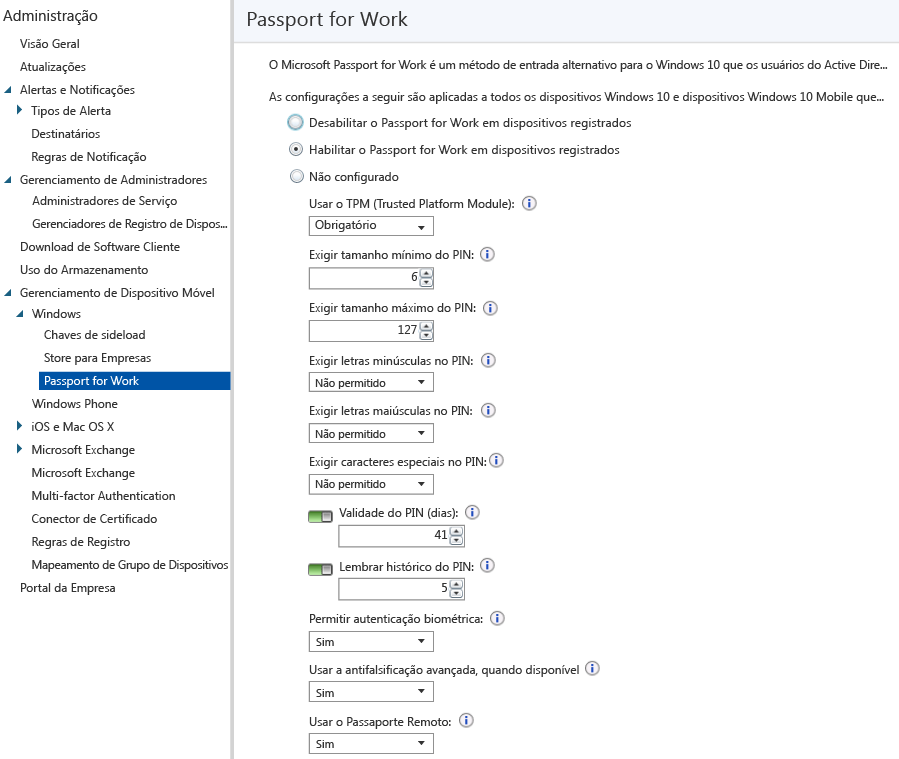

# Controlar as configurações do Microsoft Passport em dispositivos com Microsoft Intune
O Microsoft Intune se integra com o Microsoft Passport for Work, um método de entrada alternativo que usa o Active Directory ou uma conta do Azure Active Directory para substituir uma senha, cartão inteligente ou cartão inteligente virtual.

O Passport permite que você use um *gesto de usuário* para entrar, em vez de uma senha. Um gesto do usuário pode ser um PIN simples, uma autenticação biométrica, como o Windows Hello, ou um dispositivo externo, como um leitor de impressão digital.

>[!TIP]
>O Microsoft Passport for Work agora é conhecido como o Windows Hello para Empresas. O console do Intune ainda não reflete essa alteração.

O Intune se integra com o Passport for Work de duas maneiras:

-   Você pode usar uma política do Intune para controlar quais gestos os usuários podem e não podem usar para entrar.

-   Você pode armazenar certificados de autenticação no Passport for Work para o KPS (provedor de armazenamento de chaves). Para obter mais informações, consulte [Secure resource access with certificate profiles in Microsoft Intune](secure-resource-access-with-certificate-profiles.md) (Proteger o acesso a recursos com perfis de certificado no Microsoft Intune).

## Criar uma política do Passport for Work

1.  No [Console de administração do Microsoft Intune](https://manage.microsoft.com), escolha **Administrador** &gt; **Gerenciamento de Dispositivo Móvel** &gt; **Windows** &gt; **Passport for Work** para abrir a página do Passport for Work.

    

2.  Escolha uma das seguintes configurações:
    - **Desabilite o Passport for Work em dispositivos registrados**. Se você não quiser usar o Passport for Work em dispositivos Windows 10, selecione esta configuração. Todas as outras configurações na tela ficam indisponíveis.
    - **Habilitar o Passport for Work em dispositivos registrados**. Selecione esta configuração se você deseja definir as configurações do Passport for Work em todos os dispositivos Windows 10.
    - **Não configurado**. Selecione esta configuração se você não quiser usar o Intune para controlar as configurações do Passport for Work. Qualquer configuração existente do Passport for Work em dispositivos Windows 10 não serão alteradas. Todas as outras configurações na tela ficam indisponíveis.
3.  Se você selecionou **Habilitar o Passport for Work em dispositivos registrados**, defina as configurações necessárias que serão aplicadas a todos os dispositivos Windows 10 e Windows 10 Mobile registrados.
4.  Quando você terminar, escolha **Salvar**.

## Passport for Work: configurações de PIN

- **Exigir tamanho mínimo do PIN**/**Exigir tamanho máximo do PIN**. Configura os dispositivos para usar os tamanhos mínimo e máximo do PIN especificados para ajudar a garantir a entrada segura. O comprimento padrão do PIN é de seis caracteres, mas você pode impor um comprimento mínimo de quatro caracteres. O comprimento máximo do PIN é de 127 caracteres.
- **Exigir letras minúsculas no PIN**/**Exigir letras maiúsculas no PIN**/**Exigir caracteres especiais no PIN**. Você pode impor um PIN mais forte exigindo o uso de letras maiúsculas, letras minúsculas e caracteres especiais no PIN. Escolha:
    - **Permitido**. Os usuários podem usar o tipo de caractere no seu PIN, mas não é obrigatório.
    - **Obrigatório**. Os usuários devem incluir pelo menos um dos tipos de caracteres em seu PIN. Por exemplo, é uma prática comum exigir pelo menos uma letra maiúscula e um caractere especial.
    - **Não permitido** (padrão). Os usuários não devem usar esses tipos de caractere no seu PIN. (Esse também é o comportamento se a configuração não estiver configurada.)
    > [!TIP]
    > Os caracteres especiais incluem: **! " # $ % &amp; ' ( ) &#42; + , - . / : ; &lt; = &gt; ? @ [ \ ] ^ _ &#96; { &#124; } ~**.
- **Validade do PIN (dias)**. É uma boa prática especificar um período de expiração de um PIN após o qual os usuários devem alterá-lo. O padrão é 41 dias.
- **Lembrar histórico do PIN**. Restringe a reutilização de PINs usados anteriormente. Por padrão, os últimos 5 PINs não podem ser reutilizados.

## Passport for Work: outras configurações

- **Usar o TPM (Trusted Platform Module)**. Um chip TPM fornece uma camada adicional de segurança de dados. Selecione uma das seguintes opções:
    - **Obrigatório** (padrão). Somente dispositivos com um TPM acessível podem provisionar o Passport for Work.
    - **Preferencial**. Primeira tentativa dos dispositivos para usar um TPM. Se não estiver disponível, eles podem usar criptografia de software.
- **Permitir autenticação biométrica**. Permite a autenticação biométrica, como reconhecimento facial ou impressão digital, como uma alternativa a um PIN do Passport for Work. Os usuários ainda devem configurar um PIN de trabalho no caso de falha de autenticação biométrica. Escolha:
    - **Sim**. O Passport for Work permite autenticação biométrica.
    - **Não**. O Passport for Work impede a autenticação biométrica (para todos os tipos de conta).
- **Usar a antifalsificação avançada, quando disponível**. Define se as funcionalidades antifalsificação do Windows Hello são usadas em dispositivos que dão suporte a ele (por exemplo, detectando uma fotografia de um rosto, em vez do rosto real). Se isso for definido como **Sim**, o Windows exige que todos os usuários usem a antifalsificação para recursos faciais quando houver suporte.
- **Use o Remote Passport**. Se essa opção for definida como **Sim**, os usuários poderão usar um passaporte remoto para servir como um dispositivo portátil complementar para autenticação de computador desktop. O computador desktop deve ser associado ao Active Directory do Azure e o dispositivo complementar deve ser configurado com um PIN do Passport for Work.

## Informações adicionais
Para obter mais informações sobre o Microsoft Passport, consulte [o guia](https://technet.microsoft.com/library/mt589441.aspx) na documentação do Windows 10.

<!--HONumber=Aug16_HO1-->

