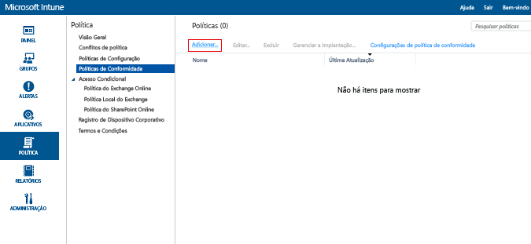
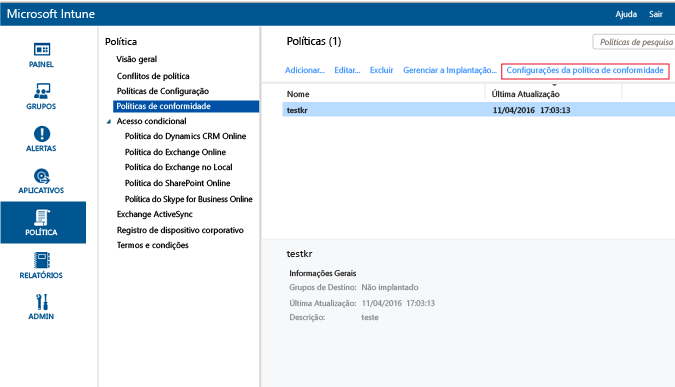
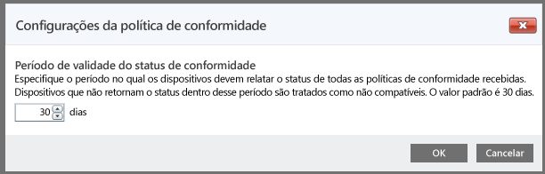

# Criar uma política de conformidade do dispositivo no Microsoft Intune
Este tópico descreve as etapas que você pode usar para criar uma política de conformidade que um dispositivo deve seguir para ser considerado compatível.

##  Etapa 1: Adicionar uma nova política
  No [Console de administração do Microsoft Intune](https://manage.microsoft.com), clique em **Política** &gt; **Políticas de conformidade** &gt; **Adicionar**.

  

##  Etapa 2: Definir configurações
Na página **Criar Política**, habilite as configurações necessárias:
  -   As configurações de segurança do sistema, como senha e criptografia
  -   Configurações de integridade do dispositivo, como, por exemplo, se ele está ou não desbloqueado, ou informado como íntegro pelo serviço de atestado de integridade do dispositivo Windows.
  -   Configurações de propriedade do dispositivo, como a versão mínima do sistema operacional necessária ou a versão máxima permitida.

##  Etapa 3: Salvar a política
Quando tiver terminado, selecione **Salvar Política**.

Você terá a opção de implantar a política logo depois de salvá-la, ou pode optar por implantá-lo mais tarde. A nova política é exibida no nó **Políticas de Conformidade** do espaço de trabalho **Política**.

##  Etapa 4: Definir o período de validade do status de conformidade
Para especificar o tempo que o dispositivo tem para fazer check-in antes que um dispositivo seja considerado não compatível, acesse as configurações da política de conformidade e atualize o tempo.  O padrão é definido como 30 dias.

## Configurações de política com suporte
A tabela a seguir lista as configurações de política de conformidade e as plataformas nas quais elas têm suporte.

-------------
|Setting|iOS|Android|Windows|
|-----|----|-----|-----|
|Exigir uma senha para desbloquear os dispositivos móveis|iOS 6 e posterior|Android 4.0 e posterior  Samsung KNOX padrão 4.0 e posterior|Windows Phone 8 e posterior|
|Permitir senha simples|iOS 6 e posterior|Sem suporte|Windows Phone 8 e posterior|
|Comprimento mínimo da senha|iOS 6 e posterior| Android 4.0 e posterior Samsung KNOX padrão 4.0 e posterior| Windows Phone 8 e posterior Windows 8.1|
|Tipo de senha necessária|iOS 6 e posterior|Não disponível|Windows Phone 8 e posterior  Windows RT  Windows RT 8.1  Windows 8.1|
|Número mínimo de conjuntos de caracteres|iOS 6 e posterior|Não disponível|Windows Phone 8 e posterior  Windows RT  Windows RT 8.1  Windows 8.1|
|Qualidade da senha|Não disponível|Android 4.0 e posterior  Samsung KNOX padrão 4.0 e posterior|Não disponível|
|Minutos de inatividade antes de a senha ser necessária|iOS 6 e posterior|Android 4.0 e posterior Samsung KNOX padrão 4.0 e posterior|Windows Phone 8 e posterior Windows RT e Windows RT 8.1 Windows 8.1|
|Expiração da senha (dias)|iOS 6 e posterior|Android 4.0 e posterior Samsung KNOX padrão 4.0 e posterior|Windows Phone 8 e posterior Windows RT e Windows RT 8.1 Windows 8.1|
|Lembrar de histórico de senha|iOS 6 e posterior|Android 4.0 e posterior Samsung KNOX padrão 4.0 e posterior|Windows Phone 8 e posterior Windows RT e Windows RT 8.1 Windows 8.1|
|Evitar a reutilização de senhas anteriores|iOS 6 e posterior|Android 4.0 e posterior Samsung KNOX padrão 4.0 e posterior|Windows Phone 8 e posterior Windows RT e Windows RT 8.1 Windows 8.1|
|Exigir senha quando o dispositivo retorna de um estado ocioso| Não disponível| Não disponível|Windows 10 Mobile|
|Exigir criptografia no dispositivo móvel|Não aplicável|Android 4.0 e posterior Samsung KNOX padrão 4.0 e posterior|Windows Phone 8 e posterior  Windows 8.1|
|Exigir que os dispositivos sejam relatados como íntegros| Não disponível| Não disponível|Windows  Windows 10 Mobile|
|O dispositivo não deve estar desbloqueado nem pode ter raiz|iOS 6 e posterior|Android 4.0 e posterior Samsung KNOX padrão 4.0 e posterior|Não disponível|
|A conta de email deve ser gerenciada pelo Intune|iOS 6 e posterior|Não disponível| Não disponível|
|Selecione o perfil de email que deve ser gerenciado pelo Intune|iOS 6 e posterior|Não disponível| Não disponível|
|SO mínimo requerido|iOS 6 e posterior|Android 4.0 e posterior Samsung KNOX padrão 4.0 e posterior| Windows Phone 8 e posterior Windows 8.1|
|Versão máxima do SO permitida|iOS 6 e posterior|Android 4.0 e posterior Samsung KNOX padrão 4.0 e posterior|Windows Phone 8 e posterior Windows 8.1|

Selecione uma das opções a seguir para saber mais sobre configurações de conformidade com suporte em cada plataforma:
> [!div class="op_single_selector"]
- [Configurações da política de conformidade para dispositivos iOS](ios-compliance-policy-settings-in-microsoft-intune.md)
- [Configurações da política de conformidade para dispositivos Android](android-compliance-policy-settings-in-microsoft-intune.md)
- [Configurações de política de conformidade para Windows e Windows Phone ](windows-compliance-policy-settings-in-microsoft-intune.md)

## Próximas etapas
[Implantar e monitorar uma política de conformidade](deploy-and-monitor-a-device-compliance-policy-in-microsoft-intune.md)

### Consulte também
[Introdução a políticas de conformidade do dispositivo](introduction-to-device-compliance-policies-in-microsoft-intune.md)

<!--HONumber=Jul16_HO5-->

