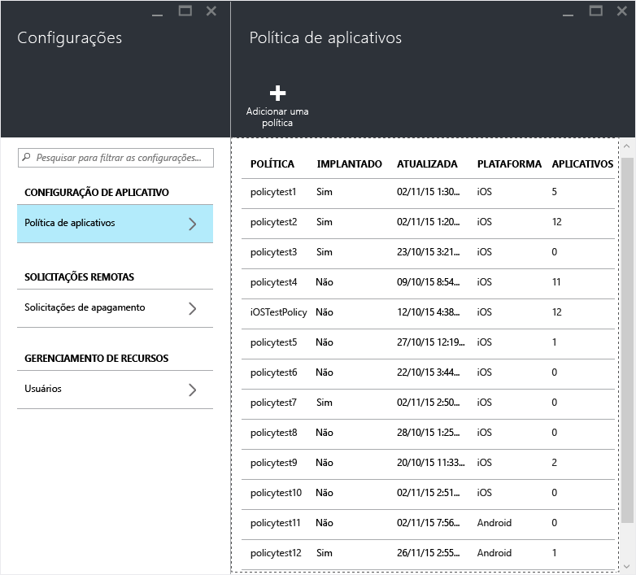
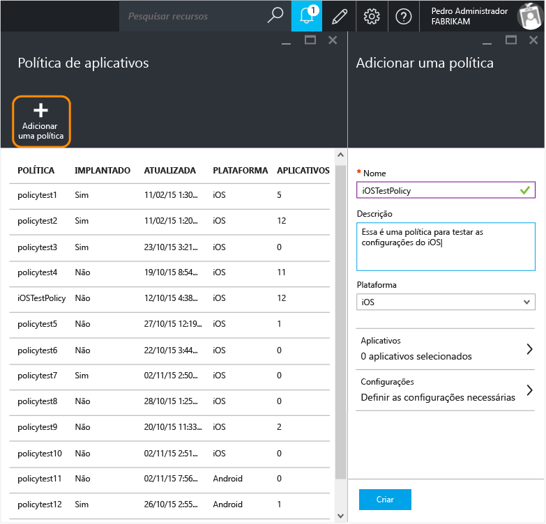
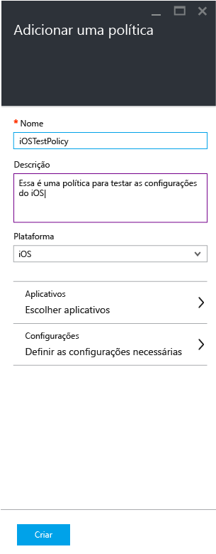
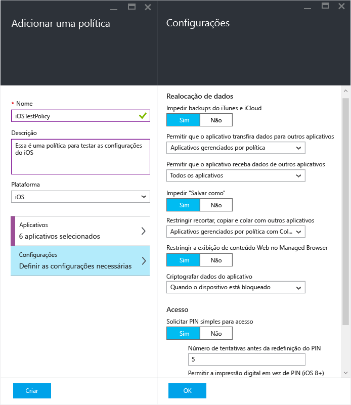
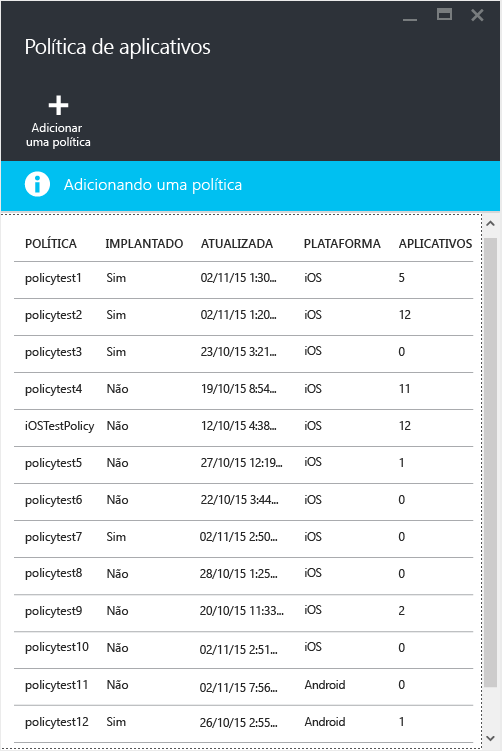
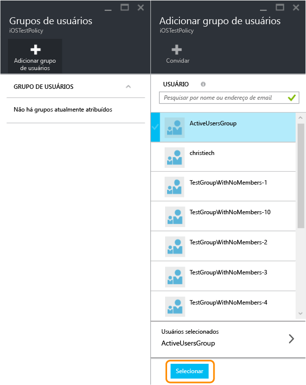
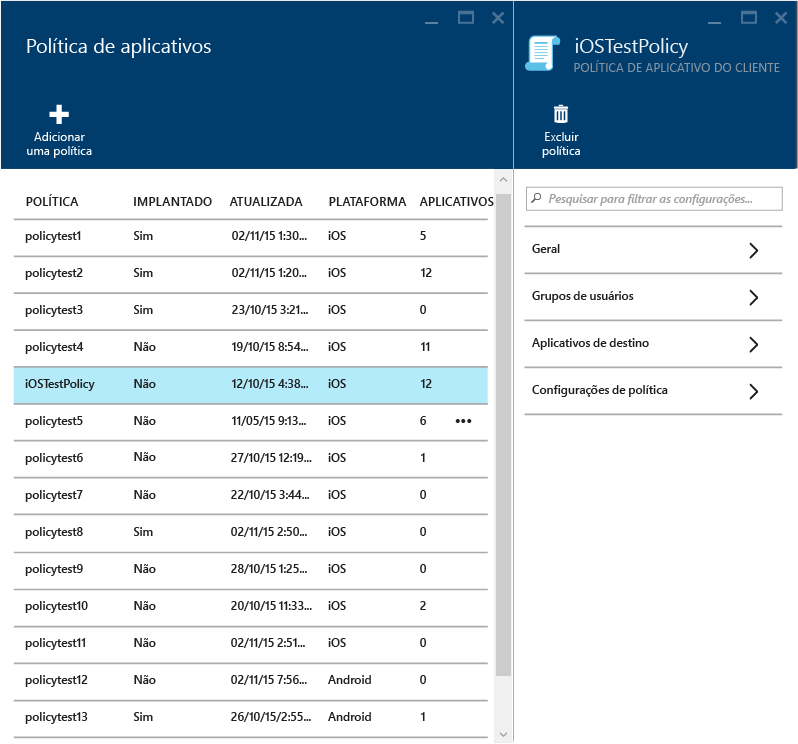
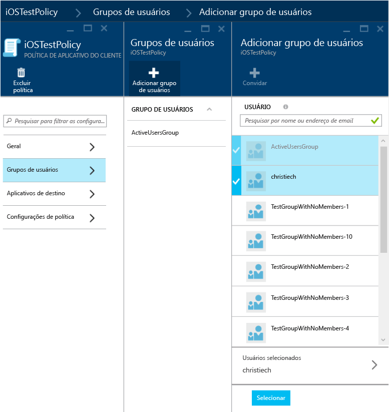
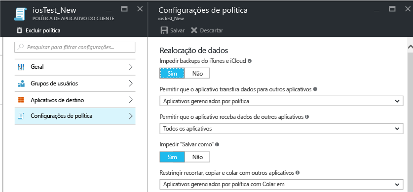

---
# required metadata

title: Criar e implantar políticas de MAM | Microsoft Intune
description:
keywords:
author: karthikaraman
manager: jeffgilb
ms.date: 04/28/2016
ms.topic: article
ms.prod:
ms.service: microsoft-intune
ms.technology:
ms.assetid: c1b9a343-1737-4a65-a9c6-aca48acad11c

# optional metadata

#ROBOTS:
#audience:
#ms.devlang:
ms.reviewer: jeffgilb
ms.suite: ems
#ms.tgt_pltfrm:
#ms.custom:

---

# Criar e implantar políticas de gerenciamento de aplicativo móvel com o Microsoft Intune
Políticas de MAM (Gerenciamento de Aplicativo Móvel) podem ser aplicadas a aplicativos executados em dispositivos que podem ou não ser gerenciados pelo Intune. Para obter uma descrição mais detalhada do funcionamento das políticas de MAM e os cenários com suporte pelas políticas de MAM do Intune, leia o tópico [Proteger dados de aplicativo usando políticas de gerenciamento de aplicativo móvel](protect-app-data-using-mobile-app-management-policies-with-microsoft-intune.md).

Esse tópico descreve o processo de criação de uma política de MAM no **Portal do Azure**. O portal do Azure é o novo console de administração para criar políticas MAM e é recomendável que você use este portal para criar políticas MAM. O portal do Azure dá suporte aos seguintes cenários MAM:
- Dispositivos registrados no Intune
- Dispositivos gerenciados por uma solução MDM terceirizada
- Dispositivos que não são gerenciados por uma solução MDM (BYOD).

Se no momento você estiver usando o **console de administração do Intune** para gerenciar seus dispositivos, poderá criar uma política MAM que dê suporte a aplicativos para dispositivos registrados no Intune usando o [Console de administração do Intune](configure-and-deploy-mobile-application-management-policies-in-the-microsoft-intune-console.md).
>[!IMPORTANT]
> Você não poderá ver todas as configurações de política de MAM no console de administração do Intune. O portal do Azure é o novo console de administração para criar políticas de MAM. Se você criar políticas MAM no console de administração do Intune e no portal do Azure, a política no portal do Azure será aplicada aos aplicativos e implantada para usuários.

Para ver uma lista de configurações de política com suporte para as plataformas Android e iOS, selecione um dos seguintes:

> [!div class="op_single_selector"]
- [Políticas de iOS](ios-mam-policy-settings.md)
- [Políticas do Android](android-mam-policy-settings.md)

##  Criar uma política de MAM
Antes de criar uma política de MAM, examine as informações de [pré-requisitos e suporte](get-ready-to-configure-mobile-app-management-policies-with-microsoft-intune.md).
1.  Escolha **Gerenciamento de aplicativos móveis do Intune&gt; Configurações** para abrir a folha **Configurações**.

    

    > [!TIP] Se esta é a primeira vez que você está usando o Portal do Azure, leia [Azure portal for Microsoft Intune MAM policies](azure-portal-for-microsoft-intune-mam-policies.md) (Portal do Azure para políticas de MAM do Microsoft Intune) primeiro para se familiarizar com o portal.

2.  Na folha **Configurações**, escolha **Política de aplicativos**.  Isso abre a folha **Política de aplicativos** , em que você poderá criar novas políticas e editar as políticas existentes.

    

3.  Escolha **Adicionar uma política**.

    

4.  Digite um nome para a política, adicione uma breve descrição e selecione o tipo de plataforma para criar uma política para iOS ou Android.  Você pode criar mais de uma política para cada plataforma.

    

5.  Escolha **Aplicativos** para abrir a **folha Aplicativos**, em que uma lista de aplicativos disponíveis é exibida. Você pode selecionar um ou mais aplicativos da lista que deseja associar à política que está sendo criada. Depois de selecionar os aplicativos, escolha o botão **Selecionar** na parte inferior da folha **Aplicativos** para salvar sua seleção.

    > [!IMPORTANT] Você deve selecionar pelo menos um aplicativo para criar uma política.

6.  Na folha **Adicionar uma política**, escolha **Definir as configurações necessárias** para abrir a folha de configurações da política.

    Há duas categorias de configurações de política-**Realocação dos dados** e **Acesso**.  Políticas de realocação de dados aplicam-se à movimentação de dados dentro e fora dos aplicativos, enquanto as políticas de acesso determinam como o usuário final acessa os aplicativos em um contexto de trabalho.
    As configurações de política têm valores padrão para que você possa começar mais facilmente.  Não é necessário fazer alterações se os valores padrão atendem às suas necessidades.

    > [!TIP]
    > Essas configurações de política só são aplicadas ao usar aplicativos no contexto corporativo.  Quando o usuário final usa o aplicativo para executar uma tarefa pessoal, ele não é afetado por essas políticas.

    

7.  Escolha **OK** para salvar esta configuração.  Agora você retornou à folha **Adicionar uma política** . Escolha **Criar** para criar a política e salvar suas configurações.

    

    

Ao terminar de criar uma política conforme descrito no procedimento anterior, ela não é implantada para nenhum usuários.  Siga as etapas descritas abaixo para implantar a política.

> [!IMPORTANT]
> Se você criar uma política de MAM para um aplicativo usando o console de administração do Intune e uma política de MAM usando o portal do Azure, a política criada usando o portal do Azure terá precedência. No entanto, o relatório no console do Intune ou do Configuration Manager relatará as configurações de política criadas no portal do Azure. Por exemplo:
>
> -   Você criou uma política de gerenciamento de aplicativos móveis no console de administração do Intune que bloqueia a cópia em um aplicativo.
> -   Você criou uma política de gerenciamento de aplicativos móveis no console do Azure que permite a cópia em um aplicativo.
> -   Você associa essas duas políticas ao mesmo aplicativo.
> -   O resultado é que a política criada no console do Azure tem precedência e a cópia é permitida.
> -   No entanto, status e relatórios no console do Intune indicarão incorretamente que a cópia está bloqueada.

## Implantar uma política para os usuários

1.  Na folha **Política**, escolha **Grupos de usuários**, o que abre a folha **Grupos de usuários**. Escolha **Adicionar grupo de usuários** na folha **Grupos de usuários** para abrir a folha **Adicionar grupo de usuários**.

    

2.  Uma lista de grupos de usuários é exibida na folha **Adicionar grupo de usuários** . Esta é uma lista de todos os grupos de segurança no seu **Active Directory do Azure**.  Você pode selecionar os grupos de usuários aos quais deseja que essa política seja aplicada e escolher **Selecionar**. A escolha de **Selecionar** implanta a política para os usuários.

    

    Agora você criou uma política e a implantou para os usuários.

Somente usuários com licenças [!INCLUDE[wit_nextref](../includes/wit_nextref_md.md)] atribuídas serão afetados pela política.  Os usuários que estão no grupo de segurança que você selecionou e que não têm uma licença [!INCLUDE[wit_nextref](../includes/wit_nextref_md.md)] atribuída não são afetados.

Se você estiver usando o Intune com o Configuration Manager para gerenciar seus dispositivos Android e iOS, a política só será aplicada aos usuários diretamente no grupo que você selecionou.  Membros de grupos filho aninhados dentro do grupo selecionado não serão afetados.

Os usuários finais terão que baixar os aplicativos da Windows Store ou do Google Play. Para obter uma explicação detalhada de como o MAM protege os dados da empresa no dispositivo, consulte o tópico [Experiência do usuário final com aplicativos habilitados para MAM](end-user-experience-for-mam-enabled-apps-with-microsoft-intune.md).

##  Alterar políticas existentes
Você pode editar uma política existente e aplicá-la aos usuários de destino. No entanto, quando você altera as políticas existentes, os usuários já conectados aos aplicativos só verão as alterações após um período de 8 horas.

Para ver o efeito das alterações imediatamente o usuário final precisará sair do aplicativo e entrar novamente.

### Para alterar a lista de aplicativos associados à política

1.  Na folha **Política de aplicativos**, escolha a política que quer alterar. Isso abrirá uma folha específica para a política que você selecionou.

    

2.  Na folha de política, escolha **Aplicativos de destino** para abrir a lista de aplicativos.

3.  Remova ou adicione aplicativos da lista e escolha o **ícone Salvar** para salvar suas alterações.

### Para alterar a lista de grupos de usuários

1.  Na folha **Política de aplicativos**, escolha a política que quer alterar. Isso abrirá a folha específica para a política selecionada.

2.  Na folha da política, escolha **Grupos de usuários** para abrir a folha **Grupo de usuários** que mostra a lista atual de grupos de usuários que têm essa política.

3.  Para **adicionar um novo grupo de usuários** à política, escolha **Adicionar grupo de usuários** e selecione o grupo de usuários. Escolha **Selecionar** para implantar a política no grupo selecionado.

    

4.  Para **Excluir um grupo de usuários**, realce o grupo de usuários que você deseja remover, escolha reticências (...) e depois escolha **Excluir** para remover o grupo de usuários.

    

### Para alterar as configurações de política

1.  Na folha **Política de aplicativos**, escolha a política que quer alterar. Isso abrirá uma folha específica para a política que você selecionou.

    

2.  Escolha **Configurações de política** para abrir a folha **Configurações de política**.

3.  Altere as configurações e escolha o **ícone Salvar** para salvar suas alterações.

    

## Configurações de política
Para ver uma lista completa de configurações de política para iOS e Android, selecione um dos seguintes:

> [!div class="op_single_selector"]
  - [Políticas de iOS](ios-mam-policy-settings.md)
  - [Políticas do Android](android-mam-policy-settings.md)

## Próximas etapas
[Monitorar conformidade e status do usuário](monitor-mobile-app-management-policies-with-microsoft-intune.md)

### Consulte também
[Experiência do usuário final para aplicativos habilitados para MAM](end-user-experience-for-mam-enabled-apps-with-microsoft-intune.md)

<!--HONumber=May16_HO3-->

