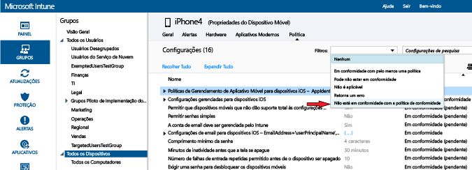

# Implantar e monitorar política de conformidade de dispositivo no Microsoft Intune
## Implantar uma política de conformidade
Implante a política de conformidade [criada](create-a-device-compliance-policy-in-microsoft-intune.md) para um ou mais grupos de usuários em sua organização. Quando uma política de conformidade é implantada para um usuário, os dispositivos dos usuários são verificados quanto à conformidade.

1.  No espaço de trabalho **Política**, selecione a política que deseja implantar e selecione **Gerenciar Implantação**.

2.  Na caixa de diálogo **Gerenciar Implantação**, escolha um ou mais grupos nos quais você deseja implantar a política e escolha **Adicionar** > **OK**.
 Use os grupos do Active Directory que você já criou e sincronizou com o Intune ou crie esses grupos manualmente no console do Intune. Para saber mais sobre como implantar políticas, consulte [Implantar uma política de configuração](manage-settings-and-features-on-your-devices-with-microsoft-intune-policies.md).

Use o resumo de status e alertas na página **Visão Geral** do espaço de trabalho **Política** para identificar problemas com a política que exigem sua atenção. Além disso, um resumo de status aparece no espaço de trabalho **Painel** .

> [!IMPORTANT]
> Se você não tiver implantado uma política de conformidade e habilitar a política de acesso condicional do Exchange, todos os dispositivos de destino terão acesso.

## Monitorar a política de conformidade

#### Para exibir os dispositivos que não estão de acordo com uma política de conformidade

1.  No [console de administração do Microsoft Intune](https://manage.microsoft.com), escolha **Grupos** > **Todos os Dispositivos**.

2.  Clique duas vezes no nome de um dispositivo na lista de dispositivos.

3.  Escolha a guia **Política** para ver uma lista de políticas para esse dispositivo.

4.  Da lista suspensa **Filtros**, escolha **Não está em conformidade com a política de conformidade**.

#### Para exibir os relatórios de atestado de integridade

1.  No [Console de administração do Microsoft Intune](https://manage.microsoft.com), selecione **Política**.

2.  Na página **Relatório de Atestado de Integridade – Criar um novo relatório**, você pode exibir um relatório com todos os dados do atestado de integridade do Windows 10 coletados pelo Intune. Você também pode criar um relatório com um subconjunto dos dados usando filtros. Os filtros podem ser baseados no tipo de dispositivo, no sistema operacional ou apenas em um subconjunto de pontos de dados.

## Como o Intune resolve conflitos de política
Podem ocorrer conflitos de política quando várias políticas do Intune são aplicadas a um dispositivo. Se as configurações de política se sobrepuserem, o Intune resolverá os conflitos usando as seguintes regras:

-   Se as configurações conflitantes forem de uma política de configuração do Intune e de uma política de conformidade, as configurações na política de conformidade têm precedência sobre as configurações na política de configuração. Isso acontece mesmo que as configurações na política de configuração sejam mais seguras.

-   Se você tiver implantado várias políticas de conformidade, o Intune usará a mais segura dessas políticas.

## Próximas etapas
Para saber como usar a política de conformidade com políticas de acesso condicional para controlar o acesso a serviços em sua organização, consulte [Restringir o acesso ao email e aos serviços do O365](restrict-access-to-email-and-o365-services-with-microsoft-intune.md).

### Consulte também
[Introdução a políticas de conformidade de dispositivo no Intune](introduction-to-device-compliance-policies-in-microsoft-intune.md)

<!--HONumber=Oct16_HO4-->

