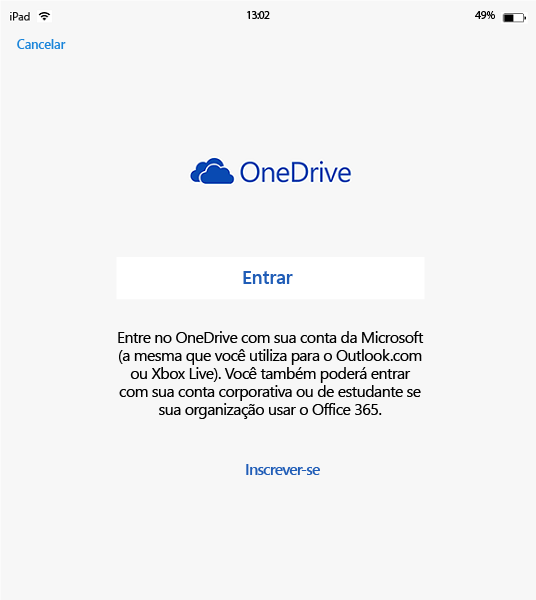
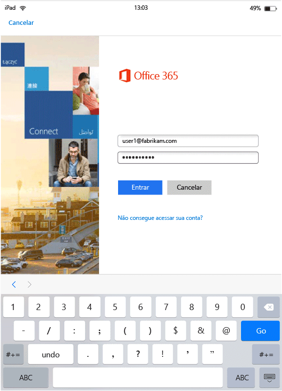
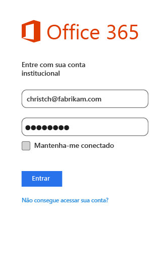
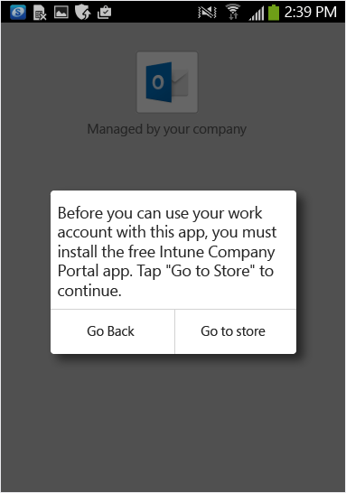
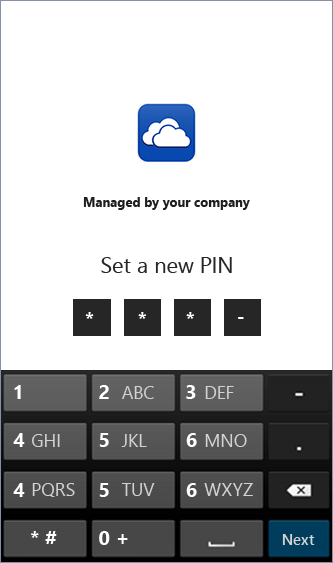
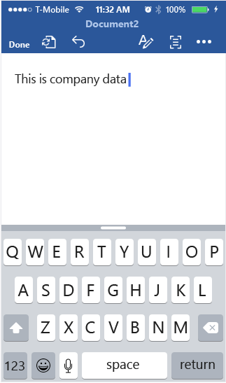

# Experiência do usuário final para aplicativos habilitados para MAM com Microsoft Intune
As políticas de MAM (gerenciamento de aplicativos móveis) são aplicadas somente quando os aplicativos são usados no contexto de trabalho.  Leia os seguintes cenários para entender como os aplicativos gerenciados funcionam.
##  Acessando o OneDrive em um dispositivo iOS

1.  Inicie o aplicativo do  **OneDrive** para abrir a página de logon.

    

    > [!NOTE]
    > Em um dispositivo pessoal, normalmente o usuário final deve baixar o aplicativo.  Se o dispositivo for gerenciado por uma solução MDM, você pode implantar o aplicativo no dispositivo.

2.  Digite seu nome de usuário da conta corporativa. Você será redirecionado para a página de **autenticação do O365** para inserir suas credenciais de trabalho.

    

3.  Depois que as credenciais são autenticadas com êxito pelo AD do Azure, as políticas de MAM são aplicadas e você deverá a reiniciar o aplicativo **OneDrive** .
  >[OBSERVAÇÃO!] A caixa de diálogo de reinício necessário é exibida somente em dispositivos que não estão registrados no Intune.

    

4.  Quando você reinicia o aplicativo **OneDrive**, ele é iniciado com as políticas de MAM ativadas. Agora você deverá definir um **PIN** para o aplicativo. (se você tiver configurado a política para isso).

    

5.  Depois de definir e confirmar o PIN, você poderá acessar os arquivos no seu **OneDrive for Business**.

    

    > [!NOTE]
    > Quando você altera uma política implantada, as alterações serão aplicadas da próxima vez que abrir o aplicativo.

##  Acessando o OneDrive em um dispositivo Android

1.  Inicie o aplicativo OneDrive para abrir a página de logon.

    > [!NOTE]
    > Em um dispositivo pessoal, normalmente o usuário final deve baixar o aplicativo.  Se o dispositivo for gerenciado por uma solução MDM, você pode implantar o aplicativo no dispositivo.

2.  Digite seu nome de usuário da conta corporativa. Você será redirecionado para a página de **autenticação do O365** para inserir suas credenciais de trabalho.

    

3.  Depois que as credenciais forem autenticadas com êxito pelo **AD do Azure**, você verá uma mensagem exibindo as instruções para instalar o aplicativo do portal da empresa, se ele já não estiver instalado no dispositivo.  Toque em **Obter o aplicativo** para continuar.

>[!NOTE]
>O aplicativo Portal da Empresa é necessário para todos os aplicativos associados a políticas de MAM em dispositivos Android. Para dispositivos não registrados no Intune, o aplicativo deve ser instalado no dispositivo, mas não precisa inicialização ou autenticação no aplicativo.  

  

4.  Agora você estará na loja do **Google Play** , em que poderá baixar e instalar o aplicativo do **Portal da Empresa** .

    O aplicativo de Portal da Empresa ajuda a manter os dados seguros e protegidos.

    

5.  Depois de concluir a instalação, escolha **Aceitar** para aceitar os termos.

6.  O aplicativo **OneDrive** é iniciado automaticamente.

7.  Na próxima vez que você abrir o OneDrive, verá o prompt para definir um **PIN**, desde que as configurações de política tenham sido definidas para exigir um PIN para acessar o aplicativo **OneDrive** .

    

8.  Depois que o PIN for definido e confirmado, você poderá continuar usando o **OneDrive**, agora gerenciado por políticas de aplicativo.

##  Usando aplicativos com suporte a várias identidades
O Microsoft Word é usado como um exemplo para este cenário.

1.  Abra o aplicativo **Word** em seu dispositivo. Aqui usamos um dispositivo iOS para mostrar as etapas.

2.  Toque em **Novo** para criar um novo documento do Word.

    

3.  Digite uma frase de sua escolha.  Quando você tenta salvar o documento, ambos os locais pessoal e de trabalho são mostrados como opções para salvar o documento que você acabou de criar.  Nesta etapa, as políticas de aplicativo são ainda não foram aplicadas, pois esse contexto de corporativo/pessoal ainda não foi estabelecido.

4.  Salve o documento no seu local do OneDrive corporativo. Agora ele é marcado como dados da empresa e as restrições de política são aplicadas.

    

5.  Abra o documento que você salvou em seu local de trabalho.  Copie o texto, abra sua conta pessoal do **Facebook** e tente colar o texto copiado.  Você não poderá colar o conteúdo em uma nova postagem do Facebook. A opção de colar não está desativada, mas nada acontece quando você pressiona **Colar**.

    

    

6.  Agora, repita as etapas 2 e 3 para criar outro novo documento, digite uma frase de sua escolha e, em vez de salvá-la em seu trabalho, salve-a em uma localização pessoal, como **OneDrive - pessoal**.

    

7.  Abra o documento pessoal salvo.  Copie o texto, abra o aplicativo do **Facebook** e tente colar o texto copiado. Veja como agora é possível colar o conteúdo em uma postagem do Facebook.

    

##  Gerenciar contas de usuário

O Intune só dá suporte a políticas de MAM a apenas uma conta de usuário por dispositivo. Se um dispositivo tiver mais de uma conta corporativa, apenas uma conta corporativa será gerenciada pelas políticas de MAM.

Dependendo do aplicativo que você estiver usando, o segundo usuário poderá ou não ser bloqueado no dispositivo. No entanto, em todos os casos, somente o primeiro usuário que obtém as políticas de MAM é afetado pela política.

Se um dispositivo existente tiver várias contas de usuário antes que as políticas de MAM sejam implantadas, a conta em que as políticas de MAM forem implantadas primeiro será gerenciada pelas políticas de MAM do Intune.

**Microsoft Word**, **Excel**, e **PowerPoint** não bloqueiam uma segunda conta de usuário, mas a segunda conta de usuário não é afetada pelas políticas de MAM.  

Para os **aplicativos OneDrive e Outlook**, só pode ser usada uma conta corporativa.  A adição de várias contas corporativas é bloqueada nesses aplicativos.  É possível remover um usuário e adicionar um usuário diferente ao dispositivo.

Leia o cenário de exemplo abaixo para obter uma compreensão mais profunda de como várias contas de usuário são tratadas.

O usuário A trabalha para duas empresas - **empresa X**, e **empresa Y**. O usuário A tem uma conta corporativa para cada empresa e ambas usam o Intune para implantar políticas de MAM. A **Empresa X** implanta políticas MAM **antes da** **empresa Y**. A conta associada à **empresa X** obterá a política de MAM, mas não a conta associada à empresa Y. Se você quiser que a conta de usuário associada à empresa Y seja gerenciada pelas políticas de MAM, deverá remover a conta de usuário associada a empresa X.
### Adicionando uma segunda conta
#### IOS
Se você estiver usando um dispositivo iOS, ao tentar adicionar uma segunda conta corporativa ao mesmo dispositivo, poderá ver uma mensagem de bloqueio.  Você também verá uma opção para remover a conta existente e adicionar uma nova. Você pode fazer isso escolhendo **Sim**.

####  Android
Se você estiver usando um dispositivo Android, poderá ver uma mensagem de bloqueio com instruções para remover a conta existente e adicionar uma nova.  Em dispositivos Android, para remover a conta existente, vá para **Configurações &gt;Geral &gt; Gerenciador de Aplicativos &gt;Portal da Empresa e selecione "Limpar Dados"**.

##  Exibindo arquivos de mídia com o aplicativo Proteção de Informações do Azure (anteriormente conhecido como aplicativo de compartilhamento Rights Management)
Para exibir os arquivos AV, PDF e de imagem em dispositivos Android, use o [aplicativo Proteção de Informações do Azure](https://play.google.com/store/apps/details?id=com.microsoft.ipviewer).

Baixe este aplicativo da Google Play Store.  

Os tipos de arquivo a seguir têm suporte:

* **Áudio:** AAC LC, HE-AACv1 (AAC+), HE-AACv2 (AAC+ aprimorado), AAC ELD (AAC com pouco atraso aprimorado), AMR-NB, AMR-WB, FLAC, MP3, MIDI, Vorbis, PCM/WAVE.
* **Vídeo:** H.263, H.264 AVC, MPEG-4 SP, VP8.
* **Imagem:** jpg, pjpg, png, ppng, bmp, pbmp, gif, pgif, jpeg, pjpeg.
* **PDF, PPDF**

------------
|**pfile**|**text**|
|----|----|
|Pfile é um formato genérico “wrapper” para arquivos protegidos que encapsula o conteúdo criptografado e as licenças da Proteção de Informações do Azure e podem ser usadas para proteger qualquer tipo de arquivo.|Arquivos de texto, inclusive XML, CSV etc. podem ser abertos para visualização no aplicativo, mesmo quando eles são protegidos. Tipos de arquivo: txt, ptxt, csv, pcsv, log, plog, xml, pxml.|
---------------

### Consulte também
[Criar e implantar políticas de gerenciamento de aplicativo móvel com o Microsoft Intune](create-and-deploy-mobile-app-management-policies-with-microsoft-intune.md)

<!--HONumber=Oct16_HO1-->

