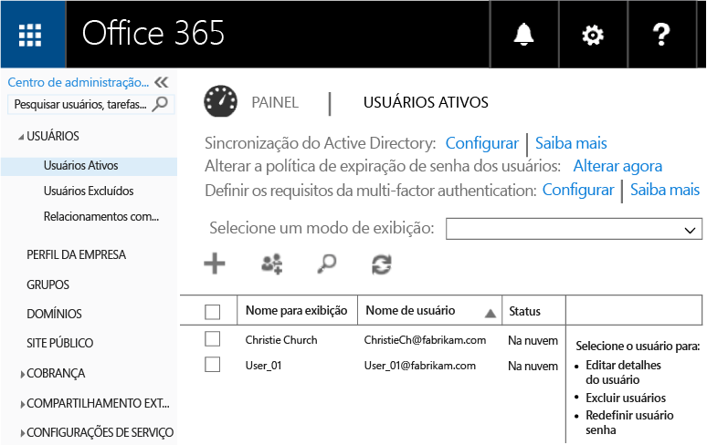
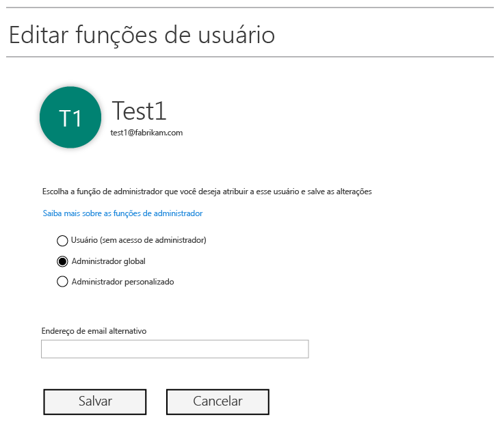
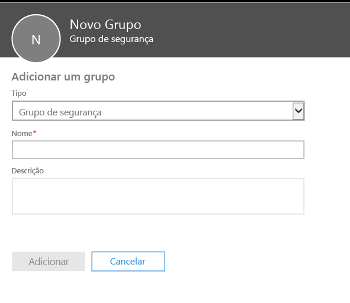
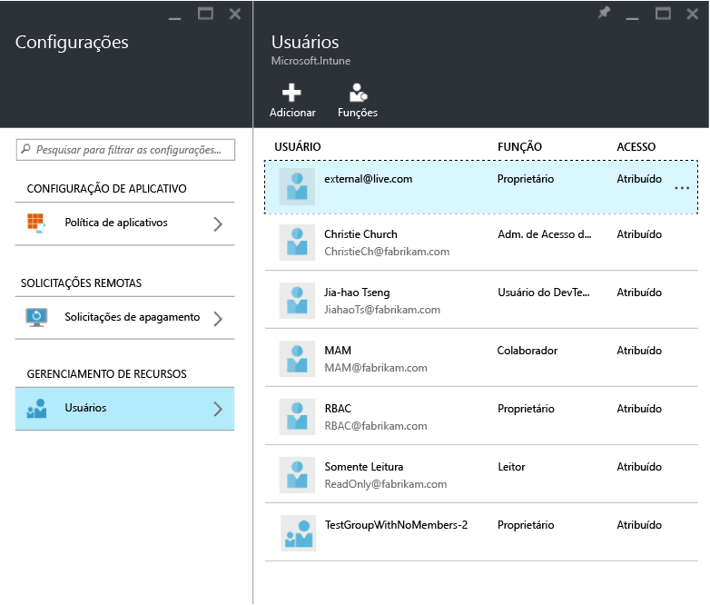
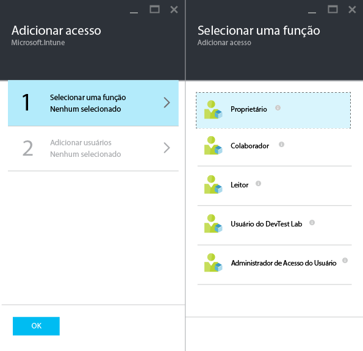
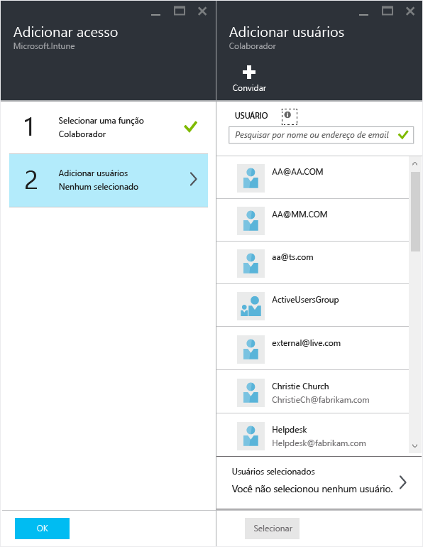

# Preparar-se para configurar as políticas de gerenciamento de aplicativos móveis com o Microsoft Intune
Este tópico descreve o que você precisa fazer para começar a criar políticas de MAM (Gerenciamento de Aplicativo Móvel) no Portal do Azure.

O portal do Azure é o novo console de administração para criar políticas de MAM. É recomendável que você use este portal para criar políticas de MAM. O Portal do Azure dá suporte aos seguintes cenários de MAM:
- Dispositivos registrados no Intune
- Dispositivos gerenciados por uma solução de MDM de terceiros
- Dispositivos que não são gerenciados por uma solução de MDM (BYOD)

Se você for novo no uso do portal do Azure, leia o tópico [Azure portal for Microsoft Intune MAM policies](azure-portal-for-microsoft-intune-mam-policies.md) (Portal do Azure para políticas MAM do Microsoft Intune) para obter uma visão geral rápida.

>[!IMPORTANT]

> Se no momento você estiver usando o console de administração do Intune para gerenciar seus dispositivos, poderá criar políticas de MAM que deem suporte a aplicativos para dispositivos registrados no Intune usando o Console de administração do Intune. Mas é recomendável que você use o Portal do Azure, mesmo para os dispositivos registrados no Intune. Para obter instruções sobre como criar uma política de MAM usando o console de administração do Intune, consulte [Configurar e implantar políticas de gerenciamento de aplicativos móveis no console do Microsoft Intune](configure-and-deploy-mobile-application-management-policies-in-the-microsoft-intune-console.md).

> Você não poderá ver todas as configurações de política de MAM no console de administração do Intune. Se você criar políticas de MAM no console de administração do Intune e no Portal do Azure, a política no Portal do Azure será aplicada aos aplicativos e implantada para usuários.
> As políticas de MAM criadas no console de administração do Intune não podem ser importadas no Portal do Azure.  As políticas de MAM devem ser recriadas no Portal do Azure.

##  Plataformas com suporte
- iOS 8.1 ou posterior

- Android 4 ou posterior

Não há suporte para dispositivos Windows.
##  Aplicativos com suporte
* **Aplicativos Microsoft:** esses aplicativos têm o SDK de Aplicativo do Intune interno e não exigem nenhum processamento adicional antes de aplicar as políticas de MAM.
Para ver a lista completa de aplicativos da Microsoft com suporte, vá para a [Galeria de aplicativos móveis do Microsoft Intune](https://www.microsoft.com/en-us/server-cloud/products/microsoft-intune/partners.aspx) na página de parceiros de aplicativos do Microsoft Intune. Clique em um aplicativo para ver os cenários e plataformas com suporte e para ver se o aplicativo dá suporte a várias identidades ou não.
* **Aplicativos de linha de negócios da sua organização:** eles requerem a preparação do aplicativo para incluir o SDK de Aplicativo do Intune antes que seja possível aplicar as políticas de MAM.

  * Para dispositivos que são gerenciados pelo Intune, consulte [Decide how to prepare apps for MAM](decide-how-to-prepare-apps-for-mobile-application-management-with-microsoft-intune.md) (Decidir como preparar os aplicativos para MAM).
  * Para dispositivos que não são gerenciados (como dispositivos do funcionário) ou para dispositivos que são gerenciados por uma solução de gerenciamento de dispositivo móvel de terceiros, consulte [Proteger aplicativos de linha de negócios e dados em dispositivos não registrados no Intune](protect-line-of-business-apps-and-data-on-devices-not-enrolled-in-microsoft-intune.md).

*Antes* de configurar políticas de MAM, você precisa do seguinte:

-   Uma assinatura do Microsoft Intune.    Os usuários precisam de licenças do [!INCLUDE[wit_nextref](../includes/wit_nextref_md.md)] para obter aplicativos que têm políticas de MAM.

-   Uma assinatura do Office 365, que é necessária para o seguinte:
  - Para aplicar políticas de MAM a aplicativos com suporte a várias identidades.
  - Para criar contas corporativas do SharePoint Online e Exchange Online. Não há suporte para o Exchange e o SharePoint locais.
-   Instalação do Skype for Business Online para autenticação moderna. Para obter mais informações, consulte [Habilitar a autenticação moderna](http://social.technet.microsoft.com/wiki/contents/articles/34339.skype-for-business-online-enable-your-tenant-for-modern-authentication.aspx.md).

- Azure AD (Azure Active Directory) para criar usuários. O Azure AD autentica os usuários quando eles abrem o aplicativo e inserem suas credenciais de trabalho.

    > [!NOTE]
    > Se você estiver configurando a usuários usando o console do [!INCLUDE[wit_nextref](../includes/wit_nextref_md.md)], lembre-se de que a configuração de política de MAM está migrando para o Portal do Azure. Para usar este portal, você precisa configurar grupos de usuários do Azure AD usando o portal do Office 365.

## Criar usuários e atribuir licenças do Microsoft Intune

1. Certifique-se de que você tenha uma assinatura do Intune. Você já tem uma assinatura do [!INCLUDE[wit_nextref](../includes/wit_nextref_md.md)] se estiver usando o [!INCLUDE[wit_nextref](../includes/wit_nextref_md.md)] para gerenciar seus dispositivos.  Você também terá uma assinatura do [!INCLUDE[wit_nextref](../includes/wit_nextref_md.md)] se tiver adquirido uma licença do EMS (Enterprise Mobility Suite). Se estiver experimentando o [!INCLUDE[wit_nextref](../includes/wit_nextref_md.md)] para conferir os recursos de MAM, você poderá obter uma conta de avaliação na [Página do Microsoft Intune](http://www.microsoft.com/en-us/server-cloud/products/microsoft-intune/).

    Para verificar se você tem uma assinatura do [!INCLUDE[wit_nextref](../includes/wit_nextref_md.md)], no portal do Office, vá para a página **Cobrança**.  Você deve ver [!INCLUDE[wit_nextref](../includes/wit_nextref_md.md)] como **Ativo** nas assinaturas.

2.  Entre no [portal do Office](http://portal.office.com) com suas credenciais de administrador.

3.  Vá até a página **Usuários Ativos** para adicionar usuários e atribuir licenças do [!INCLUDE[wit_nextref](../includes/wit_nextref_md.md)].

    

4.  Para conceder a um usuário a capacidade de acessar o portal do Office, o portal do Azure AD e o Portal do Azure, atribua a função de **Administrador Global** ao usuário.

    

5.  Políticas de MAM são implantadas para grupos de usuários no Active Directory do Azure. Para criar grupos de usuários para as políticas de MAM, vá até a página **Grupos** no portal do Office e clique no ícone **+** para criar um novo grupo de segurança.  Digite um nome, uma descrição e clique em **Criar**. Quando o grupo é criado, você pode adicionar usuários ao grupo clicando em **Editar membros**. O grupo de segurança é criado no Active Directory do Azure.

    

A tabela a seguir lista as funções e as permissões que podem ser atribuídas aos usuários administradores.

|||
|--|----|
|**Função**|**Permissões**|
|Administrador global (portal do Office 365)|Acesso ao portal do Office 365 e portal do Azure AD.  Acesso ao Portal do Azure (pode realizar tarefas de gerenciamento de função e de aplicativo móvel).|
|Proprietário (Portal do Azure)|Acesso ao Portal do Azure (pode realizar tarefas de gerenciamento de função e de aplicativo móvel).|
|Colaborador (Portal do Azure)|Acesso ao Portal do Azure (pode realizar apenas tarefas de gerenciamento de aplicativo móvel).|

## Atribuir a função de colaborador a um usuário

Os administradores globais têm acesso ao [Portal do Azure](https://portal.azure.com).  Se desejar que outros usuários administradores possam configurar políticas e realizar outras tarefas de gerenciamento de aplicativos móveis, você poderá atribuir a função de colaborador aos usuários:

1.  Na folha **Configurações**, na seção **Gerenciamento de recursos**, clique em **Usuários**.

    

2.  Clique em **Adicionar** para abrir a folha **Adicionar acesso** .

3.  Clique em **Selecionar uma função** e em **Colaborador**.

    

4.  Clique em **Adicionar usuário** e pesquise o usuário por nome ou endereço de email. Os usuários que você vê nessa lista são os primeiros 1.000 usuários criados previamente no Azure AD usando o portal do Office. Clique em **OK** na folha **Adicionar acesso** para salvar e atribuir a função ao usuário.

    

    > [!IMPORTANT]
    > Se você selecionar um usuário que não tem uma licença [!INCLUDE[wit_nextref](../includes/wit_nextref_md.md)] atribuída, ele não poderá acessar o portal.

## Próximas etapas
[Criar e implantar políticas de gerenciamento de aplicativo móvel com o Microsoft Intune](create-and-deploy-mobile-app-management-policies-with-microsoft-intune.md)

<!--HONumber=Jul16_HO3-->

