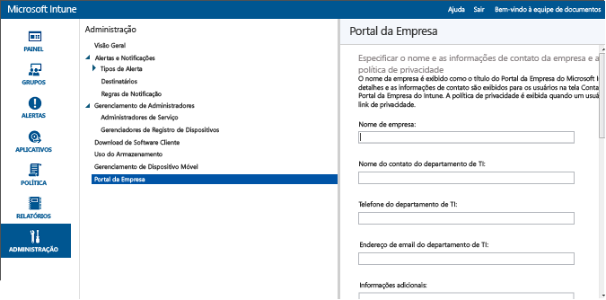

---
# required metadata

title: Prepare-se registrar dispositivos | Microsoft Intune
description:
keywords:
author: NathBarn
manager: jeffgilb
ms.date: 04/28/2016
ms.topic: article
ms.prod:
ms.service: microsoft-intune
ms.technology:
ms.assetid: 44fd4af0-f9b0-493a-b590-7825139d9d40

# optional metadata

#ROBOTS:
#audience:
#ms.devlang:
ms.reviewer: jeffgilb
ms.suite: ems
#ms.tgt_pltfrm:
#ms.custom:

---

# Prepare-se registrar dispositivos no Microsoft Intune
Para permitir que os funcionários registrem dispositivos móveis (incluindo [Android](set-up-android-management-with-microsoft-intune.md), [iOS e Mac](set-up-ios-and-mac-management-with-microsoft-intune.md), [Windows Phone](set-up-windows-phone-management-with-microsoft-intune.md) e [Computadores Windows](set-up-windows-device-management-with-microsoft-intune.md)) com o Intune, você deve habilitar o registro de dispositivo. Para permitir o registro você deve definir uma autoridade de gerenciamento de dispositivo móvel, configurar o Portal da Empresa do Intune, atribuir licenças e habilitar o registro para a plataforma do dispositivo.

## Defina a autoridade de gerenciamento de dispositivos móveis
A autoridade MDM define o serviço de gerenciamento com permissão para gerenciar um conjunto de dispositivos. As opções para a autoridade MDM incluem o Intune e o Configuration Manager com Intune. Se você definir o Configuration Manager como a autoridade de gerenciamento, nenhum outro serviço poderá ser usado para gerenciamento de dispositivo móvel.

>[!IMPORTANT]
> Considere atentamente se você quer gerenciar dispositivos móveis usando apenas o Intune (serviço online) ou o System Center Configuration Manager com a integração com Intune (solução de software local com serviço online). Depois de configurada, a autoridade de gerenciamento de dispositivo móvel não poderá ser alterada.

1.  No [Console de administração do Microsoft Intune](http://manage.microsoft.com), clique em **Administrador** &gt; **Gerenciamento de Dispositivo Móvel**.

2.  Na lista **Tarefas** , clique em **Configurar autoridade de gerenciamento de dispositivo móvel**. A caixa de diálogo **Definir autoridade MDM** é aberta.

    

3.  O Intune solicita a confirmação de que você deseja o Intune como autoridade MDM. Marque a caixa de seleção e escolha **Sim** para usar o Microsoft Intune para gerenciar dispositivos móveis.

## Configurar o Portal da Empresa do Intune

O Portal da Empresa do Intune é onde os usuários acessam os dados da empresa e podem fazer tarefas comuns, como o registro de dispositivo, a instalação de aplicativos e a localização de informações de assistência do departamento de TI.

> [!TIP] Quando você personaliza o Portal da Empresa, as configurações se aplicam ao site do Portal da Empresa e aos aplicativos do Portal da Empresa.

Personalizar o Portal da Empresa ajuda a fornecer uma experiência familiar e útil para os usuários finais. Para fazer isso, basta fazer logon no [Console do administrador do Microsoft Intune](https://manage.microsoft.com) como administrador de serviços ou locatário, escolher **Administrador** &gt; **Portal da Empresa** e definir as configurações do Portal da Empresa.

#### Declaração de privacidade e informações de contato de empresa

O nome da empresa é exibido como o título do Portal da Empresa. Os detalhes e as informações de contato são exibidos para os usuários na tela Contatar TI do Portal da Empresa. A política de privacidade é exibida quando um usuário clica no link de privacidade.

|Nome do campo|Comprimento máx.|Mais informações|
    |----------|------------------------|----------------|
    |Nome da empresa|40|Este é o nome exibido como título do Portal da Empresa.|
    |Nome do contato do departamento de TI|40|Esse nome é exibido na página **Contatar TI**.|
    |Telefone do departamento de TI|20|Este número de contato é exibido na página **Contatar TI**.|
    |Endereço de email do departamento de TI|40|Este endereço de contato é exibido na página **Contatar TI**. Você deve inserir um endereço de email válido no formato **alias@domainname.com**.|
    |Informações adicionais|120|Exibido na página **Contatar TI**.|
    |URL de política de privacidade de empresa|79|Você pode especificar a política de privacidade de sua própria empresa que será exibida quando os usuários clicarem nos links de privacidade do Portal da Empresa. Você deve digitar uma URL válida no formato https://www.contoso.com.|

#### Contatos de suporte
O site de suporte é exibido para os usuários no Portal da Empresa para que eles possam acessar o suporte online.

|Nome do campo|Comprimento máx.|Mais informações|
    |----------|------------------------|----------------|
    |URL do site de suporte|150|Se tiver um site de suporte que queira que os usuários usem, especifique o URL aqui. A URL deve estar no formato https://www.contoso.com. Se você não especificar uma URL, nada será exibido no site de suporte da página **Contatar TI**, no Portal da Empresa.|
    |Nome do site|40|Este é o nome amigável exibido para a URL do site de suporte. Se você especificar uma URL do site de suporte e nenhum nome amigável, **Ir para o site da TI** será exibido na página **Contatar IT** do Portal da Empresa.|

#### Personalização da identidade visual da empresa

Você pode personalizar o Portal da Empresa com o logotipo e o nome da empresa, uma cor de tema e um segundo plano.

|Nome do campo|Mais informações|
    |----------|----------------|
    |Cores do tema|Selecione uma cor de tema para aplicar ao Portal da Empresa.|
    |Incluir o logotipo da empresa|Ao habilitar esta opção, você pode carregar o logotipo da empresa para ser exibido no Portal da Empresa. Você pode carregar dois logotipos: um que será exibido quando o segundo plano do Portal da Empresa for branco e outro que será exibido quando o segundo plano estiver usando a sua cor de tema selecionada. Cada logotipo deve ser um tipo de arquivo .png ou .jpg e ter uma resolução máxima de 400 x 100 pixels e ter 750 KB ou menos em tamanho.|
    |Escolha um plano de fundo para o aplicativo do Portal da Empresa do [!INCLUDE[win8_client_2](../includes/win8_client_2_md.md)]|Esta configuração afeta somente a tela de fundo do aplicativo do Portal da Empresa do [!INCLUDE[win8_client_2](../includes/win8_client_2_md.md)].|

Depois de salvar suas alterações, é possível usar os links fornecidos na parte inferior da página do **Portal da Empresa** do console do administrador para exibir o site do Portal da Empresa. Esses links não podem ser alterados. Quando um usuário entra, esses links exibem o Portal da Empresa das suas assinaturas.

## Atribuir uma licença de usuário do Intune

Você usa o **portal de gerenciamento do Office 365** para adicionar manualmente usuários baseados em nuvem e atribuir licenças a contas de usuário baseadas em nuvem e contas sincronizadas do seu Active Directory local ao Azure AD.

1.  Entre no [portal de gerenciamento do Office 365](https://portal.office.com/Admin/Default.aspx) usando suas credenciais de administrador de locatário.

2.  Selecione a conta de usuário a que deseja atribuir uma licença de usuário do Intune e habilite a caixa de seleção **Microsoft Intune** nas propriedades da conta de usuário.

3.  A conta de usuário será adicionada ao grupo de usuários do Microsoft Intune, o que concede ao usuário permissões para usar o serviço e registrar seus dispositivos para gerenciamento.

## Configurar gerenciamento de dispositivo
Depois de configurar a autoridade MDM, você precisa configurar o gerenciamento de dispositivos para os sistemas operacionais aos quais sua organização quer dar suporte. As etapas necessárias para configurar o gerenciamento de dispositivos variam de acordo com o sistema operacional. Por exemplo, o SO do Android não requer nenhuma ação no console de administração do Intune. Por outro lado, o Windows e iOS exigem uma relação de confiança entre os dispositivos e o Intune para permitir o gerenciamento.

> [!div class="op_single_selector"]
- [Configurar o gerenciamento de Android com o Microsoft Intune](set-up-android-management-with-microsoft-intune.md)
- [Set up iOS and Mac management with Microsoft Intune](set-up-ios-and-mac-management-with-microsoft-intune.md)
- [Configurar o gerenciamento do Windows Phone com o Microsoft Intune](set-up-windows-phone-management-with-microsoft-intune.md)
- [Configurar o gerenciamento do dispositivo Windows com o Microsoft Intune](set-up-windows-device-management-with-microsoft-intune.md)

Você também pode:
 - Use a [conta de gerente de registro do dispositivo](enroll-corporate-owned-devices-with-the-device-enrollment-manager-in-microsoft-intune.md) para registrar vários dispositivos
 - [Especifique os dispositivos da empresa usando números IMEI](specify-corporate-owned-devices-with-international-mobile-equipment-identity-imei-numbers.md) para ajudar a registrar dispositivos e a direcionar a política

<!--HONumber=Jun16_HO1-->

