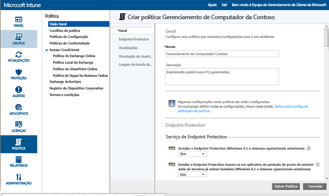
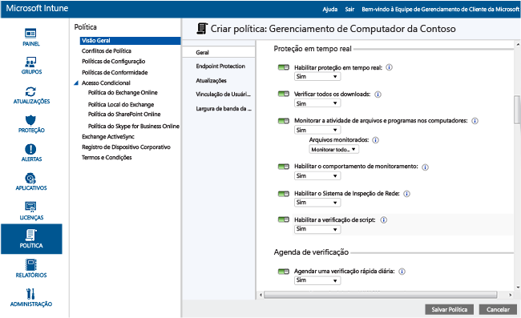
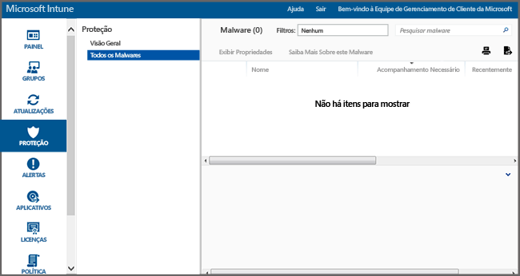

---
# required metadata

title: Endpoint Protection para computadores Windows| Microsoft Intune
description:
keywords:
author: NathBarn
manager: jeffgilb
ms.date: 04/28/2016
ms.topic: article
ms.prod:
ms.service: microsoft-intune
ms.technology:
ms.assetid: 002241bf-6cd0-4c75-a4f0-891ac7e6721a

# optional metadata

#ROBOTS:
#audience:
#ms.devlang:
ms.reviewer: jeffgilb
ms.suite: ems
#ms.tgt_pltfrm:
#ms.custom:

---

# Ajudar a proteger computadores Windows com o Endpoint Protection para Microsoft Intune
O Microsoft Intune pode ajudar você a proteger seus computadores gerenciados de diversas maneiras, incluindo o Endpoint Protection, que fornece proteção em tempo real contra ameaças de malware, mantém definições de malware atualizadas e verifica automaticamente os computadores. O Endpoint Protection também fornece ferramentas que ajudam a gerenciar e monitorar ataques de malware.

Se você ainda não tiver instalado o cliente do Intune em seus computadores, consulte [Install the Windows PC client with Microsoft Intune](install-the-windows-pc-client-with-microsoft-intune.md) (Instalar o cliente do computador Windows com o Microsoft Intune).

Use as informações contidas nas seções a seguir para ajudá-lo a configurar, implantar e monitorar o Endpoint Protection.

## Escolha quando usar o Endpoint Protection
Como administrador de TI, uma das suas principais prioridades é manter os computadores que você gerencia livre de malware e vírus. Antes de implantar o Intune nos computadores Windows de sua organização, decida como proteger seus computadores, selecionando uma das seguintes opções e definindo as respectivas configurações de política associadas:

|Eu desejo:|Configurações de política do Endpoint Protection|Mais informações|
|--------------|---------------------------------------|--------------------|
|Use o Endpoint Protection do Microsoft Intune somente se nenhum aplicativo Endpoint Protection de terceiros estiver instalado.  Você pode usar o Endpoint Protection do Microsoft Intune em todos os computadores onde nenhum aplicativo Endpoint Protection de terceiros estiver instalado.|Instalar o Endpoint Protection = **Sim**  Habilitar o Endpoint Protection = **Sim**  Instalar o Endpoint Protection mesmo que um aplicativo de proteção de ponto de extremidade de terceiros esteja instalado = **Não**|Se for detectado um aplicativo Endpoint Protection de terceiros, o Endpoint Protection do Microsoft Intune não será instalado, ou se já tiver sido instalado, será desinstalado.|
|Use o Endpoint Protection do Microsoft Intune, mesmo se nenhum aplicativo Endpoint Protection de terceiros estiver instalado  Com essa abordagem, o Endpoint Protection do Microsoft Intune e o aplicativo Endpoint Protection de terceiros serão executados simultaneamente. Essa não é uma configuração recomendada devido a possíveis problemas de desempenho.|Instalar o Endpoint Protection = **Sim**  Habilitar o Endpoint Protection = **Sim**  Instalar o Endpoint Protection mesmo que um aplicativo de proteção de ponto de extremidade de terceiros estiver instalado = **Sim**|Use quando:  -   Desejar passar a usar o Endpoint Protection do Microsoft Intune. -...Implantar um novo cliente que usará o Endpoint Protection do Microsoft Intune -...Atualizar qualquer cliente que usará o Endpoint Protection do Microsoft Intune.|
|Use o Intune sem o Endpoint Protection do Microsoft Intune. Em vez disso, você irá contar com um aplicativo de proteção de ponto de extremidade de terceiros.|Instalar o Endpoint Protection = **Não**|Caso os computadores não estejam usando um aplicativo de proteção de ponto de extremidade de terceiros, essa configuração não é recomendada, pois ela pode expor os computadores da organização a malwares ou outros ataques.  O Endpoint Protection do Microsoft Intune não está instalado ou se tiver sido instalado anteriormente será desinstalado.|
Para alternar de seu aplicativo Endpoint Protection atual ao Endpoint Protection do Microsoft Intune, faça o seguinte:

1.  Deixe seu aplicativo Endpoint Protection atual em execução enquanto você implanta o software cliente do Intune nos computadores.

2.  Confirme se o Endpoint Protection do Microsoft Intune está instalado e se está ajudando a proteger os computadores cliente.

3.  Remova o software de proteção de ponto de extremidade de terceiros por meio de um dos procedimentos a seguir:

    -   Use a distribuição de software do Intune para implantar uma ferramenta de remoção de software que é fornecida pelo fabricante do aplicativo Endpoint Protection de terceiros. Para obter mais informações, consulte [Deploy apps with Microsoft Intune](deploy-apps.md) (Implantar aplicativos com o Microsoft Intune).

    -   Removendo manualmente o aplicativo de proteção de ponto de extremidade de terceiros.

> [!NOTE] O Intune não desinstalará aplicativos Endpoint Protection automaticamente de terceiros.

## Como configurar o Microsoft Intune Endpoint Protection
Use as etapas a seguir para ajudá-lo a configurar o Endpoint Protection para o Microsoft Intune.

1.  No [Console de administração do Microsoft Intune](https://manage.microsoft.com/), clique em **Política** > **Adicionar Política**.

2.  Expanda **Gerenciamento do computador** e selecione **Configurações de Agente do Microsoft Intune**. Selecione **Criar e Implantar uma Política Personalizada** para especificar a política para as configurações do Endpoint Protection e, em seguida, clique no botão **Criar Política**. É possível usar as configurações recomendadas ou personalizá-las. Se você precisar de mais informações sobre como criar e implantar políticas, consulte o tópico [Common Windows PC management tasks with the Microsoft Intune computer client (Tarefas comuns de gerenciamento de computador Windows com o cliente de computador do Microsoft Intune)](common-windows-pc-management-tasks-with-the-microsoft-intune-computer-client.md).

  

Também é possível exibir a política do Endpoint Protection implantada na página **Todas as Políticas** do espaço de trabalho **Política**.

## Configurações do serviço Endpoint Protection

|Configuração de política|Detalhes|
|------------------|--------------------|
|**Instalar o Endpoint Protection**|Defina como **Sim** para instalar o Endpoint Protection em computadores gerenciados. Se durante a instalação for detectado um aplicativo de proteção de ponto de extremidade de terceiros, o Endpoint Protection não será instalado, a menos que **Instalar o Endpoint Protection mesmo se um aplicativo de proteção de ponto de extremidade de terceiros estiver instalado** estiver definido como **Sim**. **Nota:** o Intune Endpoint Protection é instalado em computadores gerenciados por padrão. Se não quiser que o Endpoint Protection seja instalado nos computadores gerenciados, você deverá configurar essa política como **Não**. Se o Endpoint Protection tiver sido instalado anteriormente e a política for atualizada para **Não**, o cliente do Endpoint Protection será desinstalado. Valor recomendado: **Sim**|
|**Instalar o Endpoint Protection mesmo que um aplicativo de Endpoint Protection de terceiros for instalado**|Defina como **Sim** para instalar o Endpoint Protection do Microsoft Intune mesmo se um aplicativo Endpoint Protection de terceiros for detectado.  Valor recomendado: **Sim**|
|**Habilitar o Endpoint Protection**|Defina como **Sim** para habilitar o Endpoint Protection do Microsoft Intune em computadores que tenham o cliente do Endpoint Protection.  Se definido para **Não**, e o Endpoint Protection do Microsoft Intune estiver instalado, a interface do usuário cliente do Endpoint Protection não será exibida para os usuários e todos os recursos de proteção estarão inativos.  Valor recomendado: **Sim**|
|**Desabilitar IU de cliente**|Defina como **Sim** para ocultar a interface do usuário do cliente do Endpoint Protection do Microsoft Intune dos usuários (exige a reinicialização do computador cliente para entrar em vigor).  Valor recomendado: **Não**|
|**Instalar o Endpoint Protection mesmo que um aplicativo de Endpoint Protection de terceiros for instalado**|Defina como **Sim** para forçar o Endpoint Protection do Microsoft Intune, mesmo se um aplicativo Endpoint Protection de terceiros for detectado.  Valor recomendado: **Não**|
|**Criar um ponto de restauração do sistema antes de remediação de malware**|Defina para **Sim** para criar um ponto de restauração do sistema do Windows antes que qualquer remediação de malware seja iniciada.  Valor recomendado: **Sim**|
|**Acompanhar malware resolvido (dias)**|Habilita o Endpoint Protection para rastrear malwares resolvidos por um tempo determinado para que seja possível verificar manualmente os computadores anteriormente infectados.  É possível especificar qualquer valor de 0 a 30 dias.  Valor recomendado: **7 dias**|
Se você definir os valores da política para **Instalar o Endpoint Protection** e **Habilitar o Endpoint Protection** para **Sim**, e o valor da política para **Instalar o Endpoint Protection mesmo se um aplicativo Endpoint Protection de terceiros estiver instalado** para **Não**, o Endpoint Protection do Microsoft Intune detectará que outro aplicativo Endpoint Protection está instalado e não será instalado ou será desinstalado, entretanto, o Endpoint Protection do Microsoft Intune relatará a integridade do outro aplicativo Endpoint Protection no Intune.

  Proteção em tempo real é como o Microsoft Security Essentials alerta quando ameaças potenciais, como vírus e spyware, estão tentando se instalar por conta própria ou sendo executados em seu computador. No momento em que isso acontecer, você verá uma mensagem na área de notificação na extrema direita da barra de tarefas

### Configurações de proteção em tempo real

|Configuração de política|Detalhes|
|------------------|--------------------|
|**Habilitar proteção em tempo real**|Permite monitoramento e verificação de todos os arquivos e aplicativos que são acessados. Ele também bloqueia todos os aplicativos e arquivos mal-intencionados antes que sejam executados nos computadores.  Valor recomendado: **Sim**|
|**Verificar todos os downloads**|Permite a verificação de todos os arquivos e anexos que são baixados da Internet para os computadores.  Valor recomendado: **Sim**|
|**Monitorar a atividade de arquivos e programas nos computadores**|Permite o monitoramento de arquivos de entrada e saída e da atividade do programa em computadores. Com essa configuração, o Endpoint Protection pode monitorar quando os arquivos e programas começam a ser executados e alertá-lo sobre todas as ações que desempenham ou ações que são realizadas neles.  Valor recomendado: **Sim**|
|**Arquivos monitorados**|Se a opção **Monitorar arquivos e atividades dos programas em computadores** estiver habilitada, essa configuração permite escolher se apenas arquivos de entrada, de saída, ou todos os arquivos serão monitorados.  Valor recomendado: **Monitorar todos os arquivos**|
|**Habilitar o comportamento de monitoramento**|Permite que o Endpoint Protection do Microsoft Intune verifique determinados padrões de atividades suspeitas em computadores cliente.  Valor recomendado: **Sim**|
|**Ativar o sistema de inspeção de rede**|Habilita o Network Inspection System (NIS) nos computadores cliente. O NIS utiliza assinaturas de vulnerabilidades conhecidas do [Centro de Proteção contra Malware da Microsoft](http://go.microsoft.com/fwlink/?LinkId=234249) para ajudar a detectar e bloquear o tráfego mal-intencionado na rede.  Valor recomendado: **Sim**|

  

### Configurações do agendamento de verificação

|Configuração de política|Mais informações|
|------------------|--------------------|
|**Agendar uma verificação rápida diária**|Agenda uma verificação rápida diária de arquivos importantes do sistema usados com frequência nos computadores. Essa verificação rápida tem um impacto mínimo sobre o desempenho.  Valor recomendado: **Sim**|
|**Executar uma verificação rápida se duas verificações consecutivas forem perdidas**|Configura o Endpoint Protection para executar automaticamente uma verificação rápida nos computadores, se eles perderem duas verificações rápidas agendadas consecutivas.  Valor recomendado: **Sim**|
|**Agendar uma verificação completa**|Configura uma verificação completa de todos os arquivos e recursos nos discos rígidos locais dos computadores. Essa verificação pode demorar um pouco e afetar o desempenho dos computadores (dependendo do número de arquivos e recursos verificados).  Valor recomendado: **Não**|
|**Executar uma verificação completa se duas verificações completas consecutivas forem perdidas**|Configura o Endpoint Protection para executar automaticamente uma verificação completa nos computadores, se eles perderem duas verificações completas agendadas consecutivas.  Valor recomendado: Não configurado|

### Configurações de opções de verificação

|Configuração de política|Detalhes|
|------------------|--------------------|
|**Executar verificação completa após a instalação da Proteção de ponto de extremidade**|Configura o Endpoint Protection para executar automaticamente uma verificação completa do sistema após a instalação nos computadores. Essa verificação é executada apenas quando os computadores estão ociosos, de modo a minimizar o efeito sobre a produtividade do usuário.  Valor recomendado: **Sim**|
|**Executar automaticamente uma verificação completa quando necessário para acompanhar a remoção de malware**|Defina como **Sim** para deixar o Endpoint Protection executar automaticamente uma verificação completa do sistema nos computadores após a remoção de malware para confirmar se outros arquivos não foram afetados.  Valor recomendado: **Sim**|
|**Iniciar uma verificação agendada somente quando o computador estiver ocioso**|Defina para **Sim** para impedir o início de verificações agendadas quando os computadores estiverem em uso, de modo a evitar a perda da produtividade do usuário.  Valor recomendado: **Sim**|
|**Verificar as definições de malware mais recentes antes de iniciar uma verificação**|Defina como **Sim** para permitir que o Endpoint Protection verifique automaticamente as últimas definições de malware antes de iniciar uma verificação nos computadores.  Valor recomendado: **Sim**|
|**Pesquisar arquivos mortos**|Defina como **Sim** para configurar o Endpoint Protection para fazer a verificação de malware em arquivos compactados (como .zip ou .cab) nos computadores.  Valor recomendado: **Não**|
|**Verificar mensagens de email**|Defina como **Sim** para configurar o Endpoint Protection para verificar mensagens de email recebidas à medida que forem recebidas nos computadores.  Valor recomendado: **Sim**|
|**Pesquisar arquivos abertos de pastas de rede compartilhadas**|Defina como **Sim** para configurar o Endpoint Protection para verificar os arquivos que são abertos de pastas compartilhadas na rede. Normalmente, esses arquivos são acessados por meio de um caminho UNC. Habilitar esse recurso pode causar problemas aos usuários que têm acesso somente leitura, porque eles não podem remover malwares.  Valor recomendado: **Não**|
|**Pesquisar unidades de rede mapeadas**|Defina como **Sim** para configurar o Endpoint Protection para verificar arquivos em unidades de rede mapeadas. Habilitar esse recurso pode causar problemas aos usuários que têm acesso somente leitura, porque eles não podem remover malwares.  Valor recomendado: **Não**|
|**Verificar unidades removíveis**|Defina como **Sim** para configurar o Endpoint Protection para fazer a verificação de malware e software indesejado no conteúdo de unidades removíveis, como unidades flash USB, durante a execução de uma verificação completa nos computadores.  Valor recomendado: **Sim**|
|**Limitar uso da CPU durante uma verificação**|Configura o percentual máximo de uso da CPU que pode ser usado durante as verificações agendadas nos computadores. É possível definir esse valor de 1 a 100 por cento.  Valor recomendado: **50%**|

### Configurações de ações padrão

A configuração **Escolha como o Endpoint Protection atua em malwares dos seguintes níveis de alerta** especifica a ação padrão que o Endpoint Protection realiza quando um malware de vários níveis de alerta é detectado. Para cada nível de alerta, remova o malware, coloque-o em quarentena ou realize a ação recomendada pela Microsoft. Valor recomendado: **ação recomendada** que permite que o Endpoint Protection defina a ação.   

### Configurações de arquivos e pastas excluídos

A configuração **Arquivos e pastas a serem excluídos ao executar uma verificação ou usar proteção em tempo real** exclui arquivos ou pastas específicas quando uma verificação é executada ou quando a proteção em tempo real é usada em computadores.

### Configurações de processos excluídos

A configuração **Processos para exclusão ao executar uma verificação ou usar a proteção em tempo real** permite excluir processos específicos quando uma verificação é executada ou da proteção em tempo real. É possível excluir apenas os arquivos com as seguintes extensões: **.exe**, **.com** ou **.scr**.

### Configurações de tipos de arquivo excluídos

A configuração **Extensões de arquivo a serem excluídos ao executar uma verificação ou usar proteção em tempo real** permite que você exclua extensões de nome do arquivo específicas quando uma verificação é executada ou quando a proteção em tempo real é usada nos computadores.

### Configurações do serviço de proteção Microsoft Active
O Microsoft Active Protection Service é uma comunidade online que ajuda você a decidir como reagir às ameaças potenciais. A comunidade também ajuda a interromper a propagação de novas infecções por malware. Você pode **Ingressar no Microsoft Active Protection Service** selecionando **Sim** e, em seguida, especificando seu **Nível de associação**:
  - **Básico** - envia informações básicas à Microsoft sobre o malware detectado. Isso inclui a origem do software, as ações aplicadas por você ou automaticamente pelo Endpoint Protection e se elas foram bem-sucedidas.
  - **Avançado** - envia mais informações à Microsoft sobre malware, spyware e software possivelmente indesejado. Isso inclui o local do software, nomes de arquivos, como o software funciona e como ele afetou o seu computador.

Você também pode **Receber definições dinâmicas baseadas nos relatórios do Microsoft Active Protection Service**.

## Tarefas de gerenciamento do Endpoint Protection
As tarefas a seguir lhe ajudarão a realizar várias tarefas de gerenciamento em computadores gerenciados que executam o Endpoint Protection:
 - Atualizar definições de malware
  - Console do Intune - no espaço de trabalho **Grupos**, selecione os computadores que deseja atualizar. Clique em **Tarefas Remotas** &gt; **Atualizar Definições de Malware**.
  - Computador gerenciado - inicie o software cliente do Endpoint Protection na área de notificação do Windows. Clique na guia **Atualização** e depois em **Atualizar**.
 - Executar uma verificação de malware:
  - Console do Intune - no espaço de trabalho **Grupos**, selecione os computadores que deseja verificar. Clique em **Executar verificação completa de malware** ou **Executar verificação rápida de malware**.
  - Computador gerenciado - inicie o software cliente do Endpoint Protection na área de notificação do Windows. Selecione **Rápida**, **Completa**, ou **Personalizada**e clique em **Verificar agora**.

É possível exibir o status de uma tarefa remota, clicando no link **Tarefas Remotas** no canto inferior direito do console do Intune. A caixa de diálogo **Status da Tarefa Remota** lista tarefas remotas atuais, seus status, nome do dispositivo, todos os erros reportados e fornece um link para informações de solução de problemas, se apropriado.

## Monitorar o Endpoint Protection
Monitore o status de malware em seus computadores, usando o espaço de trabalho **Proteção** do [console de administração do Microsoft Intune](https://manage.microsoft.com/). Esse espaço de trabalho contém duas páginas:
 - **Visão geral da proteção** - exibe problemas importantes como links nos quais é possível clicar para obter mais informações. Veja a seguir alguns problemas que podem ser exibidos:
  - **Instâncias de malware que precisam de acompanhamento** – clique no link para ver uma lista de problemas de malware, incluindo a ação de acompanhamento que precisa ser tomada para resolver o problema. Também é possível detalhar essa lista para ver quais computadores foram afetados.
  - **Computadores com malware que precisam de acompanhamento** – clique no link para ver todos os computadores com problemas de malware não resolvidos, incluindo a ação de acompanhamento que precisa ser tomada para resolver o problema.
  - **Dispositivos desprotegidos** – clique no link para ver os computadores que não estão protegidos por nenhum software de Endpoint Protection, seja porque não há nenhum software instalado ou porque ocorreu um erro. Selecione um computador para ver mais detalhes.
  - **Dispositivos executando outro aplicativo Endpoint Protection** – clique no link para ver os computadores que estão executando um aplicativo Endpoint Protection de terceiros.
 - **Todos os Malwares** - exibe uma lista de todos os malwares ativos encontrados nos computadores. É possível detalhar essa lista para ver todos os computadores que foram afetados por um determinado malware ou selecionar uma das seguintes tarefas:
  - **Exibir propriedades** – abre uma página com mais informações sobre o malware selecionado.
  - **Informações sobre este malware** – abre um tópico do Centro de Proteção contra Malware da Microsoft com mais informações sobre o malware.

> [!IMPORTANT] O espaço de trabalho **Proteção** não é exibido no console do administrador até que você tenha instalado o cliente e gerencie pelo menos um cliente do computador.

  

### Como exibir Caminhos de detecção recentes para malware em computadores
O Intune pode exibir os caminhos de até 10 instâncias de malware detectadas mais recentemente em um dispositivo. O **Caminho de detecção recente** fica desabilitado por padrão. Para habilitar a exibição:

1.  No [console de administração do Microsoft Intune](https://manage.microsoft.com/), vá até **Grupos** > **Todos os Dispositivos**. **Malware**.

2.  Clique com o botão direito no cabeçalho de uma coluna. É exibida uma lista das de colunas disponíveis.

3.  Marque a caixa de seleção **Caminhos de detecção recentes** na lista. A coluna **Caminhos de detecção recentes** aparece e exibe até 10 instâncias de malware mais recentes monitoradas no dispositivo.

## Executar uma verificação de malware ou atualizar definições de malware em um computador
O Intune pode executar uma verificação completa ou rápida de malware usando o Endpoint Protection ou o Windows Defender em um computador gerenciado remotamente que é instalado com o cliente do Intune.

1. No [console de administração do Microsoft Intune](https://manage.microsoft.com/) vá em **Grupos** > **Visão geral** > **Todos os Dispositivos** > **Todos os Computadores** e selecione o computador de destino.

2. Clique na lista suspensa **Tarefas Remotas** e, em seguida, selecione a tarefa. A tarefa a ser executada no computador remoto.

## Precisa de mais ajuda?
Para obter mais ajuda e suporte, consulte [Troubleshoot Endpoint Protection in Microsoft Intune](/intune/troubleshoot/troubleshoot-endpoint-protection-in-microsoft-intune) (Solucionando problemas do Endpoint Protection no Microsoft Intune).

### Consulte também
[Políticas para proteger computadores Windows](policies-to-protect-windows-pcs-in-microsoft-intune.md)

<!--HONumber=May16_HO3-->

