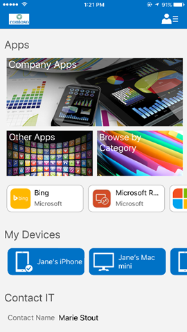

# Como os usuários iOS podem obter aplicativos

Use estas informações para entender como e onde os usuários finais obtêm os aplicativos que você distribui por meio do Microsoft Intune.

**Aplicativos necessários** - Aplicativos que são exigidos pelo administrador e instalados no dispositivo com envolvimento mínimo do usuário, dependendo da plataforma.

**Aplicativos necessários** - Aplicativos fornecidos na lista do aplicativo do Portal da Empresa e que o usuário pode optar por instalar.

**Aplicativos gerenciados** - Aplicativos que podem ser gerenciados pelas políticas e que foram "encapsulados" pelo Intune ou foram compilados com o SDK (Software Development Kit) de MAM (Mobile Application Management) do Intune. Esses aplicativos podem ser gerenciados pelo Intune e é possível aplicar políticas de aplicativo a eles.

**Aplicativos não gerenciados** - Aplicativos que podem ser gerenciados por meio de políticas e que não foram encapsulados pelo Intune ou que não incorporam o SDK de MAM do Intune. Políticas de aplicativo que não podem ser aplicadas a esses aplicativos.

As restrições da Apple proíbem que aplicativos gerenciados e de linha de negócios da app store sejam listados no aplicativo Portal da Empresa. Portanto, isso significa que os usuários precisam acessar diferentes modos de exibição para localizar todos os seus aplicativos. Os aplicativos de cada bloco mostrado na página Aplicativos do Aplicativo Portal da Empresa estão disponíveis da seguinte maneira:

- O bloco **Aplicativos da Empresa** aponta para uma lista de todos os aplicativos na guia **TODOS** do [site Portal da Empresa](http://portal.manage.microsoft.com).

- O bloco **Outros Aplicativos** aponta atualmente para um modo de exibição no aplicativo Portal da Empresa que lista todos os aplicativos que a Apple permite que o aplicativo Portal da Empresa mostre. Isso inclui todos os aplicativos, exceto aplicativos gerenciados e de linha de negócios da app store.

- O bloco **Categorias** aponta atualmente para um modo de exibição no aplicativo Portal da Empresa que lista categorias de aplicativos.

    

###Consulte também
[Como os usuários Android podem obter aplicativos](how-your-android-users-get-their-apps.md) 
[Como os usuários Windows podem obter aplicativos](how-your-windows-users-get-their-apps.md)

<!--HONumber=Aug16_HO4-->

