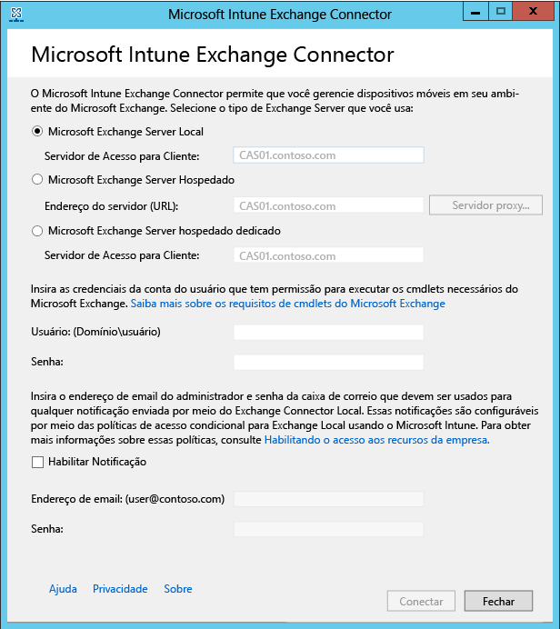

# Instalar o Exchange Connector local no Intune

Para configurar uma conexão que habilite o Microsoft Intune a se comunicar com o Exchange Server, que hospeda as caixas de correio dos dispositivos móveis, você precisa baixar e configurar a ferramenta On-Premises Connector do console do administrador do Intune. O Intune oferece suporte apenas a uma conexão do conector do Exchange de qualquer tipo por assinatura.

## Requisitos do Conector Local
A tabela a seguir lista os requisitos para o computador no qual o Exchange Connector local será instalado.

|Requisito|Mais informações|
|---------------|--------------------|
|Sistemas operacionais|O Intune dá suporte para o Exchange Connector local em um computador que executa qualquer edição do Windows Server 2008 SP2 64 bits, Windows Server 2008 R2, Windows Server 2012 ou Windows Server 2012 R2.  O conector não tem suporte em instalações Server Core.|
|Versão do Microsoft Exchange|O Connector local requer o Microsoft Exchange 2010 SP1 ou posterior, ou Exchange Online Dedicated herdado. Para determinar se o seu ambiente Exchange Online Dedicated está na configuração **nova** ou **herdada**, entre em contato com seu gerente de conta.|
|Autoridade de gerenciamento de dispositivo móvel| [Defina a autoridade de gerenciamento de dispositivo móvel para Intune](get-ready-to-enroll-devices-in-microsoft-intune.md#set-mobile-device-management-authority).|
|Hardware|O computador em que você instala o conector requer uma CPU de 1,6 GHz com 2 GB de ram e 10 GB de espaço livre mínimo em disco do hardware.|
|Sincronização do Active Directory|Antes de usar qualquer um dos conectores para conectar o Intune ao Exchange Server, é preciso [configurar a sincronização do Active Directory](/intune/get-started/start-with-a-paid-subscription-to-microsoft-intune-step-3) para que os usuários e grupos de segurança locais sejam sincronizados com a instância do Azure Active Directory.|
|Software adicional|Uma instalação completa do Microsoft .NET Framework 4 e Windows PowerShell 2.0 deve ser feita no computador que hospeda o conector.|
|Rede|O computador no qual o conector será instalado deve estar em um domínio que tenha uma relação de confiança com o domínio que hospeda o Exchange Server.  O computador precisa de configurações para habilitá-lo a acessar o serviço Intune por meio dos firewalls e servidores proxy por Portas 80 e 443. Os domínios usados pelo Intune incluem manage.microsoft.com, &#42;manage.microsoft.com e &#42;.manage.microsoft.com.|
|Hosted Exchange configurado e em execução|Consulte [Exchange Server 2016](https://technet.microsoft.com/library/mt170645.aspx) para obter mais informações. |

### Requisitos de cmdlets do Exchange

É preciso criar uma conta de usuário do Active Directory que seja usada pelo Exchange Connector. A conta deve ter permissão para executar os seguintes cmdlets do Windows PowerShell Exchange necessários:

 -   Get-ActiveSyncOrganizationSettings, Set-ActiveSyncOrganizationSettings
 -   Get-CasMailbox, Set-CasMailbox
 -   Get-ActiveSyncMailboxPolicy, Set-ActiveSyncMailboxPolicy, New-ActiveSyncMailboxPolicy, Remove-ActiveSyncMailboxPolicy
 -   Get-ActiveSyncDeviceAccessRule, Set-ActiveSyncDeviceAccessRule, New-ActiveSyncDeviceAccessRule, Remove-ActiveSyncDeviceAccessRule
 -   Get-ActiveSyncDeviceStatistics
 -   Get-ActiveSyncDevice
 -   Get-ExchangeServer
 -   Get-ActiveSyncDeviceClass
 -   Get-Recipient
 -   Clear-ActiveSyncDevice, Remove-ActiveSyncDevice
 -   Set-ADServerSettings
 -   Get-Command

## Baixe o pacote de instalação de software do Exchange Connector local

1. Em um sistema operacional Windows Server com suporte para o Exchange Connector local, abra o [console de administração do Microsoft Intune](http://manage.microsoft.com) (http://manage.microsoft.com) com uma conta de usuário que seja um administrador no locatário do Exchange com uma licença para usar o Exchange Server.

2.  No painel de atalhos do espaço de trabalho, escolha **Administrador**, selecione **Gerenciamento de Dispositivo Móvel** > **Microsoft Exchange** e selecione **Setup Exchange Connection** (Configurar Conexão do Exchange).

3.  Na página **Configurar a Conexão do Exchange**, clique em **Baixar o On-Premises Connector**.

4.  O Exchange Connector local vem em uma pasta compactada (.zip) que pode ser aberta ou salva. Na caixa de diálogo **Download de Arquivos**, clique em **Salvar** para armazenar a pasta compactada em um local seguro.

> [!IMPORTANT]
> Não renomeie ou mova os arquivos dentro da pasta do Exchange Connector local. Mover ou renomear o conteúdo da pasta interromperá a instalação.

## Instalar e configurar o Exchange Connector local no Intune
Execute as seguintes etapas para instalar o Exchange Connector local no Intune. O Exchange Connector local pode ser instalado somente uma vez por assinatura do Intune e somente em um computador. Se você tentar configurar um Exchange Connector local adicional, a nova conexão substituirá a original.

1.  Em um sistema operacional com suporte para o On-Premises Connector, extraia os arquivos do **Exchange_Connector_Setup.zip** para um local seguro.

2.  Depois que os arquivos forem extraídos, abra a pasta extraída e clique duas vezes em **Exchange_Connector_Setup.exe** para instalar o Exchange Connector local.

    > [!IMPORTANT]
    > Se a pasta de destino não estiver em um local seguro, exclua o arquivo de certificado **WindowsIntune.accountcert** após instalar o On-Premises Connector.

3.  No campo **Exchange Server**, selecione o tipo de ambiente do Exchange Server, **Microsoft Exchange Server Local** ou **Microsoft Exchange Server Hospedado**.

  

  Para um Exchange Server local, forneça o nome do servidor ou um nome de domínio totalmente qualificado do Exchange Server que hospeda a função de **servidor Acesso para Cliente**.

  Para um Exchange Server hospedado, forneça o endereço do Exchange Server. Para encontrar o URL do Exchange Server Hospedado:

      1.  Abra o Outlook Web App para o Office 365.

      2.  Selecione o “?” no canto superior esquerdo e selecione **Sobre**.

      3.  Localize o valor **Servidor Externo POP** .

      4.  Clique em **Servidor Proxy** para especificar as configurações do servidor proxy para seu Exchange Server hospedado.
        1.  Selecione **Usar um servidor proxy ao sincronizar informações do dispositivo móvel**.

        2.  Insira o **nome do servidor proxy** e o **número da porta** a serem usados para acessar o servidor.

        3.  Se for necessário fornecer as credenciais do usuário para acessar o servidor proxy, selecione Usar credenciais para se conectar ao servidor proxy e insira o **domínio\usuário** e a **senha**.

        4.  Selecione **OK**.

5.  Forneça as credenciais, **Usuário (Domínio\Usuário)** e **Senha**, necessárias para conectar-se ao Exchange Server.

6.  Forneça as credenciais administrativas necessárias para enviar notificações para a caixa de entrada do Exchange do usuário. Essas notificações são configuráveis por meio das políticas de acesso condicional usando o Intune.

    Verifique se o serviço Descoberta Automática e os Serviços Web do Exchange estão configurados no Servidor de Acesso para Cliente do Exchange. Para obter mais informações, consulte [Servidor de Acesso para Cliente](https://technet.microsoft.com/library/dd298114.aspx).

7.  No campo **Senha**, forneça a senha da conta para habilitar o Intune a acessar o Exchange Server.

8. Selecione **Conectar**.

    Pode levar alguns minutos para que a conexão seja configurada.

Durante a configuração, o Exchange Connector armazena as configurações de proxy para habilitar o acesso à Internet. Se as configurações de proxy forem alteradas, você precisará reconfigurar o Exchange Connector para aplicar as configurações de proxy atualizadas ao Exchange Connector.

Após o Exchange Connector configurar a conexão, os dispositivos móveis associados aos usuários gerenciados no Exchange Connector são automaticamente sincronizados e adicionados ao Exchange Connector. Pode levar algum tempo até que a sincronização seja concluída.

> [!NOTE]
> Se você instalou o Exchange Connector Local, e se em algum momento a conexão com o Exchange for excluída, você deverá desinstalar o Exchange Connector local do computador onde ele foi instalado.

## Validar a conexão com o Exchange

Após configurar o Exchange Connector com êxito, você pode exibir o status da conexão e a última tentativa de sincronização bem-sucedida. No [console de administração do Microsoft Intune](http://manage.microsoft.com) clique no espaço de trabalho **ADMINISTRADOR**, e em **Gerenciamento de Dispositivo Móvel**, escolha **Microsoft Exchange** e confirme se os detalhes fornecidos aparecem em **Informações sobre a Conexão com o Exchange**.

Você também pode verificar a hora e data da última tentativa de sincronização bem-sucedida.

<!--HONumber=Jul16_HO5-->

