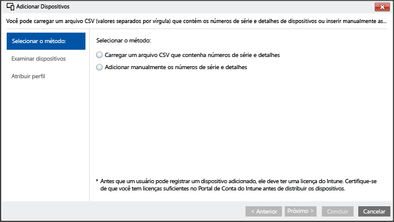

---
# required metadata

title: Registro do Assistente de Configuração para dispositivos iOS com Microsoft Intune | Microsoft Intune
description:
keywords:
author: NathBarn
manager: jeffgilb
ms.date: 04/28/2016
ms.topic: article
ms.prod:
ms.service: microsoft-intune
ms.technology:
ms.assetid: 46e5b027-4280-4809-b45f-651a6ab6d0cd

# optional metadata

#ROBOTS:
#audience:
#ms.devlang:
ms.reviewer: jeffgilb
ms.suite: ems
#ms.tgt_pltfrm:
#ms.custom:

---

# Registrar dispositivos iOS com o Apple Configurador usando o Assistente de Configuração
O Intune dá suporte ao registro de dispositivos iOS corporativos usando a ferramenta [Apple Configurator](http://go.microsoft.com/fwlink/?LinkId=518017) em execução em um computador Mac. Esse processo faz a redefinição de fábrica para o dispositivo e o prepara para executar o Assistente de Configuração pelo novo usuário do dispositivo com as políticas da empresa pré-instaladas.


## Registro do Assistente de Configuração para dispositivos iOS com o Microsoft Intune
Usando o configurador Apple, é possível redefinir de fábrica dispositivos iOS e prepara-los para a configuração pelo novo usuário do dispositivo.  Esse método requer que você conecte o dispositivo iOS por USB a um computador Mac para configurar o registro corporativo e supõe que você esteja usando o Apple Configurator 2.0. A maioria dos cenários exige que a política aplicada ao dispositivo iOS inclua *afinidade de usuário* para habilitar o aplicativo Portal da Empresa Intune.

**Pré-requisitos**
* Acesso físico aos dispositivos iOS - dispositivos devem ser não configurados (redefinição de fábrica) sem proteção por senha
* Números de série do dispositivo – [Como obter um número de série do iOS](https://support.apple.com/en-us/HT204308)
* Cabos de conexão USB
* Computador Mac com o [Apple Configurator 2.0](https://itunes.apple.com/us/app/apple-configurator-2/id1037126344?mt=12)


1.  **Criar um grupo de dispositivos móveis** (Opcional) Se sua empresa exigir grupos de dispositivos móveis para ajudar a gerenciar dispositivos, crie esses grupos. [Use grupos para gerenciar usuários e dispositivos com o Microsoft Intune](use-groups-to-manage-users-and-devices-with-microsoft-intune.md).

2.  **Criar um perfil para dispositivos** Um perfil de registro de dispositivos define as configurações aplicadas a um grupo de dispositivos. Se você ainda não tiver, crie um perfil de registro para dispositivos iOS registrados usando o Apple Configurator.

    ###### Para criar um perfil

    1.  No [console de administração do Microsoft Intune](http://manage.microsoft.com), acesse **Política** &gt; **Dispositivos Corporativos** e, em seguida, clique em **Adicionar...**.

    

    2.  Insira os detalhes para os perfis de dispositivo:

        -   **Nome** – Nome do perfil de registro do dispositivo. (Não é visível para os usuários)

        -   **Descrição** - descrição do perfil de registro do dispositivo. (Não é visível para os usuários)

        -   **Detalhes de registro** – especifica como os dispositivos são registrados.

            -   **Solicitar afinidade do usuário** – o dispositivo iOS pode ser afiliado a um usuário durante a configuração inicial e depois receber permissão para acessar dados e o email da empresa como esse usuário. Para a maioria dos cenários do Assistente de Configuração, use **Solicitar afinidade do usuário**.
            Esse modo oferece suporte a vários cenários:

                -   **Dispositivo corporativo pessoal** – "Escolha seu próprio dispositivo" (CYOD), semelhante aos dispositivos pessoais ou de propriedade particular, mas o administrador temi certos privilégios, incluindo permissão para apagar, redefinir, administrar e cancelar o registro do dispositivo. O usuário do dispositivo pode instalar aplicativos e tem a maioria das outras permissões para usar o dispositivo quando ele não está bloqueado pela política de gerenciamento.

                -   **Conta de gerenciador de registro de dispositivos** – O dispositivo foi registrado usando uma conta de administrador especial do Intune. Ela pode ser gerenciada como uma conta particular, mas apenas o usuário que conhece as credenciais de gerenciador de registro pode instalar aplicativos, apagar, redefinir, administrar e cancelar o registro do dispositivo. Para obter informações sobre como registrar um dispositivo compartilhado por muitos usuários por meio de uma conta comum, consulte [Enroll corporate-owned devices with the Device Enrollment Manager in Microsoft Intune](enroll-corporate-owned-devices-with-the-device-enrollment-manager-in-microsoft-intune.md) (Registrar dispositivos corporativos com o Gerenciador de Registro de Dispositivo no Microsoft Intune).

            -   **Nenhuma afinidade de usuário** – o dispositivo não tem usuários. Use esta afiliação para dispositivos que executam tarefas sem acessar aos dados de usuário local. Aplicativos que exigem a afiliação do usuário são desabilitados ou não funcionarão.

        -   **Pré-atribuição de grupo de dispositivos** – todos os dispositivos implantados nesse perfil pertencerão inicialmente a esse grupo. Você pode reatribuir dispositivos após o registro.

          -  **Programa de Registro de Dispositivo** - O DEP (Programa de Registro de Dispositivo) da Apple não pode ser usado com o registro do Assistente de Configuração. Verifique se a alternância está definida como **desligado**.

    3.  Clique em **Salvar Perfil** para adicionar o perfil.

3.  **Adicionar dispositivos iOS para registro com o Assistente de Instalação** No [Console de administração do Microsoft Intune](http://manage.microsoft.com), acesse **Grupos** &gt; **Todos os Dispositivos** &gt; **Todos os Dispositivos Corporativos** &gt; **Todos os Dispositivos** e, em seguida, selecione **Adicionar dispositivos...**. Você pode adicionar dispositivos de duas maneiras:

    

    -   **Carregar um arquivo CSV contendo números de série** – crie uma lista de valores separados por vírgula (.csv) de duas colunas, sem cabeçalho, com limite de 5000 dispositivos ou 5 MB por arquivo csv.

        |||
        |-|-|
        |&lt;Nº de série 1&gt;|&lt;Detalhes do dispositivo nº 1&gt;|
        |&lt;Nº de série 2&gt;|&lt;Detalhes do dispositivo nº 2&gt;|
        Quando visualizado em um editor de texto, esse arquivo .csv aparece como:

        ```
        0000000,PO 1234
        111111111,PO 1234
        ```

    -   **Adicione manualmente os detalhes do dispositivo** - insira o número de série e detalhes de até cinco dispositivos

    > [!NOTE]
    > Se, posteriormente, você precisar remover dispositivos corporativos do gerenciamento do Intune, será necessário remover o número de série do dispositivo do Intune no grupo **Por número de série do iOS** em **Dispositivos corporativos pré-registrados** para desabilitar o registro do dispositivo.  Se o Intune executar um procedimento de recuperação de desastres quando ou próximo à época em que os números de série foram removidos, você precisará confirmar que apenas números de série de dispositivos ativos estão presentes nesse grupo.

    Escolha **Avançar**.

4.  **Selecionar dispositivos para registrar** Confirme os dispositivos a serem registrados. Não é possível importar os números de série já registrados ou registrados por outros meios. Escolha **Avançar** para continuar.

5.  **Atribuir perfil** Especifique o perfil para atribuir a dispositivos adicionados na lista de perfis disponíveis, examine os **Detalhes do perfil de registro** e, em seguida, selecione **Concluir**. Dispositivos adicionados manualmente podem ser atribuídos a qualquer perfil de registro.

6.  **Exportar um perfil para ser implantado a dispositivos iOS** No [console de administração do Microsoft Intune](http://manage.microsoft.com), acesse **Política** &gt; **Registro de Dispositivo Corporativo** e, em seguida selecione o perfil a ser implantado aos dispositivos móveis. Selecione **Exportar...** na barra de tarefas. Copie e salve a **URL do perfil**. Você fará o upload no Apple Configurator posteriormente para definir o perfil do Intune utilizado pelos dispositivos iOS.
    Para dar suporte ao Apple Configurator 2, a URL do Perfil 2.0 deve ser editada. Replace
    ```
    https://manage.microsoft.com/EnrollmentServer/Discovery.svc/iOS/ESProxy?id=
    ```
    com

    ```
    https://appleconfigurator2.manage.microsoft.com/MDMServiceConfig?id=
    ```

   Você carregará essa URL do perfil para o serviço Apple DEP usando o Apple Configurator no procedimento a seguir para definir o perfil do Intune utilizado pelos dispositivos iOS.


7.  **Preparar o dispositivo com Apple Configurator** Dispositivos iOS são conectados ao computador Mac e registrados para o gerenciamento de dispositivo móvel.

    1.  Em um computador Mac, abra o **Apple Configurator 2**. Na barra de menus, selecione **Apple Configurator 2** e clique em **Preferências**.

         > [!WARNING]
         > Os dispositivos serão redefinidos para as configurações de fábrica durante o processo de registro. Como melhor prática, redefina o dispositivo e ligue-o. Como melhor prática, os dispositivos devem estar na tela **Hello** quando você conectar o dispositivo.

    2. No painel de preferências, selecione **Servidores** e selecione o símbolo "+", abaixo do painel esquerdo para inicializar o assistente do Servidor MDM. Escolha **Avançar**.

    3. Insira o **Nome** e a **URL do Registro** para o servidor MDM da Etapa 6 acima. Para a URL de registro, insira a URL do perfil de registro exportada do Intune. Escolha **Avançar**.  

       Se você receber um aviso sobre os requisitos de perfil de confiança para Apple TV, poderá cancelar com segurança a opção **Perfil de Confiança** selecionando o "X" cinza. Você também pode ignorar com segurança qualquer aviso de certificado de Âncora. Para continuar, clique em **Avançar** até que o assistente seja concluído.

    4.  No painel **Servidores**, selecione "Editar" ao lado do perfil do novo servidor. Garanta que a URL de Registro corresponde exatamente à URL exportada do Intune. Execute novamente a URL original se ela for diferente e escolha **Salvar** o perfil de registro exportado do Intune.

    5.  Conecte os dispositivos móveis iOS ao computador Apple com um adaptador USB.

        > [!WARNING]
        > Os dispositivos serão redefinidos para as configurações de fábrica durante o processo de registro. Como melhor prática, redefina o dispositivo e ligue-o. Como melhor prática, os dispositivos devem estar na tela **Hello** quando você iniciar o Assistente de Configuração.

    6.  Selecione **Preparar**. No painel **Preparar o Dispositivo iOS**, selecione **Manual** e, em seguida, selecione **Avançar**.

    7. No painel **Registrar no Servidor MDM**, selecione o nome do servidor que você criou e, em seguida, selecione **Avançar**.

    8. No painel **Supervisionar Dispositivos**, selecione o nível de supervisão e, em seguida, selecione **Avançar**.

    9. No painel **Criar uma Organização**, escolha **Organização** ou crie uma nova organização e, em seguida, selecione **Avançar**.

    10. No painel **Configurar o Assistente de Instalação do iOS**, escolha as etapas apresentadas ao usuário e, em seguida, selecione **Preparar**. Se solicitado, autentique para atualizar as configurações de confiança.  

    11. Quando o dispositivo iOS termina a preparação, você pode desconectar o cabo USB.  

8.  **Distribuir dispositivos** Os dispositivos agora estão prontos para registro corporativo. Desligue os dispositivos e distribua-os aos usuários. Quando o dispositivo for ativado, o Assistente de Configuração será iniciado.


### Consulte também
[Prepare-se para registrar dispositivos](get-ready-to-enroll-devices-in-microsoft-intune.md)


<!--HONumber=Jun16_HO3-->


