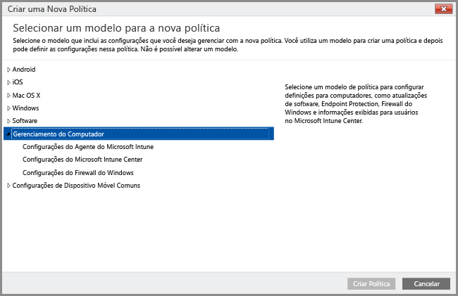

# Gerenciar computadores Windows com o software cliente de computador do Intune
Em vez de [registrar computadores Windows como dispositivos móveis](set-up-windows-device-management-with-microsoft-intune.md), você pode registrar e gerenciar computadores Windows instalando o software cliente do Intune.

O Intune gerencia computadores Windows usando as políticas de modo semelhante ao usado pelos GPOs (objetos de política de grupo) do AD DS (Serviços de Domínio do Active Directory) do Windows Server. Se você estiver gerenciando computadores ingressados em domínio do Active Directory com o Intune, [certifique-se de que as políticas do Intune não entrem em conflito com GPOs](resolve-gpo-and-microsoft-intune-policy-conflicts.md) em vigor para a sua organização.

Embora o cliente de software Intune dê suporte a [recursos de gerenciamento que ajudam a proteger computadores](policies-to-protect-windows-pcs-in-microsoft-intune.md) gerenciando atualizações de software, o firewall do Windows e o Endpoint Protection, computadores gerenciados com o software cliente Intune não podem ser direcionados com outras políticas do Intune, incluindo as configurações de política do **Windows** específicas do gerenciamento de dispositivos móveis.

> [!NOTE]
> Dispositivos que executam o Windows 8.1 ou posterior podem ser gerenciados com o cliente do Intune ou como dispositivos móveis. Este tópico se aplica a computadores que executam o cliente de software do Intune. Não há suporte para a instalação do cliente do Intune e a inscrição no gerenciamento de dispositivos móveis.

## Requisitos para o gerenciamento de cliente de computador do Intune

**Hardware**: veja a seguir os requisitos mínimos de hardware para instalar o cliente do Intune:

|Requisito|Mais informações|
|---------------|--------------------|
|Rede|O cliente requer que o PC tenha conectividade com a Internet.|
|Processador e memória|Consulte os requisitos de RAM e de processador para o sistema operacional do PC.|
|Espaço em disco|200 MB de espaço em disco disponível antes de instalar o software cliente.|

**Software**: veja a seguir os requisitos de software para a instalação do cliente:

|Requisito|Mais informações|
|---------------|--------------------|
|Sistema operacional | Dispositivo Windows executando o Windows 7 ou posterior. |
|Permissões administrativas|A conta que instala o software cliente deve ter permissões de administrador local nesse dispositivo.|
|Windows Installer 3.1|O PC deve ter, no mínimo, o Windows Installer 3.1.  Para exibir a versão do Windows Installer em um PC cliente:  -   No PC, clique com o botão direito do mouse em **%windir%\System32\msiexec.exe** e, em seguida, clique em **Propriedades**.  Você pode baixar a versão mais recente do Windows Installer em [Windows Installer Redistributables](http://go.microsoft.com/fwlink/?LinkID=234258) no site do Microsoft Developer Network.|
|Remover o software cliente incompatível|Antes de instalar o software do cliente do Intune, você deve desinstalar qualquer software cliente do Configuration Manager ou System Management Server do computador.|

## Gerenciamento do computador com o cliente do computador Intune
Depois que o software cliente do Intune é instalado, os recursos de gerenciamento incluem: [gerenciamento de aplicativos](deploy-apps-in-microsoft-intune.md), [monitoramento em tempo real e proteção de ponto de extremidade](help-secure-windows-pcs-with-endpoint-protection-for-microsoft-intune.md), [gerenciamento de configurações do Firewall do Windows](help-protect-windows-pcs-using-windows-firewall-policies-in-microsoft-intune.md), inventário de hardware e software, controle remoto (por meio de solicitações de assistência remota), [configurações de atualização de software](keep-windows-pcs-up-to-date-with-software-updates-in-microsoft-intune.md) e relatórios de configurações de conformidade.

Determinadas opções de gerenciamento disponíveis para computadores gerenciados como dispositivos móveis não estão disponíveis para os computadores gerenciados por cliente de software, incluindo:

-   Apagamento completo (o apagamento seletivo está disponível)
-   Acesso condicional
-   Políticas do Windows diferentes de políticas de **Gerenciamento do computador**

Além das ações de agente cliente do Intune executadas localmente em computadores individuais, você também pode usar o console de administração do Intune para realizar outras [tarefas comuns de gerenciamento de computador](common-windows-pc-management-tasks-with-the-microsoft-intune-computer-client.md) em computadores Windows com o cliente instalado para:

-   Exibir informações de inventário de hardware e software sobre os computadores gerenciados

-   Reiniciar remotamente um computador

-   Desativar um computador para desinstalar o software cliente e removê-lo do gerenciamento com o Intune

-   Vincular usuários a computadores gerenciados específicos

-   Responder a solicitações de assistência remota

O agente cliente Intune geralmente é executado silenciosamente em segundo plano sem necessidade de muita interação do usuário nem solução de problemas. No entanto, se você precisar de ajuda na resolução de problemas de gerenciamento do computador, haverá vários [recursos disponíveis para ajudá-lo a resolvê-los](/intune/troubleshoot/troubleshoot-client-setup-in-microsoft-intune).

<!--HONumber=Sep16_HO1-->

