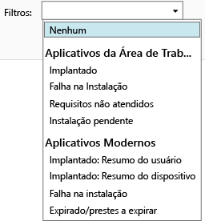

---
# required metadata

title: Monitorar implantações de aplicativo | Microsoft Intune
description:
keywords:
author: robstackmsft
manager: jeffgilb
ms.date: 04/28/2016
ms.topic: article
ms.prod:
ms.service: microsoft-intune
ms.technology:
ms.assetid: 5daad56d-71c8-455b-8a55-f8b33e279a8a

# optional metadata

#ROBOTS:
#audience:
#ms.devlang:
ms.reviewer: jeffgilb
ms.suite: ems
#ms.tgt_pltfrm:
#ms.custom:

---

# Monitorar implantações de aplicativo no Microsoft Intune

## Monitorar uma implantação de aplicativo
Você pode ver os aplicativos gerenciados e o status de todas as implantações no console de administração do Intune.

### Para exibir os aplicativos que você gerencia e seu status
No espaço de trabalho **Aplicativos**, clique no nó **Aplicativos** e em **Aplicativos**.

A lista de aplicativos que você gerencia é exibida. Você pode clicar em qualquer aplicativo para ver um status de instalação no painel inferior das janelas do console. Clique nesse status para ver mais detalhes. Por exemplo, se o status mostra **1 usuário tem este software disponível**, você pode clicar na mensagem para ver o nome do usuário.

> [!TIP]
> Você pode usar a lista suspensa **Filtros** para mostrar apenas os aplicativos que atendem aos critérios especificados por você, como aplicativos cuja instalação falhou ou aplicativos que foram implantados com êxito.
> 
> 

Além disso, o espaço de trabalho **Painel** mostra uma visão geral do status de seus aplicativos. Se você clicar em qualquer lugar na visão geral, você será levado à lista de aplicativos.

## Para exibir informações mais detalhadas sobre um aplicativo
Na lista de aplicativos, selecione qualquer aplicativo e clique em **Exibir Propriedades**.

Na página **Propriedades de Software** para o aplicativo, clique em uma dessas guias: **Geral** - mostra informações gerais sobre o aplicativo e seu status de instalação, **Dispositivos** - mostra os dispositivos que são instalados com êxito uma implantação de destino do aplicativo, **Usuários** - mostra os usuários que dispositivos instalado com êxito uma implantação de destino do aplicativo.

Assim como antes, você pode usar a lista suspensa **Filtros** para configurar os valores mostrados em cada uma das guias.

<!--HONumber=May16_HO1-->

