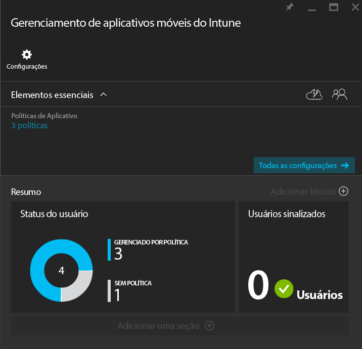
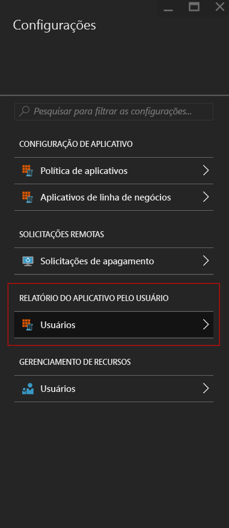
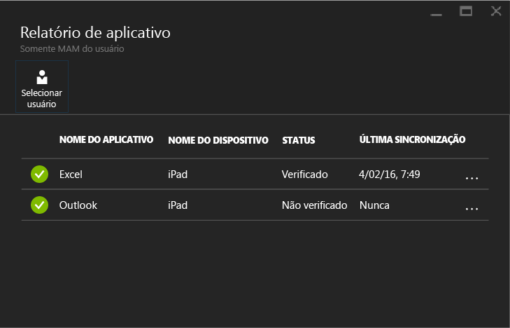

---
# required metadata

title: Monitorar as políticas de gerenciamento de aplicativos móveis com o Microsoft Intune | Microsoft Intune
description:
keywords:
author: karthikaraman
manager: jeffgilb
ms.date: 04/28/2016
ms.topic: article
ms.prod:
ms.service: microsoft-intune
ms.technology:
ms.assetid: d3aa6c74-6b5d-4b50-aa66-a040ec44393e

# optional metadata

#ROBOTS:
#audience:
#ms.devlang:
ms.reviewer: joglocke
ms.suite: ems
#ms.tgt_pltfrm:
#ms.custom:

---

# Monitorar as políticas de gerenciamento de aplicativos móveis com o Microsoft Intune
Depois de configurar uma política MAM e aplicá-la aos usuários, você pode monitorar o status de conformidade no [Portal do Azure](https://portal.azure.com). O Portal do Azure inclui informações sobre os usuários afetados pela política, o status de conformidade e os problemas que os usuários finais possam estar ocorrendo.
## Exibição de Resumo
Na folha **Gerenciamento de aplicativos móveis do Intune**, você pode ver um resumo do status de conformidade, conforme descrito abaixo:

-   **USERS:** o número total de usuários da sua empresa que usam os aplicativos que estão associados com a política.

-   **MANAGED BY POLICY:** este é o número de usuários que usaram pelo menos um dos aplicativos no contexto de trabalho.

-   **NO POLICY:** o número de usuários que estão usando os aplicativos associados à política, mas não são afetados pela sua política.  Você pode considerar adicionar esses usuários à sua política.

- **Usuários sinalizados:** o número de usuários que estão tendo problemas. Atualmente, apenas os usuários com dispositivos desbloqueados com jailbreak são relatados em **Usuários sinalizados**.

## Exibição detalhada
Você pode obter a exibição detalhada do resumo clicando nos blocos **Status do usuário** e **Usuários sinalizados**.

### Status do usuário
Você pode pesquisar por um único usuário e verificar o status de conformidade para ele. A folha **Relatórios de aplicativo** exibe as seguintes informações para um usuário selecionado:
- Dispositivos que estão associados com a conta de usuário
- Aplicativos com a política de MAM no dispositivo
- Status:

  **Check-in:** isso significa que a política foi implantada para o usuário e o aplicativo foi usado no contexto de trabalho pelo menos uma vez.

  **Check in não realizado:** indica que a política foi implantada para o usuário, mas o aplicativo ainda não foi usado no contexto de trabalho.

Para ver o relatório para um usuário, siga estas etapas:

**Etapa 1:** Para selecionar um usuário, clique no bloco do resumo ou escolha a opção **APP REPORTING BY USER** opção na folha **Configurações** conforme mostrado abaixo:

**Etapa 2:** Isso abre a folha **Relatórios do aplicativo**. Escolha **Selecionar usuário** para pesquisar por um usuário do Azure Active Directory.

**Etapa 3:** Depois de selecionar o usuário na lista, você verá os detalhes do status de conformidade para esse usuário.

### Usuários sinalizados
A exibição detalhada exibe a mensagem de erro, o aplicativo que foi acessado quando o erro ocorreu, a plataforma do dispositivo e um carimbo de hora.  

### Consulte também
[Gerenciar a transferência de dados entre aplicativos do iOS](manage-data-transfer-between-ios-apps-with-microsoft-intune.md)

[Experiência do usuário final para aplicativos habilitados para MAM](end-user-experience-for-mam-enabled-apps-with-microsoft-intune.md)

<!--HONumber=Jun16_HO2-->

