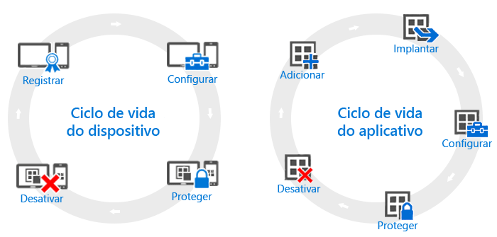

# Visão geral dos ciclos de vida do dispositivo e do aplicativo

Embora as necessidades das organizações individuais possam ser diferentes, existem algumas etapas comuns que todas as empresas precisam realizar continuamente, qualquer seja suas outras necessidades operacionais. Eles podem ser agrupados em duas categorias principais, conhecidas como **ciclos de vida**. O ciclo de vida de implantação que você seguir dependerá do cenário que você está tentando habilitar. Por exemplo, talvez seja necessário apenas o ciclo de vida do dispositivo, o ciclo de vida do aplicativo ou ambos.

Para fins de gerenciamento, todos os dispositivos têm um ciclo de vida, desde o registro inicial do dispositivo até sua desativação quando ele não é mais necessário. O [ciclo de vida de gerenciamento de dispositivo](overview-of-device-lifecycle-in-microsoft-intune.md) orienta você por todas as opções de registro, as maneiras de configurar e proteger esses dispositivos e como remover os dispositivos de gerenciamento.

Da mesma forma, aplicativos com os quais você trabalha têm seus próprios [ciclo de vida do aplicativo](overview-of-app-lifecycle-in-microsoft-intune.md) que incluem as etapas desde a adição de um aplicativo ao Intune até sua remoção quando eles não são mais necessários.

<!--HONumber=Jul16_HO3-->

