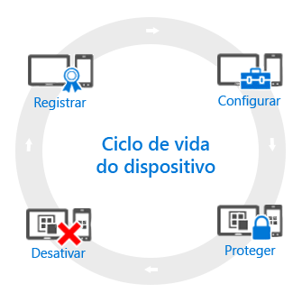

# Visão geral sobre o ciclo de vida de MDM (gerenciamento de dispositivos móveis)

Todos os dispositivos gerenciados têm o que chamamos um *ciclo de vida*. O Intune pode ajudar você a gerenciar esse ciclo de vida desde o registro até a desativação o dispositivo quando ele não é mais necessário:

## Registrar
As estratégias de MDM (gerenciamento de dispositivo móvel) atuais lidam com vários telefones, tablets e computadores (iOS, Android, Windows e Mac OS X). Se você precisa ser capaz de gerenciar o dispositivo, que geralmente é o caso para dispositivos de propriedade da empresa, a primeira etapa é [configurar o registro do dispositivo](enroll-devices-in-microsoft-intune.md). Você também pode gerenciar computadores Windows registrando-os com o Intune (MDM) ou [instalando o software cliente do Intune](manage-windows-pcs-with-microsoft-intune.md).

## Configurar
Registrar seus dispositivos é apenas a primeira etapa. Para tirar proveito de tudo o que o Intune oferece e garantir que seus dispositivos fiquem seguras e compatíveis com os padrões da empresa, você pode escolher entre uma ampla variedade de **políticas** que permitem configurar quase todos os aspectos de como os dispositivos gerenciados operaram. Por exemplo, os usuários devem ter senhas em dispositivos que têm dados da empresa? Você pode exigir uma. Você tem Wifi corporativo? Você pode configurá-lo automaticamente. Estes são os tipos de opções de configuração disponíveis:

- [**Políticas de configuração**](manage-settings-and-features-on-your-devices-with-microsoft-intune-policies.md) - Essas políticas permitem que você configure como as funcionalidades e capacidades de dispositivos gerenciados funcionam. Por exemplo, você pode exigir o uso de uma senha no Windows Phone ou desabilitar o uso da câmera em iPhones.
- [**Políticas de acesso a recursos da empresa**](enable-access-to-company-resources-with-microsoft-intune.md) - Permitir que os usuários acessam seu trabalho no seu dispositivo pessoal pode apresentar desafios. Por exemplo, como garantir que todos os dispositivos que precisam acessar o email da empresa estejam configurados corretamente? Como garantir que os usuários possam acessar a rede da empresa com uma conexão VPN sem precisar saber as configurações, geralmente complexas, necessárias? O Intune pode ajudar a reduzir esse fardo configurando automaticamente os dispositivos gerenciados para acessar os recursos comuns de empresa.
- [**Políticas de gerenciamento de computador com Windows (com o software cliente do Intune)**](common-windows-pc-management-tasks-with-the-microsoft-intune-computer-client.md) - Embora registrar computadores Windows com o Intune proporcione a maioria das funcionalidades de gerenciamento de dispositivos, o Intune continua a dar suporte ao gerenciamento de computadores Windows com o software cliente do Intune. Se você precisar obter informações sobre algumas das tarefas que podem ser executadas com computadores, comece por aqui.

## Proteger
No mundo de TI modernos, proteger dispositivos contra acesso não autorizado é uma das tarefas mais importantes que você executará. Além dos itens na etapa **Configurar** do ciclo de vida do dispositivo, o Intune fornece mais recursos que ajudam a proteger dispositivos gerenciados contra acesso não autorizado ou ataques mal-intencionados:
- [**Autenticação multifator**](protect-windows-devices-with-multi-factor-authentication.md) - Adicionar uma camada extra de autenticação para logons de usuário pode ajudar a proteger ainda mais os dispositivos. Dispositivos Windows, Windows Phone e Windows Mobile oferecem autenticação multifator que exige um segundo nível de autenticação, como uma chamada telefônica ou mensagem de texto, antes de os usuários poderem acessar.
- [**Configurações do Microsoft Passport**](control-microsoft-passport-settings-on-devices-with-microsoft-intune.md) - O Microsoft Passport é um método de logon alternativo que permite que os usuários usem um *gesto*, como uma impressão digital ou o Windows Hello para fazer logon sem a necessidade de uma senha.
- [**Políticas para proteger computadores Windows (com o software cliente do Intune)**](policies-to-protect-windows-pcs-in-microsoft-intune.md) - Quando você gerencia computadores Windows usando o software cliente do Intune, há as políticas disponíveis que permitem controlar as configurações de do Endpoint Protection, atualizações de software e Firewall do Windows em computadores gerenciados.

## Desativar
Quando um dispositivo é perdido ou roubado, precisa ser substituído ou quando os usuários mudam para outro cargo, geralmente é hora de [desativar ou apagar](use-remote-wipe-to-help-protect-data-using-microsoft-intune.md) o dispositivo. Há várias maneiras de fazer isso, desde redefinir o dispositivo, remover o gerenciamento ou apagar os dados corporativos dele.

<!--HONumber=Jul16_HO2-->

