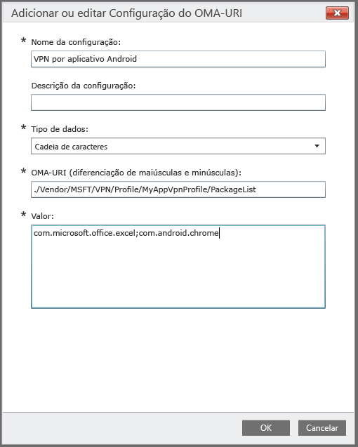

# Usar uma política personalizada para criar um perfil de VPN por aplicativo para dispositivos Android

Você pode criar um perfil de VPN por aplicativo para dispositivos Android 5.0 e posterior gerenciados pelo Intune. Primeiro, crie um perfil de VPN que use o tipo de conexão Pulse Secure ou Citrix. Em seguida, crie uma política de configuração personalizada que associa o perfil de VPN com aplicativos específicos. 

Após você implantar a política nos grupos de usuários ou no dispositivo Android, os usuários deverão iniciar o VPN do Pulse Secure ou Citrix. A conexão permitirá o tráfego apenas de aplicativos especificados para usar a conexão VPN aberta.

> [!NOTE]
>
> Para este perfil, há suporte apenas para o tipo de conexão Pulse Secure.

### Etapa 1: Criar um perfil de VPN

1. No [console de administração do Microsoft Intune](https://manage.microsoft.com), escolha **Política** > **Adicionar Política**.
2. Para selecionar um modelo para a nova política, expanda **Android** e escolha **Perfil de VPN (Android 4 e posterior)**.
3. No modelo, para **Tipo de conexão**, escolha **Pulse Secure** ou **Citrix**.
4. Conclua e salve o perfil de VPN. Para obter mais detalhes sobre perfis de VPN, consulte [Conexões VPN](../deploy-use/vpn-connections-in-microsoft-intune.md).

> [!NOTE]
>
> Anote o nome do perfil de VPN para uso na etapa seguinte. Por exemplo, MyAppVpnProfile.

### Etapa 2: Criar uma política de configuração personalizada

   1. No console de administração do Intune, escolha **Política** > **Adicionar Política** > **Android** > **Configuração personalizada** > **Criar Política**.
   2. Insira um nome para a política.
   3. Em **Configurações OMA-URI**, clique em **Adicionar**.
   4. Insira um nome para a configuração.
   5. Para **Tipo de dados**, especifique **Cadeia de caracteres**.
   6. Para **OMA-URI**, especifique esta cadeia de caracteres: **./Vendor/MSFT/VPN/Profile/*Nome*/PackageList**, em que *Nome* é o nome do perfil de VPN que você anotou na Etapa 1. Em nosso exemplo, a cadeia de caracteres seria **./Vendor/MSFT/VPN/Profile/MyAppVpnProfile/PackageList**.
   7.   Em **Valor**, crie uma lista separada por ponto e vírgula dos pacotes a serem associados ao perfil. Por exemplo, se desejar que o Excel e o navegador Google Chrome usem a conexão VPN, digite: **com.microsoft.office.excel;com.android.chrome**.

#### Definir sua lista de aplicativos como lista de bloqueios ou lista de permissões (opcional)
  Você pode especificar uma lista de aplicativos que *não podem* usar a conexão VPN usando o valor **BLACKLIST**. Todos os outros aplicativos se conectarão por meio da VPN.
Como alternativa, você pode usar o valor **WHITELIST** para especificar uma lista de aplicativos que *podem* usar a conexão VPN. Aplicativos que não estão na lista não se conectarão por meio da VPN.
  1.    Em **Configurações OMA-URI**, clique em **Adicionar**.
  2.    Insira um nome para a configuração.
  3.    Para **Tipo de dados**, especifique **Cadeia de caracteres**.
  4.    Para **OMA-URI**, use esta cadeia de caracteres: **./Vendor/MSFT/VPN/Profile/*Nome*/Mode**, em que *Nome* é o nome do perfil de VPN que você anotou na Etapa 1. Em nosso exemplo, a cadeia de caracteres seria **./Vendor/MSFT/VPN/Profile/MyAppVpnProfile/Mode**.
  5.    Em **Valor**, digite **BLACKLIST** ou **WHITELIST**.

### Etapa 3: implantar ambas as políticas

Você deve implantar *ambas* políticas para o *mesmo* grupo do Intune.

1.  No espaço de trabalho **Política**, selecione a política que deseja implantar e selecione **Gerenciar Implantação**.
2.  Na caixa de diálogo **Gerenciar implantação** :
    -   **Para implantar a política**, selecione um ou mais grupos nos quais implantar a política e escolha **Adicionar** > **OK**.
    -   **Para fechar a caixa de diálogo sem implantar a política**, selecione **Cancelar**.

Um resumo de status e alertas na página **Visão geral** do espaço de trabalho **Política** identifica problemas com a política que exigem atenção. Um resumo de status também aparece no espaço de trabalho **Painel**.

<!--HONumber=Nov16_HO2-->

