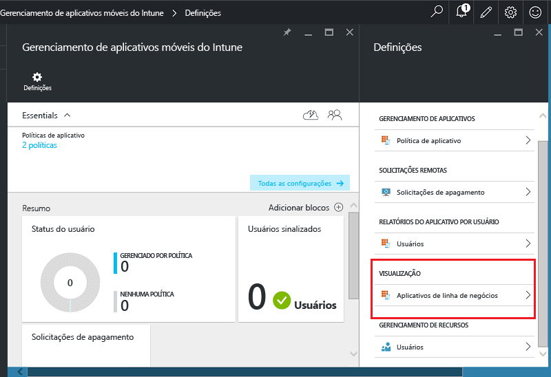
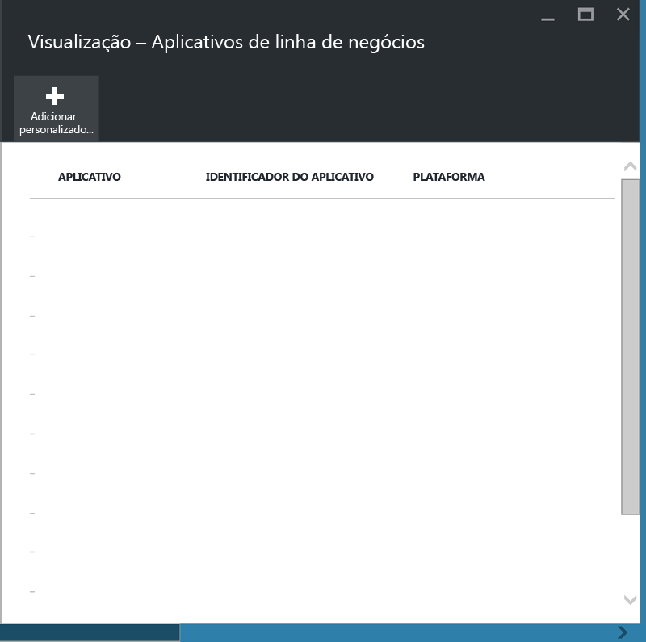
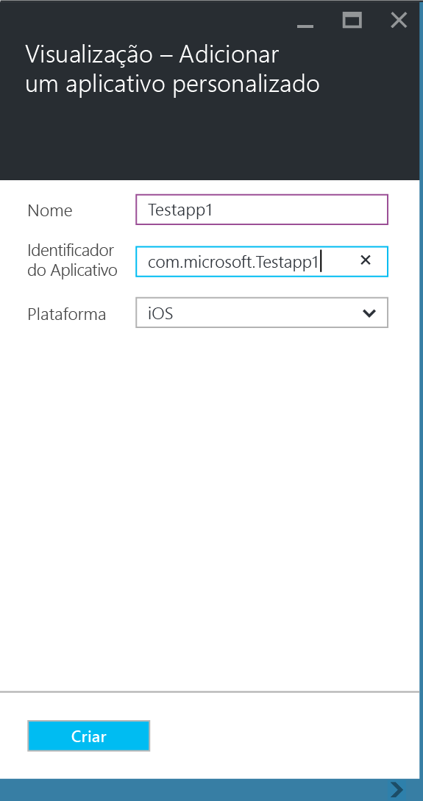
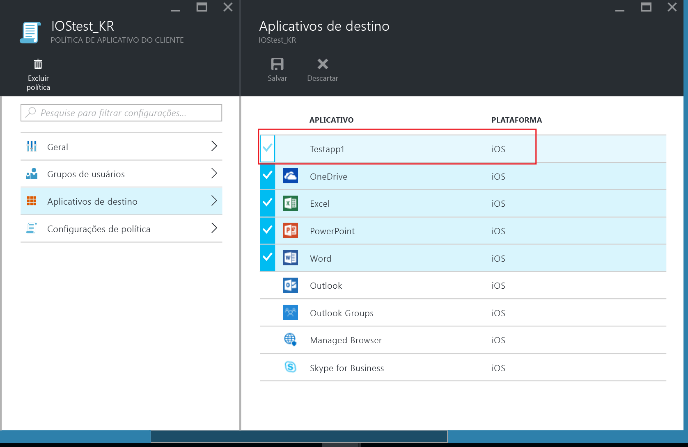
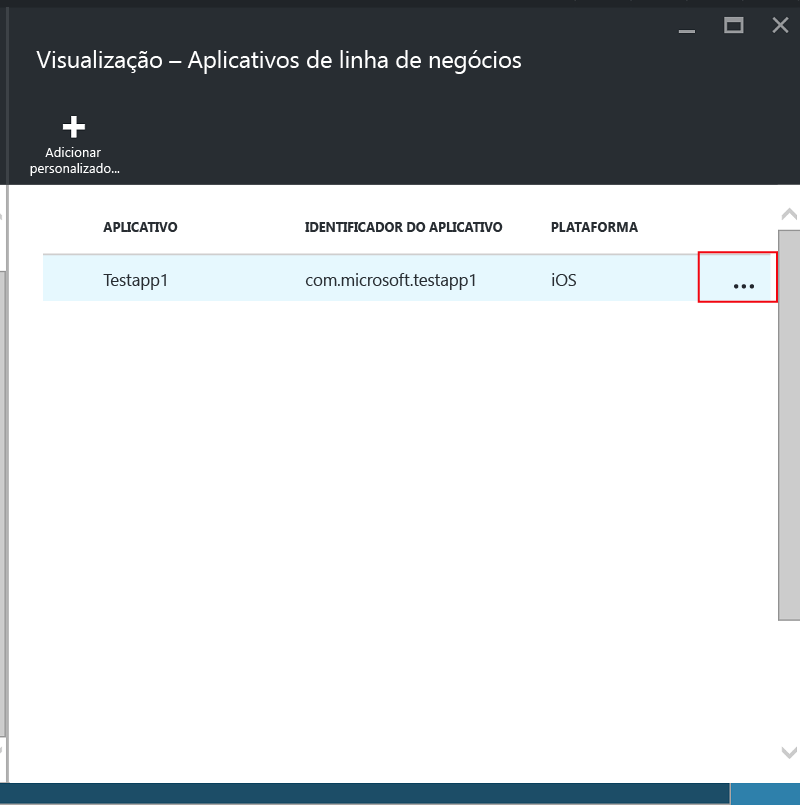
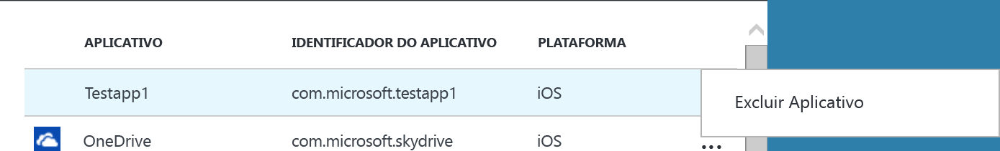

# Proteger aplicativos de linha de negócios e dados em dispositivos não registrados no Microsoft Intune

Políticas MAM (gerenciamento de aplicativo móvel) ajudam a proteger os dados da empresa, restringindo a movimentação de dados, como copiar e colar ou impedindo que os usuários salvem documentos da empresa em uma localização particular.   Para aplicar políticas MAM nos aplicativos de linha de negócios iOS e/ou Android, você deve primeiro encapsular o aplicativo com a Ferramenta de Disposição do Aplicativo do Microsoft Intune.  Disposição de aplicativo é o processo de aplicação de uma camada de gerenciamento para um aplicativo móvel sem exigir nenhuma alteração ao aplicativo subjacente.  Depois que o aplicativo é disposto, você pode aplicar políticas MAM a ele e distribuí-lo aos seus usuários finais.  

Este tópico explica as etapas necessárias para aplicar políticas MAM em aplicativos que são acessados em **dispositivos de propriedade dos funcionários que não são gerenciados** e dispositivos que são gerenciados por uma **solução de MDM (gerenciamento de dispositivo móvel) de terceiros**.  Para preparar aplicativos de linha de negócios que são executados em **dispositivos registrados no Intune**, consulte [Decide how to prepare apps for mobile application management with Microsoft Intune](decide-how-to-prepare-apps-for-mobile-application-management-with-microsoft-intune.md) (Decidir como preparar os aplicativos para gerenciamento de aplicativos móveis com o Microsoft Intune).
##  Etapa 1: preparar o aplicativo
Antes de aplicar as políticas MAM a um aplicativo, você deve primeiro encapsular o aplicativo com a Ferramenta de Disposição do Aplicativo do Microsoft Intune.  As instruções para instalar e usar a ferramenta de disposição do aplicativo são incluídas no download.  
>[!IMPORTANT]  
>Esta versão da ferramenta do wrapper de aplicativo, que dá suporte a dispositivos não registrados no Intune, estará disponível no modo de visualização particular nas próximas semanas. Se você deseja participar, envie um email para msintuneappsdk@microsoft.com para obter mais informações.

## Etapa 2: adicionar o aplicativo

Para associar seu aplicativo de linha de negócios com as políticas de MAM, você deve adicionar os detalhes do aplicativo para sua assinatura/locatário do Intune usando as seguintes etapas:

1. No [portal do Azure](https://portal.azure.com/), vá para **Gerenciamento de aplicativos móveis do Intune > Configurações** e escolha **Aplicativos de linha de negócios**.

  

2. Na folha **Aplicativos da linha de negócios**, escolha **Adicionar um aplicativo personalizado**.

  
3.  Forneça um nome para o aplicativo, o identificador de pacote em um campo Identificador de aplicativo e a plataforma (iOS ou Android).

   Esta etapa ajuda a criar uma lista exclusiva de seu aplicativo.  O aplicativo também será exibido na lista de aplicativos de destino de uma política MAM do seu locatário, conforme descrito na próxima etapa.

## Etapa 3: aplicar políticas MAM
Depois dos metadados do aplicativo serem carregados para o serviço, o aplicativo aparecerá na lista de aplicativos.  Agora você pode [criar uma nova política ou uma política existente](create-and-deploy-mobile-app-management-policies-with-microsoft-intune.md) e aplicá-la no aplicativo de linha de negócios adicionado na etapa 2.

>[!IMPORTANT]
>Você deve direcionar a política MAM aos usuários que pretendem usar o aplicativo encapsulado.  Os usuários que não têm essa política implantada não poderão usar o aplicativo.

  
## Etapa 4: distribuir o aplicativo
Você pode implantar aplicativos para seus usuários finais das seguintes maneiras:
* Para dispositivos registrados em uma solução de MDM de terceiros, você pode distribuir os aplicativos por meio de sua solução de MDM.
* Para dispositivos não gerenciados por qualquer solução de MDM, você precisará de uma solução personalizada. Os usuários finais têm que baixar e instalar o aplicativo em seu dispositivo.

## Mudando os metadados
Se você precisar alterar os detalhes do aplicativo, como o nome do aplicativo ou o identificador de pacote, você deverá [remover o aplicativo](#remove-apps) e [adicioná-lo](#step-2-add-the-app) com os novos metadados.

##  Remover aplicativos
Você pode remover um aplicativo de linha de negócios da lista de aplicativos.  Isso removerá o aplicativo da lista e removerá a associação com políticas MAM, mas não removerá ou desinstalará o aplicativo do dispositivo do usuário final.  

1.  No [portal do Azure](https://portal.azure.com/), vá para **Gerenciamento de aplicativos móveis do Intune > Configurações**.  Na folha **Configurações**, escolha **Linha de negócios** para abrir a lista de aplicativos existentes.  
2.  Selecione o aplicativo que você deseja remover e escolha o menu **(…) contexto**.

  
3.  Escolha **Excluir Aplicativo** para excluir o aplicativo.

  

  Isso removerá os aplicativos da lista de aplicativos da linha de negócios e da lista de destino de aplicativos na política MAM.

<!--HONumber=Jun16_HO4-->

