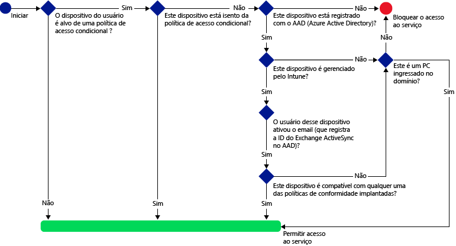
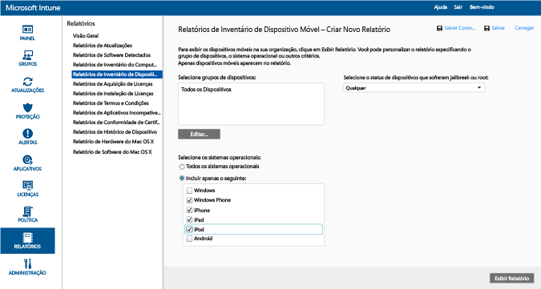
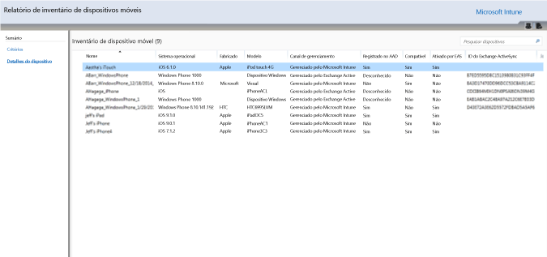
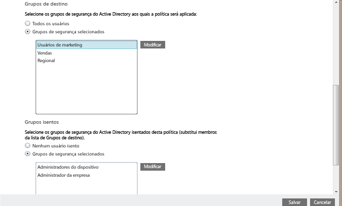
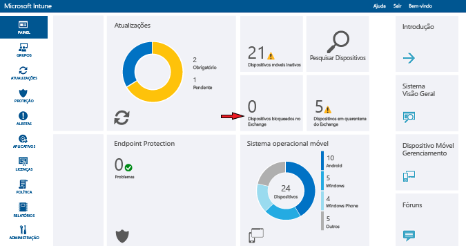

---
# required metadata

title: Restringir acesso a email ao Exchange Online e ao novo Exchange Online Dedicado | Microsoft Intune
description:
keywords:
author: karthikaraman
manager: jeffgilb
ms.date: 04/28/2016
ms.topic: article
ms.prod:
ms.service: microsoft-intune
ms.technology:
ms.assetid: 09c82f5d-531c-474d-add6-784c83f96d93

# optional metadata

#ROBOTS:
#audience:
#ms.devlang:
ms.reviewer: jeffgilb
ms.suite: ems
#ms.tgt_pltfrm:
#ms.custom:

---

# Restringir acesso a email ao Exchange Online e ao novo Exchange Online Dedicado com o Intune

Se você tiver um ambiente do Exchange Online Dedicado e precisar descobrir se ele está na configuração nova ou herdada, entre em contato com seu gerente de conta.

Para controlar o acesso ao email para Exchange Online ou para seu novo ambiente herdado do Exchange Online dedicado, configure o acesso condicional ao Exchange Online no Intune.
Para saber mais sobre como o acesso condicional funciona, leia o artigo [Restrict access to email and O365 services (Restringir acesso a email e a serviços do O365)](restrict-access-to-email-and-o365-services-with-microsoft-intune.md).

>[!IMPORTANT]
>O acesso condicional para computadores e dispositivos Windows 10 Mobile com aplicativos usando autenticação moderna atualmente não está disponível para todos os clientes do Intune. Se você já estiver usando esses recursos, você não precisará realizar nenhuma ação. Você pode continuar a usá-los.

>Se você não tiver criado as políticas de acesso condicional para computadores ou Windows 10 Mobile para aplicativos usando autenticação moderna e gostaria de fazer isso, você deverá enviar uma solicitação.  Você pode encontrar mais informações sobre problemas conhecidos, bem como para obter acesso a esse recurso no [site do Microsoft Connect](http://go.microsoft.com/fwlink/?LinkId=761472).

**Antes** de poder configurar o acesso condicional, você deve:

-   Ter uma **assinatura do Office 365 que inclui o Exchange Online (como E3)** e os usuários devem ser licenciados para o Exchange Online.

-  Considere configurar o **Microsoft Intune Service to Service Connector**, que conecta [!INCLUDE[wit_nextref](../includes/wit_nextref_md.md)] ao Microsoft Exchange Online e ajuda a gerenciar informações de dispositivos por meio do console do [!INCLUDE[wit_nextref](../includes/wit_nextref_md.md)]. Você não precisa usar o conector para usar políticas de conformidade ou políticas de acesso condicional, mas ele é necessário para executar relatórios que ajudam a avaliar o impacto de acesso condicional.

   > [!NOTE]
   > Não configure o Service to Service Connector se você pretende usar o acesso condicional para o Exchange Online e o Exchange Local

   Para obter instruções sobre como configurar o conector, consulte [Intune service-to-service connector (Intune Service to Service Connector)](intune-service-to-service-exchange-connector.md)

Quando políticas de acesso condicionais são configuradas e direcionadas ao usuário, antes de um usuário se conectar ao email, o **dispositivo** usado deve:

-   Estar **registrado** no [!INCLUDE[wit_nextref](../includes/wit_nextref_md.md)] ou ser um computador ingressado no domínio.

-  **Registrado no Azure Active Directory**. Isso ocorre automaticamente quando o dispositivo é registrado com [!INCLUDE[wit_nextref](../includes/wit_nextref_md.md)]. Além disso, a ID do Exchange ActiveSync do cliente deve estar registrada com o Azure Active Directory.

  O AAD DRS será ativado automaticamente para clientes do Intune e do Office 365. Clientes que já tiverem implantado o Serviço de Registro de Dispositivos do ADFS não verão dispositivos registrados no seu Active Directory local.

-   **Compatível** com qualquer políticas de conformidade [!INCLUDE[wit_nextref](../includes/wit_nextref_md.md)] implantada nesse dispositivo ou um domínio para um domínio local.

Se uma política de acesso condicional não for atendida, o usuário receberá uma das mensagens a seguir ao fazer logon:

- Se o dispositivo não estiver registrado no [!INCLUDE[wit_nextref](../includes/wit_nextref_md.md)] ou não estiver registrado no Azure Active Directory, será exibida uma mensagem com instruções sobre como instalar o aplicativo do portal da empresa, registrar o dispositivo e ativar o email. Esse processo também associa a ID do Exchange ActiveSync do dispositivo com o registro no Azure Active Directory.

-   Se o dispositivo não for compatível com as regras de política de conformidade, o usuário final será direcionado ao site do Portal da Empresa [!INCLUDE[wit_nextref](../includes/wit_nextref_md.md)] ou para o aplicativo Portal da Empresa, em que ele poderá encontrar informações sobre o problema e como corrigi-lo.

O diagrama abaixo ilustra o fluxo usado pelas políticas de acesso condicional para o Exchange Online.

## Suporte para dispositivos móveis
Você pode restringir o acesso ao email do Exchange Online de **Outlook** e outros **aplicativos que usam autenticação moderna**:-

- Android 4.0 e posterior, Samsung Knox Standard 4.0 e posterior
- iOS 7.1 e posterior
- Windows Phone 8.1 e posterior

 A **autenticação moderna** leva a entrada baseada no ADAL (Active Directory Authentication Library) a clientes do Microsoft Office.

> -   A autenticação com base em ADAL permite que os clientes Office participem de autenticação baseada em navegador (também conhecida como autenticação passiva).  Para autenticar, o usuário é direcionado a uma página da Web de entrada. Esse novo método de entrada permite melhor segurança, como **autenticação multifator** e **autenticação baseada em certificado Autenticação Multifator**
> Esse [artigo](https://support.office.com/en-US/article/How-modern-authentication-works-for-Office-2013-and-Office-2016-client-apps-e4c45989-4b1a-462e-a81b-2a13191cf517) tem informações mais detalhadas sobre como a autenticação moderna funciona.

Você pode restringir o acesso ao email do Exchange por meio do **cliente de email do Exchange ActiveSync** interno nas seguintes plataformas:

- Android 4.0 e posterior, Samsung Knox Standard 4.0 e posterior

- iOS 7.1 e posterior

- Windows Phone 8.1 e posterior

## Suporte para computadores

É possível configurar o acesso condicional para PCs que executam aplicativos da área de trabalho do Office para acessar o **Exchange Online** e o **SharePoint Online** para PCs que atendam aos seguintes requisitos:

-   O PC deve estar executando o Windows 7.0 ou Windows 8.1.

-   O computador deve estar ingressado no domínio ou deve ser compatível com as regras de políticas de conformidade.

    Para ser considerado em compatível, o computador deve ser registrado no [!INCLUDE[wit_nextref](../includes/wit_nextref_md.md)] e estar em conformidade com as políticas.

    Para computadores ingressados no domínio, você deve configurá-lo para [registrar o dispositivo automaticamente](https://azure.microsoft.com/documentation/articles/active-directory-conditional-access-automatic-device-registration/) com o Azure Active Directory.

-   [A autenticação moderna do Office 365 deve estar habilitada](https://support.office.com/en-US/article/Using-Office-365-modern-authentication-with-Office-clients-776c0036-66fd-41cb-8928-5495c0f9168a) e ter todas as atualizações mais recentes do Office.

    A autenticação moderna leva as credenciais baseadas na ADAL (Active Directory Authentication Library) aos clientes Windows com Office 2013 e permite mais segurança como a **autenticação multifator** e a **autenticação baseada em certificado**.

-   Configure as regras de declarações do ADFS para bloquear protocolos de autenticação não moderna. Instruções detalhadas são fornecidas no cenário 3 - [bloquear todo o acesso ao O365, exceto aplicativos baseados em navegador](https://technet.microsoft.com/library/dn592182.aspx).

## Configurar acesso condicional
### Etapa 1: configurar e implantar uma política de conformidade
Certifique-se de [criar](create-a-device-compliance-policy-in-microsoft-intune.md) e [implantar](deploy-and-monitor-a-device-compliance-policy-in-microsoft-intune.md) uma política de conformidade para os grupos de usuários que também receberão a política de acesso condicional.

> [!IMPORTANT]
> Se você não tiver implantado uma política de conformidade, os dispositivos serão considerados compatíveis e terão acesso ao Exchange.

### Etapa 2: avaliar o efeito da política de acesso condicional
Você pode usar os **Relatórios de Inventário de Dispositivos Móveis** para identificar quais dispositivos em sua organização serão impedidos de acessar o Exchange quando você configura uma política de acesso condicional.

Para fazer isso, configure uma conexão entre [!INCLUDE[wit_nextref](../includes/wit_nextref_md.md)] e o Exchange usando o [Microsoft Intune Service to Service Connector](intune-service-to-service-exchange-connector.md).
1.  Navegue até **Relatórios -> Relatórios de Inventário de Dispositivo Móvel**.

2.  Nos parâmetros do relatório, selecione o grupo [!INCLUDE[wit_nextref](../includes/wit_nextref_md.md)] que você deseja avaliar e, se necessário, as plataformas de dispositivo às quais a política se aplicará.
3.  Depois de selecionar os critérios que atendem às necessidades da sua organização, escolha **Exibir Relatório**.
Um Visualizador de Relatórios é aberto em uma nova janela.

Depois de executar o relatório, examine essas quatro colunas para determinar se um usuário será bloqueado:

-   **Canal de gerenciamento** – indica se o dispositivo é gerenciado pelo Intune, pelo Exchange ActiveSync ou por ambos.

-   **Registrado no AAD** – indica se o dispositivo está registrado no Active Directory do Azure (conhecido como Junção de Local de Trabalho).

-   **Em conformidade** – indica se o dispositivo é compatível com as políticas de conformidade que você implantou.

-   **ID do Exchange ActiveSync** – dispositivos iOS e Android precisam ter sua ID do Exchange ActiveSync associada ao registro do dispositivo no Azure Active Directory. Isso acontece quando o usuário escolhe o link **Ativar Email** no email de quarentena.

    > [!NOTE]
    > Dispositivos Windows Phone sempre exibem um valor nesta coluna.

Dispositivos que fazem parte de um grupo alvo serão impedidos de acessar o Exchange, a menos que os valores na coluna correspondam aos valores listados na tabela a seguir:

--------------------------
|Canal de gerenciamento|Registrado no AAD|Compatível|ID do Exchange ActiveSync|Ação resultante|
|----------------------|------------------|-------------|--------------------------|--------------------|
|**Gerenciado pelo Microsoft Intune e pelo Exchange ActiveSync**|Sim|Sim|Um valor é exibido|Acesso ao email permitido|
|Qualquer outro valor|Não|Não|Nenhum valor é exibido|Acesso ao email bloqueado|
----------------------
Você pode exportar o conteúdo do relatório e usar a coluna **Endereço de email** para informar os usuários de que eles serão bloqueados.

### Etapa 3: configurar grupos de usuários para a política de acesso condicional
Políticas de acesso condicional são destinadas a diferentes grupos de segurança do Azure Active Directory de usuários. Você também pode isentar certos grupos de usuários dessa política.  Quando um usuário é afetado por uma política, cada dispositivo que ele usa deve ser compatível para que possa acessar o email.

Você pode configurar esses grupos no **Centro de administração do Office 365**ou no **Portal de conta do Intune**.

Você pode especificar dois tipos de grupo em cada política:

-   **Grupos destinados** – Grupos de usuários aos quais a política é aplicada.

-   **Grupos isentos** – grupos de usuários isentos da política (opcional)

Se um usuário estiver nos dois grupos, ele ficará isento da política.

Somente os grupos que são destinados pela política de acesso condicional são avaliados.

### Etapa 4: Configurar a política de acesso condicional

1.  No [Console de administração do Microsoft Intune](https://manage.microsoft.com), escolha **Política** > **Acesso Condicional** > **Política do Exchange Online**.

2.  Na página **Política do Exchange Online**, selecione **Habilitar política de acesso condicional para o Exchange Online**.

    > [!NOTE]
    > Se você não tiver implantado uma política de conformidade, os dispositivos serão tratados como compatíveis.
    >
    > Independentemente do estado de conformidade, todos os usuários aos quais a política se destina precisarão registrar seus dispositivos com o [!INCLUDE[wit_nextref](../includes/wit_nextref_md.md)].

3.  Em **Acesso a aplicativos**, para aplicativos que usam autenticação moderna, há duas maneiras de escolher as plataformas em que a política deve ser aplicada. Plataformas com suporte incluem iOS, Android, Windows e Windows Phone.

    -   **Todas as plataformas**

        Isso requer que qualquer dispositivo usado para acessar o **Exchange Online** seja registrado no Intune e esteja compatível com as políticas.  Qualquer aplicativo cliente que usa **autenticação moderna** está sujeito à política de acesso condicional e, se a plataforma não tiver suporte atualmente no Intune, o acesso ao **Exchange Online** será bloqueado.
        >[!TIP]
           Você não encontrará essa opção se você não estiver usando o acesso condicional para computadores.  Em vez disso, use **Plataformas específicas**. O acesso condicional para computadores não está disponível no momento para todos os clientes do Intune.   Você pode encontrar mais informações sobre problemas conhecidos, bem como para obter acesso a esse recurso no [site do Microsoft Connect](http://go.microsoft.com/fwlink/?LinkId=761472).

    -   **Plataformas específicas**

         A política de acesso condicional se aplicará a qualquer aplicativo cliente que usa **autenticação moderna** mas plataformas que você especificar.

4.  Em **aplicativos do Exchange ActiveSync**, você pode optar por bloquear dispositivos incompatíveis de acessar o Exchange Online. Você também pode selecionar se deseja permitir ou bloquear o acesso a email quando o dispositivo não estiver em execução em uma plataforma com suporte. Plataformas com suporte incluem iOS, Android, Windows e Windows Phone.

5.  Em **Grupos de destino**, selecione os grupos de segurança de usuários do Active Directory aos quais a política será aplicada. Você pode optar por direcionar todos os usuários ou uma lista selecionada de grupos de usuários.

    > [!NOTE]
    > Para usuários que estão nos **grupos de Destino**, as políticas do Intune substituirão as regras e políticas do Exchange.
    >
    > Só serão impostas pelo Exchange as regras de permissão, bloqueio e quarentena e as políticas do Exchange se:
    >
    > -   O usuário não estiver licenciado para o Intune.
    > -   O usuário estiver licenciado para o Intune, mas ele não pertencer a nenhum grupo de segurança direcionado na política de acesso condicional.

6.  Em **Grupos isentos**, selecione os grupos de segurança de usuários do Active Directory que serão isentos desta política. Se um dispositivo estiver nos grupos afetados e nos grupos isentos, ele ficará isento da política.

7.  Quando terminar, selecione **Salvar**.

-   Você não precisa implantar a política de acesso condicional, ele entra em vigor imediatamente.

-   Depois que um usuário cria uma conta de email, o dispositivo é bloqueado imediatamente.

-   Se um usuário bloqueado registrar o dispositivo no [!INCLUDE[wit_nextref](../includes/wit_nextref_md.md)] e solucionar problemas de incompatibilidade, o acesso ao email será desbloqueado em 2 minutos.

-   Se o usuário cancelar o registro do dispositivo, o email será bloqueado após cerca de 6 horas.

**Para ver alguns cenários de exemplo de como você poderia configurar política de acesso condicional para restringir o acesso ao dispositivo, consulte [restrict email access example scenarios (restringir cenários de exemplo de acesso a email)](restrict-email-access-example-scenarios.md).**

## Monitorar a conformidade e políticas de acesso condicional

#### Para exibir dispositivos que foram bloqueados do Exchange

No painel do [!INCLUDE[wit_nextref](../includes/wit_nextref_md.md)], escolha o bloco **Dispositivos Bloqueados do Exchange** para mostrar o número de dispositivos bloqueados e links para obter mais informações.

## Próximas etapas
[Restringir o acesso ao SharePoint Online](restrict-access-to-sharepoint-online-with-microsoft-intune.md)

[Restringir o acesso ao Skype for Business Online](restrict-access-to-skype-for-business-online-with-microsoft-intune.md)

<!--HONumber=May16_HO1-->

