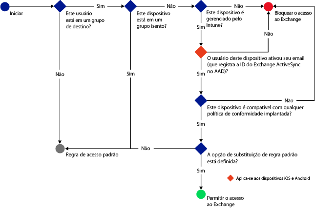
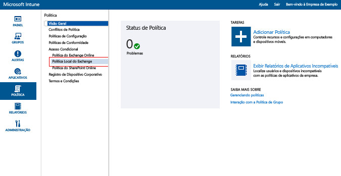
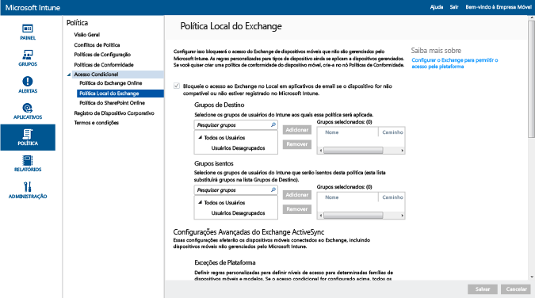

---
# required metadata

title: Restringir acesso a email ao Exchange Local e Exchange Online Dedicado herdado | Microsoft Intune
description:
keywords:
author: karthikaraman
manager: jeffgilb
ms.date: 04/28/2016
ms.topic: article
ms.prod:
ms.service: microsoft-intune
ms.technology:
ms.assetid: a55071f5-101e-4829-908d-07d3414011fc

# optional metadata

#ROBOTS:
#audience:
#ms.devlang:
ms.reviewer: jeffgilb
ms.suite: ems
#ms.tgt_pltfrm:
#ms.custom:

---

# Restringir acesso a email ao Exchange local e Exchange Online Dedicado herdado com o Intune

Se você tiver um ambiente do Exchange Online Dedicado e precisar descobrir se ele está na configuração nova ou herdada, entre em contato com seu gerente de conta.

Para controlar o acesso ao email para Exchange local ou para seu ambiente herdado do Exchange Online dedicado, configure o acesso condicional ao Exchange local no Intune.
Para saber mais sobre como o acesso condicional funciona, leia o artigo [Restrict access to email and O365 services (Restringir acesso a email e a serviços do O365)]( restrict-access-to-email-and-o365-services-with-microsoft-intune.md).

**Antes** de poder configurar o acesso condicional, verifique o seguinte:

-   A versão do Exchange deve ser **Exchange 2010 ou posterior**. Há suporte para a matriz de CAS (Servidor de Acesso de Cliente) do servidor Exchange.

-   Você deve usar o **conector do Exchange local**, que conecta [!INCLUDE[wit_nextref](../includes/wit_nextref_md.md)] a instalações do Microsoft Exchange local. Isso lhe permite gerenciar dispositivos por meio do console [!INCLUDE[wit_nextref](../includes/wit_nextref_md.md)]. Para obter detalhes sobre o conector, consulte o [Intune on-premises Exchange connector](intune-on-premises-exchange-connector.md) (Exchange Connector local do Intune).

    -   O Exchange Connector local disponível para você no console do Intune é específico ao seu locatário do Intune e não pode ser usado com nenhum outro locatário. Você também deve garantir que o Exchange Connector para seu locatário esteja instalado em **exatamente um computador**.

        Esse conector deve ser baixado do console de administração do Intune.  Para obter uma explicação sobre como configurar o Exchange Connector no loca, consulte [configure Exchange on-premises connector for on-premises or hosted Exchange (configurar co conector local do Exchange para Exchange local ou hospedado)](intune-on-premises-exchange-connector.md).

    -   O conector pode ser instalado em qualquer computador, desde que o computador seja capaz de se comunicar com o servidor Exchange.

    -   Esse conector dá suporte a **ambiente de CAS do Exchange**. Você pode tecnicamente instalar o conector no servidor de CAS do Exchange diretamente se desejar, mas não é recomendável, pois ele aumenta a carga no servidor.
    Ao configurar o conector, você deve configurá-lo para que ele se comunique com um dos servidores de CAS do Exchange.

-   O **Exchange ActiveSync** deve ser configurado com autenticação baseada em certificado ou em entrada de credenciais de usuário.

Quando políticas de acesso condicionais são configuradas e direcionadas ao usuário, antes de um usuário se conectar ao email, o **dispositivo** usado deve:

-  Estar **registrado** em [!INCLUDE[wit_nextref](../includes/wit_nextref_md.md)] ou em um computador ingressado no domínio.

-  **Registrado no Azure Active Directory**. Além disso, a ID do Exchange ActiveSync do cliente deve estar registrada com o Azure Active Directory.

  O AAD DRS será ativado automaticamente para clientes do Intune e do Office 365. Clientes que já tiverem implantado o Serviço de Registro de Dispositivos do ADFS não verão dispositivos registrados no seu Active Directory local. **Isso não se aplica a computadores Windows e dispositivos do Windows Phone**.

-   **Compatível** com qualquer política de conformidade do [!INCLUDE[wit_nextref](../includes/wit_nextref_md.md)] implantada nesse dispositivo.

O diagrama a seguir ilustra o fluxo usado por políticas de acesso condicional para o Exchange local a fim de avaliar se devem permitir ou bloquear os dispositivos.

Se uma política de acesso condicional não for atendida, o usuário receberá uma das mensagens a seguir ao fazer logon:

- Se o dispositivo não estiver registrado no [!INCLUDE[wit_nextref](../includes/wit_nextref_md.md)] ou não estiver registrado no Azure Active Directory, será exibida uma mensagem com instruções sobre como instalar o aplicativo Portal da Empresa, registrar o dispositivo e ativar o email. Esse processo também associa a ID do Exchange ActiveSync do dispositivo com o registro do dispositivo no Azure Active Directory.

-   Se o dispositivo não for compatível, será exibida uma mensagem que direciona o usuário para o site do Portal da Empresa [!INCLUDE[wit_nextref](../includes/wit_nextref_md.md)] ou para o aplicativo Portal da Empresa, em que ele pode encontrar informações sobre o problema e como corrigi-lo.

## Suporte para dispositivos móveis
-   Windows Phone 8 e posterior

-   Aplicativo de email nativo no iOS.

-   Aplicativo de email nativo no Android 4 ou posterior

## Suporte para computadores

O aplicativo de **Email** do Windows 8 e posterior (quando registrado com [!INCLUDE[wit_nextref](../includes/wit_nextref_md.md)])

##  Configurar uma política de acesso condicional

1.  No [console de Administração do Microsoft Intune](https://manage.microsoft.com), selecione **Política** > **Acesso Condicional** > **Política do Exchange local**.

2.  Configure a política com as configurações necessárias:

  - **Impedir aplicativos de email de acessar o Exchange local se o dispositivo não está em conformidade ou não registrado no Microsoft Intune:** quando você seleciona essa opção, os dispositivos que não são gerenciados pelo [!INCLUDE[wit_nextref](../includes/wit_nextref_md.md)], ou não compatíveis com uma política de conformidade são impedidos de acessar os serviços do Exchange.

  - **Substituição de regra padrão - Sempre permite que dispositivos registrados e compatíveis acessem o Exchange:** quando você marca essa opção, os dispositivos registrados no Intune e compatíveis com as políticas de conformidade têm permissão para acessar o Exchange.  
  Essa regra substitui a **Regra Padrão**, o que significa que, mesmo que você defina a **Regra Padrão** para bloquear acesso ou quarentena, dispositivos registrados e compatíveis ainda poderão acessar o Exchange.

  - **Grupos de Destino:** selecione os grupos de usuários [!INCLUDE[wit_nextref](../includes/wit_nextref_md.md)] que devem registrar seu dispositivo em [!INCLUDE[wit_nextref](../includes/wit_nextref_md.md)] antes que possam acessar o Exchange.

  - **Grupos Isentos:** selecione os grupos de usuários [!INCLUDE[wit_nextref](../includes/wit_nextref_md.md)] isentos da política de acesso condicional. Os usuários nessa lista serão isentos mesmo que eles também estejam na lista de **Grupos de Destino**.

  - **Exceções de Plataforma:** escolha **Adicionar Regra** para configurar uma regra que define os níveis de acesso para famílias e modelos de dispositivos móveis específicos. Como esses dispositivos podem ser de qualquer tipo, você também pode configurar os tipos de dispositivos que não têm suporte pelo [!INCLUDE[wit_nextref](../includes/wit_nextref_md.md)].

  - **Regra Padrão:** para um dispositivo que não está coberto por qualquer uma das outras regras, você pode optar por permitir que ele acesse o Exchange, bloqueá-lo ou colocá-lo em quarentena. Quando você define a regra para permitir o acesso, para dispositivos que estão registrados e são compatíveis, o acesso a email é concedido automaticamente para dispositivos iOS, Windows e Samsung KNOX. O usuário final não precisa passar por qualquer processo para obter seus emails.  Em dispositivos Android que não executam o Samsung KNOX, os usuários finais receberão um email de quarentena, que inclui um passo a passo guiado para verificar o registro e a conformidade para poder acessar o email. Se você definir a regra para bloquear o acesso ou colocar em quarentena, todos os dispositivos são bloqueados de acessar o Exchange, independentemente de já estarem registrados no Intune ou não. Para impedir que dispositivos registrados e compatíveis sejam afetados por essa regra, verifique a **Substituição de Regra Padrão.**
>[!TIP]
>Se sua intenção for primeiro bloquear todos os dispositivos antes de conceder acesso ao email, escolha a regra Bloquear acesso ou Quarentena. A regra padrão se aplica a todos os tipos de dispositivos, portanto os tipos de dispositivos que você configurar como exceções da plataforma ou que não tiverem suporte do [!INCLUDE[wit_nextref](../includes/wit_nextref_md.md)] também serão afetados.

  - **Notificação do Usuário:** além do email de notificação enviado do Exchange, o Intune envia um email que você contém etapas para desbloquear o dispositivo. Você pode editar a mensagem padrão para personalizá-la às suas necessidades. Como o email de notificação do Intune que contém instruções de correção é entregue à caixa de correio do Exchange do usuário, se o dispositivo do usuário for bloqueado antes dele receber a mensagem de email, ele poderá usar um dispositivo desbloqueado ou outro método para acessar o Exchange e exibir a mensagem. Isso é especialmente verdadeiro quando a **Regra Padrão** está definida como bloquear ou colocar em quarentena.  Nesse caso, o usuário final precisará ir para sua loja de aplicativos, baixar o aplicativo Portal da Empresa da Microsoft e registrar o dispositivo. Isso é aplicável a dispositivos iOS, Windows e Samsung KNOX.  Para dispositivos que não executam o Samsung KNOX, você precisará enviar o email de quarentena a uma conta de email alternativa, que o usuário final precisará copiar para seu dispositivo bloqueado para concluir o processo de registro e de conformidade.|
  > [!NOTE]
  > Para que o Exchange possa enviar o email de notificação, você deve especificar a conta que deve ser usada para enviar o email de notificação.
  >
  > Para obter mais detalhes, consulte [configure Exchange on-premises connector for on-premises or hosted Exchange (configurar o conector do Exchange local para o Exchange local ou hospedado)](intune-on-premises-exchange-connector.md).

3.  Quando terminar, selecione **Salvar**.

-   Você não precisa implantar a política de acesso condicional, ele entra em vigor imediatamente.

-   Depois que um usuário configura um perfil do Exchange ActiveSync, pode levar de 1 a 3 horas para o dispositivo ser bloqueado (se ele não for gerenciado pelo [!INCLUDE[wit_nextref](../includes/wit_nextref_md.md)]).

-   Se um usuário bloqueado registrar o dispositivo no [!INCLUDE[wit_nextref](../includes/wit_nextref_md.md)] e solucionar a incompatibilidade), o acesso ao email será desbloqueado em 2 minutos.

-   Se o usuário cancelar o registro do [!INCLUDE[wit_nextref](../includes/wit_nextref_md.md)], pode levar de 1 a 3 horas para o dispositivo ser bloqueado.

**Para ver alguns cenários de exemplo de como você poderia configurar política de acesso condicional para restringir o acesso ao dispositivo, consulte [restrict email access example scenarios (restringir cenários de exemplo de acesso a email)](restrict-email-access-example-scenarios.md).**

## Próximas etapas
[Restringir o acesso ao SharePoint Online](restrict-access-to-sharepoint-online-with-microsoft-intune.md)

[Restringir o acesso ao Skype for Business Online](restrict-access-to-skype-for-business-online-with-microsoft-intune.md)

<!--HONumber=May16_HO1-->

