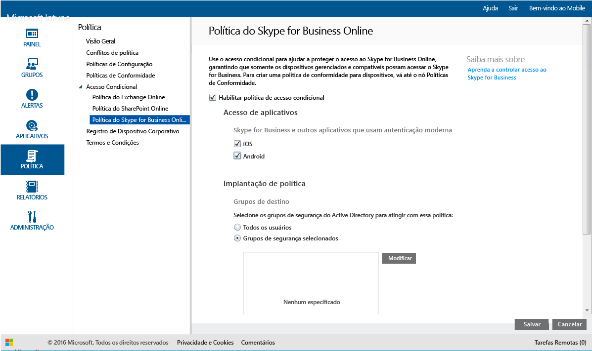

---
# required metadata

title: Restringir o acesso ao Skype for Business Online | Microsoft Intune
description:
keywords:
author: karthikaraman
manager: jeffgilb
ms.date: 04/28/2016
ms.topic: article
ms.prod:
ms.service: microsoft-intune
ms.technology:
ms.assetid: 1b2d7125-f63f-43cf-ac1e-94fbedf2a7e8

# optional metadata

#ROBOTS:
#audience:
#ms.devlang:
ms.reviewer: jeffgilb
ms.suite: ems
#ms.tgt_pltfrm:
#ms.custom:

---

# Restringir o acesso ao Skype for Business Online com o Microsoft Intune
Use a política de acesso condicional para o **Skype for Business Online** para controlar o acesso ao Skype for Business Online.
O acesso condicional tem dois componentes:
- A política de conformidade do dispositivo, com que o dispositivo deve estar em conformidade para ser considerado compatível.
- A política de acesso condicional, na qual você especifica as condições que o dispositivo deve atender para acessar o serviço.
Para saber mais sobre como o acesso condicional funciona, leia o artigo [Restrict access to email and O365 services (Restringir acesso a email e a serviços do O365)](restrict-access-to-email-and-o365-services-with-microsoft-intune.md).

Quando um determinado usuário tenta usar o Skype for Business Online em seu dispositivo, ocorre a seguinte avaliação:

**Antes** de configurar uma política de acesso condicional para o Skype for Business Online, você precisa:
- Ter uma **assinatura do Skype for Business Online** e atribuir a licença do Skype for Business Online aos usuários.
- Ter uma assinatura do **Enterprise Mobility Suite** ou do **Azure Active Directory Premium**.
-   **Habilitar a autenticação moderna** para o Skype for Business Online. Faça logon no Microsoft Connect e preencha [este formulário](https://connect.microsoft.com/office/Survey/NominationSurvey.aspx?SurveyID=17299&ProgramID=8715) para se registrar no programa de autenticação moderna.
-  Todos os seus usuários finais devem estar usando o **Skype for Business Online**. Se você tiver uma implantação com o Skype for Business Online e o Skype for Business local, a política de acesso condicional não será aplicada aos usuários finais.

    O dispositivo que precisa acessar o Skype for Business Online deve:

-   Ser um dispositivo **Android** ou **iOS**.

-   Estar **registrado** no [!INCLUDE[wit_nextref](../includes/wit_nextref_md.md)].

-   Ser **compatível** com qualquer política de conformidade do [!INCLUDE[wit_nextref](../includes/wit_nextref_md.md)] implantada.

O estado do dispositivo é armazenado no Azure Active Directory, que concede ou bloqueia o acesso com base nas condições que você especificar.

Se uma condição não for atendida, o usuário receberá uma das seguintes mensagens de erro ao fazer logon:

-   Se o dispositivo não estiver registrado no [!INCLUDE[wit_nextref](../includes/wit_nextref_md.md)] ou não estiver registrado no Azure Active Directory, será exibida uma mensagem com instruções sobre como instalar o aplicativo do portal da empresa e registrá-lo.

-   Se o dispositivo não for compatível, será exibida uma mensagem que direciona o usuário para o site do Portal da Empresa [!INCLUDE[wit_nextref](../includes/wit_nextref_md.md)] ou para o aplicativo do Portal da Empresa, no qual ele pode encontrar informações sobre o problema e como corrigi-lo.

## Configurar o acesso condicional ao Skype for Business Online

### Etapa 1: Configurar grupos de segurança do Active Directory
Antes de começar, configure os grupos de segurança do Active Directory do Azure para a política de acesso condicional. Você pode configurar esses grupos no **Centro de administração do Office 365**. Esses grupos serão usados para afetar ou isentar os usuários da política. Quando um usuário é afetado por uma política, cada dispositivo que ele usa deve ser compatível para que possa acessar os recursos.

Você pode especificar dois tipos de grupos para usar com a política do Skype for Business:

-   **Grupos de destino** – contém grupos de usuários aos quais a política será aplicada.

-   **Grupos isentos** – contém grupos de usuários isentos da política.

Se um usuário estiver nos dois grupos, ele ficará isento da política.

### Etapa 2: Configurar e implantar uma política de conformidade
[Crie](create-a-device-compliance-policy-in-microsoft-intune.md) e [implante](deploy-and-monitor-a-device-compliance-policy-in-microsoft-intune.md) uma política de conformidade para todos os dispositivos que serão afetados pela política. Esses seriam todos os dispositivos usados pelos usuários nos **Grupos de destino**.

> [!NOTE]
> Enquanto as políticas de conformidade são implantadas em grupos [!INCLUDE[wit_nextref](../includes/wit_nextref_md.md)], as políticas de acesso condicional são destinadas a grupos de segurança do Azure Active Directory.

> [!IMPORTANT]
> Se você não tiver implantado uma política de conformidade, os dispositivos serão tratados como compatíveis.

Quando estiver pronto, continue na **Etapa 3**.

### Etapa 3: Configurar a política do Skype for Business Online
Em seguida, configure a política para exigir que somente dispositivos gerenciados e compatíveis possam acessar o Skype for Business Online. Essa política será armazenada no Active Directory do Azure.

####
1.  No [Console de administração do Microsoft Intune](https://manage.microsoft.com), clique em **Política** > **Acesso Condicional** > **Política do Skype for Business Online**.

2.  Selecione **Habilitar política de acesso condicional**.

3.  Em **Acesso ao aplicativo**, você pode optar por aplicar a política de acesso condicional a:

    -   **iOS**

    -   **Android**

4.  Em **Grupos de Destino**, clique em **Modificar** para selecionar os grupos de segurança do Active Directory do Azure aos quais a política será aplicada. Você pode optar por aplicá-la a todos os usuários ou apenas a um grupos seleto de usuários.

5.  Opcionalmente, em **Grupos isentos**, clique em **Modificar** para selecionar os grupos de segurança do Active Directory do Azure que são isentos dessa política.

6.  Quando terminar, clique em **Salvar**.

Você configurou o acesso condicional ao Skype for Business Online. Você não precisa implantar a política de acesso condicional, ele entra em vigor imediatamente.

## Monitorar a conformidade e políticas de acesso condicional
No espaço de trabalho **Grupos** , você pode exibir o status de acesso condicional de seus dispositivos.

Selecione qualquer grupo de dispositivos móveis e então, na guia **Dispositivos** , selecione um dos seguintes **Filtros**:

* **Dispositivos que não estão registrados no AAD** – esses dispositivos estão bloqueados do Skype for Business Online.

* **Dispositivos que não são compatíveis** – esses dispositivos estão bloqueados do Skype for Business Online.

* **Dispositivos registrados com o AAD e que são compatíveis** – esses dispositivos podem acessar o Skype for Business Online.

<!--HONumber=May16_HO1-->

