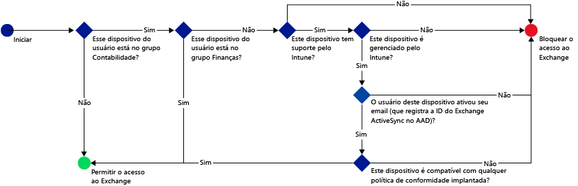
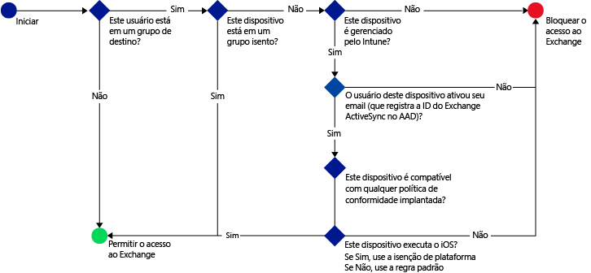
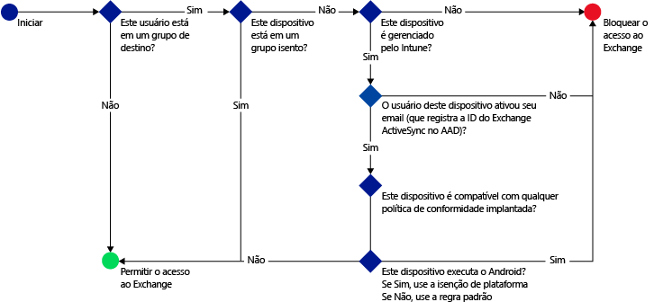

---
# required metadata

title: Restringir o acesso a email - cenários de exemplo | Microsoft Intune
description:
keywords:
author: karthikaraman
manager: jeffgilb
ms.date: 04/28/2016
ms.topic: article
ms.prod:
ms.service: microsoft-intune
ms.technology:
ms.assetid: 454eab79-b620-42c9-b8e6-fada6e719fcd

# optional metadata

#ROBOTS:
#audience:
#ms.devlang:
ms.reviewer: chrisgre
ms.suite: ems
#ms.tgt_pltfrm:
#ms.custom:

---

# Restringir o acesso a email com o Microsoft Intune: cenários de exemplo

## Impedir que usuários usem dispositivos não compatíveis para acessar o Exchange Online.
### Requisitos do cenário
- Todos os usuários no grupo de segurança **Contabilidade** do Active Directory deverão ser impedidos de acessar o Exchange Online se o dispositivo não for compatível com uma política de conformidade implantada por você.
- Se existirem quaisquer usuários nesse grupo que não têm suporte do [!INCLUDE[wit_nextref](../includes/wit_nextref_md.md)], seu acesso ao Exchange Online deverá ser bloqueado no dispositivo.
- Os usuários que estão no grupo de segurança **Finanças** do Active Directory devem ser isentos da política, mesmo que também estejam no grupo de segurança **Contabilidade**.

Para fazer isso, configure uma política de acesso condicional para o Exchange Online com as seguintes configurações:

-   Selecione **Habilitar política de acesso condicional**.

- Selecione as plataformas a que você deseja permitir o acesso de aplicativos com autenticação moderna.
- Para aplicativos do Exchange ActiveSync, selecione **Bloquear dispositivos incompatíveis em plataformas com suporte do Microsoft Intune** e **Bloquear todos os outros dispositivos em plataformas sem suporte do Microsoft Intune.**
-   Na seção **Grupo de destino**, em **Grupos de segurança selecionados**, escolha o grupo de usuários **Contabilidade**.

-   Na seção **Grupo isento**, em **Grupos de segurança selecionados**, escolha o grupo de usuários **Finanças**.

O fluxo a seguir é usado para decidir quais dispositivos podem acessar o Exchange Online:

## Todos os dispositivos iOS que acessam o Exchange local devem ser gerenciados pelo Intune
### Requisitos do cenário
- Somente dispositivos que executam o iOS devem ter acesso permitido ao Exchange local.
- Os dispositivos também devem estar registrados no Intune e atender às regras da política de conformidade antes que possam ser usados para acessar o Exchange.

Para fazer isso, configure a seguinte política de acesso condicional para o Exchange local com as seguintes configurações:

-   Selecione a opção **Bloquear o acesso de aplicativos de email ao Exchange local se o dispositivo não for compatível ou não estiver registrado no Microsoft Intune**. Ao selecionar essa opção, a política de acesso condicional é habilitada, o que requer que todos os dispositivos sejam registrados no Microsoft Intune e obedeçam as regras da política de conformidade antes que possam acessar o Exchange.

-   Para configurações avançadas do Exchange Active Sync, crie uma:

  -   Uma exceção de plataforma que permite que dispositivos que executam iOS acessem o Exchange.   

  -   Uma regra padrão que especifica que quando um dispositivo não está coberto pela regra de exceção de plataforma, ele deve ser impedido de acessar o Exchange. Essa regra garante que dispositivos que não executam o iOS sejam impedidos de acessar o Exchange.

O fluxo a seguir é usado para decidir quais dispositivos podem acessar o Exchange:

## Nenhum dispositivo Android pode acessar o Exchange local.
### Requisitos do cenário
- Todos os dispositivos Android devem ser impedidos de acessar o Exchange.
- Todos os outros dispositivos com suporte podem acessar o Exchange se forem gerenciados pelo [!INCLUDE[wit_nextref](../includes/wit_nextref_md.md)].

Para fazer isso, configure uma política de acesso condicional para o Exchange local com as seguintes configurações:

-   Selecione a opção **Bloquear o acesso de aplicativos de email ao Exchange local se o dispositivo não for compatível ou não estiver registrado no Microsoft Intune**. Ao selecionar essa opção, exige-se que qualquer dispositivo seja registrado no Intune e atenda às regras da política de conformidade.

- Para configurações avançadas do Exchange Active Sync, crie uma:
  -   Exceção de plataforma que bloqueia o acesso de dispositivos que executam Android ao Exchange. Essa regra garante que os dispositivos Android não possam ser usados para acessar o Exchange.

  -   Regra padrão que especifica que quando um dispositivo não é coberto por outras regras, ele deve ter permissão para acessar o Exchange. Esta regra padrão garante que os dispositivos que executam plataformas diferentes do Android, mas com suporte do Microsoft Intune, possam ser usados para acessar o Exchange. No entanto, eles deverão estar registrados no Intune e atender às regras de política de conformidade.

O fluxo a seguir é usado para decidir quais dispositivos podem acessar o Exchange:

<!--HONumber=Jun16_HO2-->

