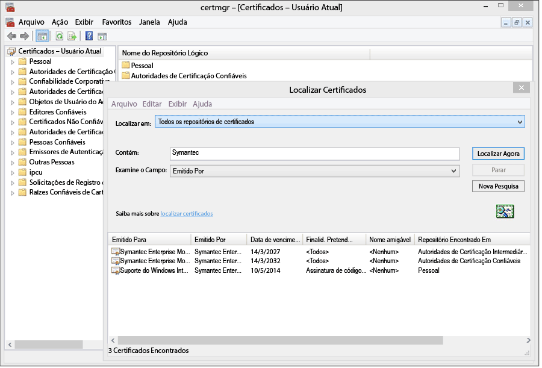
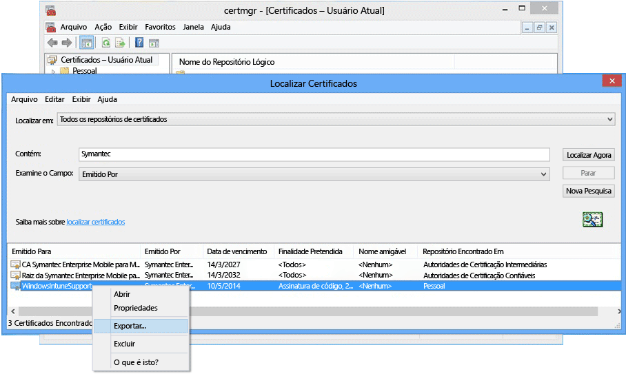

---
# required metadata

title: Configurar o gerenciamento do Windows 8.0 com o Microsoft Intune | Microsoft Intune
description:
keywords:
author: NathBarn
manager: jeffgilb
ms.date: 04/28/2016
ms.topic: article
ms.prod:
ms.service: microsoft-intune
ms.technology:
ms.assetid: 61e9b6c3-8795-49b0-8ab2-a9a05ee3ea1f

# optional metadata

#ROBOTS:
#audience:
#ms.devlang:
ms.reviewer: jeffgilb
ms.suite: ems
#ms.tgt_pltfrm:
#ms.custom:

---

# Configurar o gerenciamento de dispositivo para o Windows Phone 8.0

O Windows Phone 8.0 requer um certificado Symantec para instalar o aplicativo de Portal da Empresa do Intune e permitir o gerenciamento de dispositivo. Um certificado também é necessário para assinar aplicativos de linha de negócios. O tópico a seguir é apenas para Windows Phone 8.0. Para gerenciar o Windows Phone 8.1 ou posterior, incluindo o Windows 10 Mobile, consulte [Set up Windows Phone enrollment](set-up-windows-phone-management-with-microsoft-intune.md) (Configurar o registro do Windows Phone).

-   **Windows Phone 8** - Certificado exigido
-   **Windows Phone 8.1 e Windows 10 Mobile** requerem um certificado somente se:

    -   Você desejar implantar o aplicativo de Portal da Empresa usando o Intune

    -   Você for implantar aplicativos de linha de negócios (conhecidos como "sideload")


  > [!IMPORTANT] O certificado da Symantec usado para gerenciar determinados dispositivos móveis do Windows e do Windows Phone [deve ser renovado periodicamente](renew-a-symantec-code-signing-certificate.md).

Os requisitos de configuração de gerenciamento de dispositivo móvel do Windows Phone dependem de como você gerenciará dispositivos.  Definir duas CNAMEs no registro do DNS da sua empresa facilita o registro para usos. Se seus usuários baixarão o aplicativo Portal da Empresa da Loja, após definir as configurações de DNS, basta configurar o Portal da Empresa e informar aos usuários como se registrar.  Para Windows Phone 8.0 ou Windows Phone 8.1, no qual você implantará o Portal da Empresa, você precisará de um certificado de Symantec para assinar código do aplicativo.

## Configurar requisitos de configuração para habilitar o gerenciamento do Windows Phone
1.  **Configurar Intune** Se você ainda não o fez, prepare-se para o gerenciamento de dispositivo móvel ao [Configurar a autoridade de gerenciamento do dispositivo móvel](get-ready-to-enroll-devices-in-microsoft-intune.md#set-mobile-device-management-authority) como **Microsoft Intune** e configurando o MDM.

2.  **Definir um alias DNS para o endereço do servidor de registro** (opcional)

    Um alias DNS (tipo de registro CNAME) facilita o registro dos dispositivos para os usuários ao preencher automaticamente o nome do servidor durante o registro.

    1.  No [console do administrador do Intune](http://manage.microsoft.com), clique em **Administração** &gt; **Gerenciamento de dispositivo móvel** &gt; **Windows Phone**.

    2.  Digite a URL do domínio verificado do site na empresa na caixa **Especificar um Nome de Domínio Verificado** e clique em **Testar Detecção Automática**.

    3.  Criar registros de recurso DNS **CNAME** para o domínio da sua empresa. Os registros de recursos de CNAME deve conter as seguintes informações:

        |Nome do host|Aponta para|TTL|
        |-------------|-------------|-------|
        |enterpriseenrollment.company_domain.com|enterpriseenrollment-s.manage.microsoft.com |1 hora|
        |enterpriseregistration.company_domain.com|enterpriseregistration.windows.net|1 hora|
        Por exemplo, se o site de sua empresa for contoso.com, você precisará criar um CNAME no DNS que redirecione EnterpriseEnrollment.contoso.com para manage.microsoft.com. Se houver mais de um domínio verificado, crie um registro CNAME para cada domínio.

        -   `enterpriseenrollment-s.manage.microsoft.com` – Dá suporte ao redirecionamento para o serviço Intune com reconhecimento de domínio por meio do nome de domínio do email

        -   `enterpriseregistration.windows.net` – Dá suporte à junção de local de trabalho para dispositivos móveis. Ele também dá suporte ao acesso condicional para Windows 8.1

    

3.  **Gerenciamento de certificado para dar suporte à assinatura do aplicativo** [Necessário para Windows Phone 8.0 e Windows Phone 8.1, que não acessam a Windows Phone Store e/ou precisam de aplicativos de linha de negócios].

    Para dar suporte o aplicativo do Portal da Empresa para Windows Phone 8.0 e implantar aplicativos da empresa para o Windows Phone 8.1, você deve obter um **Symantec Enterprise Mobile Code Signing Certificate**. Você não pode usar um certificado emitido por sua própria autoridade de certificação, pois somente o certificado do Symantec confiável para dispositivos Windows Phone. Esse certificado é necessário para:

    -   Assinar o aplicativo do Portal da Empresa para implantação no [!INCLUDE[winphone8_client_1](../includes/winphone8_client_1_md.md)] para registro e gerenciamento do telefone

    -   Assinar os aplicativos de linha de negócios da empresa para que o [!INCLUDE[wit_nextref](../includes/wit_nextref_md.md)] possa implantá-los no Windows Phone

    As etapas a seguir irão ajudá-lo a obter os certificados necessários e assinar o aplicativo do Portal da Empresa. Você precisa ter uma conta do centro de desenvolvimento do Windows Phone e adquirir um certificado Symantec.

    1.  **Ingressar no Centro de Desenvolvimento do Windows Phone** Ingresse no [Centro de Desenvolvimento do Windows Phone](http://go.microsoft.com/fwlink/?LinkId=268442) usando as informações de conta corporativa para efetuar logon e comprar usando sua conta corporativa. Essa solicitação precisará ser autorizada por um executivo da empresa antes que você receba um certificado de assinatura de código.

    2.  **Obter um certificado corporativo do Symantec** Compre um certificado pelo [site do Symantec](http://go.microsoft.com/fwlink/?LinkId=268441) usando sua ID do Symantec. Depois de comprar o certificado, o aprovador corporativo designado por você para sua conta do Centro de Desenvolvimento do Windows Phone receberá um email pedindo a aprovação da solicitação do certificado. Para obter mais informações sobre o requisito de certificado do Symantec, consulte [Why Windows Phone requires a Symantec certificate? (Por que o Windows Phone exige um certificado da Symantec?)](https://technet.microsoft.com/en-us/library/dn764959.aspx#BKMK_Symantec) Perguntas frequentes sobre o registro de dispositivos Windows.

    3.  **Importar certificados** Assim que a solicitação tiver sido aprovada, você receberá um email com instruções para importar os certificados. Siga as instruções no email para importar os certificados.

    4.  **Verificar os certificados importados** Para verificar se os certificados foram importados corretamente, acesse o snap-in **Certificados**, clique com o botão direito do mouse em **Certificados** e selecione **Localizar Certificados**. No campo **Contém** , digite “Symantec” e clique em **Encontrar agora**. Os certificados que você importou devem aparecer nos resultados.

        

    5.  **Exportar um certificado de assinatura** Após ter verificado se os certificados estão presentes, você pode exportar o arquivo .pfx para assinar o portal da empresa. Selecione o certificado do Symantec com a “assinatura por código” de **Finalidade**. Clique com o botão direito do mouse no certificado de assinatura por código e selecione **Exportar**.

        

        No **Assistente para Exportação de Certificados**, selecione **Sim, exportar a chave privada** e clique em **Avançar**. **Selecione Troca de Informações Pessoais –PKCS #12 (.PFX)** e marque **Incluir todos os certificados no caminho de certificação se possível**. Conclua o assistente. Para obter mais informações, consulte [How to Export a Certificate with the Private Key (Como exportar um certificado com uma chave privada)](http://go.microsoft.com/fwlink/?LinkID=203031).

    6.  **Baixe e assine o aplicativo do Portal da Empresa**

        O suporte para o registro do Windows Phone requer que o aplicativo do Portal da Empresa do Windows Phone 8.0 seja assinado e carregado no Intune.

        1.  **Baixar o Portal da Empresa** Baixe o [Portal da Empresa do Intune para Windows Phone](http://go.microsoft.com/fwlink/?LinkId=268440) no Centro de Download. O local de instalação padrão é `C:\Program Files (x86)\Microsoft Corporation\Windows Intune Company Portal for Windows Phone`.

        2.  **Baixar o SDK do Windows Phone 8.0** Baixe o [SDK do Windows Phone](http://go.microsoft.com/fwlink/?LinkId=615570).

        3.  **Assinar código do aplicativo do Portal da Empresa** Use o aplicativo XAPSignTool baixado com o SDK para assinar o portal da empresa com o arquivo .pfx criado pelo certificado Symantec. Para saber mais, consulte [Como assinar um aplicativo da empresa usando o XapSignTool](http://go.microsoft.com/fwlink/?LinkID=280195).

    7.  **Carregar o aplicativo do Portal da Empresa para Intune** Carregue o arquivo do aplicativo do Portal da Empresa assinado e seu certificado de assinatura de código para disponibilizar os aplicativos para seus usuários finais.

        1.  No [console de administração do Intune](http://manage.microsoft.com), clique em **Administração** &gt; **Windows Phone**.

        2.  Clique em **Carregar Arquivo do Aplicativo Assinado** e entre com sua ID do administrador do Intune.

        3.  Na página **Instalação de Software** de **Especificar o local dos arquivos de instalação do software**, navegue até o local do aplicativo Portal da Empresa assinado por código (.xap para Windows Phone 8.0 ou .appx para Windows Phone 8.1).

            Se estiver avaliando o Intune e carregando um arquivo de aplicativo assinado por código em uma conta de avaliação do Intune desmarque a caixa de seleção **Usar o arquivo de aplicativo Portal da Empresa assinado pela amostra do certificado assinado por código do Symantec**.

        4.  Adicione o arquivo de certificado (.pfx) que você exportou para **Certificado de assinatura por código** e crie uma senha para o certificado.

        5.  Na página **Descrição do Software** , preencha os campos, lembre-se de que os usuários veem essas informações em seus dispositivos ao exibir detalhes sobre aplicativo no Portal da Empresa.

        6.  Conclua o assistente. Usuários que registram um dispositivo Windows Phone 8.0 recebem o aplicativo Portal da Empresa em seus dispositivos durante o registro. Usuários do Windows Phone 8.1 podem instalar o aplicativo do Portal da Empresa da versão da loja do Portal da Empresa.  Se dispositivos Windows Phone 8.1 forem bloqueados na Windows Phone Store ou você quiser implantar o aplicativo do Portal da Empresa usando o Intune, você precisará baixar e assinar o aplicativo do Portal da Empresa do Windows Phone 8.1 (SSP.appx).

4.  **Dizer aos usuários como obter acesso aos recursos da empresa com o portal da empresa** Seus usuários precisam saber como registrar seus dispositivos e o que esperar quando eles são trazidos no gerenciamento. [O que dizer a seus usuários finais sobre como usar o Microsoft Intune](what-to-tell-your-end-users-about-using-microsoft-intune.md)

## Implantar o aplicativo do Portal da Empresa do Windows Phone 8.1
Você pode implantar o aplicativo do Portal da empresa em dispositivos Windows Phone 8.1 com Intune em vez de instalar do Windows Phone Store. Você ainda deve habilitar o registro do dispositivo Windows Phone com as etapas acima usando o certificado da Symantec. Em seguida, você deve baixar o aplicativo do Portal da Empresa do Windows Phone 8.1 e assiná-lo com seu certificado da Symantec.  Isso só é necessário se os usuários não usam o Armazenamento da Empresa e você deseja implantar o Portal da Empresa em dispositivos Windows Phone 8.1.


1.  **Baixar o Portal da Empresa**

    Baixe o [Aplicativo Portal da Empresa do Microsoft Intune para Windows Phone 8.1](http://go.microsoft.com/fwlink/?LinkId=615799) no Centro de Download e execute o arquivo de extração automática (.exe). Esse arquivo contém dois arquivos:

    -   CompanyPortal.appx – Aplicativo de instalação do Portal da Empresa para Windows Phone 8.1

    -   WinPhoneCompanyPortal.ps1 – Um script do PowerShell que você pode usar para assinar o arquivo do aplicativo do Portal da Empresa para que ele pode ser implantado em dispositivos Windows Phone 8.1

2.  **Baixar o SDK do Windows Phone** Baixe o [SDK do Windows Phone 8.0](http://go.microsoft.com/fwlink/?LinkId=615570) (http://go.microsoft.com/fwlink/?LinkId=268439) e instale o SDK em seu computador. O SDK é necessário para gerar um token de registro do aplicativo.

3.  **Gerar um arquivo AETX** Gere um arquivo de token de registro do aplicativo (.aetx) por meio do arquivo Symantec PFX usando o AETGenerator.exe, parte do SDK do Windows Phone 8.0. Para obter instruções de como criar um arquivo AETX, consulte [Como gerar um token de registro de aplicativo para o Windows Phone](https://msdn.microsoft.com/library/windows/apps/jj735576.aspx)

4.  **Baixar o SDK do Windows para Windows 8.1** Baixe e instale o [SDK do Windows Phone](http://go.microsoft.com/fwlink/?LinkId=613525) (http://go.microsoft.com/fwlink/?LinkId=613525). Observe que o script do PowerShell incluído com o aplicativo do Portal da Empresa usa o local de instalação padrão, `${env:ProgramFiles(x86)}\Windows Kits\8.1`. Se instalar em outro lugar, você deve incluir o local em um parâmetro de cmdlet.

5.  **Assinar código do aplicativo usando o PowerShell** Como administrador, abra o **Windows PowerShell** no computador host instalado com o SDK do Windows, o Symantec Enterprise Mobile Code Signing Certificate, navegue até o arquivo Sign-WinPhoneCompanyPortal.ps1 e execute o script.

    **Exemplo 1**

    ```
    .\Sign-WinPhoneCompanyPortal.ps1 -InputAppx 'C:\temp\CompanyPortal.appx' -OutputAppx 'C:\temp\CompanyPortalEnterpriseSigned.appx' -PfxFilePath 'C:\signing\cert.pfx' -PfxPassword '1234' -AetxPath 'C:\signing\cert.aetx'
    ```
    Este exemplo assina CompanyPortal.appx em C:\temp\ e produz o CompanyPortalEnterpriseSigned.appx. Ele usaria a senha de PFX 1234 e leria a ID do editor do arquivo PFX. Ele lê também a ID da empresa do arquivo cert.aetx.

    **Exemplo 2**

    ```
    .\Sign-WinPhoneCompanyPortal.ps1 -InputAppx 'C:\temp\CompanyPortal.appx' -OutputAppx 'C:\temp\CompanyPortalEnterpriseSigned.appx' -PfxFilePath 'C:\signing\cert.pfx' -PfxPassword '1234' -PublisherId 'OID.0.9.2342.19200300.100.1.1=1000000001, CN="Test, Inc.", OU=Test 1' -EnterpriseId 1000000001
    ```
    Este exemplo assina CompanyPortal.appx em C:\temp\ e produz o CompanyPortalEnterpriseSigned.appx. Ele usaria a senha de PFX 1234 e usaria a ID do editor especificada.

    **Parâmetros:**

    -   `-InputAppx` – O caminho local para o arquivo CompanyPortal.appx entre aspas simples. Por exemplo, 'C:\temp\CompanyPortal.appx'

    -   `-OutputAppx` – O nome de arquivo e caminho local para o aplicativo do Portal da Empresa assinado entre aspas simples. Por exemplo, 'C:\temp\CompanyPortalEnterpriseSigned.appx'

    -   `-PfxFilePath` – O nome do arquivo e o caminho local para o arquivo PFX exportado do certificado Symantec. Por exemplo, 'C:\signing\cert.pfx'

    -   `-PfxPassword` – A senha usada para assinar o arquivo PFX entre aspas simples. Por exemplo, '1234'

    -   `-AetxPath` – O caminho local para o arquivo .aetx que será usado para ler a ID da empresa, se o argumento 'EnterpriseId' não estiver definido. Este argumento ou EnterpriseId deve ser fornecido. Por exemplo, 'C:\signing\cert.aetx'

    -   `-PublisherId` - A ID do Editor da empresa. Se ausente, o campo 'Assunto' da Symantec Enterprise Mobile Code Signing Certificate será usado. Por exemplo, 'OID.0.9.2342.19200300.100.1.1=1000000001, CN="Test, Inc.", OU=Test 1'

    -   `-SdkPath` - O caminho para a pasta raiz do SDK do Windows para Windows 8.1. Esse argumento é opcional e o padrão é ${env:ProgramFiles(x86)}\Windows Kits\8.1.

    -   `-EnterpriseId` - A ID da empresa. Este argumento ou 'AetxPath' deve ser fornecido. Se esse argumento não for fornecido, a ID da empresa será lida do arquivo AETX. Por exemplo, 1000000001

6.  Implante o aplicativo do Portal da Empresa do Windows Phone 8.1 (SSP.appx).

    > [!IMPORTANT]
    > O ssp.xap e o Portal da Empresa da loja podem ser instalados ao mesmo tempo, o que pode confundir os usuários. Para que todos os usuários usem o ssp.xap, crie um aplicativo bloqueado para a versão da loja do Portal da Empresa. Para que todos os dispositivos Windows Phone 8.1 usem somente a versão da loja do Portal da Empresa, você tem três opções:
    >
    > -   Se não for fazer sideload de aplicativos e não precisar de suporte para Windows Phone 8.0, não carregue o ssp.xap assinado.
    > -   Se forem necessários aplicativos em sideload e não houver dispositivos Windows Phone 8 em registro, mude a implantação do ssp.xap criada automaticamente de "disponível" para "desinstalar."
    > -   Se aplicativos em sideload tiverem que ser instalados e dispositivos Windows Phone 8.0 precisarem ser registrados e receber o ssp.xap, crie uma nova implantação de software do ssp.xap e implante-a com a ação **desinstalar** . Dispositivos Windows Phone 8.0 não dão suporte à instalação ou desinstalação forçada de aplicativos, portanto eles ignoram a implantação. Dispositivos Windows Phone 8.1 dão suporte para a ação de desinstalação e removem o ssp.xap.


<!--HONumber=May16_HO4-->


