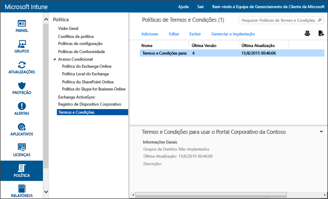

# Configurações de política de termos e condições no Microsoft Intune
Você pode implantar os termos e condições do Intune em grupos de usuários para explicar como o registro, o acesso aos recursos de trabalho e o aplicativo de Portal da Empresa afetam usuários e dispositivos. Os usuários devem aceitar estes termos e condições antes de poderem usar o Portal da Empresa para registrar e acessar o trabalho.

Você pode criar e implantar várias políticas que contêm termos e condições diferentes. Você pode também gerar versões dos mesmos termos e condições em idiomas diferentes e, em seguida, implantá-las aos grupos apropriados.

## Criar uma política de termos e condições

1.  No [Console de administração do Microsoft Intune](http://manage.microsoft.com), clique em **Política** &gt; **Termos e Condições**.

    

2.  Clique em **Adicionar** para criar uma nova política de termos e condições.

    Você também pode **Editar** ou **Excluir** uma política existente.

3.  Na página **Criar Termos e Condições**, especifique as seguintes informações:

    -   **Nome**&mdash;Um nome de política exclusivo exibido no console do Intune.

    -   **Descrição**&mdash;Detalhes que ajudarão a identificar a política no console do Intune.

    -   **Título**&mdash;O título que os usuários veem no Portal da Empresa.

    -   **Texto para explicar o que significa se o usuário aceitar**&mdash;O rótulo que os usuários veem quanto a sua aceitação. Por exemplo, "Eu concordo com os termos e condições".

4.  Ao terminar, clique em **Salvar**. A nova política é exibida no nó **Termos e Condições** do espaço de trabalho **Política**.

## Implantar uma política de termos e condições

1.  No [Console de administração do Microsoft Intune](http://manage.microsoft.com), clique em **Política** &gt; **Termos e Condições**.

2.  Na lista **Políticas de Termos e Condições**, selecione a política que você deseja implantar e clique em **Gerenciar Implantação**.

3.  Na caixa de diálogo **Gerenciar Implantação**, selecione os grupos de usuário nos quais você implantará a política e clique em **OK**.

    Quando os usuários de destino acessam o portal da empresa, o Intune exibe os termos e condições que você implantou. Os usuários devem aceitar esses termos antes de que possam obter acesso aos recursos da empresa.

## Monitorar uma política de termos e condições

1.  No [Console de administração do Microsoft Intune](http://manage.microsoft.com), clique em **Política** &gt; **Termos e Condições**.

2.  Na janela **Criar Novo Relatório**, clique em **Exibir Relatório**. O relatório será aberto, detalhando quais usuários que aceitaram os termos e condições que você implantou.

### Atualizações e controle de versão dos termos e condições
Quando edita uma política de termos e condições existente, você pode escolher qual comportamento ocorre ao implantar a política. Use o procedimento a seguir para ajudá-lo a atualizar as políticas de termos e condições existentes.

## Trabalhar com várias versões dos termos e condições

1.  No [Console de administração do Microsoft Intune](http://manage.microsoft.com), clique em **Política** &gt; **Termos e Condições**.

2.  Selecione a política de termos e condições que deseja editar e, em seguida, clique em **Editar**.

3.  Na página **Editar Termos e Condições**, faça as edições necessárias e especifique se essa nova versão requer que todos os usuários aceitem os termos e condições ou se somente novos usuários verão a nova versão.

    É recomendável aumentar o número de versão e exigir a aceitação sempre que você fizer alterações significativas em sua política de termos e condições. Se você estiver corrigindo erros de digitação ou alterando a formatação, por exemplo, mantenha o número de versão atual.

### Consulte também
[Gerenciar configurações e recursos em seus dispositivos com políticas do Microsoft Intune](manage-settings-and-features-on-your-devices-with-microsoft-intune-policies.md)

<!--HONumber=Oct16_HO3-->

