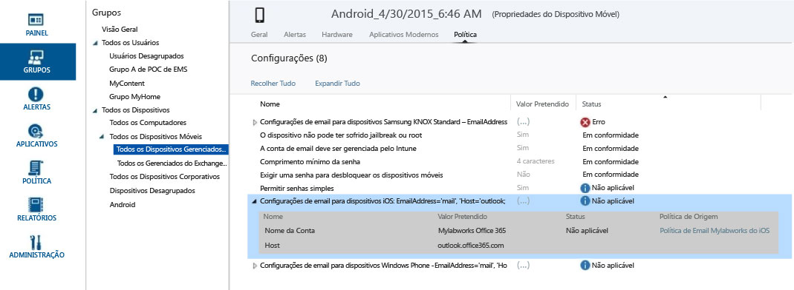

# Criar grupos para gerenciar usuários e dispositivos com o Microsoft Intune

Para criar e gerenciar grupos, use o espaço de trabalho **Grupos** no console de administração do Microsoft Intune. A página **Visão Geral dos Grupos** contém resumos de status que o ajudam a identificar e priorizar problemas que exigem a sua atenção para:

-   Alertas
-   Atualizações de software
-   Endpoint Protection
-   Política
-   Gerenciamento de software

Além disso, sua hierarquia de grupo é exibida com resumos de status para ajudar você a identificar e resolver problemas dos membros de um grupo selecionado.

> [!TIP]
> Quando estiver criando seus grupos, considere como você aplicará a política. Por exemplo, você pode ter políticas específicas para sistemas operacionais do dispositivo e políticas específicas para diferentes funções na sua organização, ou para Unidades organizacionais que você já definiu no Active Directory. Algumas pessoas consideram útil ter grupos de dispositivos específicos para iOS, Android e Windows, bem como grupos de usuários para cada função organizacional.
>
> É possível que você queira criar uma política padrão que se aplica a todos os grupos e dispositivos, para estabelecer os requisitos de conformidade básicos da sua empresa. Depois, crie políticas mais específicas para as categorias mais amplas de usuários e dispositivos, como políticas de email para cada um dos sistemas operacionais de dispositivos.
>
> Preste atenção ao nomear suas políticas para que você possa identificá-las facilmente mais tarde. Por exemplo, um bom nome descritivo para uma política é **Política de email do WP para toda a empresa**.
>
> Sempre que criar uma política restritiva, você desejará comunicá-la aos seus usuários. Sendo assim, depois de criar os grupos e políticas mais gerais, fique atento ao criar os grupos menores para reduzir a comunicação desnecessária.

## Criar um grupo de dispositivos

1.  No console de administração do Intune, escolha **Grupos** &gt; **Visão geral** &gt; **Criar Grupo**.

2.  Forneça um nome e uma descrição opcional para o grupo e selecione um grupo de dispositivos como o grupo pai. Escolha **Avançar**.

3.  Na página **Definir Critérios de Associação** , selecione o tipo de dispositivos que o grupo incluirá. Opções adicionais para configurar o grupo dependem do tipo de dispositivos que serão selecionados:

    -   **Computador:** especifique se deseja incluir todos os membros do grupo pai, as OU (Unidades Organizacionais) e os domínios que deseja incluir ou excluir. As informações de domínio e unidade organizacional de um computador são obtidas do inventário.

    -   **Dispositivos Móveis:** especifique para incluir somente os dispositivos móveis que são gerenciados pelo Intune, pelo Exchange ActiveSync ou por ambos.

    -   **Todos os dispositivos:** essa opção inclui todos os dispositivos sem exceções com base em critérios.

4.  Na página **Definir Associação Direta** , inclua ou exclua os dispositivos individuais especificados clicando em **Procurar**. Se for usada a opção para selecionar os dispositivos que não estão no grupo pai especificado, esses dispositivos serão automaticamente adicionados ao grupo pai.

5.  Na página **Resumo**, examine as ações que serão tomadas. Escolha **Concluir**.

O grupo recém-criado pode ser encontrado na lista **Grupos**, no espaço de trabalho **Grupos**, no grupo pai. Nesse local, também é possível editar ou excluir o grupo.

## Criar um grupo de usuários

1.  No console de administração do Intune, escolha **Grupos** &gt; **Visão geral** &gt; **Criar Grupo**.

2.  Forneça um nome e uma descrição opcional para o grupo e selecione um grupo de usuários como o grupo pai. Escolha **Avançar**.

3.  Na página **Definir Critérios de Associação** , especifique se deseja incluir todos os membros do grupo pai ou começar com um grupo vazio.  Você pode, então, incluir ou excluir membros com base nos **Grupos de segurança** de usuários que foram configurados manualmente no [centro de administração do Office 365](http://go.microsoft.com/fwlink/?LinkId=698854) ou que foram sincronizados no Active Directory local. Se a associação de um grupo de segurança for alterada, a associação de grupos de usuários baseada nesse grupo de segurança também poderá mudar.

    > [!IMPORTANT]
    > No momento, se o seu grupo incluir membros de grupos de segurança ou grupos de gerenciamento específicos, e você também excluir membros de grupos específicos, os membros incluídos inicialmente serão removidos. Para criar um grupo que tenha membros incluídos e excluídos, recomendamos que você primeiro crie um grupo pai com os membros incluídos e, em seguida, crie um grupo filho desse grupo, no qual você lista os membros excluídos. Você pode usar esse grupo filho conforme apropriado para a distribuição de aplicativos, perfis e políticas do Intune.

    > [!NOTE]
    > No Portal de Gerenciamento do Azure, você pode criar um grupo com base no gerenciador ao qual os usuários estão subordinados. O grupo será dinâmico, mudando conforme os funcionários são adicionados ou removidos da equipe do gerente no Active Directory do Azure. O procedimento para criar um grupo do Azure baseado em um gerente é descrito em [Usar atributos para criar regras avançadas](https://azure.microsoft.com/en-us/documentation/articles/active-directory-accessmanagement-groups-with-advanced-rules/) na seção chamada **Para configurar um grupo como grupo de "Gerente"**.

4.  Na página **Definir Associação Direta** , inclua ou exclua os usuários individuais especificados clicando em **Procurar**. Se for usada a opção para selecionar os usuários que não estão no grupo pai especificado, esses dispositivos serão automaticamente adicionados ao grupo pai. Na parte inferior da caixa de diálogo **Selecionar membros**, você encontrará a opção de adicionar um usuário manualmente. Isso é útil se você quiser adicionar um usuário que ainda não tem um dispositivo registrado.

5.  Na página **Resumo**, examine as ações que serão tomadas. Escolha **Concluir**.

O grupo recém-criado pode ser encontrado na lista **Grupos**, no espaço de trabalho **Grupos**, no grupo pai. Nesse local, também é possível editar ou excluir o grupo.

> [!TIP]
> Grupos de segurança são um ótimo recurso para preencher grupos de usuários. Como os grupos de segurança definem quem tem acesso a quais recursos, eles podem ser bem traduzidos em grupos de usuários do Intune. Os grupos de segurança que são sincronizados do Active Directory para o Azure Active Directory, ou criados diretamente no Azure Active Directory por meio do centro de administração do Office 365 ou do portal de administração do Azure, estão disponíveis para a criação de grupos de usuários no Intune.

## Personalizar exibições para funções administrativas
As exibições de grupo filtrado permitem que você personalize o que os administradores de exibição podem ver com base em suas funções e restringir quais grupos cada administrador de TI pode gerenciar. Isso pode ser útil quando:

-   Seus administradores de TI só devem ser capazes de implantar itens a dispositivos e usuários específicos.

-   Para exibir apenas os grupos relevantes para cada administrador de TI.

Você pode configurar as exibições de grupo filtrado para administradores de serviço no console do administrador do Intune. Para detalhes, confira [What to know before you start Microsoft Intune](/intune/get-started/what-to-know-before-you-start-microsoft-intune) (O que saber antes de iniciar o Microsoft Intune).

Após configurar a exibição de grupo filtrado para um administrador de serviços, esse administrador:

-   Poderá ver e selecione apenas os grupos que você especificou ao implantar softwares e políticas ou usar relatórios

-   Não receberá informações de status nas seguintes páginas do console de administração:

    -   **Visão geral do sistema**

    -   **Visão geral de grupos**

    -   **Visão geral do Endpoint Protection**

    -   **Visão geral de alertas**

    -   **Visão geral de softwares**

    -   **Visão Geral de Políticas**

### Configurar os modos de exibição de grupo filtrado

1.  No console de administração do Intune, escolha **Admin** &gt; **Gerenciamento de Administradores** &gt; **Administradores de Serviço**.

2.  Selecione o administrador de serviços para o qual você deseja filtrar grupos e clique em **Gerenciar grupos**.

3.  Na caixa de diálogo **Selecionar os grupos que serão visíveis para esse administrador de serviços** , adicione os grupos selecionados que o administrador de serviços poderá acessar e clique em **OK**.

Depois de configurar os modos de exibição do grupo filtrado, o administrador de TI será capaz de ver e selecionar apenas os grupos que você selecionou.

## Gerenciar seus grupos
Depois de criar os grupos, você continuará a gerenciá-los de acordo com as necessidades da sua organização.

Você pode editar o grupo para alterar seu nome e descrição e quem pertence ao grupo.

Você pode excluir um grupo que não atenda às necessidades da sua organização. Excluir um grupo não exclui os usuários que pertencem a esse grupo.

## Próximas etapas

### Verificar o design
Depois de configurar seus grupos e políticas, verifique as implicações práticas do seu design, examinando o **Valor pretendido** e o **Status**.

1. Selecione qualquer dispositivo de um grupo de dispositivos e percorra as categorias de informações na parte superior da tela.
2. Selecione **Política** . Você verá algo parecido com esta captura de tela das configurações de política de dispositivo do Android.

Cada política tem um **Valor Pretendido** e um **Status**. O valor pretendido é o que você quis realizar ao atribuir a política. O status é o que você, de fato, realizou quando todas as politicas que se aplicam ao dispositivo, bem como as restrições e requisitos de hardware e de sistema operacional, são consideradas em conjunto.  Na captura de tela, você pode ver dois exemplos claros:

-   **Permitir senhas simples** é definido como **Sim**, conforme mostrado na coluna **Valor Pretendido** , mas o **Status** é **Não aplicável**. Isso ocorre porque senhas simples não têm suporte para dispositivos Android.

-   Da mesma forma, o item de política expandido **Configurações de email para dispositivos iOS** não é aplicado a esse dispositivo porque se trata de um dispositivo Android.

> [!NOTE]
> Lembre-se de que, quando duas políticas com diferentes níveis de restrição aplicam-se ao mesmo dispositivo ou usuário, a política mais restritiva se aplica na prática.

<!--HONumber=Jun16_HO4-->

