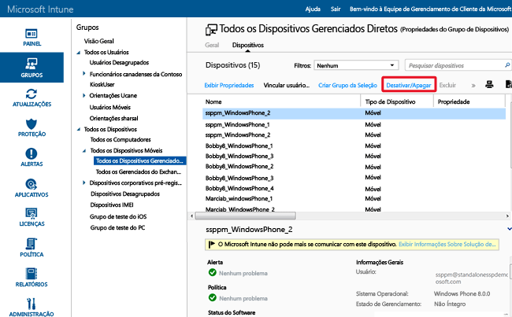

---
# required metadata

title: Usar apagamento remoto para ajudar a proteger dados | Microsoft Intune
description:
keywords:
author: NathBarn
manager: jeffgilb
ms.date: 04/28/2016
ms.topic: article
ms.prod:
ms.service: microsoft-intune
ms.technology:
ms.assetid: 8519e411-3d48-44eb-9b41-3e4fd6a93112

# optional metadata

#ROBOTS:
#audience:
#ms.devlang:
ms.reviewer: jeffgilb
ms.suite: ems
#ms.tgt_pltfrm:
#ms.custom:

---

# Ajude a proteger os dados com apagamento completo ou seletivo usando o Microsoft Intune
Da mesma forma que com dispositivos, há momentos em que você quer ou precisa [desativar aplicativos](retire-apps-using-microsoft-intune.md) que foram implantados em computadores e dispositivos móveis, porque eles não são mais necessários. Você também pode remover os dados da empresa do dispositivo. Para isso, o Intune fornece funcionalidades de apagamento completo e apagamento seletivo. Como os dispositivos móveis podem armazenar dados empresariais confidenciais e fornecer acesso a vários recursos empresariais, você pode emitir um comando de apagamento remoto de dados no dispositivo usando o Intune, para apagar um dispositivo roubado ou perdido. Além disso, os usuários podem emitir um comando de apagamento remoto de dados no dispositivo usando o Intune, para dispositivos de propriedade privada registrados no Intune.

  > [!NOTE]
  > Este tópico é apenas sobre limpeza de dispositivos gerenciados pelo Intune. Você também pode usar [a Versão Prévia do Portal do Azure](https://portal.azure.com) para [apagar dados empresariais dos aplicativos](wipe-managed-company-app-data-with-microsoft-intune.md).

## Apagamento completo

O **Apagamento Completo** restaura um dispositivo para suas configurações padrão de fábrica, removendo todas as configurações e os dados da empresa e do usuário. O dispositivo é removido do Intune. O apagamento completo é útil para redefinir um dispositivo antes de fornecê-lo a um novo usuário ou quando o dispositivo é roubado ou perdido.  **Tenha cuidado ao selecionar o apagamento completo. Os dados no dispositivo não podem ser recuperados**.

## Apagamento seletivo

O **apagamento seletivo** remove os dados da empresa, incluindo dados de MAM (gerenciamento de aplicativo móvel), quando aplicável, configurações e perfis de email do dispositivo. O apagamento seletivo deixa os dados pessoais do usuário no dispositivo. O dispositivo é removido do Intune. As tabelas a seguir descrevem, por plataforma, qual dado foi removido e o efeito nos dados que permaneceram no dispositivo após o apagamento seletivo.

**iOS**

|Tipo de dados|iOS|
|-------------|-------|
|Aplicativos da empresa e dados associados instalados pelo Intune.|Aplicativos são desinstalados. Dados de aplicativo da empresa são removidos.  Os dados dos aplicativos da Microsoft que usam o gerenciamento de aplicativos móveis são removidos. O aplicativo não é removido.|
|Configurações|As configurações definidas pela política do Intune não são mais impostas e os usuários podem alterar as configurações.|
|Configurações dos perfis de Wi-Fi e VPN|Removido|
|Configurações do perfil de certificado|Certificados removidos e revogados.|
|Agente de gerenciamento|O perfil de gerenciamento é removido.|
|Email|Os perfis de email provisionados usando o Intune são removidos e o email armazenado em cache no dispositivo é excluído.|
|Sair do Active Directory do Azure (AAD)|Registro do AAD removido|
|Contatos | Contatos sincronizados diretamente do aplicativo para o catálogo de endereços nativos são removidos.  Todos os contatos sincronizados do catálogo de endereços nativos com outra fonte externa não podem ser apagados.    Atualmente, há suporte somente para aplicativo do Outlook.

**Android**

|Tipo de dados|Android|Samsung Android KNOX|
|-------------|-----------|------------------------|
|Links da Web|Removidos.|Removido|
|Aplicativos Google Play não gerenciados|Os aplicativos e dados permanecem instalados|Os aplicativos e dados permanecem instalados|
|Aplicativos de linha de negócios não gerenciados|Os aplicativos e dados permanecem instalados|Os aplicativos são desinstalados e dados locais do aplicativo são removidos como resultado. Nenhum dado fora do aplicativo (cartão SD, etc.) é removido.|
|Aplicativos Google Play gerenciados|Dados de aplicativo são removidos. O aplicativo não é removido. Dados protegidos pela criptografia MAM fora do aplicativo (cartão SD, etc.) permanecem criptografados e inutilizáveis, mas não são removidos.|Dados de aplicativo são removidos. O aplicativo não é removido. Dados protegidos pela criptografia MAM fora do aplicativo (cartão SD, etc.) permanecem criptografados, mas não são removidos.|
|Aplicativos de linha de negócios gerenciadas|Dados de aplicativo são removidos. O aplicativo não é removido. Dados protegidos pela criptografia MAM fora do aplicativo (cartão SD, etc.) permanecem criptografados e inutilizáveis, mas não são removidos.|Dados de aplicativo são removidos. O aplicativo não é removido. Dados protegidos pela criptografia MAM fora do aplicativo (cartão SD, etc.) permanecem criptografados, mas não são removidos.|
|Configurações|As configurações definidas pela política do Intune não são mais impostas e os usuários podem alterar as configurações.|As configurações definidas pela política do Intune não são mais impostas e os usuários podem alterar as configurações.|
|Configurações dos perfis de Wi-Fi e VPN|Removido|Removido|
|Configurações do perfil de certificado|Certificados revogados, mas não removidos.|Certificados removidos e revogados.|
|Agente de gerenciamento|O privilégio de administrador do dispositivo é revogado.|O privilégio de administrador do dispositivo é revogado.|
|Email|Mensagens de email recebidas pelo aplicativo Microsoft Outlook para o aplicativo do Android são removidas.|Os perfis de email provisionados usando o Intune são removidos e o email armazenado em cache no dispositivo é excluído.|
|Sair do Active Directory do Azure (AAD)|Registro do AAD removido|Registro do AAD removido|
|Contatos | Contatos sincronizados diretamente do aplicativo para o catálogo de endereços nativos são removidos.  Todos os contatos sincronizados do catálogo de endereços nativos com outra fonte externa não podem ser apagados.    Atualmente, há suporte somente para aplicativo do Outlook.|Contatos sincronizados diretamente do aplicativo para o catálogo de endereços nativos são removidos.  Todos os contatos sincronizados do catálogo de endereços nativos com outra fonte externa não podem ser apagados.    Atualmente, há suporte somente para aplicativo do Outlook.

**Windows**

|Tipo de dados|Windows 8.1 (MDM) e Windows RT 8.1|Windows RT|Windows Phone 8 e Windows Phone 8.1|Windows 10|
|-------------|----------------------------------------------------------------|--------------|-----------------------------------------|--------|
|Aplicativos da empresa e dados associados instalados pelo Intune.|Arquivos protegidos por EFS terão sua chave revogada e o usuário não conseguirá abrir os arquivos.|Não removerão aplicativos da empresa.|Aplicativos instalados originalmente por meio do portal da empresa são desinstalados. Dados de aplicativo da empresa são removidos.|Os aplicativos são desinstalados e a chaves de sideload são removidas.|
|Configurações|As configurações definidas pela política do Intune não são mais impostas e os usuários podem alterar as configurações.|As configurações definidas pela política do Intune não são mais impostas e os usuários podem alterar as configurações.|As configurações definidas pela política do Intune não são mais impostas e os usuários podem alterar as configurações.|As configurações definidas pela política do Intune não são mais impostas e os usuários podem alterar as configurações.|
|Configurações dos perfis de Wi-Fi e VPN|Removido|Removido|Sem suporte|Removido|
|Configurações do perfil de certificado|Certificados removidos e revogados.|Certificados removidos e revogados.|Sem suporte|Certificados removidos e revogados.|
|Email|Remove o email habilitado para EFS que inclui o aplicativo Mail para emails e anexos de email do Windows.|Sem suporte|Os perfis de email provisionados usando o Intune são removidos e o email armazenado em cache no dispositivo é excluído.|Remove o email habilitado para EFS que inclui o aplicativo Mail para emails e anexos de email do Windows. Remove contas de email que foram provisionadas pelo Intune.|
|Sair do Active Directory do Azure (AAD)|Não|Não|Registro do AAD removido|Não aplicável. O Windows 10 não dá suporte para apagamento seletivo de dispositivos inseridos no Azure Active Directory|

### Apague um dispositivo remotamente usando o Console Administração do Intune

1.  Selecione os dispositivos a serem apagados. Você pode encontrá-los por usuário ou por dispositivo.

    -   **Por usuário:**

        1.  No [Console de administração do Intune](https://manage.microsoft.com/), escolha **Grupos** &gt; **Todos os Usuários**.

        2.  Escolha o nome do usuário cujo dispositivo móvel deseja apagar. Escolha **Exibir Propriedades**.

        3.  Na página **Propriedades** do usuário, escolha **Dispositivos** e selecione o nome do dispositivo móvel que deseja apagar. Use Ctrl+clique para selecionar vários dispositivos.

    -   **Por dispositivo:**

        1.  No [Console do administrador do Intune](https://manage.microsoft.com/), escolha **Grupos** &gt; **Todos os Dispositivos Móveis**.

      

        2.  Clique em **Dispositivos** e escolha o nome do dispositivo móvel que deseja apagar. Use Ctrl+clique para selecionar vários dispositivos.

2.  Escolher **Desativar/Apagar**.

3.  É exibida uma mensagem solicitando que você confirme se deseja retirar o dispositivo.

    -   Para realizar um **Apagamento seletivo**, que somente remove aplicativos e dados da empresa, escolha **Sim**.

    -   Para executar um **Apagamento Completo** que apaga todos os aplicativos e dados e retorna o dispositivo para as configurações padrão de fábrica, selecione **Apagar o dispositivo antes de desativar**. Essa ação se aplica a todas as plataformas, exceto Windows 8.1. **Não é possível recuperar dados removidos por um apagamento completo**.

Leva menos de 15 minutos para que um apagamento seja propagado para todos os tipos de dispositivo.

## Apagar conteúdo habilitado para EFS (sistema de arquivos com criptografia)
O apagamento seletivo de conteúdo criptografados com EFS é suportado pelo Windows 8.1 e Windows RT 8.1. O exemplo a seguir se aplica a um apagamento seletivo de conteúdo habilitado para EFS:

-   Somente os aplicativos e dados protegidos por EFS que usam o mesmo domínio de Internet como a conta do Intune são apagados seletivamente. Para obter mais informações, consulte [Apagamento Seletivo do Windows para Gerenciamento de Dados do Dispositivo](http://technet.microsoft.com/library/dn486874.aspx).

-   Se houver que qualquer alteração feita no domínio associado ao EFS, as alterações podem levar até 48 horas para que os aplicativos e dados usando o novo domínio possam ser apagados seletivamente.

-   Todos os domínios registrados com o Intune serão apagados.

Os dados e os aplicativos que atualmente têm suporte apagamento seletivo do EFS são:

-   Aplicativo de email para o Windows

-   Pastas de trabalho

-   Pastas e arquivos criptografados pelo EFS. Para obter mais informações, consulte as [Práticas recomendadas para Encrypting File System](http://support.microsoft.com/kb/223316).

-   Se sua organização mantém sua identidade no Active Directory, ele deve usar a ferramenta de sincronização de diretório (DirSync) para sincronizar informações em AAD para que o apagamento seletivo do EFS funcione corretamente.  Para obter mais informações sobre o DirSync, consulte o [Cenário de sincronização de diretório](http://technet.microsoft.com/library/dn441212.aspx) na documentação do Azure Active Directory.

## Monitorar ações de desativamento, apagamento e exclusão
Para obter um relatório de dispositivos que foram desativados, apagados ou excluídos, e quem executou a ação:

1.  No [Console de administração do Intune](https://manage.microsoft.com/), escolha **Relatórios** &gt; **Relatórios de Histórico de Dispositivo**.

2.  Forneça uma data de início e uma de término para o relatório e escolha **Exibir Relatório**.

### Consulte também
[Desativar dispositivos](retire-devices-from-microsoft-intune-management.md)

[Apagamento seletivo do Windows para o gerenciamento de dados de dispositivos](http://technet.microsoft.com/library/dn486874.aspx)

<!--HONumber=May16_HO4-->

