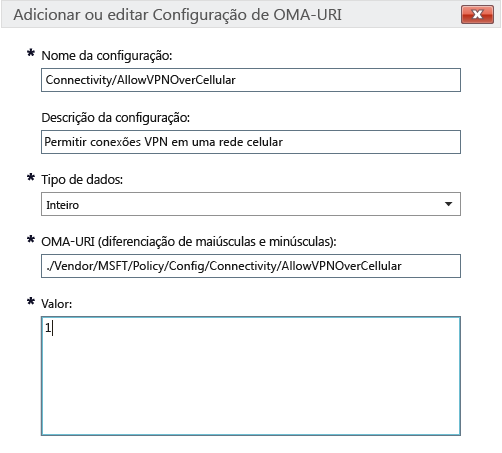

# Configurações de política do Intune para dispositivos Windows 10 no Microsoft Intune

Este tópico contém informações para ajudá-lo a entender as configurações de política do Intune que você pode usar para gerenciar dispositivos Windows 10. Leia este tópico junto com os procedimentos em [Gerenciar configurações e recursos em seus dispositivos com as políticas do Microsoft Intune](manage-settings-and-features-on-your-devices-with-microsoft-intune-policies) para definir configurações internas e personalizadas para dispositivos da Área de Trabalho do Windows 10 e Windows Mobile 10 registrados. Você não pode usar essas políticas com computadores que executam o [software de cliente do Intune PC](/intune/get-started/windows-pc-management-capabilities-in-microsoft-intune).

Você pode escolher entre dois tipos de política:

- **Política Personalizada** - use a **política personalizada** do Microsoft Intune para Windows 10 e Windows 10 Mobile para implantar configurações de OMA-URI (Open Mobile Alliance Uniform Resource Identifier), que podem ser usadas para controlar recursos em dispositivos. O Windows 10 disponibiliza várias configurações por meio do [CSP de Política (Provedor de Serviço de Configuração de Política)](https://technet.microsoft.com/itpro/windows/manage/how-it-pros-can-use-configuration-service-providers).
- **Política de configuração geral** - use esse tipo de política para selecionar as configurações da lista interna fornecida com o Microsoft Intune.

## Configurações de política personalizada

Forneça as seguintes configurações em uma política personalizada:

## &nbsp;&nbsp;&nbsp;Geral

Insira um nome e, opcionalmente, uma descrição para essa política para ajudar a identificá-la no console do Intune.

## &nbsp;&nbsp;&nbsp;Configurações de OMA-URI

Para cada configuração de OMA-URI que você desejar adicionar, insira as informações a seguir. Use a [referência de configurações de URI do Windows 10](/intune/deploy-use/windows-10-policy-settings-in-microsoft-intune#Windows-10-URI-settings) neste tópico para saber mais sobre as configurações que você pode usar: 

- **Nome da configuração** - insira um nome exclusivo para a configuração de OMA-URI para ajudar a identificá-la na lista de configurações.
- **Descrição da configuração** - opcionalmente, insira uma descrição para a configuração.
- **Tipo de dados** - escolha dentre:
    - **Cadeia de caracteres**
    - **Cadeia de caracteres (XML)**
    - **Data e hora**
    - **Inteiro**
    - **Ponto flutuante**
    - **Booliano**
- **OMA-URI (com distinção entre maiúsculas e minúsculas)** - especifique o OMA-URI para o qual você deseja fornecer uma configuração.
- **Valor** - especifique o valor para associar ao OMA-URI que você inseriu.

### Exemplo
Na captura de tela abaixo, a configuração **Connectivity/AllowVPNOverCellular** foi habilitada. Isso permite que um dispositivo Windows 10 abra uma conexão VPN quando estiver em uma rede de celular.

> 

## Configurações de URI do Windows 10
Use esta seção para saber mais sobre as configurações de OMA-URI que você pode configurar com uma **política personalizada do Windows 10**.

## &nbsp;&nbsp;&nbsp;Política

|Nome de política e URI|Detalhes|
|---------------|------------|-----------|
|**Permitir atualização automática** ./Vendor/MSFT/Policy/Config/Update/AllowAutoUpdate|Somente Área de trabalho **Tipo de dados:** inteiro **Valores:** **0** - **5** (padrão: **1**)|
|**Dia da instalação agendada** ./Vendor/MSFT/Policy/Config/Update/ScheduledInstallDay|Somente dispositivos móveis **Tipo de dados:** inteiro **Valores:** **0** - Todos os dias (padrão) **1** - domingo **2** - segunda-feira **3** - terça-feira **4** - quarta-feira **5** - quinta-feira **6** - sexta-feira **7** - Sábado|
|**Hora da instalação agendada** ./Vendor/MSFT/Policy/Config/Update/ScheduledInstallTime|Área de trabalho e dispositivos móveis **Tipo de dados:** inteiro **Valores:** **0** – **23** horas (**0** é meia-noite) (padrão: **3**)|
|**DeviceLock/AllowIdleReturnWithoutPassword** ./Vendor/MSFT/Policy/Config/DeviceLock/AllowIdleReturnWithoutPassword|Somente dispositivos móveis **Tipo de dados:** inteiro **Valores:** **0** - o usuário não pode definir o temporizador de período de carência de senha; o valor é definido como "sempre" **1** - o usuário pode definir o temporizador de período de carência de senha (padrão)|
|**WiFi/AllowWiFi** ./Vendor/MSFT/Policy/Config/WiFi/AllowWiFi|Somente dispositivos móveis **Tipo de dados:** inteiro **Valores:** **0** – não permitir **usar conexão Wi-Fi**. **1** – **Permitir o uso de conexão Wi-Fi** (padrão)|
|**WiFi/AllowInternetSharing** ./Vendor/MSFT/Policy/Config/WiFi/AllowInternetSharing|Área de trabalho e dispositivos móveis **Tipo de dados:** inteiro **Valores:** **0** – não permitir compartilhamento da Internet, **1** – permitir compartilhamento da Internet (padrão)|
|**WiFi/AllowAutoConnectToWiFiSenseHotspots** ./Vendor/MSFT/Policy/Config/WiFi/AllowAutoConnectToWiFiSenseHotspots|Área de trabalho e dispositivos móveis **Tipo de dados:** inteiro **Valores:** **0** – não permitido, **1** – permitido (padrão)|
|**WiFi/AllowManualWiFiConfiguration** ./Vendor/MSFT/Policy/Config/WiFi/AllowManualWiFiConfiguration|Somente dispositivos móveis **Tipo de dados:** inteiro **Valores:** **0** – não é permitida nenhuma conexão Wi-Fi fora do MDM provisionado. **1** – É permitido adicionar novas SSIDs de rede além das que há foram provisionadas pelo MDM (padrão)|
|**System/AllowLocation** ./Vendor/MSFT/Policy/Config/System/AllowLocation|Área de trabalho e dispositivos móveis **Tipo de dados:** inteiro **Valores:** **0** – não permitido, **1** – permitido (padrão)|
|**System/AllowTelemetry** ./Vendor/MSFT/Policy/Config/System/AllowTelemetry|Área de trabalho e dispositivos móveis **Tipo de dados:** inteiro **Valores:** **0** – Não permitido (configuração Enterprise somente) **1** – Limitado **2** – completo (padrão) **3** - completo e informações de diagnóstico|
|**System/AllowExperimentation** ./Vendor/MSFT/Policy/Config/System/AllowExperimentation|Área de trabalho e dispositivos móveis **Tipo de dados:** inteiro **Valores:** **0** – Não permitido **1**- Somente configurações (padrão) **2**- configurações e experimentação|
|**Security/AntiTheftMode** ./Vendor/MSFT/Policy/Config/Security/AntiTheftMode|Somente dispositivos móveis **Tipo de dados:** inteiro **Valores:** **0** - não permitir modo contra roubo **1** - Preferência do usuário (padrão)|
|**Connectivity/AllowUSBConnection** ./Vendor/MSFT/Policy/Config/Connectivity/AllowUSBConnection|Somente dispositivos móveis **Tipo de dados:** inteiro **Valores:** **0** – não permitido, **1** – permitido (padrão)|
|**System/AllowUserToResetPhone** ./Vendor/MSFT/Policy/Config/System/AllowUserToResetPhone|Somente dispositivos móveis **Tipo de dados:** inteiro **Valores:** **0** – não permitido, **1** – permitido (padrão)|
|**Connectivity/AllowCellularDataRoaming** ./Vendor/MSFT/Policy/Config/Connectivity/AllowCellularDataRoaming|Área de trabalho e dispositivos móveis **Tipo de dados:** inteiro **Valores:** **0** – não permitido, **1** – permitido (padrão)|
|**Connectivity/AllowVPNOverCellular** ./Vendor/MSFT/Policy/Config/Connectivity/AllowVPNOverCellular|Área de trabalho e dispositivos móveis **Tipo de dados:** inteiro **Valores:** **0** - a VPN não é permitida por celular **1** – A VPN pode usar qualquer conexão, incluindo celulares (padrão)|
|**Connectivity/AllowVPNRoamingOverCellular** ./Vendor/MSFT/Policy/Config/Connectivity/AllowVPNRoamingOverCellular|Somente dispositivos móveis **Tipo de dados:** inteiro **Valores:** **0** – não permitido, **1** – permitido (padrão)|
|**Connectivity/AllowVPNRoamingOverCellular** ./Vendor/MSFT/Policy/Config/Connectivity/AllowVPNRoamingOverCellular|Somente dispositivos móveis **Tipo de dados:** inteiro **Valores:** **0** – não permitido, **1** – permitido (padrão)|
|**Connectivity/AllowBluetooth** ./Vendor/MSFT/Policy/Config/Connectivity/AllowBluetooth|Área de trabalho e dispositivos móveis **Tipo de dados:** inteiro **Valores:** **0** – Não permitir que o usuário ative o Bluetooth. **1** – Reservado. O usuário pode ativar e configurar o Bluetooth (sem suporte no Windows Phone 8.1 para MDM, EAS, desktop Windows 10 ou Windows 10 Mobile) **2** - Permitido. O usuário pode ativar e configurar o Bluetooth (padrão)|
|**Experience/AllowScreenCapture** ./Vendor/MSFT/Policy/Config/Experience/AllowScreenCapture|Somente dispositivos móveis **Tipo de dados:** inteiro **Valores:** **0** – não permitido, **1** – permitido (padrão)|
|**Experience/AllowTaskSwitcher** ./Vendor/MSFT/Policy/Config/Experience/AllowTaskSwitcher|Somente dispositivos móveis **Tipo de dados:** inteiro **Valores:** **0** – não permitido, **1** – permitido (padrão)|
|**Experience/AllowVoiceRecording** ./Vendor/MSFT/Policy/Config/Experience/AllowVoiceRecording|Somente dispositivos móveis **Tipo de dados:** inteiro **Valores:** **0** – não permitido, **1** – permitido (padrão)|
|**Experience/AllowSyncMySettings** ./Vendor/MSFT/Policy/Config/Experience/AllowSyncMySettings|Somente dispositivos móveis **Tipo de dados:** inteiro **Valores:** **0** – não permitir roaming, **1** – permitir roaming (padrão)|
|**Experience/AllowManualMDMUnenrollment** ./Vendor/MSFT/Policy/Config/Experience/AllowManualMDMUnenrollment|Área de trabalho e dispositivos móveis **Tipo de dados:** inteiro **Valores:** **0** – não permitido, **1** – permitido (padrão)|
|**Accounts/AllowMicrosoftAccountConnection** ./Vendor/MSFT/Policy/Config/Accounts/AllowMicrosoftAccountConnection|Área de trabalho e dispositivos móveis **Tipo de dados:** inteiro **Valores:** **0** – não permitido, **1** – permitido (padrão)|
|**Accounts/AllowAddingNonMicrosoftAccountsManually** ./Vendor/MSFT/Policy/Config/Accounts/AllowAddingNonMicrosoftAccountsManually|Área de trabalho e dispositivos móveis **Tipo de dados:** inteiro **Valores:** **0** – não permitido, **1** – permitido (padrão)|
|**Security/AllowManualRootCertificateInstallation** ./Vendor/MSFT/Policy/Config/Security/AllowManualRootCertificateInstallation|Somente dispositivos móveis **Tipo de dados:** inteiro **Valores:** **0** – não permitido, **1** – permitido (padrão)|
|**Security/AllowAddProvisioningPackages** ./Vendor/MSFT/Policy/Config/Security/AllowAddProvisioningPackages|Área de trabalho e dispositivos móveis **Tipo de dados:** inteiro **Valores:** **0** – não permitido, **1** – permitido (padrão)|
|**Search/DisableBackoff** ./Vendor/MSFT/Policy/Config/Search/DisableBackoff|Área de trabalho e dispositivos móveis **Tipo de dados:** inteiro **Valores:** **0** (padrão), **1**|
|**Search/PreventRemoteQueries** ./Vendor/MSFT/Policy/Config/Search/PreventRemoteQueries|Área de trabalho e dispositivos móveis **Tipo de dados:** inteiro **Valores:** **0**, **1** (padrão)|
|**Search/AllowUsingDiacritics** ./Vendor/MSFT/Policy/Config/Search/AllowUsingDiacritics|Área de trabalho e dispositivos móveis **Tipo de dados:** inteiro **Valores:** **0** (padrão), **1**|
|**Search/AlwaysUseAutoLangDetection** ./Vendor/MSFT/Policy/Config/Search/AlwaysUseAutoLangDetection|Área de trabalho e dispositivos móveis **Tipo de dados:** inteiro **Valores:** **0** (padrão), **1**|
|**Search/DisableRemovableDriveIndexing** ./Vendor/MSFT/Policy/Config/Search/DisableRemovableDriveIndexing|Área de trabalho e dispositivos móveis **Tipo de dados:** inteiro **Valores:** **0** (padrão), **1**|
|**Search/PreventIndexingLowDiskSpaceMB** ./Vendor/MSFT/Policy/Config/Search/PreventIndexingLowDiskSpaceMB|Área de trabalho e dispositivos móveis **Tipo de dados:** inteiro **Valores:** **0**, **1** (padrão)|
|**Search/AllowIndexingEncryptedStoresOrItems** ./Vendor/MSFT/Policy/Config/Search/AllowIndexingEncryptedStoresOrItems|Área de trabalho e dispositivos móveis **Tipo de dados:** inteiro **Valores:** **0** (padrão), **1**|
|**Security/AllowRemoveProvisioningPackage** ./Vendor/MSFT/Policy/Config/Security/AllowRemoveProvisioningPackage|Área de trabalho e dispositivos móveis **Tipo de dados:** inteiro **Valores:** **0** – não permitido, **1** – permitido (padrão)|
|**Security/RequireProvisioningPackageSignature** ./Vendor/MSFT/Policy/Config/Security/RequireProvisioningPackageSignature|Área de trabalho e dispositivos móveis **Tipo de dados:** inteiro **Valores:** **0** (padrão), **1**|
|**AboveLock/AllowActionCenterNotifications** ./Vendor/MSFT/Policy/Config/AboveLock/AllowActionCenterNotifications|Área de trabalho e dispositivos móveis **Tipo de dados:** inteiro **Valores:** **0** – não permitido, **1** – permitido (padrão)|
|**TextInput/AllowIMENetworkAccess** ./Vendor/MSFT/Policy/Config/TextInput/AllowIMENetworkAccess|Somente Área de trabalho **Tipo de dados:** inteiro **Valores:** **0** – Não permitir O Open Extended Dictionary está desativado. Um usuário não pode: -Adicionar um novo Open Extended Dictionary -Adicionar um novo arquivo de configuração de integração de pesquisa -Usar o recurso do candidato de nuvem -Enviar uma palavra registrada pelo usuário. **1** - Permitir O Open Extended Dictionary pode ser adicionado e usado por padrão. Além disso, a função de integração de pesquisa pode ser usada por padrão. Um usuário pode: Usar o recurso do candidato de nuvem.|
|**TextInput/AllowIMELogging** ./Vendor/MSFT/Policy/Config/TextInput/AllowIMELogging|Somente Área de trabalho **Tipo de dados:** inteiro **Valores:** **0** - registro em log de erros de conversão desativado. **1** - registro em log de erros de conversão ativado (padrão)|
|**TextInput/AllowJapaneseNonPublishingStandardGlyph** ./Vendor/MSFT/Policy/Config/TextInput/AllowJapaneseNonPublishingStandardGlyph|Somente Área de trabalho **Tipo de dados:** inteiro **Valores:** **0** – não permitido, **1** – permitido (padrão)|
|**TextInput/AllowJapaneseIVSCharacters** ./Vendor/MSFT/Policy/Config/TextInput/AllowJapaneseIVSCharacters|Somente Área de trabalho **Tipo de dados:** inteiro **Valores:** **0** – não permitido, **1** – permitido (padrão)|
|**TextInput/AllowJapaneseUserDictionary** ./Vendor/MSFT/Policy/Config/TextInput/AllowJapaneseUserDictionary|Somente Área de trabalho **Tipo de dados:** inteiro **Valores:** **0** – não permitido **1** – permitido (padrão)|
|**TextInput/AllowJapaneseIMESurrogatePairCharacters** ./Vendor/MSFT/Policy/Config/TextInput/AllowJapaneseIMESurrogatePairCharacters|Somente Área de trabalho **Tipo de dados:** inteiro **Valores:** **0** – não permitido, **1** – permitido (padrão)|
|**TextInput/ExcludeJapaneseIMEExceptShiftJIS** ./Vendor/MSFT/Policy/Config/TextInput/ExcludeJapaneseIMEExceptShiftJIS|Somente Área de trabalho **Tipo de dados:** inteiro **Valores:** **0** - Nenhum caractere é filtrado (padrão) **1** - Todos, exceto caracteres Shift JIS, são filtrados|
|**TextInput/ExcludeJapaneseIMEExceptJIS0208** ./Vendor/MSFT/Policy/Config/TextInput/ExcludeJapaneseIMEExceptJIS0208|Somente Área de trabalho **Tipo de dados:** inteiro **Valores:** **0** - Nenhum caractere é filtrado (padrão) **1** - Todos, exceto caracteres JIS0208, são filtrados|
|**TextInput/ExcludeJapaneseIMEExceptJIS0208andEUDC** ./Vendor/MSFT/Policy/Config/TextInput/ExcludeJapaneseIMEExceptJIS0208andEUDC|Somente Área de trabalho **Tipo de dados:** inteiro **Valores:** **0** - Nenhum caractere é filtrado (padrão) **1** - Todos, exceto caracteres JIS0208 ou EUDC, são filtrados|
|**TextInput/AllowInputPanel** ./Vendor/MSFT/Policy/Config/TextInput/AllowInputPanel|Somente Área de trabalho **Tipo de dados:** inteiro **Valores:** **0** – não permitido, **1** – permitido (padrão)|
|**Bluetooth/AllowDiscoverableMode** ./Vendor/MSFT/Policy/Config/Bluetooth/AllowDiscoverableMode|Área de trabalho e dispositivos móveis **Tipo de dados:** inteiro **Valores:** **0** – não permitido, **1** – permitido (padrão)|
|**Bluetooth/AllowAdvertising** ./Vendor/MSFT/Policy/Config/Bluetooth/AllowAdvertising|Área de trabalho e dispositivos móveis **Tipo de dados:** inteiro **Valores:** **0** – não permitido, **1** – permitido (padrão)|
|**Settings/AllowDataSense** ./Vendor/MSFT/Policy/Config/Settings/AllowDataSense|Área de trabalho e dispositivos móveis **Tipo de dados:** inteiro **Valores:** **0** – não permitido, **1** – permitido (padrão)|
|**Settings/AllowVPN** ./Vendor/MSFT/Policy/Config/Settings/AllowVPN|Área de trabalho e dispositivos móveis **Tipo de dados:** inteiro **Valores:** **0** – não permitido, **1** – permitido (padrão)|
|**Settings/AllowWorkplace** ./Vendor/MSFT/Policy/Config/Settings/AllowWorkplace|Somente Área de trabalho **Tipo de dados:** inteiro **Valores:** **0** – não permitido, **1** – permitido (padrão)|
|**Settings/AllowDateTime** ./Vendor/MSFT/Policy/Config/Settings/AllowDateTime|Área de trabalho e dispositivos móveis **Tipo de dados:** inteiro **Valores:** **0** – não permitido, **1** – permitido (padrão)|
|**Settings/AllowLanguage** ./Vendor/MSFT/Policy/Config/Settings/AllowLanguage|Somente Área de trabalho **Tipo de dados:** inteiro **Valores:** **0** – não permitido, **1** – permitido (padrão)|
|**Settings/AllowRegion** ./Vendor/MSFT/Policy/Config/Settings/AllowRegion|Somente Área de trabalho **Tipo de dados:** inteiro **Valores:** **0** – não permitido, **1** – permitido (padrão)|
|**Settings/AllowSignInOptions** ./Vendor/MSFT/Policy/Config/Settings/AllowSignInOptions|Somente Área de trabalho **Tipo de dados:** inteiro **Valores:** **0** – não permitido, **1** – permitido (padrão)|
|**Settings/AllowYourAccount** ./Vendor/MSFT/Policy/Config/Settings/AllowYourAccount|Área de trabalho e dispositivos móveis **Tipo de dados:** inteiro **Valores:** **0** – não permitido, **1** – permitido (padrão)|
|**Settings/AllowPowerSleep** ./Vendor/MSFT/Policy/Config/Settings/AllowPowerSleep|Somente Área de trabalho **Tipo de dados:** inteiro **Valores:** **0** – não permitido, **1** – permitido (padrão)|
|**Settings/AllowAutoPlay** ./Vendor/MSFT/Policy/Config/Settings/AllowAutoPlay|Somente Área de trabalho **Tipo de dados:** inteiro **Valores:** **0** – não permitido, **1** – permitido (padrão)|
|**Experience/AllowCortana** ./Vendor/MSFT/Policy/Config/Experience/AllowCortana|Área de trabalho e dispositivos móveis **Tipo de dados:** inteiro **Valores:** **0** – não permitido, **1** – permitido (padrão)|
|**Search/SafeSearchPermissions** ./Vendor/MSFT/Policy/Config/Search/SafeSearchPermissions|Somente dispositivos móveis **Tipo de dados:** inteiro **Valores:** **0** – Restrita, filtragem mais elevada contra conteúdo adulto **1** – Moderada, filtragem moderada contra conteúdo somente para adultos (resultados da pesquisa válidos não serão filtrados - padrão)|
|**Experience/AllowCopyPaste** ./Vendor/MSFT/Policy/Config/Experience/AllowCopyPaste|Somente Área de trabalho **Tipo de dados:** inteiro **Valores:** **0** – não permitido, **1** – permitido (padrão)|
|**Forçar tamanho inicial** ./Vendor/MSFT/Policy/Config/Start/ForceStartSize|Somente dispositivos móveis **Tipo de dados:** inteiro **Valores:** **0** - permitir que o usuário altere o tamanho (padrão) **1** - forçar tela não inteira **2** - forçar tela inteira|
|**Update/RequireDeferUpgrade** ./Vendor/MSFT/Policy/Config/Update/RequireDeferUpgrade|Área de trabalho e dispositivos móveis **Tipo de dados:** inteiro **Valores:** **0**: não adiar atualização (mantém na ramificação atual, CB - padrão) **1**: possibilitar que atualizações sejam adiadas (dispositivo segue a ramificação atual para empresas, CBB e regras) Para obter detalhes, consulte: [Introdução ao período de manutenção do Windows 10](https://technet.microsoft.com/library/mt598226.aspx) [Plano de implantação do Windows 10](https://technet.microsoft.com/library/mt574241.aspx)|
|**Update/DeferUpdatePeriod** ./Vendor/MSFT/Policy/Config/Update/DeferUpdatePeriod|Área de trabalho e dispositivos móveis **Descrição:** política para adiar atualizações de software por até 4 semanas **Tipo de dados:** inteiro **Valores:**  **0**: aplicar atualizações imediatamente (padrão) **1**-**4**: número de semanas para adiar atualizações de software. Para obter detalhes, consulte: [Introdução ao período de manutenção do Windows 10](https://technet.microsoft.com/library/mt598226.aspx) [Plano de implantação do Windows 10](https://technet.microsoft.com/library/mt574241.aspx)|
|**Update/DeferUpgradePeriod** ./Vendor/MSFT/Policy/Config/Update/DeferUpgradePeriod|Área de trabalho e dispositivos móveis **Descrição:** política para adiar atualizações de recursos para até 8 meses **Tipo de dados:** inteiro **Valores:** **0**: aplicar atualizações imediatamente (padrão) **1**-**8**: número de meses para adiar atualizações de recursos. Para obter detalhes, consulte: [Introdução ao período de manutenção do Windows 10](https://technet.microsoft.com/library/mt598226.aspx) [Plano de implantação do Windows 10](https://technet.microsoft.com/library/mt574241.aspx)|
|**Update/PauseDeferrals** ./Vendor/MSFT/Policy/Config/Update/PauseDeferrals|Área de trabalho e dispositivos móveis **Descrição:** permite que um dispositivo pare de receber atualizações por cinco semanas. **Tipo de dados:** inteiro **Valores:** **0**: aplicar atualizações imediatamente (padrão) **1**: pausar atualizações (expira após 5 semanas)|

## &nbsp;&nbsp;&nbsp;Windows Defender

|Nome de política e URI|Detalhes|
|---------------|-----------|
|**AllowRealtimeMonitoring** ./Vendor/MSFT/Policy/Config/Defender/AllowRealtimeMonitoring|Somente Área de trabalho **Tipo de dados:** inteiro **Valores:** **0** – não permitido, **1** – permitido (padrão)|
|**AllowBehaviorMonitoring** ./Vendor/MSFT/Policy/Config/Defender/AllowBehaviorMonitoring|Somente Área de trabalho **Tipo de dados:** inteiro **Valores:** **0** – não permitido, **1** – permitido (padrão)|
|**AllowIntrusionPreventionSystem** ./Vendor/MSFT/Policy/Config/Defender/AllowIntrusionPreventionSystem|Somente Área de trabalho **Tipo de dados:** inteiro **Valores:** **0** – não permitido, **1** – permitido (padrão)|
|**AllowIOAVProtection** ./Vendor/MSFT/Policy/Config/Defender/AllowIOAVProtection|Somente Área de trabalho **Tipo de dados:** inteiro **Valores:** **0** – não permitido, **1** – permitido (padrão)|
|**AllowScriptScanning** ./Vendor/MSFT/Policy/Config/Defender/AllowScriptScanning|Somente Área de trabalho **Tipo de dados:** inteiro **Valores:** **0** – não permitido, **1** – permitido (padrão)|
|**AllowOnAccessProtection** ./Vendor/MSFT/Policy/Config/Defender/AllowOnAccessProtection|Somente Área de trabalho **Tipo de dados:** inteiro **Valores:** **0** – não permitido, **1** – permitido (padrão)|
|**RealTimeScanDirection** ./Vendor/MSFT/Policy/Config/Defender/RealTimeScanDirection|Somente Área de trabalho **Tipo de dados:** inteiro **Valores:** **0** – monitorar todos os arquivos (padrão) **1** – Monitorar arquivos de entrada **2** – Monitorar arquivos de saída|
|**DaysToRetainCleanedMalware** ./Vendor/MSFT/Policy/Config/Defender/DaysToRetainCleanedMalware|Somente Área de trabalho **Tipo de dados:** inteiro **Valores:** **0** - **90** – Representa por quanto tempo o malware será retido **Padrão:** **0** – mantém na pasta de quarentena para sempre e não remove automaticamente|
|**AllowUserUIAccess** ./Vendor/MSFT/Policy/Config/Defender/AllowUserUIAccess|Somente Área de trabalho **Tipo de dados:** inteiro **Valores:** **0** – não permitido, **1** – permitido (padrão)|
|**ScanParameter** ./Vendor/MSFT/Policy/Config/Defender/ScanParameter|Somente Área de trabalho **Tipo de dados:** inteiro **Valores:** **1** – Verificação rápida (padrão) **2** - varredura completa|
|**ScheduleScanDay** ./Vendor/MSFT/Policy/Config/Defender/ScheduleScanDay|Somente Área de trabalho **Tipo de dados:** inteiro **Valores:** **0** - Todos os dias (padrão) **1** - segunda-feira **2** - terça-feira **3** - quarta-feira **4** - quinta-feira **5** - sexta-feira **6** - sábado **7** - domingo **8** – Nenhuma varredura agendada|
|**ScheduleScanTime** ./Vendor/MSFT/Policy/Config/Defender/ScheduleScanTime|Somente Área de trabalho **Tipo de dados:** inteiro **Valores:** **0** - 12:00 AM **60** – 1:00 AM **120** – 2h00 (padrão) **180** – 3:00 AM **240** – 4:00 AM **300** – 5:00 AM **360** – 6:00 AM **420** – 7:00 AM **480** – 8:00 AM **540** – 9:00 AM **600** – 10:00 AM **660** – 11:00 AM **720** – 12:00 PM **780** – 1:00 PM **840** – 2:00 PM **900** – 3:00 PM **960** – 4:00 PM **1020** – 5:00 PM **1080** – 6:00 PM **1140** – 7:00 PM **1200** – 8:00 PM **1260** – 9:00 PM **1320** – 10:00 PM **1381** – Janela de manutenção|
|**ScheduleQuickScanTime** ./Vendor/MSFT/Policy/Config/Defender/ScheduleQuickScanTime|Somente Área de trabalho **Tipo de dados:** inteiro **Valores:** **0** - 12:00 AM **60** – 1:00 AM **120** – 2h00 (padrão) **180** – 3:00 AM **240** – 4:00 AM **300** – 5:00 AM **360** – 6:00 AM **420** – 7:00 AM **480** – 8:00 AM **540** – 9:00 AM **600** – 10:00 AM **660** – 11:00 AM **720** – 12:00 PM **780** – 1:00 PM **840** – 2:00 PM **900** – 3:00 PM **960** – 4:00 PM **1020** – 5:00 PM **1080** – 6:00 PM **1140** – 7:00 PM **1200** – 8:00 PM **1260** – 9:00 PM **1320** – 10:00 PM **1380** – 11:00 PM|
|**AVGCPULoadFactor** ./Vendor/MSFT/Policy/Config/Defender/AVGCPULoadFactor|Somente Área de trabalho **Tipo de dados:** inteiro **Valores:** **0** - **100** (padrão: **50**)|
|**AllowArchiveScanning** ./Vendor/MSFT/Policy/Config/Defender/AllowArchiveScanning|Somente Área de trabalho **Tipo de dados:** inteiro **Valores:** **0** – não permitido, **1** – permitido (padrão)|
|**AllowEmailScanning** ./Vendor/MSFT/Policy/Config/Defender/AllowEmailScanning|Somente Área de trabalho **Tipo de dados:** inteiro **Valores:** **0** – não permitido (padrão), **1** – permitido|
|**AllowFullScanRemovableDriveScanning** ./Vendor/MSFT/Policy/Config/Defender/AllowFullScanRemovableDriveScanning|Somente Área de trabalho **Tipo de dados:** inteiro **Valores:** **0** – não permitido (padrão), **1** – permitido|
|**AllowFullScanOnMappedNetworkDrives** ./Vendor/MSFT/Policy/Config/Defender/AllowFullScanOnMappedNetworkDrives|Somente Área de trabalho **Tipo de dados:** inteiro **Valores:** **0** – não permitido, **1** – permitido (padrão)|
|**AllowScanningNetworkFiles** ./Vendor/MSFT/Policy/Config/Defender/AllowScanningNetworkFiles|Somente Área de trabalho **Tipo de dados:** inteiro **Valores:** **0** – não permitido, **1** – permitido (padrão) – também é executado quando o RTP está ativado, caso definido como permitido|
|**SignatureUpdateInterval** ./Vendor/MSFT/Policy/Config/Defender/SignatureUpdateInterval|Somente Área de trabalho **Tipo de dados:** inteiro **Valores:** **0** – não verificar assinaturas em um intervalo **1** - verificar assinaturas a cada hora **2** – verificar a cada duas horas etc. **24** – verificar todos os dias **Valor padrão:** 8 – verificar a cada oito horas|
|**AllowCloudProtection** ./Vendor/MSFT/Policy/Config/Defender/AllowCloudProtection|Somente Área de trabalho **Tipo de dados:** inteiro **Valores:** **0** – não permitido, **1** – permitido (padrão)|
|**SubmitSamplesConsent** ./Vendor/MSFT/Policy/Config/Defender/SubmitSamplesConsent|Somente Área de trabalho **Tipo de dados:** inteiro **Valores:** **0** – Sempre solicitar (padrão) **1** – Enviar amostras seguras automaticamente **2** – Nunca enviar **3** – Enviar todas as amostras automaticamente|
|**ExcludedExtensions** ./Vendor/MSFT/Policy/Config/Defender/ExcludedExtensions|Somente Área de trabalho **Tipo de dados:** cadeia de caracteres **Valores:** *&lt;lista de extensões separadas por ponto e vírgula&gt;* por exemplo, **obj;lib** **Padrão:** nenhuma extensão excluída|
|**ExcludedPaths** ./Vendor/MSFT/Policy/Config/Defender/ExcludedPaths|Somente Área de trabalho **Tipo de dados:** cadeia de caracteres **Valores:** *&lt;lista dos caminhos separados por ponto e vírgula&gt;* Exemplo: **c:\test;c:\test1.exe** **Valor padrão:** nenhum caminho será excluído|
|**ExcludedProcesses** ./Vendor/MSFT/Policy/Config/Defender/ExcludedProcesses|Somente Área de trabalho **Tipo de dados:** cadeia de caracteres **Valores:** *&lt;lista dos caminhos separados por ponto e vírgula&gt;* Exemplo: **c:\test.exe;c:\test1.exe** **Valor padrão:** nenhum processo será excluído|

## &nbsp;&nbsp;&nbsp;Navegador de borda

|Nome de política e URI|Detalhes|
|---------------|------------|-----------|
|**Permitir navegador** ./Vendor/MSFT/Policy/Config/Browser/AllowBrowser|Somente dispositivos móveis **Tipo de dados:** inteiro **Valores:** **0**: navegação desativada, **1**: navegação ativada (padrão)|
|**AllowSearchSuggestionsinAddressBar** ./Vendor/MSFT/Policy/Config/Browser/AllowSearchSuggestionsinAddressBar|Área de trabalho e dispositivos móveis **Tipo de dados:** inteiro **Valores:** **0**: não mostrar sugestões, **1**: mostrar sugestões (padrão)|
|**SendIntranetTraffictoInternetExplorer** ./Vendor/MSFT/Policy/Config/Browser/SendIntranetTraffictoInternetExplorer|Somente Área de trabalho **Tipo de dados:** inteiro **Valores:** **0**: desabilitado (abrir sites da intranet no navegador  Microsoft Edge - padrão) **1** - habilitado (abrir sites de intranet no Internet Explorer).|
|**Permitir Não Rastrear** ./Vendor/MSFT/Policy/Config/Browser/AllowDoNotTrack|Área de trabalho e dispositivos móveis) **Tipo de dados:** inteiro **Valores:** **0** – desabilitado (DNT não enviado - padrão), **1** – habilitado (enviar DNT)|
|**Configurar o SmartScreen** ./Vendor/MSFT/Policy/Config/Browser/AllowSmartScreen|Área de trabalho e dispositivos móveis **Tipo de dados:** inteiro **Valores:** **0** – não permitir, **1** – permitir (padrão)|
|**Permitir pop-ups** ./Vendor/MSFT/Policy/Config/Browser/AllowPopups|Somente Área de trabalho **Tipo de dados:** inteiro **Valores:** **0** – bloquear pop-ups (padrão), **1** – permitir pop-ups|
|**Permitir cookies** ./Vendor/MSFT/Policy/Config/Browser/AllowCookies|Área de trabalho e dispositivos móveis **Tipo de dados:** inteiro **Valores:** **0** – permitir cookies de todos os sites (padrão) **1** – Bloquear somente os cookies de terceiros **2** – Bloquear todos os cookies|
|**Permitir salvar senha** ./Vendor/MSFT/Policy/Config/Browser/AllowPasswordManager|Área de trabalho e dispositivos móveis **Tipo de dados:** inteiro **Valores:** **0** – O gerenciador de senha é desabilitado;  **1** – O Gerenciador de senha é habilitado (padrão)|
|**Permitir Preenchimento Automático** ./Vendor/MSFT/Policy/Config/Browser/AllowAutofill|Somente Área de trabalho **Tipo de dados:** inteiro **Valores:** **0** – desabilitado (padrão), **1** – habilitado|
|**Configurar a lista de sites corporativos** ./Vendor/MSFT/Policy/Config/Browser/EnterpriseModeSiteList|Somente Área de trabalho **Tipo de dados:** cadeia de caracteres **Valores: **0** – não configurado **1** – usar lista de sites de modo empresarial do IE se configurado (padrão) **2** – especificar o local da lista de sites corporativos|

## Definições de política de configuração geral

Use a **política de configuração geral** do Microsoft Intune para Windows 10 para definir configurações internas para Windows 10 Desktop e dispositivos Windows 10 Mobile registrados. 

## &nbsp;&nbsp;&nbsp;Senha

|Nome da configuração|Informações adicionais (quando necessário)|
|----------------|----------------------|
|**Exigir uma senha para desbloquear dispositivos**|-|
|**Tipo de senha necessária**|Especifica se a senha deve ser apenas numérica ou alfanumérica|
|**Tipo de senha necessária** - **Número mínimo de conjuntos de caracteres**|Há quatro conjuntos de caracteres: minúsculas, maiúsculas, símbolos e números. Essa configuração especifica quantos desses conjuntos devem ser incluídos na senha.|
|**Comprimento mínimo da senha**|Aplica-se somente ao Windows 10 Mobile|
|**Número de falhas de logon repetidas permitido antes do dispositivo ser apagado**|Para dispositivos que executam o Windows 10: se o dispositivo tiver o BitLocker habilitado, ele será colocado no modo de recuperação do BitLocker depois que a entrada falhar pelo número de vezes que você especificar. Se o dispositivo não tiver o BitLocker habilitado, essa configuração não será aplicada. Para dispositivos que executam o Windows Mobile 10: depois que a entrada falhar pelo número de vezes que você especificar, o dispositivo será apagado.|
|**Minutos de inatividade antes que a tela se apague**|Especifica o período que um dispositivo deve permanecer ocioso antes da tela ser bloqueada.|
|**Expiração da senha (dias)**|Especifica o período após o qual a senha do dispositivo deve ser alterada.|
|**Lembrar de histórico de senha**|Especifica se você deseja impedir que o usuário final crie senhas usadas anteriormente.|
|**Lembrar histórico de senha** - **Evitar a reutilização de senhas anteriores**|Especifica o número de senhas usadas anteriormente que são lembradas pelo dispositivo.|
|**Exigir senha quando o dispositivo retorna de um estado ocioso**|Se habilitado, o usuário deve inserir uma senha para desbloquear o dispositivo. (Somente Windows 10 Mobile)|

## &nbsp;&nbsp;&nbsp;Criptografia

|Nome da configuração|Informações adicionais (quando necessário)|
|----------------|----------------------|
|**Exigir criptografia no dispositivo móvel**|Habilitar a criptografia em dispositivos de destino. (Somente Windows 10 Mobile)|

## &nbsp;&nbsp;&nbsp;System (sistema)

|Nome da configuração|Informações adicionais (quando necessário)|
|----------------|----------------------|
|**Permitir captura de tela**|Permite que o usuário capture a tela do dispositivo como uma imagem. (Somente Windows 10 Mobile)|
|**Permitir cancelamento de registro manual**|Permite que o usuário exclua manualmente a conta da empresa do dispositivo.|
|**Permitir instalação de certificado raiz manual**|Aplica-se ao Windows 10 Mobile|
|**Permitir que o diagnóstico e os dados de uso sejam enviados à Microsoft**|Os possíveis valores são:  **Não** - Nenhum dado é enviado para a Microsoft **Básico** - informações limitadas são enviadas à Microsoft **Avançado** - dados de diagnóstico avançados são enviados à Microsoft **Completo (recomendado)** - Envia os mesmos dados que **Avançado**, além de dados adicionais sobre o estado do dispositivo|

## &nbsp;&nbsp;&nbsp;Conta e sincronização

|Nome da configuração|Informações adicionais (quando necessário)|
|----------------|----------------------|---------------------|
|**Permitir conta da Microsoft**|Permite que o usuário associe uma conta da Microsoft ao dispositivo.|
|**Permitir a adição de contas não Microsoft manualmente**|Permite que o usuário adicione contas de email a dispositivos que não estão associados uma conta da Microsoft.|
|**Permitir a sincronização de configurações de contas da Microsoft**|Permitir usar configurações de dispositivo e aplicativo associadas a uma conta da Microsoft para sincronização entre dispositivos.|

## &nbsp;&nbsp;&nbsp;Microsoft Edge

|Nome da configuração|Informações adicionais (quando necessário)|
|----------------|----------------------|
|**Permitir navegador da web**|Permitir o uso do navegador da Web Microsoft Edge no dispositivo. (Somente Windows 10 Mobile)|
|**Permitir sugestões de pesquisa na barra de endereços**|Permite que seu mecanismo de pesquisa sugira sites à medida que você digita frases de pesquisa.|
|**Permitir envio de tráfego de intranet no Internet Explorer**|Permite que os usuários abram sites da intranet no Internet Explorer. (Somente Windows 10 Desktop)|
|**Permitir Não Rastrear**|Configura o navegador Microsoft Edge para enviar cabeçalhos Não Rastrear para sites visitados pelos usuários.|
|**Habilitar SmartScreen**|-|
|**Permitir script ativo**|Permite que scripts, como JavaScript, sejam executados no navegador Microsoft Edge.|
|**Permitir pop-ups**|Aplica-se somente à área de trabalho do Windows 10|
|**Permitir cookies**|-|
|**Permitir Preenchimento Automático**|Permite que os usuários possam alterar as configurações de preenchimento automático no navegador. (Somente Windows 10 Desktop)|
|**Permitir Gerenciador de Senhas**|Habilitar ou desabilitar o recurso de Gerenciamento de Senha do Microsoft Edge.|
|**Local do Enterprise Mode Site List**|Especifica onde encontrar a lista de sites que será aberta no modo Empresarial. Os usuários não podem editar essa lista. (Somente Windows 10 Desktop)|

## &nbsp;&nbsp;&nbsp;Aplicativos

|Nome da configuração|Informações adicionais (quando necessário)|
|----------------|----------------------|---------------------|
|**Permitir loja de aplicativo**|Aplica-se somente ao Windows 10 Mobile|

## &nbsp;&nbsp;&nbsp;Celular

|Nome da configuração|Informações adicionais (quando necessário)|
|----------------|----------------------|---------------------|
|**Permitir roaming de Dados**|Permita o roaming entre redes durante o acesso de dados.|
|**Permitir VPN por celular**|Controla se o dispositivo pode acessar conexões VPN quando conectado a uma rede celular.|
|**Permitir roaming de VPN por celular**|Controla se o dispositivo pode acessar conexões VPN quando estiver em roaming ou em uma rede celular.|

## &nbsp;&nbsp;&nbsp;Hardware

|Nome da configuração|Informações adicionais (quando necessário)|
|----------------|----------------------|
|**Permitir câmera**|-|
|**Permitir armazenamento removível**|Especifica se é possível usar dispositivos de armazenamento externo, como um cartão SD, no dispositivo.|
|**Permitir Wi-Fi**|Aplica-se somente ao Windows 10 Mobile|
|**Permitir compartilhamento de Internet**|Permitir usar o compartilhamento de conexão com a Internet no dispositivo móvel.|
|**Permitir configuração manual de Wi-Fi**|Controla se o usuário pode configurar suas próprias conexões Wi-Fi ou se podem usar somente as conexões configuradas por um perfil Wi-Fi. (Somente Windows 10 Mobile)|
|**Permitir conexão automática para liberar pontos de acesso Wi-Fi**|Permite que o dispositivo se conecte automaticamente a hotspots Wi-Fi gratuitos e aceite os possíveis termos e condições da conexão automaticamente.|
|**Permitir localização geográfica**|Especifica se o dispositivo pode usar informações de serviços de localização.|
|**Permitir NFC**|Permite que o dispositivo use sua funcionalidade de Comunicação a Curta Distância.|
|**Permitir Bluetooth**|-|
|**Permitir Bluetooth no modo detectável**|Permite que este dispositivo seja descoberto por outros dispositivos habilitados para Bluetooth.|
|**Permitir anúncios de Bluetooth**|Permite que os dispositivos recebam anúncios via Bluetooth.|
|**Permitir a redefinição do telefone**|Controla se o usuário pode redefinir seu dispositivo para os padrões de fábrica.|
|**Permitir conexão USB**|Controla se os dispositivos podem acessar dispositivos de armazenamento externo por meio de uma conexão USB.|
|**Permitir modo AntiTheft**|Configure se o modo Antitheft do Windows está habilitado.|

## &nbsp;&nbsp;&nbsp;Recursos

|Nome da configuração|Informações adicionais (quando necessário)|
|----------------|----------------------|---------------------|
|**Permitir copiar e colar**|Aplica-se somente ao Windows 10 Mobile|
|**Permitir gravação de voz**|Aplica-se somente ao Windows 10 Mobile|
|**Permitir Cortana**|Habilitar ou desabilitar a assistente de voz Cortana.|
|**Permitir notificações da central de ações**|Habilitar ou desabilitar notificações da central de ações na tela de bloqueio do dispositivo. (Somente Windows 10 Mobile)|

## &nbsp;&nbsp;&nbsp;Windows Defender

Todas as configurações são somente para Windows 10 Desktop.

|Nome da configuração|Informações adicionais (quando necessário)|
|-|-|
|**Permitir monitoramento em tempo real**|Habilita a verificação em tempo real de malware, spyware e outros softwares indesejados.|
|**Habilitar o monitoramento de comportamento**|Permite que o Defender verifique se há certos padrões de atividade suspeita nos dispositivos.|
|**Ativar o sistema de inspeção de rede**|O NIS(Sistema de Inspeção de Rede) ajuda a proteger dispositivos contra explorações baseadas em rede usando as assinaturas de vulnerabilidades conhecidas do Microsoft Endpoint Protection Center para ajudar a detectar e bloquear tráfego mal-intencionado.|
|**Verificar todos os downloads**|Controla se o Defender examina todos os arquivos baixados da Internet.|
|**Ativar a verificação de script**|Permite que o Defender examine scripts que são usados no Internet Explorer.|
|**Monitorar atividade de arquivo e programa**|Habilite essa configuração para permitir que o Defender monitore a atividade de arquivos e programas nos dispositivos.|
|**Dias para rastrear o malware resolvido**|Permite que o Defender continue a rastrear o malware resolvido pelo número de dias que especificado para que você possa examinar manualmente os dispositivos infectados anteriormente. Se você definir o número de dias para **0**, o malware permanecerá na pasta de Quarentena e não será removido automaticamente. |
|**Permitir acesso à interface do usuário cliente**|Controla se a interface do usuário do Windows Defender está oculta para usuários finais. Quando essa configuração é alterada, ela entrará em vigor na próxima vez em que o computador do usuário final for reiniciado.|
|**Agendar uma verificação rápida diária**|Permite agendar uma verificação rápida que ocorre diariamente na hora que você selecionar.|
|**Agendar uma verificação do sistema**|Permite agendar uma verificação de sistema completa ou rápida que ocorre regularmente no dia e hora que você selecionar.|
|**Limitar uso da CPU durante uma verificação**|Permite limitar a quantidade de CPU que as verificações têm permissão para usar (de **1** a **100**)|
|**Pesquisar arquivos mortos**|Permite que o Defender examine arquivos armazenados como arquivos Zip ou Cab.|
|**Verificar mensagens de email**|Permite que o Defender examine mensagens de email assim que elas chegarem ao dispositivo.|
|**Verificar unidades removíveis**|Permite que o Defender examine unidades removíveis, como cartões USB.|
|**Pesquisar unidades de rede mapeadas**|Permite que o Defender examine arquivos na unidade de rede mapeada. Se os arquivos na unidade forem somente leitura, o Defender não poderá o remover nenhum malware encontrado neles.|
|**Pesquisar arquivos abertos de pastas de rede compartilhadas**|Permite que o Defender examine arquivos em unidades de rede compartilhadas (por exemplo, aqueles acessados de um caminho UNC. Se os arquivos na unidade forem somente leitura, o Defender não poderá o remover nenhum malware encontrado neles.|
|**Intervalo de atualização de assinatura**|Especifique o intervalo no qual o Defender verificará novos arquivos de assinatura.|
|**Permitir proteção de nuvem**|Permite ou bloqueia o Microsoft Active Protection Service de receber informações sobre a atividade de malware de dispositivos gerenciados. Essas informações são usadas para aprimorar o serviço futuramente.|
|**Solicitar aos usuários o envio de amostras**|Controla se os arquivos que podem exigir mais análise pela Microsoft para determinar se são mal-intencionados sejam enviados automaticamente para a Microsoft.|
|**Detecção de aplicativos potencialmente indesejados**|Esta configuração pode ser usada para proteger os dispositivos Windows Desktop registrados contra a execução de software classificado pelo Windows Defender como potencialmente indesejado. Você pode se proteger esses aplicativos executando ou usando o modo de auditoria para relatar quando um aplicativo potencialmente indesejado é instalado.|
|**Arquivos e pastas a serem excluídos quando executar uma verificação ou usar uma proteção em tempo real**|Adicionar um ou mais arquivos e pastas como **C:\Path** ou **ProgramFiles%\Path\filename.exe** à lista de exclusões. Esses arquivos e pastas não serão incluídas em verificações em tempo real ou programadas.|
|**As extensões de arquivos a serem excluídas quando executar uma verificação ou usar uma proteção em tempo real**|Adicionar uma ou mais extensões de arquivo como **jpg** ou **txt** à lista de exclusões. Quaisquer arquivos com essas extensões não serão incluídos em verificações em tempo real ou programadas.|
|**Processos a serem excluídos quando executar uma verificação ou usar uma proteção em tempo real**|Adicionar um ou mais processos do tipo **.exe**, **.com**, ou **. scr** à lista de exclusões. Esses processos não serão incluídas em verificações em tempo real ou programadas.| 

## &nbsp;&nbsp;&nbsp;Updates

|Nome da configuração|Informações adicionais (quando necessário)|
|----------------|---------------|
|**Permitir atualizações automáticas**|Habilite essa configuração para permitir as atualizações automáticas. Em seguida, configure as seguintes configurações para controlar o comportamento de atualização: **Notificar o download** **Instalação automática no tempo de manutenção** **Instalação automática e reinicialização no tempo de manutenção** **Instalação automática e a reinicialização no horário agendado** **Observação:** quando esta opção é selecionada, você também pode definir as seguintes configurações: **Suprimir notificação para o usuário final** e **Definir dia da instalação de atualizações agendadas**. (Somente Windows 10 Desktop)|
|**Permitir recursos de pré-lançamento**|Permite que a Microsoft implante configurações e recursos de pré-lançamento em dispositivos Windows 10. Você pode selecionar para permitir apenas as configurações, ou todos os recursos e configurações de pré-lançamento a serem instalados.|

### Consulte também
[Gerenciar configurações e recursos em seus dispositivos com políticas do Microsoft Intune](manage-settings-and-features-on-your-devices-with-microsoft-intune-policies.md)

<!--HONumber=Oct16_HO1-->

