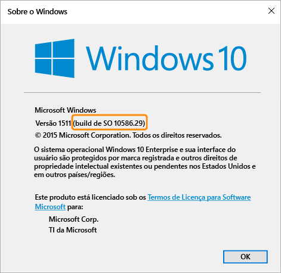

# Configurações de política de conformidade para dispositivos Windows no Microsoft Intune

As configurações de política descritas neste tópico se aplicam a dispositivos que executam o sistema operacional Windows. A versão específica do Windows com suporte é indicada nas seções a seguir.

Se você estiver procurando informações sobre outras plataformas, selecione uma das seguintes opções:
> [!div class="op_single_selector"]
- [Configurações da política de conformidade para dispositivos iOS](ios-compliance-policy-settings-in-microsoft-intune.md)
- [Configurações da política de conformidade para dispositivos Android](android-compliance-policy-settings-in-microsoft-intune.md)

## Configurações da política de conformidade para dispositivos Windows Phone
As configurações listadas nesta seção têm suporte no Windows Phone 8.1 e posterior.

## Configurações de segurança do sistema
### Senha
- **Exigir uma senha para desbloquear dispositivos móveis:**    defina esta opção como **Sim** para exigir que os usuários insiram uma senha antes que eles possam acessar o dispositivo.

- **Permitir senhas simples:**    defina como **Sim** para permitir que os usuários criem senhas simples, como '**1234**' ou '**1111**'.

-  **Comprimento mínimo da senha:** especifique o número mínimo de dígitos ou caracteres que a senha do usuário deve conter.
- **Tipo de senha exigido:** especifique se os usuários devem criar uma senha **Alfanumérica** ou **Numérica**.

  Para dispositivos que executam o Windows e são acessados com uma Conta da Microsoft, a política de conformidade não será avaliada corretamente se o comprimento mínimo da senha tiver mais de oito caracteres ou se o número mínimo de conjuntos de caracteres for maior que dois.

- **Número mínimo de caracteres configurado:** se **Tipo de Senha Necessário** é definido como **Alfanumérico**, essa configuração especifica o número mínimo de conjuntos de caracteres que a senha deve conter. Os quatro conjuntos de caracteres são:
  -   Letras minúsculas
  -   Letras maiúsculas
  -   Símbolos
  -   Números

  Definir um número mais alto para essa configuração exigirá que os usuários criem senhas mais complexas. Para dispositivos que executam o Windows e são acessados com uma Conta da Microsoft, a política de conformidade não será avaliada corretamente se o comprimento mínimo da senha tiver mais de oito caracteres ou se o número mínimo de conjuntos de caracteres for maior que dois.
- **Minutos de inatividade antes da senha ser necessária:** especifica o tempo ocioso antes que o usuário precise digitar novamente a senha.

- **Expiração da senha (dias):** selecione o número de dias antes que a senha do usuário expire e seja preciso criar uma nova.

- **Lembrar o histórico da senha:** use essa configuração em conjunto com **Evitar a reutilização de senhas anteriores** para impedir que o usuário crie senhas usadas anteriormente.

- **Evitar a reutilização de senhas anteriores:** se a opção **Lembrar o histórico de senha** estiver selecionada, especifique o número de senhas usadas anteriormente que não poderão ser reutilizadas.
- **Exigir uma senha quando o dispositivo retorna do estado ocioso:** essa configuração deve ser usada junto com **Minutos de inatividade antes da senha ser necessária**. Os usuários finais serão solicitados a inserir uma senha para acessar um dispositivo que está inativo durante o tempo especificado na configuração **Minutos de inatividade antes da senha ser necessária**.

  **Essa configuração só se aplica a dispositivos Windows 10 Mobile.**
### Criptografia
- **Exigir criptografia no dispositivo móvel:** defina esta opção como **Sim** para exigir que o dispositivo seja criptografado para conectar-se aos recursos.

## Configurações de integridade do dispositivo
- **Exigir que os dispositivos sejam relatados como íntegros:** você pode definir uma regra para exigir que os dispositivos **Windows 10 Mobile** sejam relatados como íntegros nas Políticas de Conformidade novas ou existentes.  Se essa configuração estiver habilitada, dispositivos Windows 10 serão avaliados por meio do HAS (Serviço de Atestado de Integridade) para os seguintes pontos de dados:
  -  **BitLocker habilitado**: quando o Bitlocker está ativado, o dispositivo é capaz de proteger os dados armazenados na unidade do acesso não autorizado quando o sistema é desligado ou entra no modo de hibernação. A Criptografia de Unidade de Disco Windows BitLocker criptografa todos os dados armazenados no volume do sistema operacional Windows. O BitLocker usa o TPM para ajudar a proteger o sistema operacional Windows e os dados de usuário e ajuda a garantir que um computador não foi violado, mesmo se tiver sido deixado sem supervisão, tiver sido perdido ou roubado. Se o computador estiver equipado com um TPM compatível, o BitLocker usará o TPM para bloquear as chaves de criptografia que protegem os dados. Consequentemente, as chaves não poderão ser acessadas até que o TPM verifique o estado do computador
  -  **Integridade de código habilitada:** a integridade de código é um recurso que valida a integridade de um driver ou arquivo do sistema cada vez que ele é carregado na memória. A integridade do código detecta se um arquivo de sistema ou de driver não assinado está sendo carregado no kernel, ou se um arquivo do sistema foi modificado por software mal-intencionado que está sendo executado por uma conta de usuário com privilégios de administrador.
  - **Inicialização Segura habilitada:** quando a Inicialização Segura está habilitada, o sistema é forçado a inicializar para um estado confiável de fábrica. Além disso, quando a Inicialização Segura é habilitada, os principais componentes usados para inicializar o computador devem ter assinaturas criptográficas corretas que são confiáveis para a organização que fabricou o dispositivo. O firmware UEFI confirma isso antes de permitir que o computador seja iniciado. Se todos os arquivos foram violados, interrompendo sua assinatura, o sistema não inicializará.

  Para obter informações sobre como funciona o serviço HAS, consulte [CSP do Estado de Integridade](https://msdn.microsoft.com/library/dn934876.aspx).
##  Configurações de propriedade do dispositivo
- **Sistema operacional mínimo exigido:** quando um dispositivo não atende ao requisito mínimo de versão do sistema operacional, ele será relatado como não compatível.
    É exibido um link com informações sobre como atualizar. O usuário final pode optar por atualizar seus dispositivos, quando então será possível acessar os recursos da empresa.

- **Versão do sistema operacional máxima permitida:** quando um dispositivo estiver usando uma versão de sistema operacional posterior àquela especificada na regra, o acesso aos recursos da empresa será bloqueado e o usuário será solicitado a entrar em contato com o administrador de TI. Até que haja uma alteração na regra para permitir a versão do SO, este dispositivo não pode ser usado para acessar recursos da empresa.

## Configurações da política de conformidade para computadores Windows
As configurações listadas nesta seção têm suporte em computadores Windows.
## Configurações de segurança do sistema
### Senha
- **Comprimento mínimo da senha:** - Com suporte no Windows 8.1.

  Especifique o número mínimo de dígitos ou caracteres que a senha do usuário deve conter.

  Para dispositivos acessados com uma Conta da Microsoft, a política de conformidade não será avaliada corretamente se o **Comprimento mínimo da senha** tiver mais de oito caracteres ou se o **Número mínimo de conjuntos de caracteres** for maior do que dois.

- **Tipo de senha necessária:** - Com suporte no Windows RT, Windows RT 8.1 e Windows 8.1

  Especifique se os usuários devem criar uma senha **Alfanumérica** ou **Numérica**.

- **Número mínimo de conjuntos de caracteres:** - Com suporte no Windows RT, Windows RT 8.1 e Windows 8.1. Se **Tipo de Senha Necessário** é definido como **Alfanumérico**, essa configuração especifica o número mínimo de conjuntos de caracteres que a senha deve conter. Os quatro conjuntos de caracteres são:
  -   Letras minúsculas
  -   Letras maiúsculas
  -   Símbolos
  -   Números: definir um número mais alto para essa configuração exigirá que os usuários criem senhas mais complexas.

  Para dispositivos acessados com uma Conta da Microsoft, a política de conformidade não é avaliada corretamente se o **Comprimento mínimo da senha** tiver mais de oito caracteres ou se o **Número mínimo de conjuntos de caracteres** for maior do que dois.
- **Minutos de inatividade antes da senha ser necessária:** - Com suporte no Windows RT, Windows RT 8.1 e Windows 8.1

  Especifique o tempo ocioso antes que o usuário precise inserir novamente sua senha.

- **Expiração da senha (dias):** - Com suporte no Windows RT, Windows RT 8.1 e Windows 8.1.

  Selecione o número de dias antes que a senha do usuário expire e seja preciso criar uma nova.

- **Lembrar histórico de senha:** - Com suporte no Windows RT, Windows RT e Windows 8.1.

  Use essa configuração em conjunto com **Evitar a reutilização de senhas anteriores** para impedir que o usuário crie senhas usadas anteriormente.
- **Evitar a reutilização de senhas anteriores:** - Com suporte no Windows RT, Windows RT 8.1 e Windows 8.1

  Se a opção **Lembrar Histórico de Senha** estiver selecionada, especifique o número de senhas usadas anteriormente que não poderão ser reutilizadas.

## Configurações de integridade do dispositivo
- **Exigir que os dispositivos sejam relatados como íntegros:** - Com suporte em dispositivos Windows 10.
Você pode definir uma regra para exigir que os dispositivos Windows 10 sejam relatados como íntegros nas Políticas de Conformidade novas ou existentes.  Se essa configuração estiver habilitada, dispositivos Windows 10 serão avaliados por meio do HAS (Serviço de Atestado de Integridade) para os seguintes pontos de dados:
  -  **BitLocker habilitado**: quando o Bitlocker está ativado, o dispositivo é capaz de proteger os dados armazenados na unidade do acesso não autorizado quando o sistema é desligado ou entra no modo de hibernação. A Criptografia de Unidade de Disco Windows BitLocker criptografa todos os dados armazenados no volume do sistema operacional Windows. O BitLocker usa o TPM para ajudar a proteger o sistema operacional Windows e os dados de usuário e ajuda a garantir que um computador não foi violado, mesmo se tiver sido deixado sem supervisão, tiver sido perdido ou roubado. Se o computador estiver equipado com um TPM compatível, o BitLocker usará o TPM para bloquear as chaves de criptografia que protegem os dados. Consequentemente, as chaves não poderão ser acessadas até que o TPM verifique o estado do computador
  -  **Integridade de código habilitada:** a integridade de código é um recurso que valida a integridade de um driver ou arquivo do sistema cada vez que ele é carregado na memória. A integridade do código detecta se um arquivo de sistema ou de driver não assinado está sendo carregado no kernel, ou se um arquivo do sistema foi modificado por software mal-intencionado que está sendo executado por uma conta de usuário com privilégios de administrador.
  - **Inicialização Segura habilitada:** quando a Inicialização Segura está habilitada, o sistema é forçado a inicializar para um estado confiável de fábrica. Além disso, quando a Inicialização Segura é habilitada, os principais componentes usados para inicializar o computador devem ter assinaturas criptográficas corretas que são confiáveis para a organização que fabricou o dispositivo. O firmware UEFI confirma isso antes de permitir que o computador seja iniciado. Se todos os arquivos foram violados, interrompendo sua assinatura, o sistema não inicializará.
  - **Antimalware de Início Antecipado habilitado:** o ELAM (Antimalware de Início Antecipado) fornece proteção para os computadores na sua rede quando eles são iniciados e antes de inicializar drivers de terceiros.

  Para obter informações sobre como funciona o serviço HAS, consulte [CSP do Estado de Integridade](https://msdn.microsoft.com/library/dn934876.aspx).

## Configurações de propriedade do dispositivo
- **Sistema operacional mínimo necessário:** - Com suporte no Windows 8.1 e no Windows 10.

  Especifique o número de major.minor.build aqui. O número de versão deve corresponder à versão retornada pelo comando winver.

  Quando um dispositivo tiver uma versão mais antiga que a versão de sistema operacional especificada, ele será relatado como não compatível. É exibido um link com informações sobre como atualizar. O usuário final pode optar por atualizar seus dispositivos, quando então será possível acessar os recursos da empresa.

- **Sistema operacional máximo permitido:** - Com suporte no Windows 8.1 e no Windows 10.

  Quando um dispositivo estiver usando uma versão de sistema operacional posterior àquela especificada na regra, o acesso aos recursos da empresa será bloqueado e o usuário será solicitado a entrar em contato com o administrador de TI. Até que haja uma alteração na regra para permitir a versão do SO, este dispositivo não pode ser usado para acessar recursos da empresa.

Para localizar a versão do sistema operacional que deve ser usada para as configurações **Sistema operacional mínimo necessário** e **Versão de sistema operacional máxima permitida**, execute o comando **winver** no prompt de comando. O comando winver retorna a versão relatada do sistema operacional.
- Computadores com Windows 8.1 retornam a versão **6.3**.    Se a regra de versão do sistema operacional for definida como Windows 8.1 para Windows, então o dispositivo será relatado como não compatível mesmo que o dispositivo tenha o Windows 8.1.
- Em computadores que executam o Windows 10, a versão deve ser definida como “10.0” + o número de build do sistema operacional retornado pelo comando winver. Por exemplo, poderia ser algo como 10.0.10586.
> 

<!--HONumber=Jun16_HO4-->

