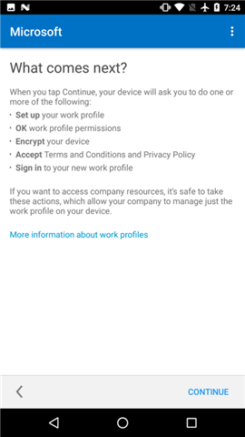
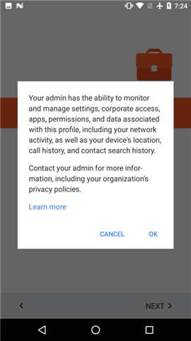

# Criar um perfil de trabalho e registrar seu dispositivo no Intune

Você configura um perfil de trabalho no seu dispositivo para acessar emails, aplicativos e arquivos de trabalho ou escola. Para saber mais, consulte [O que acontece quando você cria um perfil de trabalho](what-happens-when-you-create-a-work-profile-android.md).

Para criar um perfil de trabalho:

1.  Na tela de **Boas-vindas** do Portal da Empresa do Android, toque em **Entrar** e entre com sua conta corporativa ou de estudante. Se você ainda não instalou o aplicativo gratuito, baixe e instale-o por meio do [Google Play](http://play.google.com/store/apps/details?id=com.microsoft.windowsintune.companyportal).

    

2. Na tela **Configuração de Acesso da Empresa**, toque em **Iniciar**.

    

3.  Na tela **Por que criar um perfil de trabalho?**, leia sobre o que você poderá fazer e, em seguida, toque em **CONTINUAR**.

    

4.  Examine uma lista do que o administrador de TI pode ou não ver em seu dispositivo e toque em **CONTINUAR**.

    

5.  Na tela **O que vem em seguida**, leia sobre o que acontecerá em seguida e toque em **CONTINUAR**.

    

6. Na tela **Configurar perfil de trabalho**, toque em **AVANÇAR** para permitir que o aplicativo do Portal da Empresa acesse o perfil de trabalho.

    

7. Examine a tela do Google que descreve o que o administrador de TI pode fazer quando você cria um perfil de trabalho e, em seguida, toque em **OK**.

    

    Você verá algumas mensagens com os dizeres: “Configurando seu perfil de trabalho” e “Registrando seu dispositivo”.

8. Na tela **Você está quase lá!**, toque o ícone do aplicativo do Portal da Empresa que tem uma notificação.

    

9. Na tela de **Boas-vindas** do Portal da Empresa do Android, toque em **Entrar** e entre com sua conta corporativa ou de estudante.

10. Na tela **Configuração de Acesso da Empresa**, observe que a Configuração do Perfil de Trabalho está concluída e, em seguida, toque em **CONTINUAR**.

    

    A mensagem “Registrando seu dispositivo” aparecerá brevemente.

11. Quando a tela **Configuração de Acesso da Empresa** mostrar que tudo foi configurado corretamente, toque em **CONTINUAR**. 

    

12. Na tela **Configuração de Acesso da Empresa completa**, toque em **CONCLUÍDO**.

    

    Você será direcionado para a Play Store for Work, na qual é possível obter aplicativos da empresa.

    

Ainda precisa de ajuda? Entre em contato com seu administrador de TI. Para obter as informações de contato, consulte o [site do Portal da Empresa](http://portal.manage.microsoft.com).

<!--HONumber=Oct16_HO2-->

