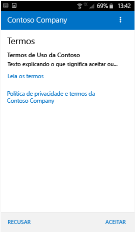
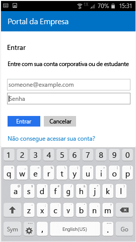
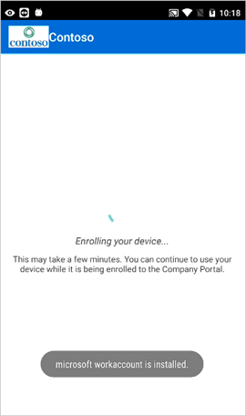

# Registrar seu dispositivo Android no Intune

Se sua empresa ou escola usa o Microsoft Intune, você pode registrar seu dispositivo Android para obter acesso a email, arquivos e outros recursos corporativos. O registro dos dispositivos permite que o departamento de TI gerencie recursos corporativos ou de estudante e os mantenha seguros, dando-lhe a liberdade de usar seu dispositivo preferido para realizar o trabalho. Para saber mais sobre registro, consulte [What happens when I install and Company Portal app and enroll my device? (O que acontece quando instalo o aplicativo Portal da Empresa e registro meu dispositivo?)](what-happens-if-you-install-the-Company-Portal-app-and-enroll-your-device-in-intune-android.md).

Essas instruções de registro são para dispositivos Samsung Knox Android e dispositivos Android "nativos" (não Samsung Knox). Para determinar se você tem um dispositivo Samsung Knox, vá para **Configurações** &gt; **Sobre o dispositivo**. Se você não vê a "versão do KNOX" listada, tem um dispositivo Android nativo.

Antes ou após o registro, você poderá ser solicitado a escolher uma categoria que melhor descreva como você usa o dispositivo. O administrador de TI usa essa categoria para ajudar a determinar quais aplicativos você terá acesso.

Se você receber um erro ao tentar registrar o dispositivo no Intune, poderá [enviar erros de registro ao administrador de TI](send-enrollment-errors-to-your-it-administrator-android.md).

**Para registrar seu dispositivo Android:**

1.  Instale o aplicativo gratuito Portal da Empresa do Intune do [Google Play](http://play.google.com/store/apps/details?id=com.microsoft.windowsintune.companyportal).

2.  Abra o aplicativo Portal da Empresa do Microsoft Intune.

3.  Na tela de **Boas-vindas** do Portal da Empresa, toque em **Entrar** e entre com sua conta corporativa ou de estudante.

       

4.  Se o seu administrador de TI tiver configurado os termos e condições da empresa, toque em **ACEITAR** para aceitar os termos.

    

5.  Conecte-se no aplicativo Portal da Empresa, usando sua conta e senha corporativa ou de estudante e, em seguida, toque em **Entrar**.

    

6.  Na tela **Configuração de Acesso da Empresa**, toque em **Iniciar**.

    

7.  Na tela **Por que registrar seu dispositivo?** leia sobre o que você pode fazer ao registrar o dispositivo e, em seguida, toque em **CONTINUAR**.

    

8.  Examine uma lista do que o administrador de TI pode ou não ver em seu dispositivo e toque em **CONTINUAR**.

    

9.  Na tela **O que vem em seguida**, leia sobre o que acontece durante o registro e, em seguida, toque em **REGISTRAR**.

    

10.  Se você estiver usando o Android 6.0 ou posterior, execute esta etapa. Caso contrário, vá para a próxima etapa.

    Se o administrador de TI tiver configurado algumas políticas, você poderá ver as seguintes mensagens:
    -   **Permitir que o Portal da Empresa faça e gerencie chamadas telefônicas?**

    

    Se você vir essa mensagem, toque em **PERMITIR**. É seguro tocar em PERMITIR, porque a **Microsoft nunca faz nem gerencia suas chamadas telefônicas**! O Google controla o texto da mensagem, e a Microsoft não pode alterá-lo. Quando você permite o acesso, tudo o que faz é permitir que o dispositivo grave logs de dados no cartão SD do dispositivo, o que permite que você mova esses logs usando um cabo USB.

    Se você negar acesso, a mensagem será exibida novamente na próxima vez que você entrar no Portal da Empresa, mas você pode desligar as mensagens futuras tocando na caixa de seleção **Nunca Perguntar Novamente**.  Se você decidir posteriormente permitir o acesso, acesse **Configurações** &gt; **Aplicativos** &gt; **Portal da Empresa** &gt; **Permissões** &gt; **Telefone** e ative a permissão.

    -   **Permitir que o Portal da Empresa acesse seus contatos?**

    

    Se você vir essa mensagem, toque em **PERMITIR**. É seguro tocar em PERMITIR, porque a **Microsoft nunca acessa seus contatos!** O Google controla o texto da mensagem, e a Microsoft não pode alterá-lo. Quando você permitir acesso, ele só permitirá que o aplicativo do Portal da Empresa crie, use e gerencie sua conta corporativa.

    Se você negar o acesso, a mensagem será exibida novamente na próxima vez que você tocar em **Enviar Dados**, mas você poderá desligar mensagens futuras tocando na caixa de seleção **Nunca perguntar novamente**. Se você decidir posteriormente permitir o acesso, acesse **Configurações** &gt; **Aplicativos** &gt; **Portal da Empresa** &gt; **Permissões** &gt; **Armazenamento** e ativar a permissão.

11.  Na tela **Ativar administrador do dispositivo**, clique em **Ativar**.

    

12.  Siga os prompts para inserir um PIN ou senha. Se já tiver configurado um PIN ou senha neste dispositivo, você não verá esta tela ou será solicitado a inserir um novo PIN ou senha.

    

13.  Se você estiver usando um dispositivo Samsung Knox, toque em **Confirmar** e você verá uma mensagem informando que seu dispositivo está sendo registrado. Se você estiver usando um dispositivo Android nativo, basta observar a tela abaixo mostrando que seu dispositivo está sendo registrado.

    

    Esta tela mostra que seu dispositivo está sendo registrado.

    

14. Quando a tela **Configuração de Acesso da Empresa** for exibida, toque em **CONTINUAR**. Se você ver uma mensagem indicando que o dispositivo está fora de conformidade, siga as instruções para corrigir o problema e, em seguida, toque em **CONTINUAR**.

      

11. Na tela **Configuração de Acesso da Empresa completa**, toque em **CONCLUÍDO**. Agora, seu dispositivo está registrado.

    

Antes de instalar os aplicativos da empresa, acesse **Configurações** &gt; **Segurança**, e ative **Fontes Desconhecidas**. Se não ativar essa opção antes de tentar instalar os aplicativos, você verá a mensagem "Instalação bloqueada". Por motivos de segurança, seu dispositivo está definido para bloquear as instalações de aplicativos obtidos de fontes desconhecidas." Você pode tocar em **Configurações** na caixa de diálogo de erro para ir para a opção **Fontes Desconhecidas**.

Ainda precisa de ajuda? Entre em contato com seu administrador de TI (consulte o [site do Portal da Empresa](http://portal.manage.microsoft.com) para obter as informações de contato) ou escreva para a equipe de Android da Microsoft em wintunedroidfbk@microsoft.com.

<!--HONumber=Aug16_HO5-->

