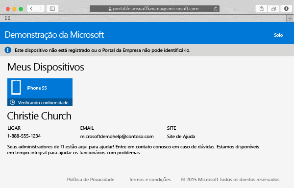

---
# required metadata

title: Registrar seu dispositivo Mac OS X no Intune| Microsoft Intune
description:
keywords:
author: Staciebarker
manager: jeffgilb
ms.date: 05/30/2016
ms.topic: article
ms.prod:
ms.service: microsoft-intune
ms.technology:
ms.assetid: 58eb0e7a-1321-4c66-a281-88fb01e72c1c

# optional metadata

ROBOTS:
#audience:
#ms.devlang:
ms.reviewer: esmich
ms.suite: ems
#ms.tgt_pltfrm:
#ms.custom:

---

# Registrar seu dispositivo Mac OS X no Intune

Registrar seu dispositivo Mac OS X permite que você acesse a rede da empresa, email e arquivos de trabalho e permite que você obtenha aplicativos da empresa. Para obter mais informações sobre o que acontece quando você registra seu dispositivo, consulte [What happens if you install the Company Portal app and enroll your device in Intune?](what-happens-if-you-install-the-company-portal-app-and-enroll-your-device-in-intune-ios.md) (O que acontecerá se você instalar o aplicativo do Portal da Empresa e registrar seu dispositivo no Intune?).

Se você estiver tentando registrar um dispositivo iOS, consulte [Enroll your iOS device in Intune](enroll-your-device-in-intune-ios.md) (Registrar seu dispositivo iOS no Intune).

Registrar seu dispositivo Mac OS X no Intune:

1.  Usando um navegador Safari, abra o [site do Portal da Empresa](https://portal.manage.microsoft.com), e toque na barra de notificação.

2.  Toque em **Este dispositivo não está registrado ou o Portal da Empresa não pode identificá-lo**.

     

3.  Toque **Instalar** para registrar seu dispositivo.

     

4.  Na caixa de diálogo **Instalar o Perfil de Gerenciamento**, toque **Instalar**. Se uma caixa de diálogo for exibida solicitando que você insira suas credenciais, digite seu nome de usuário e senha e, em seguida, toque em **Continuar** &gt; **Instalar**.

     

    Ao concluir o registro, você verá uma página de Perfil de Gerenciamento mostrando que o perfil foi verificado.

     

Ainda precisa de ajuda? Entre em contato com seu administrador de TI. Para obter suas informações de contato, consulte o [site do Portal da Empresa](http://portal.manage.microsoft.com).

### Consulte também
[Using your iOS or Mac OS X device with Intune](using-your-ios-or-mac-os-x-device-with-intune.md)

<!--HONumber=Jun16_HO2-->

