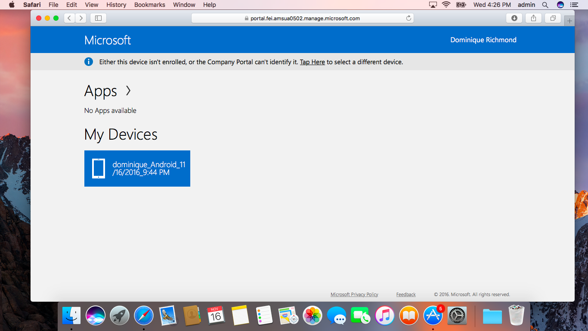
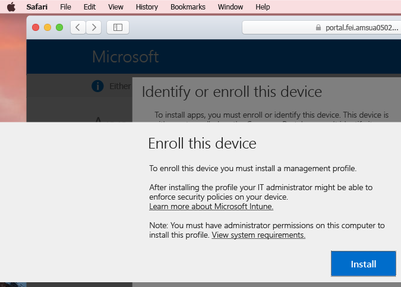
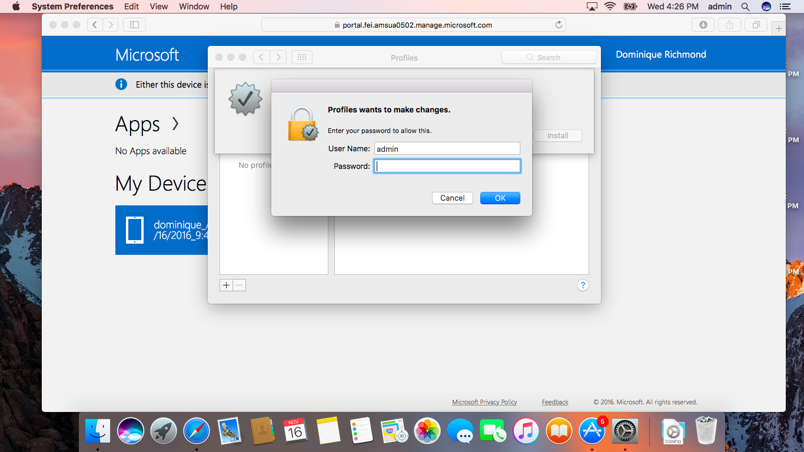

# Registrar seu dispositivo macOS no Intune

Obter acesso a aplicativos, dados e recursos da sua organização possibilita fazer seu trabalho. Se estiver usando um dispositivo macOS no trabalho, isso significa instalar um __Perfil de Gerenciamento__. Esse é simplesmente um arquivo configurado pelo seu administrador de TI que carrega as configurações e informações de acesso para seu Mac. Quer saber mais? Descubra [o que acontece quando você instala o aplicativo do Portal da Empresa e registra o dispositivo no Intune](what-happens-if-you-install-the-company-portal-app-and-enroll-your-device-in-intune-ios.md)

  > [!NOTE]
  > Se estiver, de fato, tentando registrar um dispositivo iOS, como um iPhone ou iPad, [tente estas instruções em vez disso](enroll-your-device-in-intune-ios.md).

1. Em seu __Encaixe__, localize __Safari__ e abra uma nova janela, em seguida abra o [site de Portal da Empresa](http://portal.manage.microsoft.com).
2. Faça logon no Portal da Empresa com sua conta corporativa ou de estudante.

  [!INCLUDE[wit_nextref](../includes/end-user-password-guidance.md)]

3. Ao fazer o logon, você verá qualquer __Aplicativos__ disponível, __Meus dispositivos__ e qualquer __informação de contato__ disponível para sua equipe de TI. Na parte superior da página, você verá um aviso que diz **Este dispositivo não está registrado ou o Portal da Empresa não pode identificá-lo. <u>Toque Aqui</u> para selecionar um dispositivo diferente.** Clique em __Toque Aqui__.

 

4. Uma janela pop-up será exibida com uma breve explicação sobre por que vocês vão __Identificar ou registrar este dispositivo__. Examine isso, clique em __Registrar__ para continuar.

 

5. Uma segunda janela pop-up será exibida com uma breve explicação sobre o que vai acontecer quando __Registrar este dispositivo__. Examine isso, clique em __Instalar__ para continuar.

 

  > [!NOTE]
  > O Intune precisa de acesso ao seu computador para certificar-se de que o dispositivo é seguro o suficiente para acessar recursos da sua organização. Descubra [o que acontece quando você registra seu dispositivo no Intune](what-happens-if-you-install-the-Company-Portal-app-and-enroll-your-device-in-intune-ios.md).

6. As __Preferências do Sistema__ serão abertas e perguntarão se deseja __Instalar "Perfil de Gerenciamento"?__ Clique em __Instalar__ para continuar ou obtenha mais detalhes clicando __Mostrar Perfil__.

 

7. Será exibida uma janela pop-up do macOS. Confirme que deseja fazer alterações, fornecendo o __nome de usuário__ e __senha__ do computador, em seguida, clicando em __OK__. Isso instalará o perfil de gerenciamento em seu Mac.

 

8. Você pode ver algumas mensagens adicionais do seu Mac com mais detalhes sobre o perfil ou se tem certeza de que deseja __Instalar__. Clique em __Continuar__ e __Instalar__ por meio desses para continuar. Depois que a instalação for concluída, você poderá exibir seu recém-instalado __Perfil de Gerenciamento__ na lista de __Perfis de Dispositivo__.

 

Ainda precisa de ajuda? Faça o check-in com o administrador de TI. Você pode encontrar as informações de contato deles no [site do Portal da Empresa](http://portal.manage.microsoft.com).

<!--HONumber=Feb17_HO2-->

