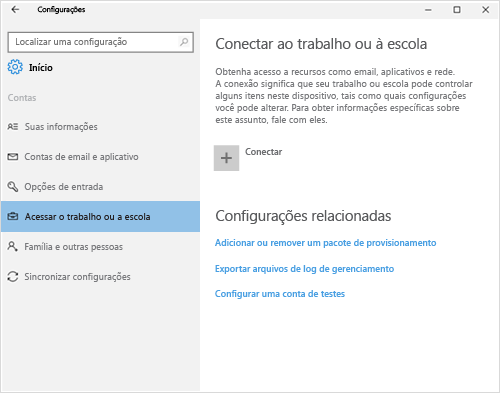
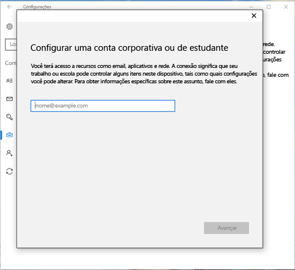
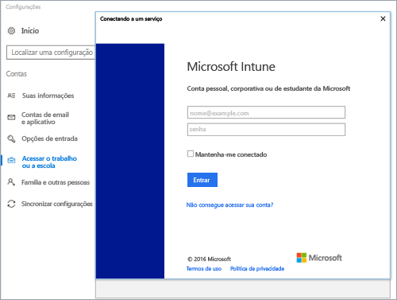
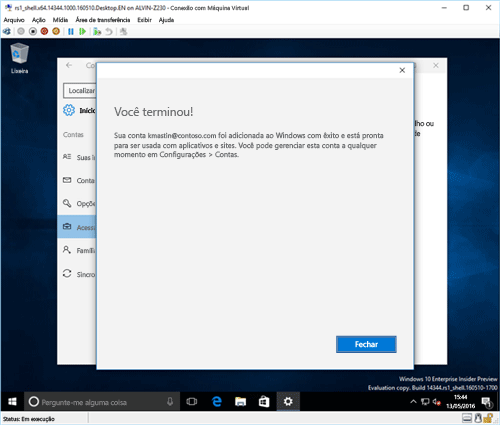
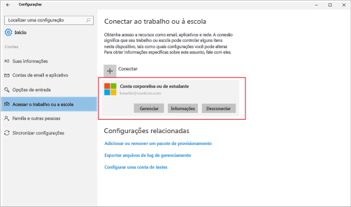

# Registrar seu dispositivo Windows 10 no Intune

<iframe src="https://channel9.msdn.com/Series/IntuneEnrollment/Windows-Enrollment-with-AAD/player" width="960" height="540" allowFullScreen frameBorder="0"></iframe>

1.  Abra o aplicativo **Configurações** do Windows acessando o **menu Iniciar** e selecionando o botão **Configurações**. Também é possível pesquisar “configurações” na barra de pesquisa.

2. Selecione **Contas** > **Acessar trabalho ou escola** > **Conectar**.

    

3.  Insira seu endereço de email corporativo ou de estudante e selecione **Avançar**.

    

4. Entre no Intune com sua conta corporativa ou de estudante.

    

    Você verá uma mensagem que indica que sua empresa ou escola está registrando o dispositivo.

5. Quando você vir a página **Tudo pronto!**, selecione **Fechar**. Você terminou.

  

6. Se você quiser verificar que a conexão tenha a aparência correta, vá até **Configurações**, onde você deve ver agora sua conta corporativa ou de estudante listada.

    

Se você seguiu as etapas anteriores, mas ainda não consegue acessar sua conta de email e seus arquivos corporativos ou de estudante, siga as etapas em [As etapas a serem seguidas se você vir Acessar conta corporativa ou de estudante](troubleshoot-your-windows-10-device-windows.md#troubleshooting-steps-to-follow-if-you-see-access-work-or-school).

