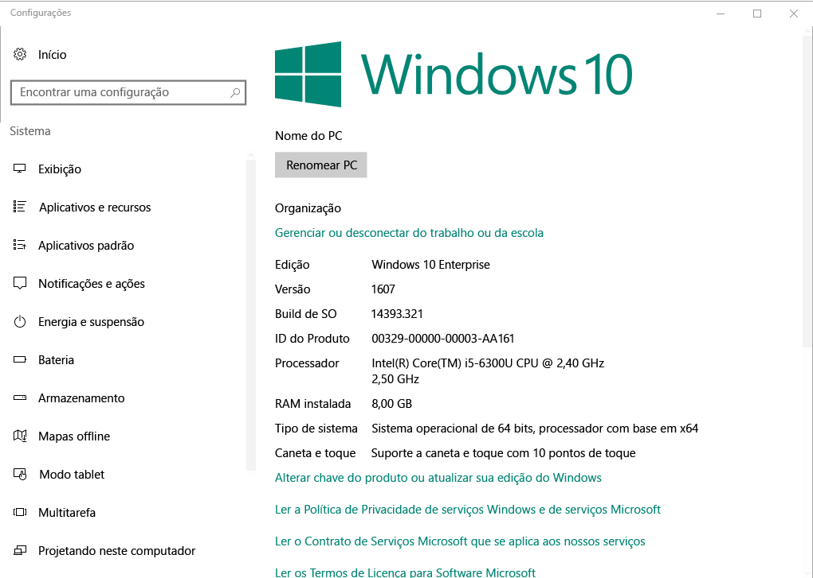

# Registrar seus dispositivos Windows 10 no Intune

Registrar seus dispositivos no Microsoft Intune permite que dispositivos Windows 10 tenham acesso a dados protegidos da sua organização, incluindo email, arquivos e outros recursos. Isso vale para dispositivos com Windows 10 Desktop e Windows 10 Mobile. Registrar seus dispositivos ajuda a proteger o acesso para você e para sua organização e ajuda a manter dados de trabalho separados de dados pessoais.

Quer saber mais? Saiba o que acontece quando você [registra seu dispositivo no Intune](what-happens-if-you-install-the-company-portal-app-and-enroll-your-device-in-intune-windows) e o que isso significa para as [informações no dispositivo](what-can-your-it-administrator-see-when-you-enroll-your-device-in-intune-windows).

## Dispositivos com Windows 10 Desktop
1.  Vá até __Iniciar__.

 .

2. Digite "sobre seu PC" na __barra de pesquisa__ e selecione __Sobre seu PC__.

 

2.  Nas __Configurações__, você verá uma lista de informações sobre a versão do Windows 10 que está instalada no seu computador. Dentro dessa lista, localize a __Versão__.

 

3.  Se sua versão for a __1607__, prossiga com [estas etapas](enroll-your-w10-device-access-work-or-school). Se sua versão for a __1511__, prossiga com [estas etapas](enroll-your-w10-device-your-account).

## Dispositivos com Windows 10 Mobile

1.  Em __Iniciar__, passe o dedo sobre a lista __Todos os aplicativos__ e selecione o aplicativo de __Configurações__.
2.  Toque em __Sistema__ e em __Sobre__.
3.  Em __Informações do dispositivo__, toque em __Mais informações__. Você verá uma lista de informações sobre o dispositivo. Dentro dessa lista, localize a __Versão__.
4.  Se sua versão for a __1607__, prossiga com [estas etapas](enroll-your-w10-device-access-work-or-school). Se sua versão for a __1511__, prossiga com [estas etapas](enroll-your-w10-device-your-account).

Ainda precisa de ajuda? Entre em contato com seu administrador de TI. Para obter suas informações de contato, consulte o [site do Portal da Empresa](http://portal.manage.microsoft.com).

<!--HONumber=Nov16_HO3-->

