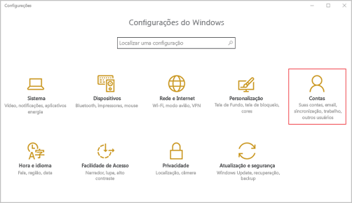
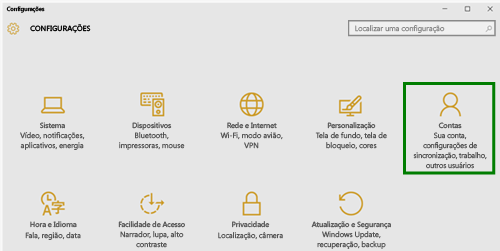
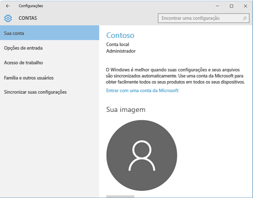
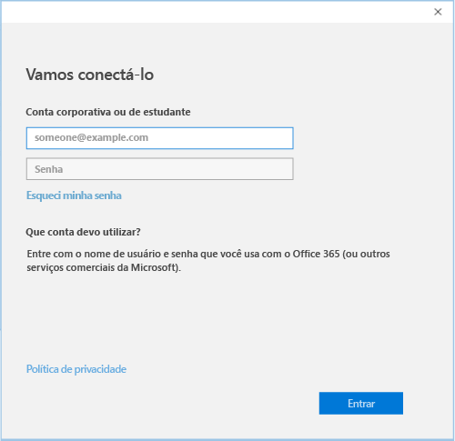

# Registrar seu dispositivo Windows 10 Mobile ou Windows 10 Desktop no Intune

Se sua empresa ou escola usa o Microsoft Intune, você pode registrar os dispositivos para obter acesso aos emails, arquivos e outros recursos da empresa. O registro dos dispositivos permite que sua organização mantenha os dados corporativos protegidos. Para saber mais sobre registro, consulte [What happens if you install the Company Portal app and enroll your device in Intune?](what-happens-if-you-install-the-company-portal-app-and-enroll-your-device-in-intune-windows.md) (O que acontece quando você instala o aplicativo do Portal da Empresa e registra seu dispositivo no Intune?). e [What your IT administrator can and can't see on your device](what-can-your-it-administrator-see-when-you-enroll-your-device-in-intune-windows.md) (O que o administrador de TI pode ver ou não no seu dispositivo).

Para registrar seu dispositivo Windows 10 Mobile ou Windows 10 Desktop no Intune:

1.  Vá para as **Configurações** do Windows e toque em **Contas**.

    

2.  Examine as duas próximas telas e localize a que é semelhante ao que você vê em seu dispositivo. Siga as etapas fornecidas com a tela que você vê em seu dispositivo.

    Se você vir essa tela, siga as instruções em [As etapas a serem seguidas se você vir Acessar conta corporativa ou de estudante](#steps-to-follow-if-you-see-access-work-or-school).

    

    Se você vir essa tela, siga as etapas em [As etapas a serem seguidas se você vir Sua conta](#steps-to-follow-if-you-see-your-account).

    

## As etapas a serem seguidas se você vir Acessar conta corporativa ou de estudante

1.  Toque **Acessar trabalho ou escola** e, em seguida, toque em **Conectar**.

    

2.  Insira o endereço de email de sua conta corporativa ou de estudante e toque em **Avançar**.

    

3. Entre no Intune com sua conta corporativa ou de estudante.

    

    Você verá uma mensagem que indica que sua empresa ou escola está registrando o dispositivo.

4. Quando você vir a página **Tudo pronto!**, tela, toque em **Fechar**. Você terminou.

  

5. Se você quiser verificar que a conexão tenha a aparência correta, vá até **Configurações**, onde você deve ver agora sua conta corporativa ou de estudante listada.

    

Se você seguiu as etapas anteriores, mas ainda não consegue acessar sua conta de email e seus arquivos corporativos ou de estudante, siga as etapas em [As etapas a serem seguidas se você vir Acessar conta corporativa ou de estudante](troubleshoot-your-windows-10-device-windows.md#troubleshooting-steps-to-follow-if-you-see-access-work-or-school).

## As etapas a serem seguidas se você vir Sua conta

1.  Vá para as **Configurações** do Windows e toque em **Contas**.

    

2.  Toque em **Sua Conta**.

    

3.  Toque em **Adicionar uma Conta Corporativa ou de Estudante**.

    

4.  Entre com as suas credenciais corporativas ou de estudante.

    

Se você seguiu as etapas anteriores, mas não consegue acessar seu endereço de email corporativo ou de estudante, arquivos ou outros dados, experimente as instruções em [Etapas de solução de problemas a seguir se você vir sua conta](troubleshoot-your-windows-10-device-windows.md#troubleshooting-steps-to-follow-if-you-see-your-account).

Também recomendamos que você instale o aplicativo do Portal da Empresa, que permite facilmente identificar e obter os aplicativos da empresa que são relevantes para você e para sua função. Dependendo de como a sua empresa configurou o Intune, o aplicativo do Portal da Empresa pode ter sido instalado como parte do seu processo de registro.

Para verificar se você tem o aplicativo, procure **Portal da Empresa** na lista de aplicativos. Se você não vir o Portal da Empresa na sua lista de aplicativos, siga essas etapas para instalá-lo.

1.  Toque em **Iniciar** &gt; **Repositório**.

2.  Toque em **Pesquisar** e digite **portal da empresa**.

3.  Na lista de resultados, toque em **Portal da Empresa** &gt; **Instalar**.

4.  Toque em **Instalar** ou **Gratuito**. A opção mostrada depende de como sua empresa configurou o aplicativo.

Ainda precisa de ajuda? Entre em contato com seu administrador de TI. Para obter suas informações de contato, consulte o [site do Portal da Empresa](http://portal.manage.microsoft.com).

<!--HONumber=Oct16_HO1-->

