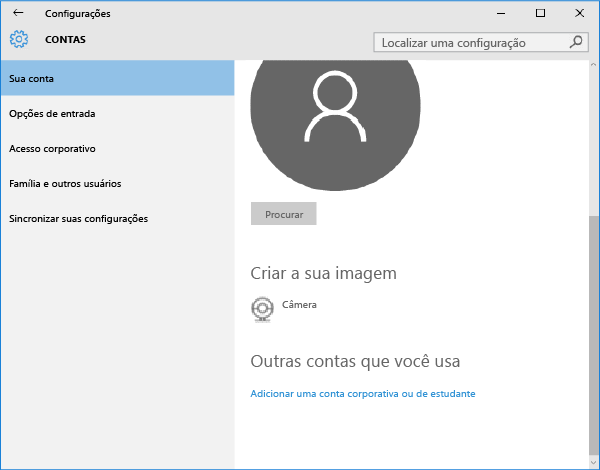

---
# required metadata

title: Registrar seu dispositivo Windows 10 Mobile ou Windows 10 Desktop no Intune| Microsoft Intune
description:
keywords:
author: Staciebarker
manager: jeffgilb
ms.date: 05/11/2016
ms.topic: article
ms.prod:
ms.service: microsoft-intune
ms.technology:
ms.assetid: 36250832-c6fd-4e8d-b681-de735023ebc3

# optional metadata

#ROBOTS:
#audience:
#ms.devlang:
ms.reviewer: priyar
ms.suite: ems
#ms.tgt_pltfrm:
#ms.custom:

---

# Registrar seu dispositivo Windows 10 Mobile ou Windows 10 Desktop no Intune

Se sua empresa ou escola usa o Microsoft Intune, você pode registrar os dispositivos para obter acesso aos emails, arquivos e outros recursos da empresa. O registro dos dispositivos permite que sua organização mantenha os dados corporativos protegidos. Para saber mais sobre registro, consulte [What happens if you install the Company Portal app and enroll your device in Intune?](what-happens-if-you-install-the-company-portal-app-and-enroll-your-device-in-intune-windows.md) (O que acontece quando você instala o aplicativo do Portal da Empresa e registra seu dispositivo no Intune?). e [What your IT administrator can and can't see on your device](what-can-your-it-administrator-see-when-you-enroll-your-device-in-intune-windows.md) (O que o administrador de TI pode ver ou não no seu dispositivo).

Para registrar seu dispositivo Windows 10 Mobile ou Windows 10 Desktop no Intune:

1.  Vá para as **Configurações** do Windows e toque em **Contas**.

    

2.  Toque em **Sua Conta**.

    

3.  Toque em **Adicionar uma Conta Corporativa ou de Estudante**.

    

4.  Entre com as suas credenciais corporativas ou de estudante.

    

Se você tiver seguido as etapas acima, mas não conseguir acessar seu email do trabalho ou de estudante, arquivos e outros dados, volte para **Contas** e toque em **Acesso de Trabalho**.

-   Se você vir seu trabalho ou conta da escola, parabéns. Você está conectado.

-   Se você não ver a sua conta do trabalho ou de estudante, toque em **Conectar** e entre com as suas credenciais corporativas ou de estudante.

Também recomendamos que você instale o aplicativo do Portal da Empresa, que permite facilmente identificar e obter os aplicativos da empresa que são relevantes para você e para sua função. Dependendo de como a sua empresa configurou o Intune, o aplicativo do Portal da Empresa pode ter sido instalado como parte do seu processo de registro. Para verificar se você tem o aplicativo, procure o **Portal da Empresa** em sua lista de aplicativos. Se você não vir o Portal da Empresa na sua lista de aplicativos, siga essas etapas para instalá-lo.

1.  Toque em **Iniciar** &gt; **Repositório**.

2.  Toque em **Pesquisar** e digite **portal da empresa**.

3.  Na lista de resultados, toque em **Portal da Empresa** &gt; **Instalar**.

4.  Toque em **Instalar** ou **Gratuito**. A opção mostrada depende de como sua empresa configurou o aplicativo.

Ainda precisa de ajuda? Entre em contato com seu administrador de TI. Para obter suas informações de contato, consulte o [site do Portal da Empresa](http://portal.manage.microsoft.com).

### Consulte também
[Registrar seu dispositivo Windows no Intune](enroll-your-device-in-intune-windows.md) 
[Usando seu dispositivo Windows com o Intune](using-your-windows-device-with-intune.md)

<!--HONumber=Jun16_HO2-->

