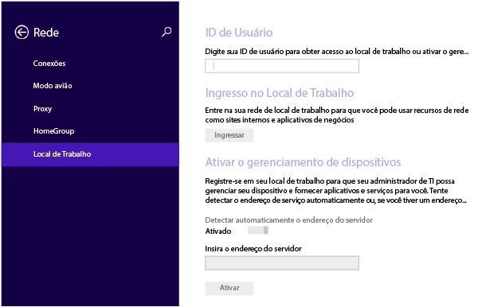
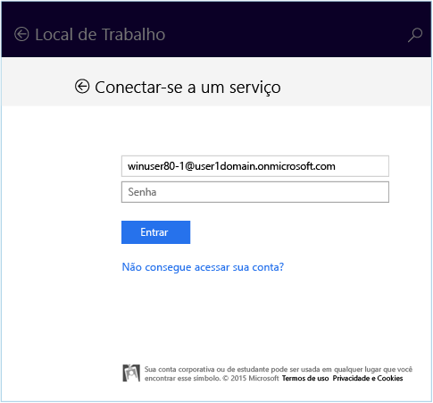
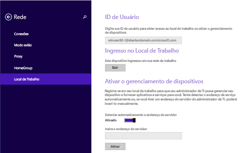
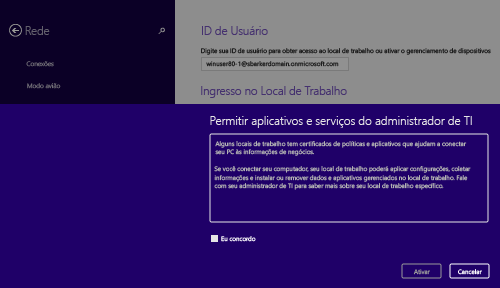
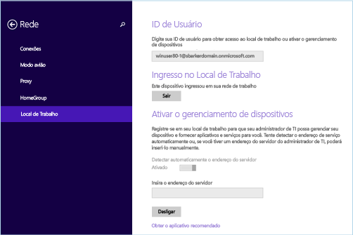

---
# required metadata

title: Registrar seu dispositivo Windows 8.1 ou Windows RT 8.1 no Intune| Microsoft Intune
description:
keywords:
author: Staciebarker
manager: jeffgilb
ms.date: 04/28/2016
ms.topic: article
ms.prod:
ms.service: microsoft-intune
ms.technology:
ms.assetid: 28984f26-1070-4f7a-877c-669a59375c0c

# optional metadata

#ROBOTS:
#audience:
#ms.devlang:
ms.reviewer: jeffgilb
ms.suite: ems
#ms.tgt_pltfrm:
#ms.custom:

---

# Registrar seu dispositivo Windows 8.1 ou Windows RT 8.1 no Intune

Se sua empresa ou escola usa o Microsoft Intune, você pode registrar os dispositivos para obter acesso aos emails, arquivos e outros recursos da empresa. O registro dos dispositivos permite que sua organização mantenha os dados corporativos protegidos. Para saber mais sobre registro, consulte [What happens if you install the Company Portal app and enroll your device in Intune? (O que acontece quando você instala o aplicativo Portal da Empresa e registra seu dispositivo no Intune?)](what-happens-if-you-install-the-company-portal-app-and-enroll-your-device-in-intune-windows.md) e [O que o administrador de TI pode ver ou não no seu dispositivo](what-can-your-it-administrator-see-when-you-enroll-your-device-in-intune-windows.md).

Para registrar seu dispositivo Windows 8.1 ou Windows RT 8.1 no Intune:

1.  No dispositivo, toque em **Configurações** &gt; **Configurações do Computador** &gt; **Rede** &gt; **Local de Trabalho**.

    

2.  Insira seu email corporativo ou de estudante para a ID de usuário, se necessário, e toque em **Ingressar**.

    Se sua ID de usuário não for solicitada, é usado o endereço de email que você inseriu quando se conectou ao dispositivo.

3.  Digite a senha do seu email de trabalho ou da escola.

    

4.  Em **Ativar o Gerenciamento de Dispositivo**, toque em **Ativar**.

    

5.  No diálogo **Permitir aplicativos e serviços do administrador de TI**, marque a caixa de seleção **Concordo** e, em seguida, toque em **Ativar**.

    

    Após se registrar com êxito, você verá a tela a seguir.

    

Também recomendamos que você instale o aplicativo do Portal da Empresa, que permite facilmente identificar e obter os aplicativos da empresa que são relevantes para você e para sua função. Dependendo de como a sua empresa configurou o Intune, o aplicativo do Portal da Empresa pode ter sido instalado como parte do seu processo de registro. Para verificar se você tem o aplicativo, procure o **Portal da Empresa** em sua lista de aplicativos. Se você não vir o Portal da Empresa na sua lista de aplicativos, siga essas etapas para instalá-lo.

1.  Toque em **Iniciar** &gt; **Armazenamento**.

2.  Toque em **Pesquisar** e digite **portal da empresa**.

3.  Na lista de resultados, toque em **Portal da Empresa**.

4.  Toque em **Instalar** ou **Gratuito**. A opção mostrada depende de como sua empresa configurou o aplicativo.

### Consulte também
[Registrar seu dispositivo Windows no Intune](enroll-your-device-in-intune-windows.md) 
[Usando seu dispositivo Windows com o Intune](using-your-windows-device-with-intune.md)

<!--HONumber=May16_HO1-->

