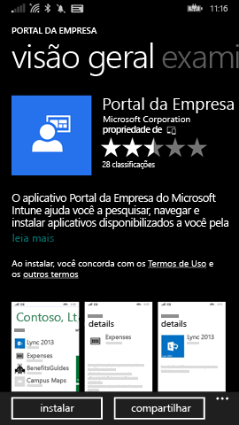
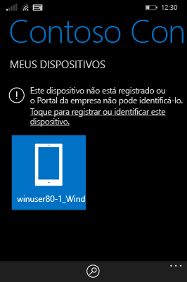
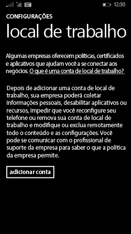

# Registrar seu dispositivo Windows Phone 8.1 no Intune

Se sua empresa ou escola usa o Microsoft Intune, você pode registrar os dispositivos para obter acesso aos emails, arquivos e outros recursos da empresa. O registro dos dispositivos permite que sua organização mantenha os dados corporativos protegidos. Para saber mais sobre registro, consulte [What happens if you install the Company Portal app and enroll your device in Intune?](what-happens-if-you-install-the-company-portal-app-and-enroll-your-device-in-intune-windows.md) (O que acontece quando você instala o aplicativo do Portal da Empresa e registra seu dispositivo no Intune?). e [What your IT administrator can and can't see on your device](what-can-your-it-administrator-see-when-you-enroll-your-device-in-intune-windows.md) (O que o administrador de TI pode ver ou não no seu dispositivo).

Para registrar seu dispositivo Phone 8.1 no Intune, siga as instruções que se aplicam à sua empresa ou escola:

-   [Se a sua empresa permitir que você use o Portal da Empresa na Windows Store](#if-your-company-lets-you-use-the-company-portal-from-the-windows-store)

-   [Se você não tiver permissão para acessar a Windows Store do Windows Phone ou se você não tiver uma conta da Microsoft](#if-you-are-not-allowed-to-access-the-windows-store-from-your-windows-phone-or-if-you-do-not-have-a-microsoft-account)

## Se a sua empresa permitir que você use o Portal da Empresa na Windows Store
Instale o aplicativo do Portal da Empresa no seu dispositivo:

1.  Toque em **Iniciar** &gt; **Repositório**.

2.  Toque em **Pesquisar** e digite **portal da empresa**.

3.  Na lista de resultados, toque em **Portal da Empresa**.

    

4.  Toque em **Portal da Empresa** &gt; **Instalar**.

    

Registrar seu dispositivo:

1.  No dispositivo, abra o aplicativo **Portal da Empresa do Microsoft Intune**.

2.  Forneça as suas credenciais. Você pode ser solicitado a aceitar os Termos e Condições da sua empresa, se aplicável.

3.  Passe o dedo sobre **Meus Dispositivos**.

4.  Toque em **Tocar para Registrar ou Identificar este Dispositivo**.

    

5.  Toque em **Registrar este Dispositivo**.

    

6.  Toque em **Adicionar Conta**.

    

7.  Insira informações adicionais, conforme solicitado e, em seguida, toque em **Entrar** para concluir o registro. Agora, você verá a sua conta de local de trabalho listada na página **Configurações** &gt; **Local de Trabalho**.

    

## Se você não tiver permissão para acessar a Windows Store do Windows Phone ou se não tiver uma conta da Microsoft

1.  Toque em **Configurações** &gt; **Local de trabalho**.

2.  Toque em **Adicionar Conta** e entre usando sua conta de trabalho.

3.  Insira informações adicionais conforme solicitado e, em seguida, toque em **Entrar** para concluir o registro.

4.  Se solicitado a instalar o aplicativo da empresa ou o Hub, verifique se a caixa relevante está marcada e toque em **Concluído**.

Se seu administrador de TI tiver configurado o Portal da Empresa para ser instalado durante o registro, você verá que Portal da Empresa é exibido na lista de aplicativos.

Ainda precisa de ajuda? Entre em contato com seu administrador de TI. Para obter suas informações de contato, consulte o [site do Portal da Empresa](http://portal.manage.microsoft.com).

### Consulte também
[Registrar seu dispositivo Windows no Intune](enroll-your-device-in-intune-windows.md) 
[Usando seu dispositivo Windows com o Intune](using-your-windows-device-with-intune.md)

<!--HONumber=Jun16_HO4-->

