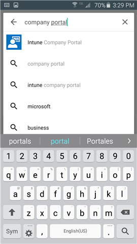

---
# required metadata

title: Instalar o aplicativo de Portal da Empresa do Microsoft Intune | Microsoft Intune
description:
keywords:
author: staciebarker
manager: jeffgilb
ms.date: 04/28/2016
ms.topic: article
ms.prod:
ms.service: microsoft-intune
ms.technology:
ms.assetid: 68e5a234-4353-4cb9-b869-4f2af5e59f31

# optional metadata

#ROBOTS:
#audience:
#ms.devlang:
ms.reviewer: jeffgilb
ms.suite: ems
#ms.tgt_pltfrm:
#ms.custom:

---

# Instalar o aplicativo Portal da Empresa do Microsoft Intune

O Portal da Empresa é um aplicativo que você instala em seu dispositivo Android para ter acesso a aplicativos, email e rede da empresa ou escola.  Antes de poder obter acesso, você deve instalar o aplicativo de Portal da Empresa e, em seguida, usar o aplicativo para registrar seu dispositivo no Microsoft Intune. Para obter mais informações sobre o que acontece quando você se registra, consulte [What happens if you install the Company Portal app and enroll your device in Intune? (O que acontece quando você instala o aplicativo de Portal da empresa e registra seu dispositivo no Intune?)](what-happens-if-you-install-the-company-portal-app-and-enroll-your-device-in-intune-android.md).

1.  Toque em **Página Inicial** &gt; **Play Store**.

2.  Na caixa **Pesquisar**, digite **portal da empresa**.

3.  Toque em **Portal da Empresa Intune**.

    

4.  Toque em **INSTALAR**.

    

5.  Toque em **ACEITAR**.

    

Para registrar seu dispositivo no Intune para obter acesso aos recursos e dados de escola ou da empresa, consulte [Enroll your device in Intune (Registrar seu dispositivo no Intune)](enroll-your-device-in-Intune-android.md).

### Consulte também
[Usando seu dispositivo Android com o Intune](using-your-android-device-with-intune.md)

<!--HONumber=May16_HO1-->

