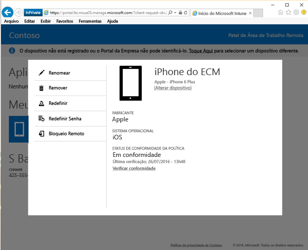
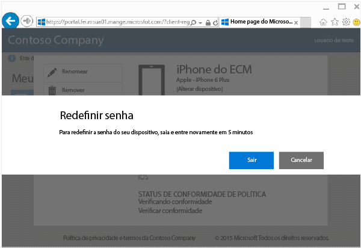
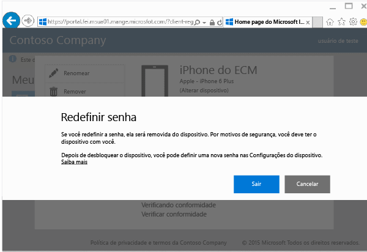

# Redefinir a senha do dispositivo pelo site do Portal da Empresa

Se você perder a senha ou o PIN do seu dispositivo para um dispositivo que você registrou no Intune, você poderá usar o [site do Portal da Empresa](http://portal.manage.microsoft.com) para redefini-la. Você pode usar o site do Portal da Empresa para gerenciar computadores e dispositivos que você registrou no Intune e para realizar a maioria das mesmas tarefas que você pode fazer quando usa o aplicativo de Portal da Empresa.

> [!NOTE]
> Você pode não ver o botão **Redefinir Senha** no site do Portal da Empresa, dependendo de como o administrador de TI tiver configurado o Intune. Não há suporte para a redefinição de senha em dispositivos Windows 8.1.

Para redefinir sua senha:

1.  Abra o [site do Portal da Empresa](http://portal.manage.microsoft.com) e escolha o dispositivo cuja senha você deseja redefinir.

2.  Escolha **Redefinir Senha**.

    

3.  Escolha **Entrar** e entre novamente com as suas credenciais corporativas ou de estudante. Você precisa entrar novamente em cinco minutos.

    

4.  Escolha **Redefinir Senha**.

    

    Verifique a tabela para ver como **Redefinir Senha** funciona em seu dispositivo.

    |Plataforma|Suporte|
    |------------|-----------|
    |Android|Cria uma senha temporária alfanumérica.|
    |iOS|Remove a senha do dispositivo e não cria uma senha temporária. Se estiver usando Touch ID, você precisará configurá-lo novamente no seu dispositivo, porque ele será removido quando você redefinir sua senha.|
    |Windows 10 (somente para dispositivos móveis)|Cria uma senha temporária alfanumérica. Há suporte para o Windows Hello.|
    |Windows Phone 8.1|Cria uma senha temporária numérica.|
    Depois de desbloquear o dispositivo, você pode definir uma nova senha indo para **Configurações** em seu dispositivo.

5.  Desbloqueie seu dispositivo e, em seguida, defina uma nova senha ou altere a senha temporária acessando **Configurações** em seu dispositivo.

    Para ver uma notificação confirmando que sua senha foi redefinida com êxito, clique no sinalizador de notificação na parte superior direita do site do Portal da Empresa.

Ainda precisa de ajuda? Entre em contato com seu administrador de TI. Para obter suas informações de contato, consulte o [site do Portal da Empresa](http://portal.manage.microsoft.com).

<!--HONumber=Oct16_HO3-->

