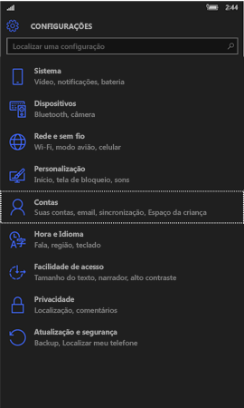
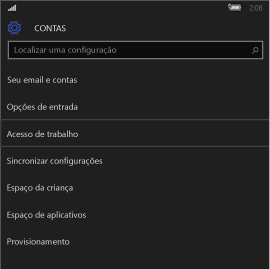
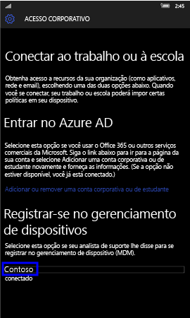
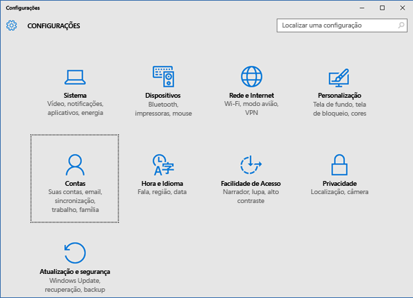
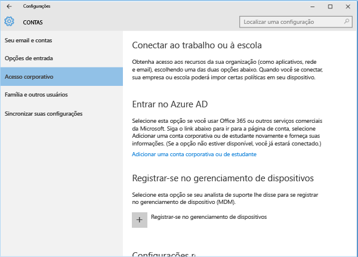
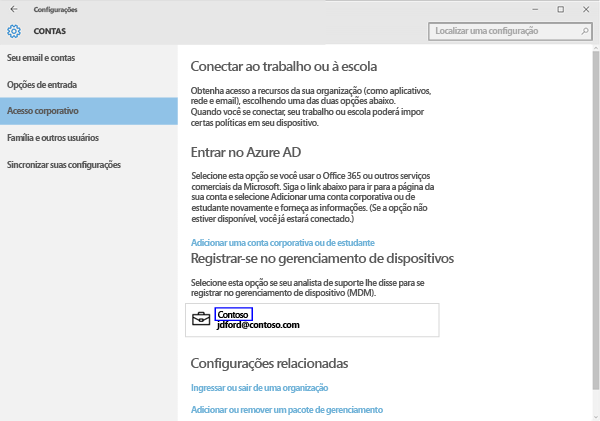
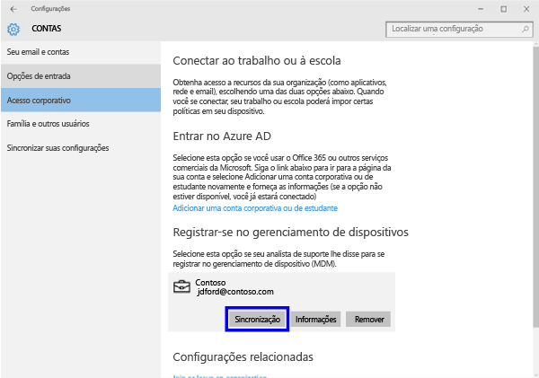
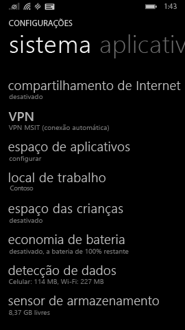
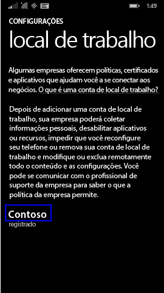
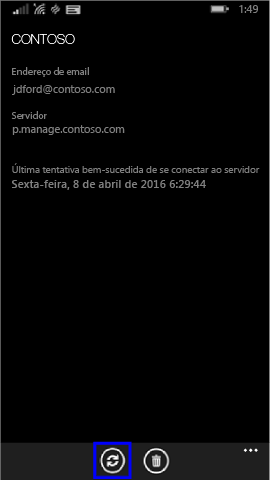

# Sincronizar o dispositivo Windows manualmente
Se a instalação do aplicativo estiver demorando muito, use as instruções a seguir para sincronizar manualmente seu dispositivo Windows, pois isso pode ajudar a acelerar a instalação. Somente as versões com suporte são aquelas listadas. Use o link, mostrado na seção “Nesse Artigo” acima, que corresponde ao tipo de dispositivo que você tem:

* [Windows 10 Mobile](#windows-10-mobile)
* [Windows 10 Desktop](#windows-10-desktop)
* [Windows Phone 8.1](#windows-phone-8-1)

## Windows 10 Mobile
Para sincronizar manualmente seu dispositivo Windows 10 Mobile e acelerar uma instalação de aplicativo que está lenta:

1. Vá para **Todos os aplicativos** > **Configurações** > **Contas**.

    

2. Toque em **Acesso corporativo**.

    

3. Em **Registrar-se no gerenciamento de dispositivo**, toque no nome da sua empresa, conforme mostrado abaixo.

    

4. Toque no ícone **Sincronizar**.

    

    A mensagem "Estamos sincronizando sua conta" é exibida na parte superior da tela. O botão Sincronizar fica esmaecido até que o dispositivo termine a sincronização.

## Windows 10 Desktop
Para sincronizar manualmente seu dispositivo Windows 10 Desktop e acelerar uma instalação de aplicativo que está lenta:

1. Selecione o botão **Iniciar**, conforme mostrado abaixo e selecione **Configurações**.

    

2. Na página **Configurações**, selecione **Contas**.

    

3. Na página **Contas**, selecione **Acesso corporativo**.

    

4. Na seção **Registrar-se no gerenciamento de dispositivo**, clique no nome da sua empresa, como mostra o realce azul abaixo.

    

5. Selecione o botão **Sincronizar**.

    

   O botão fica esmaecido até que a sincronização seja concluída.

## Windows Phone 8.1
Para sincronizar manualmente seu dispositivo Windows Phone 8.1 e acelerar uma instalação de aplicativo que está lenta:

1. Vá para **Todos os aplicativos** > **Configurações** > **Local de trabalho**.

    

2. Toque no nome da sua empresa, conforme indicado no realce azul abaixo.

    

3. Toque no ícone **Sincronizar**.

    

   A mensagem "Estamos sincronizando sua conta" é exibida na parte superior da tela até que o dispositivo conclua a sincronização.

Ainda precisa de ajuda? Entre em contato com seu administrador de TI. Para obter suas informações de contato, consulte o [site do Portal da Empresa](http://portal.manage.microsoft.com).

### Consulte também
[Usando seu dispositivo Windows com o Intune](using-your-windows-device-with-intune.md)

<!--HONumber=Aug16_HO4-->

