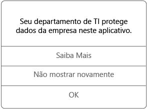

# Usar aplicativos gerenciados no seu dispositivo Android

Aplicativos gerenciados são aplicativos que o administrador de TI pode configurar para ajudar a proteger os dados da empresa que você pode acessar nesse aplicativo. Ao acessar dados da empresa em um aplicativo gerenciado no seu dispositivo Android, você pode perceber que o aplicativo funciona um pouco diferente do que o esperado. Por exemplo, não é possível copiar e colar os dados da empresa protegidos, ou você pode não conseguir salvar esses dados em determinados locais.

Diferentes aplicativos gerenciados também podem trabalhar juntos no seu dispositivo para permitir que você possa fazer as tarefas diárias mantendo dados corporativos protegidos. Por exemplo, se você abre um arquivo da empresa em um aplicativo gerenciado, e o outro aplicativo gerenciado é necessário para exibir o arquivo, o aplicativo gerenciado que permite que você exiba o arquivo é aberto automaticamente. Se um aplicativo necessário não estiver disponível, determinadas ações, como abrir um documento ou acessar um link da Web de dentro de um documento gerenciado, poderão não estar disponíveis.

Ao acessar dados da empresa em um aplicativo gerenciado, você verá uma mensagem como a mostrada abaixo, que permite que você saiba que o aplicativo que você está abrindo é gerenciado.

## Como obtenho os aplicativos gerenciados?
Você pode obter aplicativos gerenciados de duas maneiras diferentes:

-   Quando o dispositivo é registrado no Microsoft Intune, você instala o aplicativo do seu aplicativo Portal da Empresa ou um site do Portal da Empresa, ou seu administrador de TI pode instalá-lo em seu dispositivo. Para saber mais sobre como se registrar, confira [Enroll your device in Intune](enroll-your-device-in-Intune-android.md) (Registrar seu dispositivo no Intune).

-   Instale um aplicativo da Play Store e entre com sua conta de usuário corporativo que é gerenciada pelo Intune.

## O que meu administrador de TI pode gerenciar em um aplicativo?
Aqui estão alguns exemplos de opções que seu administrador de TI pode gerenciar em um aplicativo e que podem afetar suas interações com os dados da empresa no dispositivo:

-   Acesso a sites específicos

-   Transferências de dados entre aplicativos

-   Salvando arquivos

-   Operações de copiar e colar

-   Requisitos de acesso do PIN

-   Suas credenciais, usando as credenciais da empresa

-   Capacidade de fazer backup para a nuvem

-   Capacidade de fazer capturas de tela

-   Requisitos de criptografia de dados

Estes são aplicativos comuns que o departamento de TI pode gerenciar:

-   Intune Managed Browser

-   Visualizador de imagem do Intune

-   Visualizador de PDF do Intune

-   AV Player do Intune

-   Microsoft Word, Excel e PowerPoint

Para obter mais informações sobre os aplicativos gerenciados em seu dispositivo, entre em contato com seu departamento de TI. Para obter suas informações de contato, consulte o [site do Portal da Empresa](http://portal.manage.microsoft.com).

<!--HONumber=Oct16_HO2-->

