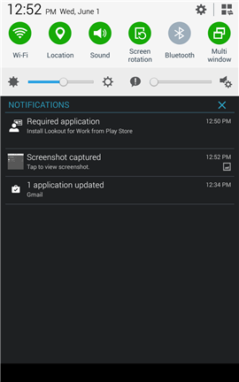

# Aparecerá um aviso para que você instale o Lookout for Work

Antes de poder acessar seu trabalho, o administrador de TI exige que você instale o aplicativo Lookout for Work, que ajuda a proteger seu dispositivo ao localizar possíveis ameaças à segurança.

**O que você deve fazer:**

1.  Arraste para baixo da parte superior da tela para abrir a barra de Notificações e toque em **Aplicativo necessário – Instalar Lookout for Work da Play Store**.

    

    Você será levado à página de instalação do Lookout for Work na Play Store.

2.  Instale o Lookout for Work e toque em **ACEITAR** para permitir que o Lookout for Work acesse seu dispositivo.

    

3. Abra o Lookout for Work e toque em **Ativar**.

    

4. Toque em **Entre com sua conta corporativa** e digite a conta que você usa para acessar email e arquivos corporativos ou de estudante.

    

5. Selecione a conta que você usa para acessar seus arquivos e email corporativo ou de estudante e toque em **ADICIONAR CONTA**.

    

6. Toque em **Aceitar** para dar ao Lookout for Work permissão para entrar e ler seu perfil.

    

    Será exibida uma tela mostrando que o Lookout for Work está se conectando com a Lookout Security Cloud.

7. Examine os itens sobre como o Lookout protege seu dispositivo e toque em **OK**.

    

    Quando você vir a tela a seguir, significa que o Lookout está instalado e conectado.

    

    O Lookout for Work começa imediatamente a verificar se há ameaças à segurança em seu dispositivo. Se nenhuma ameaça for encontrada, você verá a tela a seguir.

    

    A tela Detalhes do Dispositivo no Portal da Empresa mostra que agora você está em conformidade com os requisitos de segurança da empresa.

    

    Se o Lookout for Work encontrar uma ameaça à segurança em seu dispositivo, você verá instruções para corrigir o problema.

Ainda precisa de ajuda? Entre em contato com seu administrador de TI. Para obter suas informações de contato, consulte o [site do Portal da Empresa](http://portal.manage.microsoft.com).

<!--HONumber=Sep16_HO2-->

