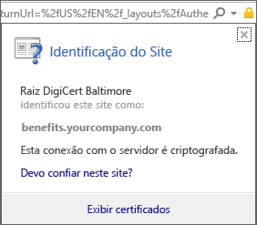
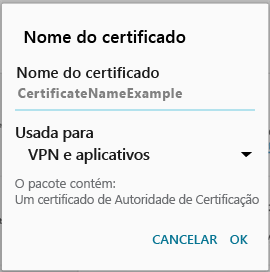

# Falta ao dispositivo um certificado necessário

## Seu dispositivo não tem um certificado que normalmente vem instalado no seu telefone
Se o dispositivo Android não estiver registrado no Intune e ele não tiver um certificado que normalmente vem instalado no telefone, você não conseguirá entrar no aplicativo Portal da Empresa Android. Quando você tentar entrar, verá a seguinte mensagem:

Para resolver esse problema e obter o certificado necessário:

1.  Em um navegador, navegue até a [página do certificado Digicert](https://www.digicert.com/digicert-root-certificates.htm).

2.  Localize e baixe o certificado Baltimore CyberTrust Root (https://www.digicert.com/CACerts/BaltimoreCyberTrustRoot.crt).

3.  Da parte superior, arraste para baixo para abrir as notificações e, em seguida, toque em **BaltimoreCyberTrustRoot.crt** na lista de notificações.

4.  Na tela **Nome do Certificado**, aceite o nome do certificado padrão.

5. Certifique-se de que o **Uso da Credencial** é definido como **Usado para aplicativos e VPN**, e, em seguida, toque em **OK**.

    

6. Feche o navegador da Web e o aplicativo Portal da Empresa.

7. Abra o aplicativo Portal da Empresa. Agora, você poderá entrar no aplicativo Portal da Empresa. Se você precisar de Ajuda, entre em contato com o administrador de TI.

## O dispositivo não tem um certificado exigido por seu administrador de TI
Se seu dispositivo Android não estiver registrado no Intune e não tiver um determinado certificado exigido por seu administrador de TI, você não poderá entrar no aplicativo Portal da Empresa Android. Quando você tentar entrar, verá a seguinte mensagem:

>[!NOTE]
> Se você já tiver visto uma mensagem de "certificado faltando" e tiver seguido as etapas em [Seu dispositivo não tem um certificado que normalmente vem instalado no seu telefone](#your-device-is-missing-a-certificate-that-usually-comes-installed-on-your-phone), tudo bem. Esta é uma mensagem e um certificado diferentes dessa, portanto, continue e siga as etapas nessa seção para obter o certificado que está faltando.

Para resolver esse problema e obter o certificado necessário, há duas etapas principais que você precisará realizar:

- Identificar o certificado que está faltando procurando em um computador corporativo ou de estudante.
- Usar seu dispositivo para baixar o certificado que está faltando da Internet.

### Identificar o certificado que está faltando procurando em um computador corporativo ou de estudante

1. Em um computador, abra o Internet Explorer. Se você não tiver um computador para usar para essa finalidade, entre em contato com seu administrador de TI. Para obter as informações de contato do administrador de TI, consulte o [site do Portal da Empresa](http://portal.manage.microsoft.com).

2. Acesse o [site do Portal da Empresa](http://portal.manage.microsoft.com) e entre usando suas credenciais corporativas ou de estudante.

3. Na extremidade direita da barra de endereços do navegador, clique no símbolo que se parece com um cadeado, conforme mostrado abaixo. Se você não vir o símbolo do cadeado, pare e entre em contato com seu administrador de TI. O cadeado significa que você está conectado com segurança, portanto, você não deve continuar a menos que veja esse símbolo.

    

4. Clique em **Exibir certificados**.

    

5. Na caixa de diálogo **Certificado**, clique na guia **Caminho de certificação** e identifique o certificado que precisa ser obtido da Internet. O nome do certificado que você precisa estará na mesma posição que o que está realçado na captura de tela da exemplo acima.

### Baixar e instalar o certificado que está faltando em seu dispositivo móvel Android

1. Usando um mecanismo de pesquisa como o Bing ou o Google, pesquise o nome do certificado que está faltando identificado na seção anterior. O certificado pode terminar com “extensões” diferentes, como ".crt" ou ".pem" etc.

2. Baixe o certificado raiz do site.

3. Após o certificado ser baixado, arraste a parte superior da tela para baixo para abrir suas notificações e toque no nome do certificado na lista de notificações.

4. Na caixa de diálogo **Name the Certificate (Nome do Certificado)** mostrada abaixo, aceite o nome de certificado padrão.

5. Certifique-se de que o **Uso da Credencial** é definido como **Usado para aplicativos e VPN**, e, em seguida, toque em **OK**.

    

6. Feche o aplicativo Portal da Empresa.

7. Abra o aplicativo Portal da Empresa. Agora, você poderá entrar no aplicativo Portal da Empresa. Se você precisar de Ajuda, entre em contato com o administrador de TI.

Se você vir a mensagem de “certificado faltando” como a mostrada acima e já tiver seguido as etapas acima, isso provavelmente significa que ainda há outro certificado que seu administrador de TI precisará ajudá-lo a instalar. Entre em contato com seu administrador de TI e forneça a ele este [link](/intune/troubleshoot/troubleshoot-device-enrollment-in-intune#android-certificate-issues), que contém as etapas para ajudar a resolver o problema.

<!--HONumber=Aug16_HO5-->

