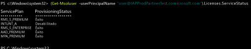

# Gerenciar licenças do Intune usando o PowerShell
Antes que os usuários possam entrar para usar o serviço do Intune ou registrar seus dispositivos no gerenciamento, ele deverão primeiro ser atribuídos a uma licença para sua assinatura do Intune, conforme descrito em [Manage Intune licenses](start-with-a-paid-subscription-to-microsoft-intune-step-4.md) (Gerenciar licenças do Intune). No entanto, as organizações que usam Microsoft Enterprise Mobility + Security podem ter usuários que precisam apenas dos serviços do Azure Active Directory Premium ou do Intune no pacote do EMS. Você pode atribuir um serviço ou um subconjunto de serviços usando os [cmdlets do PowerShell do Azure Active Directory](https://msdn.microsoft.com/library/jj151815.aspx).

Para atribuir seletivamente licenças de usuário para serviços do EMS, abra o PowerShell como administrador em um computador com o [Módulo do Azure Active Directory para Windows PowerShell](https://msdn.microsoft.com/library/jj151815.aspx#bkmk_installmodule) instalado. Você pode instalar o PowerShell em um computador local ou em um servidor do ADFS.

Você precisa criar uma nova definição de SKU de licença que se aplique apenas aos planos de serviço desejados. Para fazer isso, desabilite os planos que não deseja aplicar. Por exemplo, você pode criar uma definição de SKU de licença que não atribui uma licença do Intune. Para ver uma lista dos serviços disponíveis, digite:

    (Get-MsolAccountSku | Where {$_.SkuPartNumber -eq "EMS"}).ServiceStatus

Você pode executar o comando a seguir para excluir o plano de serviço do Intune. Você pode usar o mesmo método para expandir para um grupo de segurança inteiro ou pode usar filtros mais granulares.

**Exemplo 1** Criar um novo usuário na linha de comando e atribuir uma licença do EMS sem habilitar a parte do Intune da licença:

    Connect-MsolService

    New-MsolUser -DisplayName “Test User” -FirstName FName -LastName LName -UserPrincipalName user@<TenantName>.onmicrosoft.com –Department DName -UsageLocation US

    $CustomEMS = New-MsolLicenseOptions -AccountSkuId "<TenantName>:EMS" -DisabledPlans INTUNE_A
    Set-MsolUserLicense -UserPrincipalName user@<TenantName>.onmicrosoft.com -AddLicenses <TenantName>:EMS -LicenseOptions $CustomEMS

Verifique com:

    (Get-MsolUser -UserPrincipalName "user@<TenantName>.onmicrosoft.com").Licenses.ServiceStatus

**Exemplo 2** Desabilitar a parte do Intune da licença do EMS para um usuário para o qual já foi atribuída uma licença:

    Connect-MsolService

    Set-MsolUserLicense -UserPrincipalName user@<TenantName>.onmicrosoft.com -RemoveLicenses IAPProdPartnerTest:EMS

    $CustomEMS = New-MsolLicenseOptions -AccountSkuId "<TenantName>:EMS" -DisabledPlans INTUNE_A
    Set-MsolUserLicense -UserPrincipalName user@<TenantName>.onmicrosoft.com -AddLicenses <TenantName>:EMS -LicenseOptions $CustomEMS

Verifique com:

    (Get-MsolUser -UserPrincipalName "user@<TenantName>.onmicrosoft.com" .Licenses.ServiceStatus

### Próximas etapas
Parabéns! Você acabou de concluir a etapa 4 do *Intune quick start guide* (Guia de início rápido do Intune).
>[!div class="step-by-step"]

>[&larr; **Sincronizar usuários ao Intune**](.\start-with-a-paid-subscription-to-microsoft-intune-step-2.md)     [**Organizar usuários e dispositivos** &rarr;](.\start-with-a-paid-subscription-to-microsoft-intune-step-5.md)  

<!--HONumber=Sep16_HO1-->

