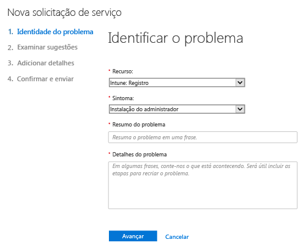
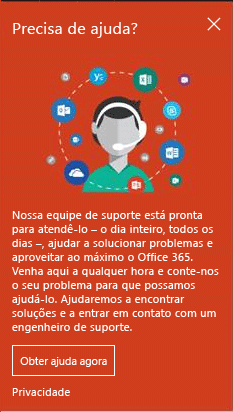
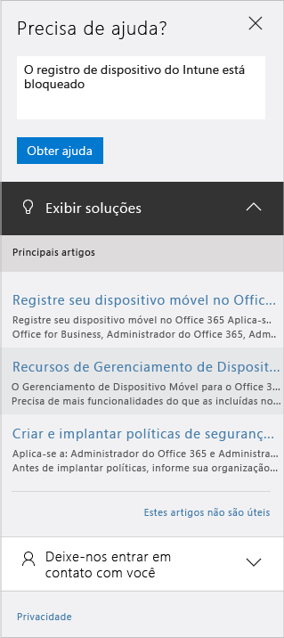

# Como obter suporte de administrador para o Microsoft Intune

A Microsoft fornece suporte técnico global, de pré-vendas, cobrança e assinatura para o Microsoft Intune. O suporte está disponível online e por telefone para versões de avaliação e assinaturas pagas. O suporte técnico online está disponível apenas em inglês e japonês. O suporte via telefone e o suporte de cobrança online estão disponíveis em outros idiomas.

O suporte para Intune, e para Intune quando usado com o Configuration Manager, é gratuito. Os clientes do Suporte Premier incorrerão em um custo para perguntas sobre procedimentos (por exemplo, instruções sobre como configurar um recurso do Intune).

## Criar um tíquete de serviço online

1.  Entre no [Centro de administração do Office 365](https://portal.office.com) com suas credenciais do Intune.
    >[!NOTE]
    >
    >Os clientes do Suporte Premier podem abrir um tíquete de suporte do Intune na [página do Suporte Premier](https://support.microsoft.com/en-us/premier/contacts).

2.  Selecione o bloco de **Admin**.
3.  À esquerda, em **Suporte**, selecione **Suporte** para abrir um tíquete.

    

    >[!NOTE]
    >  Os clientes que têm ou tiveram, uma conta do O365 com 100 ou menos licenças, verão esta mensagem. Se você a vir, consulte [Criar um tíquete de suporte com métodos alternativos](#create-a-support-ticket-with-alternate-methods).

    > 

    -   Para problemas cobrança, licenciamento e conta, selecione **Informações de cobrança e produto**.

    -   Para todos os outros problemas com o Intune selecione **Gerenciamento de Dispositivo Móvel**.

    > [!NOTE]
    > Talvez você precise selecionar **mais** na parte inferior da lista para ver todas as categorias.

3.  Siga as instruções para abrir sua solicitação.

### Criar um tíquete de suporte com métodos alternativos

Siga este procedimento se sua página de suporte tiver esta aparência:

1. Selecione **Preciso de ajuda**.
2. Na caixa de texto, forneça uma descrição do problema e, em seguida, selecione **Obter ajuda**.

    

3. Examine os recursos online sugeridos ou selecione **Deixe-nos ligar para você** para receber uma ligação do Suporte da Microsoft.

## Obtenha suporte por telefone
Veja [Contatar o suporte do fornecido por telefone assistido do Microsoft Intune](contact-assisted-phone-support-for-microsoft-intune.md) para obter uma lista de números de telefone de suporte por país e região, horários de atendimento e idiomas com suporte para cada região.

## Controlar suas solicitações de serviço
1.  Entre no [Centro de administração do Office 365](https://portal.office.com) com suas credenciais do Intune.
2.  Selecione o bloco de **Admin**.
3.  À esquerda, em **Suporte**, selecione **Solicitações de serviço**. Em seguida, você pode examinar suas solicitações.

Nosso respostas iniciais a solicitações de serviço dependem da gravidade do problema. Para problemas mais graves, nossa primeira resposta para clientes Professional será dentro de duas horas. Para clientes do Suporte Premier, a resposta variará de acordo com o contrato de suporte. Esses são casos em que:

- Um ou mais serviços não estão acessíveis ou não podem ser utilizados.
- Prazos de produção, operações ou implantações são gravemente afetados, ou haverá um impacto drástico na produção ou na rentabilidade.
- Vários usuários ou serviços são afetados.

Para problemas moderadamente graves, nossa primeira resposta para clientes Professional será dentro de quatro horas. Para clientes do Suporte Premier, a resposta variará de acordo com o contrato de suporte.  Esses são casos em que:

- O serviço pode ser usado, mas não está funcionando bem como de costume.
- A situação tem um impacto moderado nos negócios e pode ser tratada durante o horário comercial.
- Um único usuário, cliente ou serviço é parcialmente afetado.

Para outros problemas, nossa primeira resposta para clientes Professional será dentro de oito horas. Para clientes do Suporte Premier, a resposta variará de acordo com o contrato de suporte.  Esses são casos em que:

- O problema tem um impacto mínimo sobre os negócios.
- O problema é importante, mas não tem um impacto significativo imediato sobre o serviço ou a produtividade do cliente.
- Um único usuário está enfrentando interrupção parcial, mas há uma solução alternativa aceitável.

> [!NOTE]
> **Se você usa o Microsoft System Center Configuration Manager** ou o **Microsoft System Center Endpoint Protection:** para obter suporte técnico para o Configuration Manager ou o Endpoint Protection, entre em contato com o seu parceiro ou visite o [Centro de Soluções do Microsoft System Center Configuration Manager e do System Center Endpoint Protection](http://www.microsoft.com/en-us/server-cloud/products/system-center-2012-r2/resources.aspx) para encontrar materiais avançados de autoajuda. Ele também oferece a opção de abrir uma solicitação de suporte online ou por telefone.
>
> O suporte técnico do System Center Configuration Manager ou System Center Endpoint Protection requer um pagamento ou é diminuído dos seus contratos existentes de licenciamento ou Suporte Premier.

## Resolver problemas sem abrir um tíquete de suporte

Você pode resolver o problema sem abrir um tíquete de suporte.

Para autoajuda com o Intune, consulte [Dicas de solução de problemas gerais do Microsoft Intune](general-troubleshooting-tips-for-microsoft-intune.md) ou qualquer um dos tópicos de solução de problemas para problemas específicos. Você também pode pesquisar uma solução ou postar sua pergunta no [Fórum do Intune](https://social.technet.microsoft.com/Forums/en-US/home?forum=microsoftintuneprod).

## Localizar suporte para licenciamento por volume
Se já tiver comprado licenças da Microsoft por meio de um programa de licenciamento por volume, obtenha os seguintes recursos para suporte:

-   Para obter suporte relacionado a licenças e chaves de localização, acesse o [Centro de serviços de licenciamento por volume](http://go.microsoft.com/fwlink/p/?LinkID=282016).

-   Para questões sobre cobrança, consulte [Suporte ao gerenciamento de assinaturas e cobrança](http://support.microsoft.com/oas/default.aspx?prid=15371).

-   Para obter informações mais gerais sobre licenciamento por volume, consulte [Licenciamento por volume](http://go.microsoft.com/fwlink/p/?LinkID=282015).

<!--HONumber=Dec16_HO1-->

