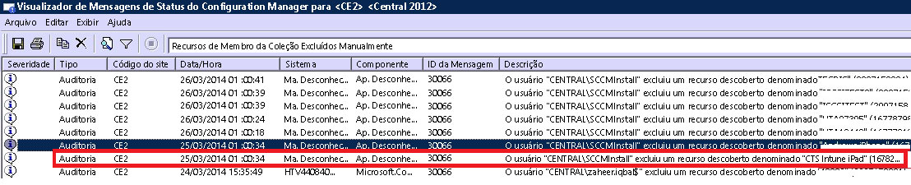

# Solução de problemas de registro de dispositivo no Intune

Este tópico fornece sugestões para solução de problemas de registro do dispositivo. Se essas informações não resolverem seu problema, confira [How to get support for Microsoft Intune](how-to-get-support-for-microsoft-intune.md) (Como obter suporte para o Microsoft Intune) para encontrar outras formas de obter ajuda.

## Etapas para solução de problemas iniciais

Antes de iniciar a solução de problemas, verifique se você configurou o Intune corretamente para habilitar o registro. Você pode ler sobre os requisitos de configuração em:

-   [Prepare-se registrar dispositivos no Microsoft Intune](/intune/deploy-use/gprerequisites-for-enrollment.md)
-   [Configurar gerenciamento de dispositivos iOS e Mac](/intune/deploy-use/set-up-ios-and-mac-management-with-microsoft-intune)
-   [Configurar o gerenciamento do Windows 10 Mobile e do Windows Phone com o Microsoft Intune](/intune/deploy-use/set-up-windows-phone-management-with-microsoft-intune)
-   [Configurar o gerenciamento do dispositivo Windows](/intune/deploy-use/set-up-windows-device-management-with-microsoft-intune)

Seus usuários de dispositivo gerenciado podem coletar logs de registro e diagnóstico para você examinar. As instruções para o usuário coletar logs são fornecidas em:

- [Enviar logs de dados de diagnóstico do Android para o administrador de TI usando um cabo USB](/intune/enduser/send-diagnostic-data-logs-to-your-it-administrator-using-a-usb-cable-android)
- [Enviar logs de dados de diagnóstico do Android para o administrador de TI usando o email](/intune/enduser/send-diagnostic-data-logs-to-your-it-administrator-using-email-android)
- [Enviar erros de registro do Android para o administrador de TI](/intune/enduser/send-enrollment-errors-to-your-it-administrator-android)
- [Enviar erros de registro do iOS para o administrador de TI](/intune/enduser/send-errors-to-your-it-admin-ios)

## Problemas gerais de registro
Esses problemas podem ocorrer em todas as plataformas de dispositivo.

### Limite do dispositivo associado
**Problema:** um usuário recebe um erro no seu dispositivo durante o registro, como um erro **Portal da empresa temporariamente indisponível** em um dispositivo iOS, e o DMPdownloader.log no Configuration Manager contém o erro **DeviceCapReached**.

**Resolução:** por design, os usuários podem registrar não mais de 5 dispositivos.

#### Verifique o número de dispositivos registrados e permitidos

1.  Valide no portal de administração do Intune que o usuário tem não mais de 5 dispositivos atribuídos

2.  Verifique no portal de administração do Intune, em Admin\Mobile Device Management\Enrollment Rules, se o limite de registro de dispositivos está definido como 5

Os usuários de dispositivos móveis podem excluir dispositivos na seguinte URL: [https://byodtestservice.azurewebsites.net/](https://byodtestservice.azurewebsites.net/).

Os administradores podem excluir dispositivos no portal do Azure Active Directory.

#### Para excluir dispositivos no portal do Active Directory do Azure

1.  Navegue até [http://aka.ms/accessaad](http://aka.ms/accessaad) ou clique em **Administrador** &gt; **Azure AD** de [https://portal.office.com](https://portal.office.com).

2.  Faça logon com sua ID da organização usando o link no lado esquerdo da página.

3.  Se não tiver uma, crie uma assinatura do Azure. Isso não deverá exigir um cartão de crédito ou pagamento se você tiver uma conta paga (clique no link de assinatura **Register your free Azure Active Directory** [Registrar seu Azure Active Directory gratuito]).

4.  Selecione **Active Directory** e selecione sua organização.

5.  Selecione a guia **Usuários** .

6.  Selecione o usuário cujos dispositivos que deseja excluir.

7.  Escolha **Dispositivos**.

8.  Remova os dispositivos conforme apropriado, como aqueles que não estão mais em uso, ou aqueles que têm definições imprecisas.

> [!NOTE]

> Você pode evitar o limite de registro de dispositivo usando os Gerenciadores de Registro do Dispositivo, conforme descrito em [Enroll corporate-owned devices with the Device Enrollment Manager in Microsoft Intune](/intune/deploy-use/enroll-corporate-owned-devices-with-the-device-enrollment-manager-in-microsoft-intune) (Registrar dispositivos corporativos com o Gerenciador de Registro do Dispositivo no Microsoft Intune).
>
> Uma conta de usuário que é adicionada ao grupo de Gerenciadores de registro de dispositivos não conseguirá concluir o registro quando a política de acesso condicional for aplicada a esse logon de usuário específico.

### Portal da empresa temporariamente indisponível
**Problema:** um usuário recebe um erro de **Portal da empresa temporariamente indisponível** no dispositivo.

#### Solucionando o erro de Portal da empresa temporariamente indisponível

1.  Remova o aplicativo de Portal da Empresa do Intune do dispositivo.

2.  No dispositivo, abra o navegador, navegue até [https://portal.manage.microsoft.com](https://portal.manage.microsoft.com), e tente algum logon de usuário.

3.  Se o usuário não conseguir efetuar logon, faça-o tentar outra rede.

4.  Se isso falhar, confirme que as credenciais do usuário foram sincronizadas corretamente com o Active Directory do Azure.

5.  Se o usuário fizer logon com êxito, um dispositivo iOS solicitará que você instale o aplicativo de Portal da Empresa do Intune e o registre. Em um dispositivo Android, você precisará instalar manualmente o aplicativo de Portal da Empresa do Intune, e depois disso você poderá tentar novamente a inscrição.

### Autoridade MDM não definida
**Problema:** um usuário recebe um erro de **Autoridade MDM não definida**.

#### Solucionando o erro de autoridade MDM não definida

1.  Verifique se a Autoridade MDM foi definida corretamente para a versão do serviço do Intune que você está usando, ou seja, para o Intune, MDM O365 ou System Center Configuration Manager com o Intune. Para o Intune, a Autoridade MDM é definida em **Administrador** &gt; **Gerenciamento de Dispositivo Móvel**. Para o Configuration Manager com o Intune, ela é definida quando você configura o conector do Intune e, no O365, ela é uma configuração de **Dispositivos Móveis**.

    > [!NOTE]
    > Após definir a Autoridade MDM, você só pode alterá-la entrando em contato com o Suporte, conforme descrito em [How to get support for Microsoft Intune](how-to-get-support-for-microsoft-intune.md) (Como obter suporte para o Microsoft Intune).

2.  Verifique se as credenciais do usuário foram sincronizadas corretamente com o Active Directory do Azure, verificando se seu UPN corresponde às informações do Active Directory no Portal da conta.
    Se o UPN não coincidir com as informações do Active Directory:

    1.  Desligue o DirSync no servidor local.

    2.  Exclua o usuário incompatível da lista de usuários do **Portal de Contas do Intune** .

    3.  Aguarde cerca de uma hora para permitir que o serviço do Azure remova os dados incorretos.

    4.  Ative o DirSync novamente e verifique se agora o usuário está sincronizado corretamente.

3.  Em um cenário em que você estiver usando o System Center Configuration Manager com o Intune, verifique se o usuário tem uma ID de usuário de nuvem válida:

    1.  Abra o SQL Management Studio.

    2.  Conecte-se ao banco de dados apropriado.

    3.  Abra a pasta de bancos de dados e localize e abra a pasta **CM_DBName**, em que DBName é o nome do banco de dados do cliente.

    4.  Na parte superior, escolha **Nova Consulta** e execute as seguintes consultas:

        -   Para ver todos os usuários: `select * from [CM_ DBName].[dbo].[User_DISC]`

        -   Para ver Usuários Específicos, use a seguinte consulta, em que % testuser1% representa username@domain.com para o usuário que você deseja pesquisar: `select * from [CM_ DBName].[dbo].[User_DISC] where User_Principal_Name0 like '%testuser1%'`

        Depois de gravar a consulta, escolha **!Execute**.
        Após os resultados serem retornados, procure a ID do clouduser.  Se nenhuma ID for encontrada, o usuário não está licenciado para usar o Intune.

### Não é possível criar a política ou registrar os dispositivos se o nome da empresa contiver caracteres especiais
**Problema:** não é possível criar a política ou registrar os dispositivos.

**Resolução:** no [Centro de administração do Office 365](https://portal.office.com/), remova os caracteres especiais do nome da empresa e salve as informações da empresa.

### Não é possível entrar ou registrar dispositivos quando você tiver vários domínios verificados
**Problema:** quando você adiciona um segundo domínio verificado ao seu ADFS, os usuários com o sufixo de nome UPN do segundo domínio não poderão fazer logon nos portais ou registrar dispositivos.

**Resolução:** os clientes do Microsoft Office 365 que utilizarem o logon único (SSO) por meio do AD FS 2.0 e tiverem vários domínios de nível superior para sufixos UPN de usuários em sua organização (por exemplo, @contoso.com ou @fabrikam.com) deverão implantar uma instância separada do Serviço de Federação AD FS 2.0 em cada sufixo.  Agora, há um [pacote cumulativo de atualizações para o AD FS 2.0](http://support.microsoft.com/kb/2607496) que funciona em conjunto com o comutador **SupportMultipleDomain** para habilitar o servidor AD FS, para dar suporte a esse cenário sem a necessidade de exigir servidores AD FS 2.0 adicionais. Confira [este blog](https://blogs.technet.microsoft.com/abizerh/2013/02/05/supportmultipledomain-switch-when-managing-sso-to-office-365/) para obter mais informações.

## Problemas de Android
### Falha na instalação do perfil
**Problema:** um usuário recebe um erro de **Falha na instalação de perfil** em um dispositivo Android.

### Etapas de solução de problemas para falhas na instalação de perfil

1.  Confirme que foi atribuída ao usuário uma licença apropriada para a versão do serviço do Intune que você está usando.

2.  Confirme se o dispositivo já não está registrado com outro provedor MDM ou se ele ainda não tem um perfil de gerenciamento instalado.

4.  Confirme se o Chrome para Android é o navegador padrão e se os cookies estão habilitados.

### Problemas de certificado do Android

**Problema**: o usuário recebe a seguinte mensagem em seu dispositivo: *Você não pode entrar porque o dispositivo não tem um certificado necessário.*

**Resolução**:

- O usuário pode ser capaz de recuperar o certificado ausente seguindo [estas instruções](/intune/enduser/your-device-is-missing-a-required-certificate-android#your-device-is-missing-a-certificate-required-by-your-it-administrator).
- Se o usuário não conseguir recuperar o certificado, você poderá perder certificados intermediários no servidor ADFS. Os certificados intermediários são exigidos pelo Android para confiar no servidor.

Você pode importar os certificados para o repositório intermediário no servidor ADFS ou proxies da seguinte maneira:

1.  No servidor ADFS, inicie o **Console de Gerenciamento Microsoft** e adicione o snap-in de certificados para a **conta de computador**.
5.  Localize o certificado que seu serviço do ADFS está usando e exiba seu certificado pai.
6.  Copie o certificado pai e cole-o em **Computador\Autoridades de Certificação Intermediárias\Certificados**.
7.  Copie seus certificados de ADFS, descriptografia do ADFS e assinatura do ADFS e cole-os no Repositório Pessoal do serviço do ADFS.
8.  Reinicie os servidores ADFS.

Agora, o usuário deve ser capaz de entrar no Portal da Empresa no dispositivo Android.

## Problemas de iOS
### Falha na instalação do perfil
**Problema:** um usuário recebe um erro de **Falha na instalação de perfil** em um dispositivo iOS.

### Etapas de solução de problemas para falhas na instalação de perfil

1.  Confirme que foi atribuída ao usuário uma licença apropriada para a versão do serviço do Intune que você está usando.

2.  Confirme se o dispositivo já não está registrado com outro provedor MDM ou se ele ainda não tem um perfil de gerenciamento instalado.

3.  Navegue até [https://portal.manage.microsoft.com](https://portal.manage.microsoft.com) e tente instalar o perfil quando solicitado.

4.  Confirme se o Safari para iOS é o navegador padrão e se os cookies estão habilitados.

### Os dispositivos iOS registrados não aparecem no console ao usar o System Center Configuration Manager com o Intune
**Problema:** o usuário registra um dispositivo iOS, mas ele não aparece no console de administração do Configuration Manager. O dispositivo não indica que ele foi registrado. Possíveis causas:

- Você pode ter registrado seu conector Intune em uma conta e, então, ter registrado o dispositivo em outra conta.
- Você pode ter baixado o certificado MDM de uma conta e o usado em outra conta.

**Resolução:** execute as etapas a seguir:

1. Desabilite o iOS dentro do conector do Windows Intune.
    1. Clique com o botão direito do mouse na assinatura do Intune e selecione **Propriedades**.
    1. Na guia "iOS", desmarque a opção "Habilitar registro do iOS".

1. No SQL, execute as etapas a seguir no banco de dados do CAS

    1. atualizar o SC_ClientComponent_Property set Value2 = '', em que Nome é igual a '%APNS%'
    1. excluir do MDMPolicy, em que PolicyType = 7
    1. excluir do MDMPolicyAssignment, em que PolicyType = 7
    1. atualizar o SC_ClientComponent_Property set Value2 = '', em que Nome é igual a '%APNS%'
    1. excluir do MDMPolicy, em que PolicyType = 11
    1. excluir do MDMPolicyAssignment, em que PolicyType = 11
    1. EXCLUIR Drs_Signals
1. Reinicie o serviço SMS Executive ou o servidor CM

1. Obtenha um novo certificado APN e carregue-o: clique com o botão direito do mouse na assinatura do Intune, no painel esquerdo do Configuration Manager. Selecione a opção **Criar solicitação de certificado APNs** e siga as instruções.
## Problemas ao usar o System Center Configuration Manager com o Intune
### Dispositivos móveis desaparecem
**Problema:** após registrar com êxito um dispositivo móvel no Configuration Manager, ele desaparece da coleção de dispositivos móveis, mas o dispositivo ainda tem o Perfil de gerenciamento e é listado no Gateway de CSS.

**Resolução:** isso pode ocorrer porque você tem um processo personalizado para remover dispositivos não ingressados no domínio ou porque o usuário desativou o dispositivo da assinatura. Para validar e verificar qual conta de usuário ou processo removeu o dispositivo do console do Configuration Manager, execute as seguintes etapas.

#### Verifique como o dispositivo foi removido

1.  No console de administração do Configuration Manager, selecione **Monitoramento** &gt; **Status do Sistema** &gt; **Consultas de Mensagem de Status**.

2.  Clique com o botão direito do mouse em **Recursos Membros da Coleção Excluídos Manualmente** e selecione **Mostrar Mensagens**.

3.  Selecione uma data/hora apropriada ou as últimas 12 horas.

4.  Localize o dispositivo em questão e examine como o dispositivo foi removido. O exemplo a seguir mostra que a conta SCCMInstall excluiu o dispositivo por meio de um aplicativo desconhecido.

    

5.  Verifique se o Configuration Manager não tem uma tarefa agendada, script ou outro processo que poderia estar limpando automaticamente dispositivos móveis, fora do domínio ou relacionados.

### Outros erros de registro do iOS
Uma lista de erros de registro do iOS é fornecida em nossa documentação de usuário do dispositivo em [You see errors while trying to enroll your device in Intune](/intune/enduser/using-your-ios-or-mac-os-x-device-with-intune) (Erros ao tentar registrar seu dispositivo no Intune).

## Problemas do computador

### O computador já está registrado - erro hr 0x8007064c
**Problema:** o registro falha com o erro **O computador já está registrado**. O log de registro mostra o erro **hr 0x8007064c**.

Isso pode ocorrer porque o computador já foi registrado anteriormente ou tem a imagem clonada de um computador que tinha sido registrado. O certificado de conta da conta anterior ainda está presente no computador.

**Solução:**

1. Do menu **Iniciar**, **Execute** -> **MMC**.
1. **Arquivo** -> **Adicionar/Remover Snap-ins**.
1. Clique duas vezes em **Certificados**, escolha a **Conta de computador**, **Avançar** e selecione **Computador Local**.
1. Clique duas vezes em **Certificados (computador local)**, escolha **Pessoal/Certificados**.
1. Procure pelo certificado Intune emitido por Sc_Online_Issuing e exclua-o, se estiver presente
1. Exclua essa chave do Registro, se ela existir: **HKEY_LOCAL_MACHINE\SOFTWARE\Microsoft\OnlineManagement regkey** e todas as subchaves.
1. Tente registrar novamente.
1. Se o computador ainda não puder ser registrado, procure e exclua esta chave, caso ela exista: **KEY_CLASSES_ROOT\Installer\Products\6985F0077D3EEB44AB6849B5D7913E95**.
1. Tente registrar novamente.

    > [!IMPORTANT]
    > Nesta seção, o método ou tarefa contém etapas que descrevem como modificar o Registro. No entanto, problemas graves podem ocorrer se você modificar o Registro incorretamente. Portanto, certifique-se de seguir estas etapas com cuidado. Para maior proteção, faça backup do Registro antes de modificá-lo. Assim, será possível restaurá-lo se houver algum problema.
    > Para obter mais informações sobre como fazer backup e restaurar o Registro, leia [Como fazer backup e restaurar o registro no Windows](https://support.microsoft.com/en-us/kb/322756)

## Códigos de erro geral de registro

|Código do erro|Possível problema|Resoluções sugeridas|
|--------------|--------------------|----------------------------------------|
|0x80CF0437 |O relógio no computador cliente não está definido com a hora correta.|Verifique se o relógio e o fuso horário do computador cliente estão definidos para a hora e o fuso horário corretos.|
|0x80240438, 0x80CF0438, 0x80CF402C|Não é possível se conectar ao serviço Intune. Verifique as configurações de proxy do cliente.|Verifique se a configuração de proxy no computador cliente tem suporte pelo Intune e se o computador tem acesso à Internet.|
|0x80240438, 0x80CF0438|As configurações de proxy no Internet Explorer e no Sistema Local não estão definidas.|Não é possível se conectar ao serviço Intune. Verifique as configurações de proxy do cliente, confirme se a configuração de proxy no computador cliente tem suporte no Intune e se o computador cliente tem acesso à Internet.|
|0x80043001, 0x80CF3001, 0x80043004, 0x80CF3004|O pacote de inscrição está desatualizado.|Baixe e instale o pacote do software cliente atual no espaço de trabalho Administração.|
|0x80043002, 0x80CF3002|A conta está no modo de manutenção.|Não é possível inscrever novos computadores clientes quando a conta está no modo de manutenção. Para exibir suas configurações de conta, entre na sua conta.|
|0x80043003, 0x80CF3003|A conta está excluída.|Verifique se sua conta e assinatura do Intune continuam ativas. Para exibir suas configurações de conta, entre na sua conta.|
|0x80043005, 0x80CF3005|O computador cliente foi desativado.|Aguarde algumas horas, remova do computador as versões mais antigas do software cliente e tente instalar novamente o software cliente.|
|0x80043006, 0x80CF3006|O número máximo de estações permitidas para a conta foi atingido.|Sua organização deve adquirir estações adicionais para poder inscrever mais computadores clientes no serviço.|
|0x80043007, 0x80CF3007|Não foi possível localizar o arquivo de certificado na mesma pasta do programa de instalação.|Extrai todos os arquivos antes de iniciar a instalação. Não renomeie ou relocalize os arquivos extraídos: todos os arquivos devem existir na mesma pasta ou a instalação falhará.|
|0x8024D015, 0x00240005, 0x80070BC2, 0x80070BC9, 0x80CFD015|O software não pode ser instalado porque uma reinicialização do computador cliente está pendente.|Reinicie o computador e tente instalar novamente o software cliente.|
|0x80070032|Um ou mais pré-requisitos de instalação do software cliente não foram encontrados no computador cliente.|Verifique se todas as atualizações necessárias estão instaladas no computador cliente e tente instalar novamente o software cliente.|
|0x80043008, 0x80CF3008|Falha ao iniciar o serviço de atualizações do Microsoft Online Management.|Entre em contato com o Suporte da Microsoft, conforme descrito em [How to get support for Microsoft Intune](how-to-get-support-for-microsoft-intune.md) (Como obter suporte para o Microsoft Intune).|
|0x80043009, 0x80CF3009|O computador cliente já está inscrito no serviço.|Você deve retirar o computador cliente antes de ser possível registrá-lo novamente no serviço.|
|0x8004300B, 0x80CF300B|O pacote de instalação do software cliente não pode ser executado porque a versão do Windows que está em execução no cliente não é suportada.|O Intune não dá suporte à versão do Windows em execução no computador cliente.|
|0xAB2|O Windows Installer não pode acessar o tempo de uma ação personalizada de execução do VBScript.|Este erro é causado por uma ação personalizada que se baseia em bibliotecas de vínculo dinâmico (DLLs). Ao solucionar problemas de DLL, pode ser necessário usar as ferramentas descritas em [Microsoft Support KB198038: Useful Tools for Package and Deployment Issues](https://support.microsoft.com/en-us/kb/198038) (Suporte da Microsoft KB198038: Ferramentas úteis para problemas de implantação e pacote).|
|0x80cf0440|A conexão com o ponto de extremidade do serviço foi encerrada.|A conta de avaliação ou paga está suspensa. Criar uma nova conta de avaliação ou paga e registrar novamente.|

### Próximas etapas
Se essas informações para solução de problemas não ajudarem, entre em contato com o Suporte da Microsoft, conforme descrito em [How to get support for Microsoft Intune](how-to-get-support-for-microsoft-intune.md) (Como obter suporte para o Microsoft Intune).

<!--HONumber=Sep16_HO4-->

